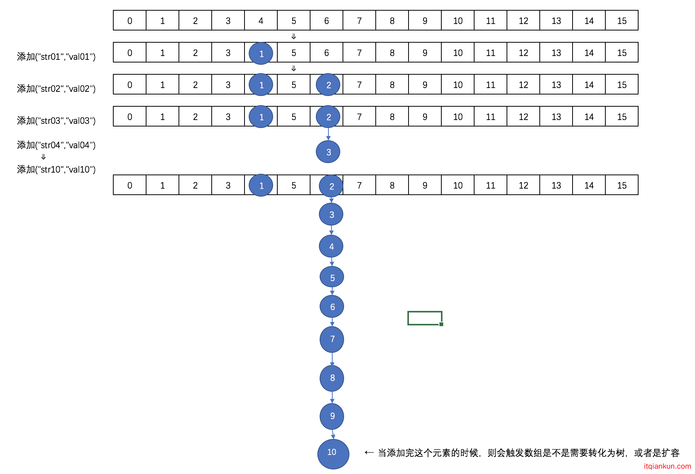
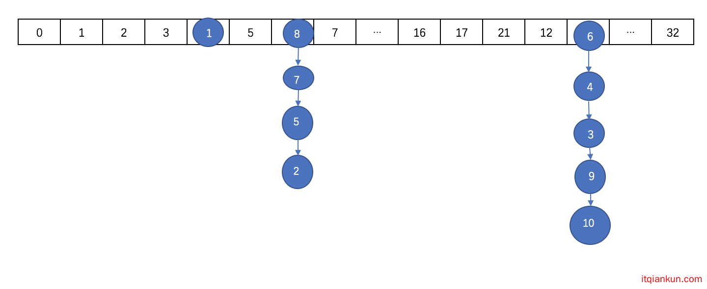
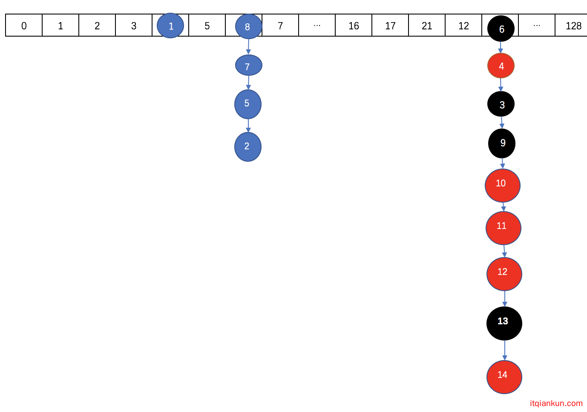

# 5.3 并发集合

我们都知道HashMap不是线程安全的，所以在处理并发的时候会出现问题。

而HashTable虽然是线程安全的，但是是通过整个来加锁的方式，当一个线程在写操作的时候，另外的线程则不能进行读写。

而ConcurrentHashMap则可以支持并发的读写。跟1.7版本相比，1.8版本又有了很大的变化，已经抛弃了Segment的概念，虽然源码里面还保留了，也只是为了兼容性的考虑。jdk 1.8中ConcurrentHashmap采用的底层数据结构为数组+链表+红黑树的形式。数组可以扩容，链表可以转化为红黑树。

## ConcurrentHashMap原理

　　在ConcurrentHashMap中通过一个Node[]数组来保存添加到map中的键值对，而在同一个数组位置是通过链表和红黑树的形式来保存的。但是这个数组只有在第一次添加元素的时候才会初始化，否则只是初始化一个ConcurrentHashMap对象的话，只是设定了一个sizeCtl变量，这个变量用来判断对象的一些状态和是否需要扩容，后面会详细解释。

　　第一次添加元素的时候，默认初期长度为16，当往map中继续添加元素的时候，通过hash值跟数组长度取与来决定放在数组的哪个位置，如果出现放在同一个位置的时候，优先以链表的形式存放，在同一个位置的个数又达到了8个以上，如果数组的长度还小于64的时候，则会扩容数组。如果数组的长度大于等于64了的话，在会将该节点的链表转换成树。

　　通过扩容数组的方式来把这些节点给分散开。然后将这些元素复制到扩容后的新的数组中，同一个链表中的元素通过hash值的数组长度位来区分，是还是放在原来的位置还是放到扩容的长度的相同位置去 。在扩容完成之后，如果某个节点的是树，同时现在该节点的个数又小于等于6个了，则会将该树转为链表。

　　取元素的时候，相对来说比较简单，通过计算hash来确定该元素在数组的哪个位置，然后在通过遍历链表或树来判断key和key的hash，取出value值。

往ConcurrentHashMap中添加元素的时候，里面的数据以数组的形式存放的样子大概是这样的：

这个时候因为数组的长度才为16，则不会转化为树，而是会进行扩容。

　　扩容后数组大概是这样的：

需要注意的是，扩容之后的长度不是32，扩容后的长度在后面细说。

　　如果数组扩张后长度达到64了，且继续在某个节点的后面添加元素达到8个以上的时候，则会出现转化为红黑树的情况。

　　转化之后大概是这样：

## 为什么不用ReentrantLock而用synchronized ?

- 减少内存开销:如果使用ReentrantLock则需要节点继承AQS来获得同步支持，增加内存开销，而1.8中只有头节点需要进行同步。
- 内部优化:synchronized则是JVM直接支持的，JVM能够在运行时作出相应的优化措施：锁粗化、锁消除、锁自旋等等。

## 红黑树

红黑树是每个结点都带有颜色属性的二叉查找树，颜色或红色或黑色。在二叉查找树强制一般要求以外，对于任何有效的红黑树我们增加了如下的额外要求:

- 性质1. 结点是红色或黑色。  
- 性质2. 根结点是黑色。 
- 性质3. 所有叶子都是黑色。（叶子是NULL结点） 
- 性质4. 每个红色结点的两个子结点都是黑色。（从每个叶子到根的所有路径上不能有两个连续的红色结点）
- 性质5. 从任一节结点其每个叶子的所有路径都包含相同数目的黑色结点。 

这些约束强制了红黑树的关键性质: 从根到叶子的最长的可能路径不多于最短的可能路径的两倍长。结果是这个树大致上是平衡的。因为操作比如插入、删除和查找某个值的最坏情况时间都要求与树的高度成比例，这个在高度上的理论上限允许红黑树在最坏情况下都是高效的，而不同于普通的二叉查找树。

## 常用方法

forEach()

putIfAbsent()

getOrDefault()

replaceAll()

compute()

computeIfAbsent() 

computeIfPresent()

merge() 

search()

reduce()