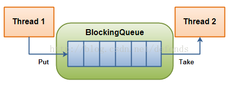
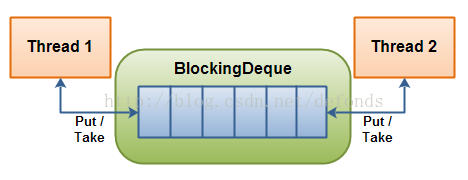

# 5.4 并发队列

如果新请求的到达速率超过了线程池的处理速率，那么新到来的请求将累积起来。在线程池中，这些请求会在一个由Executor管理的Runnable队列中等待，而不会像线程那样去竞争CPU资源。常见的工作队列有以下几种，前三种用的最多。

1. ArrayBlockingQueue：列表形式的工作队列，必须要有初始队列大小，有界队列，先进先出。
2. LinkedBlockingQueue：链表形式的工作队列，可以选择设置初始队列大小，有界/无界队列，先进先出。
3. SynchronousQueue：SynchronousQueue不是一个真正的队列，而是一种在线程之间移交的机制。要将一个元素放入SynchronousQueue中, 必须有另一个线程正在等待接受这个元素. 如果没有线程等待，并且线程池的当前大小小于最大值，那么ThreadPoolExecutor将创建 一个线程, 否则根据饱和策略，这个任务将被拒绝。使用直接移交将更高效，因为任务会直接移交 给执行它的线程，而不是被首先放在队列中, 然后由工作者线程从队列中提取任务. 只有当线程池是无界的或者可以拒绝任务时，SynchronousQueue才有实际价值.
4. PriorityBlockingQueue：优先级队列，无界队列，根据优先级来安排任务，任务的优先级是通过自然顺序或Comparator（如果任务实现了Comparator）来定义的。
5. DelayedWorkQueue：延迟的工作队列，无界队列。


在生产者消费者模型中，生产数据和消费数据的速率不一致，如果生产数据速度快一些，消费(处理)不过来，就会导致数据丢失。这时候我们就可以应用上**阻塞队列**来解决这个问题。

阻塞队列首先是一个队列，一般我们起单线程生产数据入队，起多线程消费数据。

由于阻塞队列的特点：队空时消费阻塞，队满时生产阻塞。多线程消费数据起到了加速消费的作用，使得生产的数据不会在队里积压过多，而生产的数据也不会丢失处理了。

当我们身在分布式开发中时经常会碰到突然大量的消息造访，而我们的消费者无法及时处理，最终导致消息丢失，甚至服务崩溃。这个时候我们就需要暂时将这些不速之客请到“休息室”去坐一下。

阻塞队列BlockingQueue就是我们经常使用的“休息室”。阻塞队列可以有效的阻止大量的消息冲击我们的服务，设置队列大小可以将无法处理的消息阻止在外。


## 1. 阻塞队列BlockingQueue

BlockingQueue 接口表示一个线程安放入和提取实例的队列。

BlockingQueue 通常用于一个线程生产对象，而另外一个线程消费这些对象的场景。下图是对这个原理的阐述：



一个线程往里边放，另外一个线程从里边取的一个 BlockingQueue。

一个线程将会持续生产新对象并将其插入到队列之中，直到队列达到它所能容纳的临界点。也就是说，它是有限的。如果该阻塞队列到达了其临界点，负责生产的线程将会在往里边插入新对象时发生阻塞。它会一直处于阻塞之中，直到负责消费的线程从队列中拿走一个对象。

负责消费的线程将会一直从该阻塞队列中拿出对象。如果消费线程尝试去从一个空的队列中提取对象的话，这个消费线程将会处于阻塞之中，直到一个生产线程把一个对象丢进队列。

**BlockingQueue 的方法 **

BlockingQueue 具有 4 组不同的方法用于插入、移除以及对队列中的元素进行检查。如果请求的操作不能得到立即执行的话，每个方法的表现也不同。这些方法如下：

|      | 抛异常     | 特定值   | 阻塞    | 超时                        |
| :--- | :--------- | :------- | :------ | :-------------------------- |
| 插入 | add(o)     | offer(o) | put(o)  | offer(o, timeout, timeunit) |
| 移除 | remove(o)  | poll(o)  | take(o) | poll(timeout, timeunit)     |
| 检查 | element(o) | peek(o)  |         |                             |


四组不同的行为方式解释：

1. **抛异常**：如果试图的操作无法立即执行，抛一个异常。
2. **特定值**：如果试图的操作无法立即执行，返回一个特定的值(常常是 true / false)。
3. **阻塞**：如果试图的操作无法立即执行，该方法调用将会发生阻塞，直到能够执行。
4. **超时**：如果试图的操作无法立即执行，该方法调用将会发生阻塞，直到能够执行，但等待时间不会超过给定值。返回一个特定值以告知该操作是否成功(典型的是 true / false)。

无法向一个 BlockingQueue 中插入 null。如果你试图插入 null，BlockingQueue 将会抛出一个 NullPointerException。

可以访问到 BlockingQueue 中的所有元素，而不仅仅是开始和结束的元素。比如说，你将一个对象放入队列之中以等待处理，但你的应用想要将其取消掉。那么你可以调用诸如 remove(o) 方法来将队列之中的特定对象进行移除。但是这么干效率并不高(译者注：基于队列的数据结构，获取除开始或结束位置的其他对象的效率不会太高)，因此你尽量不要用这一类的方法，除非你确实不得不那么做。

### 1.1 数组阻塞队列ArrayBlockingQueue

ArrayBlockingQueue 是一个有界的阻塞队列，其内部实现是将对象放到一个数组里。有界也就意味着，它不能够存储无限多数量的元素。它有一个同一时间能够存储元素数量的上限。你可以在对其初始化的时候设定这个上限，但之后就无法对这个上限进行修改了(译者注：因为它是基于数组实现的，也就具有数组的特性：一旦初始化，大小就无法修改)。

ArrayBlockingQueue 内部以 FIFO(先进先出)的顺序对元素进行存储。队列中的头元素在所有元素之中是放入时间最久的那个，而尾元素则是最短的那个。


### 1.2 链阻塞队列LinkedBlockingQueue

LinkedBlockingQueue 内部以一个链式结构(链接节点)对其元素进行存储。如果需要的话，这一链式结构可以选择一个上限。如果没有定义上限，将使用 Integer.MAX_VALUE 作为上限。

LinkedBlockingQueue 内部以 FIFO(先进先出)的顺序对元素进行存储。队列中的头元素在所有元素之中是放入时间最久的那个，而尾元素则是最短的那个。

### 1.3 具有优先级的阻塞队列PriorityBlockingQueue

PriorityBlockingQueue 是一个无界的并发队列。它使用了和类 java.util.PriorityQueue 一样的排序规则。你无法向这个队列中插入 null 值。

所有插入到 PriorityBlockingQueue 的元素必须实现 java.lang.Comparable 接口。因此该队列中元素的排序就取决于你自己的 Comparable 实现。

注意 PriorityBlockingQueue 对于具有相等优先级(compare() == 0)的元素并不强制任何特定行为。
同时注意，如果你从一个 PriorityBlockingQueue 获得一个 Iterator 的话，该 Iterator 并不能保证它对元素的遍历是以优先级为序的。

### 1.4 同步队列SynchronousQueue

SynchronousQueue 是一个特殊的队列，它的内部同时只能够**容纳单个元素**。如果该队列已有一元素的话，试图向队列中插入一个新元素的线程将会阻塞，直到另一个线程将该元素从队列中抽走。同样，如果该队列为空，试图向队列中抽取一个元素的线程将会阻塞，直到另一个线程向队列中插入了一条新的元素。

### 1.5 延迟队列DelayQueue

DelayQueue 对元素进行持有直到一个特定的延迟到期。**注入其中的元素**必须实现 java.util.concurrent.Delayed 接口。

```java
public interface Delayed extends Comparable<Delayed> {

	public long getDelay(TimeUnit timeUnit);

}
```

正如你所看到的，Delayed 接口也继承了 java.lang.Comparable 接口，这也就意味着 Delayed 对象之间可以进行对比。这个可能在对 DelayQueue 队列中的元素进行排序时有用，因此它们可以根据过期时间进行有序释放。

DelayQueue 将会在每个元素的 getDelay() 方法返回的值的时间段之后才释放掉该元素。如果返回的是 0 或者负值，延迟将被认为过期，该元素将会在 DelayQueue 的下一次 take 被调用的时候被释放掉。

传递给 getDelay 方法的 getDelay 实例是一个枚举类型，它表明了将要延迟的时间段。


## 2. 阻塞双端队列BlockingDeque

java.util.concurrent 包里的 BlockingDeque 接口表示一个线程安放入和提取实例的双端队列。

BlockingDeque 类是一个双端队列，在不能够插入元素时，它将阻塞住试图插入元素的线程；在不能够抽取元素时，它将阻塞住试图抽取的线程。

deque(双端队列) 是 "Double Ended Queue" 的缩写。因此，双端队列是一个你可以从任意一端插入或者抽取元素的队列。

在线程既是一个队列的生产者又是这个队列的消费者的时候可以使用到 BlockingDeque。如果生产者线程需要在队列的两端都可以插入数据，消费者线程需要在队列的两端都可以移除数据，这个时候也可以使用 BlockingDeque。



一个 BlockingDeque - 线程在双端队列的两端都可以插入和提取元素。

一个线程生产元素，并把它们插入到队列的任意一端。如果双端队列已满，插入线程将被阻塞，直到一个移除线程从该队列中移出了一个元素。如果双端队列为空，移除线程将被阻塞，直到一个插入线程向该队列插入了一个新元素。

BlockingDeque 接口**继承自 BlockingQueue 接口**。这就意味着你可以像使用一个 BlockingQueue 那样使用 BlockingDeque。如果你这么干的话，各种插入方法将会把新元素添加到双端队列的尾端，而移除方法将会把双端队列的首端的元素移除。正如 BlockingQueue 接口的插入和移除方法一样。

## BlockingDeque 的方法

BlockingDeque 具有 4 组不同的方法用于插入、移除以及对双端队列中的元素进行检查。如果请求的操作不能得到立即执行的话，每个方法的表现也不同。这些方法如下：

|      | 抛异常         | 特定值        | 阻塞         | 超时                             |
| :--- | :------------- | :------------ | :----------- | :------------------------------- |
| 插入 | addFirst(o)    | offerFirst(o) | putFirst(o)  | offerFirst(o, timeout, timeunit) |
| 移除 | removeFirst(o) | pollFirst(o)  | takeFirst(o) | pollFirst(timeout, timeunit)     |
| 检查 | getFirst(o)    | peekFirst(o)  |              |                                  |


|      | 抛异常        | 特定值       | 阻塞        | 超时                            |
| :--- | :------------ | :----------- | :---------- | :------------------------------ |
| 插入 | addLast(o)    | offerLast(o) | putLast(o)  | offerLast(o, timeout, timeunit) |
| 移除 | removeLast(o) | pollLast(o)  | takeLast(o) | pollLast(timeout, timeunit)     |
| 检查 | getLast(o)    | peekLast(o)  |             |                                 |


四组不同的行为方式解释：

1. **抛异常**：如果试图的操作无法立即执行，抛一个异常。
2. **特定值**：如果试图的操作无法立即执行，返回一个特定的值(常常是 true / false)。
3. **阻塞**：如果试图的操作无法立即执行，该方法调用将会发生阻塞，直到能够执行。
4. **超时**：如果试图的操作无法立即执行，该方法调用将会发生阻塞，直到能够执行，但等待时间不会超过给定值。返回一个特定值以告知该操作是否成功(典型的是 true / false)。

### 2.1 LinkedBlockingDeque

LinkedBlockingDeque 是一个双端队列，在它为空的时候，一个试图从中抽取数据的线程将会阻塞，无论该线程是试图从哪一端抽取数据。


## 3. TransferQueue

TransferQueue同时也是一个阻塞队列，它具备阻塞队列的所有特性。

TransferQueue(java7引入)继承了BlockingQueue（BlockingQueue又继承了Queue）并扩展了一些新方法。**生产者会一直阻塞直到所添加到队列的元素被某一个消费者所消费（不仅仅是添加到队列里就完事）。**

阻塞队列不外乎put ，take，offer ，poll等方法，再加上TransferQueue的 几个 tryTransfer 方法。

- transfer(E e)若当前存在一个正在等待获取的消费者线程，即立刻将e移交之；**否则将元素e插入到队列尾部，并且当前线程进入阻塞状态，直到有消费者线程取走该元素**。
- tryTransfer(E e)若当前存在一个正在等待获取的消费者线程，则该方法会即刻转移e，并返回true;若不存在则返回false，但是并不会将e插入到队列中。**这个方法不会阻塞当前线程，要么快速返回true，要么快速返回false。**
- hasWaitingConsumer()和getWaitingConsumerCount()用来判断当前正在等待消费的消费者线程个数。
- tryTransfer(E e, long timeout, TimeUnit unit) 若当前存在一个正在等待获取的消费者线程，会立即传输给它; 否则将元素e插入到队列尾部，并且等待被消费者线程获取消费掉。**若在指定的时间内元素e无法被消费者线程获取，则返回false，同时该元素从队列中移除。**
  

### 3.1 LinkedTransferQueue

BlockingQueue对读或者写都是锁上整个队列，在并发量大的时候，各种锁是比较耗资源和耗时间的，而前面的SynchronousQueue虽然不会锁住整个队列，但它是一个没有容量的“队列”，那么有没有这样一种队列，它即可以像其他的BlockingQueue一样有容量又可以像SynchronousQueue一样不会锁住整个队列呢？有！答案就是LinkedTransferQueue。

LinkedTransferQueue采用一种预占模式。意思就是消费者线程取元素时，如果队列不为空，则直接取走数据，若队列为空，那就生成一个节点（节点元素为null）入队，然后消费者线程被等待在这个节点上，后面生产者线程入队时发现有一个元素为null的节点，生产者线程就不入队了，直接就将元素填充到该节点，并唤醒该节点等待的线程，被唤醒的消费者线程取走元素，从调用的方法返回。我们称这种节点操作为“匹配”方式。

LinkedTransferQueue是基于链表的FIFO无界阻塞队列，它出现在JDK7中。Doug Lea 大神说LinkedTransferQueue是一个聪明的队列。它是ConcurrentLinkedQueue、SynchronousQueue (公平模式下)、无界的LinkedBlockingQueues等的超集。


## 4 非阻塞队列

在并发编程中我们有时候需要使用线程安全的队列。如果我们要实现一个线程安全的队列有两种实现方式一种是使用阻塞算法，另一种是使用非阻塞算法。使用阻塞算法的队列可以用一个锁（入队和出队用同一把锁）或两个锁（入队和出队用不同的锁）等方式来实现，而非阻塞的实现方式则可以使用**循环CAS**的方式来实现，下面我们一起来研究下Doug Lea是如何使用非阻塞的方式来实现线程安全队列ConcurrentLinkedQueue的。

### 4.1 ConcurrentLinkedQueue

ConcurrentLinkedQueue是一个基于链接节点的无界线程安全队列，它采用先进先出的规则对节点进行排序，当我们添加一个元素的时候，它会添加到队列的尾部，当我们获取一个元素时，它会返回队列头部的元素。它采用了“wait－free”算法来实现，该算法在Michael & Scott算法上进行了一些修改。

从源代码角度来看整个**入队**过程主要做两件事情：

- 第一是定位出尾节点
- 第二是使用CAS算法能将入队节点设置成尾节点的next节点，如不成功则重试。

第一步定位尾节点。tail节点并不总是尾节点，所以每次入队都必须先通过tail节点来找到尾节点，尾节点可能就是tail节点，也可能是tail节点的next节点。代码中循环体中的第一个if就是判断tail是否有next节点，有则表示next节点可能是尾节点。获取tail节点的next节点需要注意的是p节点等于q节点的情况，出现这种情况的原因我们后续再来介绍。

第二步设置入队节点为尾节点。p.casNext(null, newNode)方法用于将入队节点设置为当前队列尾节点的next节点，q如果是null表示p是当前队列的尾节点，如果不为null表示有其他线程更新了尾节点，则需要重新获取当前队列的尾节点。

出队过程是真的头节点操作。当head节点里有元素时，直接弹出head节点里的元素，而不会更新head节点。只有当head节点里没有元素时，出队操作才会更新head节点。采用这种方式也是为了减少使用CAS更新head节点的消耗，从而提高出队效率。

ConcurrentLinkedQueue 的非阻塞算法实现可概括为下面 5 点：

- 使用 CAS 原子指令来处理对数据的并发访问，这是非阻塞算法得以实现的基础。
- head/tail 并非总是指向队列的头 / 尾节点，也就是说允许队列处于不一致状态。 这个特性把入队 / 出队时，原本需要一起原子化执行的两个步骤分离开来，从而缩小了入队 / 出队时需要原子化更新值的范围到唯一变量。这是非阻塞算法得以实现的关键。
- 由于队列有时会处于不一致状态。为此，ConcurrentLinkedQueue 使用**三个不变式**来维护非阻塞算法的正确性。
- 以批处理方式来更新 head/tail，从整体上减少入队 / 出队操作的开销。
- 为了有利于垃圾收集，队列使用特有的 head 更新机制；为了确保从已删除节点向后遍历，可到达所有的非删除节点，队列使用了特有的向后推进策略。

**三个不变式:**

**基本不变式**
在执行方法之前和之后，队列必须要保持的不变式：

- 当入队插入新节点之后，队列中有一个 next 域为 null 的（最后）节点
- 从 head 开始遍历队列，可以访问所有 item 域不为 null 的节点

**head 的不变式和可变式**
在执行方法之前和之后，head 必须保持的不变式：

- 所有”活着”的节点（指未删除节点），都能从 head 通过调用 succ() 方法遍历可达。
- head 不能为 null。
- head 节点的 next 域不能引用到自身。

在执行方法之前和之后，head 的可变式：

- head 节点的 item 域可能为 null，也可能不为 null。
- 允许 tail 滞后（lag behind）于 head，也就是说：从 head 开始遍历队列，不一定能到达 tail。

**tail 的不变式和可变式**
在执行方法之前和之后，tail 必须保持的不变式：

- 通过 tail 调用 succ() 方法，最后节点总是可达的。
- tail 不能为 null。

在执行方法之前和之后，tail 的可变式：

- tail 节点的 item 域可能为 null，也可能不为 null。
- 允许 tail 滞后于 head，也就是说：从 head 开始遍历队列，不一定能到达 tail
- tail 节点的 next 域可以引用到自身。


### 4.2 ConcurrentLinkedDeque

ConcurrentLinkedDeque 是双向链表结构的无界并发队列。从JDK 7开始加入到J.U.C的行列中。使用CAS实现并发安全，与 ConcurrentLinkedQueue 的区别是该阻塞队列同时支持FIFO和FILO两种操作方式，即可以从队列的头和尾同时操作(插入/删除)。适合“多生产，多消费”的场景。内存一致性遵循对 ConcurrentLinkedDeque 的插入操作先行发生于(happen-before)访问或移除操作。相较于 ConcurrentLinkedQueue，ConcurrentLinkedDeque 由于是双端队列，所以在操作和概念上会更加复杂。
