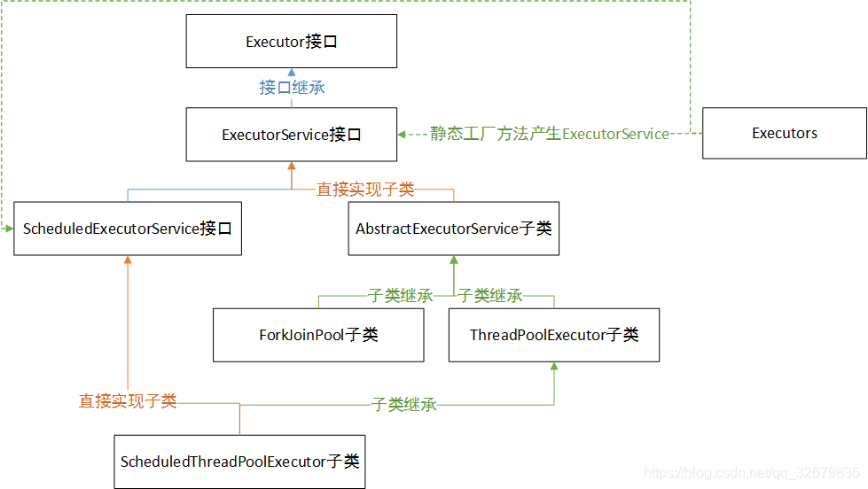

# 5.5 线程池与执行器

## 类结构图



1. Executor接口：顶层抽象接口最大的作用就是解耦了任务和任务的执行。只有一个void execute(Runnable command);方法，该方法用来执行任务，因为是接口方法，根据重写方式不同的不同，就会导致该任务的实现方式不同

2. ExecutorService接口：继承了Executor接口，增加了任务的管理与异步运行（Future模式：比如<T> Future<T> submit(Runnable task, T result);）

3. ScheduledExecutorService接口：添加了处理延迟执行或者周期任务。

4. AbstractExecutorService子类：实现ExecutorService接口，为各类执行器类提供基础

5. ThreadPoolExecutor子类：ExecutorService的具体线程池实现。

   DelegatedExecutorService(它是ThreadPoolExecutor的一个封装类，目的是为了将功能隔离，避免对ThreadPoolExecutor内部参数的调整)

6. ForkJoinPool子类：jvm提供的一个用于并行执行的任务框架。其主旨是将大任务分成若干小任务，之后再并行对这些小任务进行计算，最终汇总这些任务的结果。得到最终的结果。其广泛用在java8的stream中。

7. ScheduledThreadPoolExecutor子类：增加了延迟执行和异步执行的ExecutorService的具体线程池实现。

## Executors

Executors类，提供了一系列工厂方法用于创建线程池，返回的线程池都实现了ExecutorService接口。

```java
public class ThreadPoolExecutor extends AbstractExecutorService {
    public ThreadPoolExecutor(int corePoolSize, // 1 核心线程池大小
                          int maximumPoolSize,  // 2 最大线程池大小
                          long keepAliveTime,  // 3 线程最大空闲时间
                          TimeUnit unit,  // 4 时间单位
                          BlockingQueue<Runnable> workQueue, // 5 线程等待队列
                          ThreadFactory threadFactory,  // 6 线程创建工厂
                          RejectedExecutionHandler handler //7 拒绝策略
                         ) 
}
```
### 1、构建固定线程数的线程池
返回ThreadPoolExecutor实例对象，指定线程容量

ExecutorService newFixedThreadPool(int nThreads)：使用默认的线程工厂DefaultThreadFactory

ExecutorService newFixedThreadPool(int nThreads, ThreadFactory threadFactory)：需要传递线程工厂

- corePoolSize与maximumPoolSize相等，即其线程全为核心线程，是一个固定大小的线程池，是其优势；
- keepAliveTime = 0 该参数默认对核心线程无效，而FixedThreadPool全部为核心线程；
- workQueue 为LinkedBlockingQueue（无界阻塞队列），队列最大值为Integer.MAX_VALUE。如果任务提交速度持续大余任务处理速度，会造成队列大量阻塞。因为队列很大，很有可能在拒绝策略前，内存溢出。是其劣势；
- threadFactory为DefaultThreadFactory。
- handler为AbortPolicy。

### 2、构建单个线程的线程池
ExecutorService newSingleThreadExecutor()
ExecutorService newSingleThreadExecutor(ThreadFactory threadFactory)

类似newFixedThreadPool(1)，但被FinalizableDelegatedExecutorService包装，作用是FixedThreadPool可以向下转型为ThreadPoolExecutor，并对其线程池进行配置，而SingleThreadExecutor被包装后，无法成功向下转型。**因此，SingleThreadExecutor被定以后，无法修改，做到了真正的Single。**

- corePoolSize与maximumPoolSize相等，都为1；
- keepAliveTime = 0 该参数默认对核心线程无效；
- workQueue 为LinkedBlockingQueue（使用链表阻塞队列），队列最大值为Integer.MAX_VALUE。如果任务提交速度持续大余任务处理速度，会造成队列大量阻塞。因为队列很大，很有可能在拒绝策略前，内存溢出。是其劣势；
- threadFactory为DefaultThreadFactory。
- handler为AbortPolicy。

### 3、构建可缓存（自增长）的线程池
ExecutorService newCachedThreadPool()
ExecutorService newCachedThreadPool(ThreadFactory threadFactory)

- corePoolSize = 0，maximumPoolSize = Integer.MAX_VALUE，即线程数量几乎无限制；核心线程为0
- keepAliveTime = 60s，线程空闲60s后自动结束。
- workQueue 为 SynchronousQueue 同步队列，这个队列类似于一个接力棒，入队出队必须同时传递，因为CachedThreadPool线程创建无限制，不会有队列等待，所以使用SynchronousQueue；
- threadFactory为DefaultThreadFactory。
- handler为AbortPolicy。


```java
public class ScheduledThreadPoolExecutor
        extends ThreadPoolExecutor
        implements ScheduledExecutorService {
    public ScheduledThreadPoolExecutor(int corePoolSize) {
        super(corePoolSize, // 1 核心线程池大小
              Integer.MAX_VALUE, // 2 最大线程池大小
              0, // 3 线程最大空闲时间
              NANOSECONDS,// 4 时间单位 毫微秒
              new DelayedWorkQueue()// 5 线程等待队列
             );
    }
}
```


### 4、构建可延时/周期的线程池
ScheduledExecutorService newScheduledThreadPool(int corePoolSize)
ScheduledExecutorService newScheduledThreadPool(int corePoolSize, ThreadFactory threadFactory)

- DelayedWorkQueue优先队列，是基于堆结构的等待队列。

### 5、构建可延时/周期的单线程线程池

ScheduledExecutorService newSingleThreadScheduledExecutor()
ScheduledExecutorService newSingleThreadScheduledExecutor(ThreadFactory threadFactory)


```java
public class ForkJoinPool extends AbstractExecutorService {
    public ForkJoinPool(int parallelism,//线程池个数
                        ForkJoinWorkerThreadFactory factory,//默认为defaultForkJoinWorkerThreadFactory
                        UncaughtExceptionHandler handler,//如果没有设置，默认为null
                        boolean asyncMode//控制是FIFO(true)还是LIFO(false)
                       )
}
```

### 6、构建具有抢占式操作的线程池

ExecutorService newWorkStealingPool()
ExecutorService newWorkStealingPool(int parallelism)

- Runtime.getRuntime().availableProcessors() 线程池的大小采用cpu核心线程数也就是计算资源

## **线程工厂**

每当线程池需要创建一个线程时，都是通过线程工厂方法来完成的。在ThreadFactory中只定义了一个方法newThread，每当线程池需要创建一个新线程时都会调用这个方法。Executors提供的线程工厂有两种，一般使用默认的，当然如果有特殊需求，也可以自己定制。

1. DefaultThreadFactory：默认线程工厂，创建一个新的、非守护的线程，并且不包含特殊的配置信息。
2. PrivilegedThreadFactory：通过这种方式创建出来的线程，将与创建privilegedThreadFactory的线程拥有相同的访问权限、 AccessControlContext、ContextClassLoader。如果不使用privilegedThreadFactory， 线程池创建的线程将从在需要新线程时调用execute或submit的客户程序中继承访问权限。
3. 自定义线程工厂：可以自己实现ThreadFactory接口来定制自己的线程工厂方法。

## 饱和策略（拒绝策略）

当有界队列被填满后，饱和策略开始发挥作用。ThreadPoolExecutor的饱和策略可以通过调用setRejectedExecutionHandler来修改。（如果某个任务被提交到一个已被关闭的Executor时，也会用到饱和策略）。饱和策略有以下四种，一般使用默认的AbortPolicy。

1. AbortPolicy：中止策略。默认的饱和策略，抛出未检查的RejectedExecutionException。调用者可以捕获这个异常，然后根据需求编写自己的处理代码。
2. DiscardPolicy：抛弃策略。当新提交的任务无法保存到队列中等待执行时，该策略会悄悄抛弃该任务。
3. DiscardOldestPolicy：抛弃最旧的策略。当新提交的任务无法保存到队列中等待执行时，则会抛弃下一个将被执行的任务，然后尝试重新提交新的任务。（如果工作队列是一个优先队列，那么“抛弃最旧的”策略将导致抛弃优先级最高的任务，因此最好不要将“抛弃最旧的”策略和优先级队列放在一起使用）。
4. CallerRunsPolicy：调用者运行策略。该策略实现了一种调节机制，该策略既不会抛弃任务，也不会抛出异常，而是将某些任务回退到调用者（调用线程池执行任务的主线程），从而降低新任务的流程。它不会在线程池的某个线程中执行新提交的任务，而是在一个调用了execute的线程中执行该任务。当线程池的所有线程都被占用，并且工作队列被填满后，下一个任务会在调用execute时在主线程中执行（调用线程池执行任务的主线程）。由于执行任务需要一定时间，因此主线程至少在一段时间内不能提交任务，从而使得工作者线程有时间来处理完正在执行的任务。在这期间，主线程不会调用accept，因此到达的请求将被保存在TCP层的队列中。如果持续过载，那么TCP层将最终发现它的请求队列被填满，因此同样会开始抛弃请求。当服务器过载后，这种过载情况会逐渐向外蔓延开来——从线程池到工作队列到应用程序再到TCP层，最终达到客户端，导致服务器在高负载下实现一种平缓的性能降低。

## ExecutorService

- Executor 和 ExecutorService 这两个接口主要的区别是：ExecutorService 接口继承了 Executor 接口，是 Executor 的子接口
- Executor 和 ExecutorService 第二个区别是：Executor 接口定义了 execute()方法用来接收一个Runnable接口的对象，而 ExecutorService 接口中的 submit()方法可以接受Runnable和Callable接口的对象。
- Executor 和 ExecutorService 接口第三个区别是 Executor 中的 execute() 方法不返回任何结果，而 ExecutorService 中的 submit()方法可以通过一个 Future 对象返回运算结果。Futures与底层的ExecutorService紧密耦合，如果关闭executor每个未终止的future都将抛出异常。
- Executor 和 ExecutorService 接口第四个区别是除了允许客户端提交一个任务，ExecutorService 还提供用来控制线程池的方法。比如：调用 shutDown() 方法终止线程池。
- Executors 类提供工厂方法用来创建不同类型的线程池。比如: newSingleThreadExecutor() 创建一个只有一个线程的线程池，newFixedThreadPool(int numOfThreads)来创建固定线程数的线程池，newCachedThreadPool()可以根据需要创建新的线程，但如果已有线程是空闲的会重用已有线程。
  

### 1、ThreadPoolExecutor

shutdown与shutdownNow区别：
（1）shutdown调用后，不可以再submit新的task，已经submit的将继续执行。终止空闲线程
（2）shutdownNow试图停止当前正执行的task，并返回尚未执行的task的list，终止所有线程

isShutDown与isTerminated区别：
（1）isShutDown当调用shutdown()或shutdownNow()方法后返回为true。
（2）isTerminated当调用shutdown()方法后，并且所有提交的任务完成后返回为true;
（3）isTerminated当调用shutdownNow()方法后，成功停止后返回为true;
（4）如果线程池任务正常完成，都为false

invokeAny与invokeAll应用场景
1、invokeAny查找海量数据中的其中某一个资源，多个线程同时查找，有一个线程执行完成，就会立即返回，其他线程就会推出，不再占用CPU资源
2、invokeAll查找海量数据的所有资源，多个线程同时查找，需要全部查找出来

submit方法
首先将提交的任务通过newTaskFor封装为RunnableFuture对象，之后execute提交任务，返回一步计算结果对象。最终返回的是FutureTask对象，以让调用方以异步方式获取任务的执行结果。


Runnable没有返回值；Callable可以返回执行结果，是个泛型，和Future、FutureTask配合可以用来获取异步执行的结果

Callable接口的call()方法允许抛出异常；Runnable的run()方法异常只能在内部消化，不能往上继续抛

**注**：Callalble接口支持返回执行结果，需要调用**FutureTask.get()得到，此方法会阻塞主进程的继续往下执行**，如果不调用不会阻塞。

实际上Future提供了3种功能：

- （1）能够中断执行中的任务
- （2）判断任务是否执行完成
- （3）获取任务执行完成后的结果

### 2、ScheduledThreadPoolExecutor

1、scheduleAtFixedRate（） 与scheduleWithFixedDelay（）区别
scheduleAtFixedRate ，是以上一个任务开始的时间计时，period时间过去后，检测上一个任务是否执行完毕，如果上一个任务执行完毕，则当前任务立即执行，如果上一个任务没有执行完毕，则需要等上一个任务执行完毕后立即执行。
scheduleWithFixedDelay，是以上一个任务结束时开始计时，period时间过去后，立即执行。
两者开始的时间点不同

2、返回ScheduledFuture：是在future基础上添加延迟功能
interface ScheduledFuture<V> extends Delayed, Future<V>

### 3、ForkJoinPool

ForkJoinPool采取工作窃取算法，以避免工作线程由于拆分了任务之后的join等待过程。这样处于空闲的工作线程将从其他工作线程的队列中主动去窃取任务来执行。这里涉及到的两个基本知识点是分治法和工作窃取。

1 分治法
分治法的基本思想是将一个规模为N的问题分解为K个规模较小的子问题，这些子问题的相互独立且与原问题的性质相同，求出子问题的解之后，将这些解合并，就可以得到原有问题的解。是一种分目标完成的程序算法。简单的问题，可以用二分法来完成。

2 工作窃取（work-stealing）
工作窃取是指当某个线程的任务队列中没有可执行任务的时候，从其他线程的任务队列中窃取任务来执行，以充分利用工作线程的计算能力，减少线程由于获取不到任务而造成的空闲浪费。在ForkJoinpool中，工作任务的队列都采用双端队列Deque容器。我们知道，在通常使用队列的过程中，我们都在队尾插入，而在队头消费以实现FIFO。而为了实现工作窃取。一般我们会改成工作线程在工作队列上LIFO,而窃取其他线程的任务的时候，从队列头部取获取。

在juc中，实现Fork-join框架有两个类，分别是**ForkJoinPool**以及提交的任务抽象类**ForkJoinTask**。对于ForkJoinTask，虽然有很多子类，但是我们在基本的使用中都是使用了带返回值的**RecursiveTask**和不带返回值的**RecursiveAction**类。

