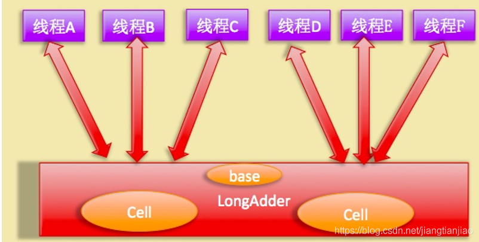

# 5.1 原子变量

https://blog.csdn.net/lmb55/article/details/79547685

https://blog.csdn.net/u011116672/article/details/51068828

https://www.cnblogs.com/theRhyme/p/12129120.html

https://www.jianshu.com/p/4a99f2e65dcc

https://blog.csdn.net/jiangtianjiao/article/details/103844801/

https://www.cnblogs.com/wyq1995/p/12242984.html

https://www.cnblogs.com/wangzun/p/8268581.html

java.util.concurrent.atomic原子操作类包里面提供了一组原子变量类。其基本的特性就是在多线程环境下，当有多个线程同时执行这些类的实例包含的方法时，具有排他性，即当某个线程进入方法，执行其中的指令时，不会被其他线程打断，而别的线程就像自旋锁一样，一直等到该方法执行完成，才由JVM从等待队列中选择一个另一个线程进入，这只是一种逻辑上的理解。实际上是借助硬件的相关指令来实现的，不会阻塞线程(或者说只是在硬件级别上阻塞了)。可以对基本数据、数组中的基本数据、对类中的基本数据进行操作。原子变量类相当于一种泛化的volatile变量，能够支持原子的和有条件的读-改-写操作。

**java.util.concurrent.atomic中的类可以分成4组：**

- 标量类：AtomicBoolean，AtomicInteger，AtomicLong，AtomicReference
- 数组类：AtomicIntegerArray，AtomicLongArray，AtomicReferenceArray
- 更新器类：AtomicLongFieldUpdater，AtomicIntegerFieldUpdater，AtomicReferenceFieldUpdater
- 复合变量类：AtomicMarkableReference，AtomicStampedReference
  

valueOffSet：value 在 AtomicInteger 实例中的内存偏移地址

## 标量类

AtomicBoolean、AtomicInteger、AtomicLong、AtomicReference这四种基本类型用来处理布尔，整数，长整数，对象四种数据，其内部实现不是简单的使用synchronized，而是一个更为高效的方式CAS (compare and swap) + volatile和native方法，从而避免了synchronized的高开销，执行效率大为提升。其实例各自提供对相应类型单个变量的访问和更新。每个类也为该类型提供适当的实用工具方法。

AtomicInteger的静态属性valueOffset，属性value的偏移量，在类加载的时候，通过AtomicInteger的Field——"value"初始化，后续通过当前的AtomicInteger实例和该valueOffset obtain该实例value属性的值；

### valueOffset 详解

在不了解一个事物的时候，最直接的是先看它的作用，然后参考注释或者其他资料，进一步用自己的理解抽象出一个概念。

> 作用：是用来记录 value 本身在内存的偏移地址的，这个记录，也主要是为了在更新操作在内存中找到 value 的位置，方便比较。

也就是说，valueOffset 的核心作用是用来定位 value 在 AtomicInteger 对象中的位置的。

进一步了解：

> valueOffset 是一个静态常量，并且在类加载时就被赋值了。那么这个类在编译后的字节码是一定的，但是在堆中存放 AtomicInteger 对象的首地址是随机的，所以这里的偏移应该是相对于对象实例的首地址。

AtomicInteger通过Unsafe对象保证原子性，而Unsafe对象的getAndAddInt方法通过**循环比较主存和线程工作内存中的属性值相等后更新(即CAS)**来保证原子性；

AtomicInteger的value属性也被volatile关键字修饰。

## 数组类

AtomicIntegerArray、AtomicLongArray、AtomicReferenceArray类进一步扩展了原子操作，对这些类型的数组提供了支持。这些类在为其数组元素提供volatile访问语义方面也引人注目，这对于普通数组来说是不受支持的。其内部并不是像AtomicInteger一样维持一个volatile变量，而是全部由native方法实现。数组变量进行volatile没有意义，因此set/get就需要unsafe来做了，但是多了一个index来指定操作数组中的哪一个元素。

## 更新器类

AtomicReferenceFieldUpdater,AtomicIntegerFieldUpdater和AtomicLongFieldUpdater 是基于反射的实用工具，可以提供对关联字段类型的访问，可用于获取任意选定volatile字段上的compareAndSet操作。它们主要用于原子数据结构中，该结构中同一节点的几个 volatile 字段都独立受原子更新控制。这些类在如何以及何时使用原子更新方面具有更大的灵活性，但相应的弊端是基于映射的设置较为拙笨、使用不太方便，而且在保证方面也较差。

使用中要注意一下几点：

（1）字段必须是volatile类型的
（2）字段的描述类型（修饰符public/protected/default/private）是与调用者与操作对象字段的关系一致。也就是说 调用者能够直接操作对象字段，那么就可以反射进行原子操作。但是对于父类的字段，子类是不能直接操作的，尽管子类可以访问父类的字段。
（3）只能是实例变量，不能是类变量，也就是说不能加static关键字。
（4）只能是可修改变量，不能使final变量，因为final的语义就是不可修改。实际上final的语义和volatile是有冲突的，这两个关键字不能同时存在。
（5）对于AtomicIntegerFieldUpdater 和AtomicLongFieldUpdater 只能修改int/long类型的字段，不能修改其包装类型（Integer/Long）。如果要修改包装类型就需要使用AtomicReferenceFieldUpdater 。

## 复合变量类

AtomicMarkableReference 类将单个布尔值与引用关联起来。维护带有标记位的对象引用，可以原子方式更新带有标记位的引用类型。

AtomicStampedReference 类将整数值与引用关联起来。维护带有整数“标志”的对象引用，可以原子更新带有版本号的引用类型。该类将整数值与引用关联起来，可用于**原子的更新数据和版本号**，可以解决使用CAS进行原子更新时，可能出现的ABA问题。

## LongAdder DoubleAdder

LongAdder类是JDK1.8新增的一个原子性操作类。AtomicLong通过CAS算法提供了非阻塞的原子性操作，相比用阻塞算法的同步器来说性能已经很好了，但是JDK开发组并不满足于此，因为非常高并发的请求下AtomicLong的性能是不能让人接受的。

虽然AtomicLong使用CAS算法，但是CAS失败后还是通过无限循环的自旋锁不断的尝试，这就是高并发下CAS性能低下的原因所在。

高并发下N多线程同时去操作一个变量会造成大量线程CAS失败，然后处于自旋状态，导致严重浪费CPU资源，降低了并发性。既然AtomicLong性能问题是由于过多线程同时去竞争同一个变量的更新而降低的，那么如果把一个变量分解为多个变量，让同样多的线程去竞争多个资源。

**LongAdder实现原理图**

LongAdder则是内部维护一个Cells数组，每个Cell里面有一个初始值为0的long型变量，在同等并发量的情况下，争夺单个变量的线程会减少，这是变相的减少了争夺共享资源的并发量，另外多个线程在争夺同一个原子变量时候，如果失败并不是自旋CAS重试，而是尝试获取其他原子变量的锁，最后当获取当前值时候是把所有变量的值累加后再加上base的值返回的。

LongAdder维护了要给延迟初始化的原子性更新数组和一个基值变量base数组的大小保持是2的N次方大小，数组表的下标使用每个线程的hashcode值的掩码表示，数组里面的变量实体是Cell类型。

Cell 类型是Atomic的一个改进，用来减少缓存的争用，对于大多数原子操作字节填充是浪费的，因为原子操作都是无规律的分散在内存中进行的，多个原子性操作彼此之间是没有接触的，但是原子性数组元素彼此相邻存放将能经常共享缓存行，也就是伪共享。所以这在性能上是一个提升。

另外由于Cells占用内存是相对比较大的，所以一开始并不创建，而是在需要时候再创建，也就是惰性加载，当一开始没有空间时候，所有的更新都是操作base变量。

## LongAccumulator DoubleAccumulator

LongAdder这个类也有点局限性，因为只能是每一次都+1，那有没有办法每次+2呢？或者每次乘以2？说得更抽象一点，我们能不能自己指定规则呢？干嘛老是傻乎乎的+1呢？于是就有了LongAccumulator这个累加器，这个累加器更加抽象，前面使用的LongAdder只不过是这个累加器的一个特例，由此我们可以猜出这个累加器功能更加强大，但是需要我们自己的定制规则。

LongAccumulator相比于LongAdder，可以为累加器提供非0的初始值，后者只能提供默认的0值。另外，前者还可以指定累加规则，比如不进行累加而进行相乘，只需要在构造LongAccumulator时传入自定义的双目运算器即可，后者则内置累加的规则。

前者在调用longAccumulate时传递的时function，而后者是null。从代码可知，当fn为null时就会使用v+x加法来运算，这时候就等价于LongAdder，当fn不等于null时则使用传递的fn函数来计算。

## Striped64类
Striped64是一个高并发累加的工具类。
Striped64的设计核心思路就是通过内部的分散计算来避免竞争。 
Striped64内部包含一个base和一个Cell[] cells数组，又叫hash表。 
没有竞争的情况下，要累加的数通过cas累加到base上；如果有竞争的话，会将要累加的数累加到Cells数组中的某个cell元素里面。所以整个Striped64的值为sum=base+∑[0~n]cells。

**Striped64核心属性**

transient volatile long base;  // 基础值（1.无竞争时更新，2.cells数组初始化过程不可用时，也会通过cas累加到base）

transient volatile Cell[] cells;  // 存放cell的hash表，大小为2乘幂

transient volatile int cellsBusy;  // 自旋锁，通过CAS操作加锁（1.初始化cells数组，2.创建cell单元，3.cells扩容）

**成员变量base**

它有两个作用： 

1. 在开始没有竞争的情况下，将累加值累加到base 
2. 在cells初始化的过程中，cells不可用，这时会尝试将值累加到base上

**成员变量cells**

cells数组是LongAdder高性能实现的必杀器： 
AtomicInteger只有一个value，所有线程累加都要通过cas竞争value这一个变量，高并发下线程争用非常严重； 而LongAdder则有两个值用于累加，一个是base，它的作用类似于AtomicInteger里面的value，在没有竞争的情况不会用到cells数组，这时使用base做累加，有了竞争后cells数组就上场了，第一次初始化长度为2，以后每次扩容都是变为原来的两倍，直到cells数组的长度大于等于当前服务器cpu的数量为止就不在扩容（**CPU能够并行的CAS操作的最大数量是它的核心数**），每个线程会通过线程对cells[threadLocalRandomProbe%cells.length]位置的Cell对象中的value做累加，这样相当于将线程绑定到了cells中的某个cell对象上。

**成员变量cellsBusy**

cellsBusy作用是当要修改cells数组时加锁，防止多线程同时修改cells数组，0为无锁，1为加锁，加锁的状况有三种 

1. cells数组初始化的时候
2. cells数组扩容的时候
3. 如果cells数组中某个元素为null，给这个位置创建新的Cell对象的时候

**hash生成策略**

hash决定了当前线程将累加值定位到哪个cell中，hash算法尤其重要。
hash就是java的Thread类里面有一个成员变量，初始值为0。