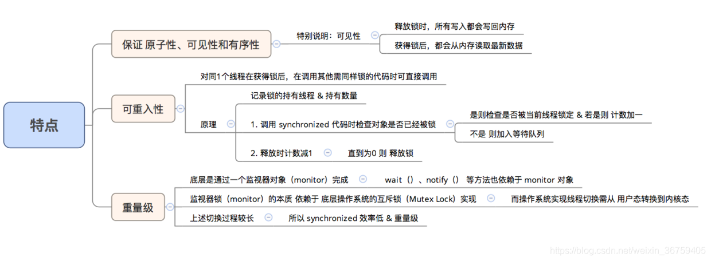

# 5.2 锁

在并发编程中存在线程安全问题，主要原因有：

1.存在共享数据。

2.多线程共同操作共享数据。

## 1. Synchronized关键字

关键字synchronized可以保证在同一时刻，只有一个线程可以执行某个方法或某个代码块，同时synchronized可以保证一个线程的变化可见（可见性），即可以代替volatile。

实现原理： JVM 是通过进入、退出 **对象监视器(Monitor)** 来实现对方法、同步块的同步的，而对象监视器的本质依赖于底层操作系统的 **互斥锁(Mutex Lock)** 实现。

具体实现是在编译之后在同步方法调用前加入一个`monitor.enter`指令，在退出方法和异常处插入`monitor.exit`的指令。

对于没有获取到锁的线程将会阻塞到方法入口处，直到获取锁的线程`monitor.exit`之后才能尝试继续获取锁。



所有隐式监控器都实现可重入特性。可重入意味着锁绑定到当前线程。一个线程可以多次安全地获取相同的锁，而不会陷入死锁。

## 2. Locks

### 2.1 ReentrantLock

ReentrantLock常常对比着synchronized来分析，我们先对比着来看然后再一点一点分析。

（1）synchronized是独占锁，加锁和解锁的过程自动进行，易于操作，但不够灵活。ReentrantLock也是独占锁，加锁和解锁的过程需要手动进行，不易操作，但非常灵活。

（2）synchronized可重入，因为加锁和解锁自动进行，不必担心最后是否释放锁；ReentrantLock也可重入，但加锁和解锁需要手动进行，且次数需一样，否则其他线程无法获得锁。

（3）synchronized不可响应中断，一个线程获取不到锁就一直等着；ReentrantLock可以相应中断。

ReentrantLock好像比synchronized关键字没好太多，我们再去看看synchronized所没有的，一个最主要的就是ReentrantLock还可以实现**公平锁**机制。什么叫公平锁呢？也就是在锁上等待时间最长的线程将获得锁的使用权。通俗的理解就是谁排队时间最长谁先执行获取锁。

通过构造方法接受一个可选的 fair 参数（默认非公平锁）：当设置为 true 时，表示公平锁；否则为非公平锁

> 公平锁与非公平锁的区别在于，公平锁的锁获取是有顺序的。但是公平锁的效率往往没有非公平锁的效率高，在许多线程访问的情况下，公平锁表现出较低的吞吐量

lock()获取锁,调用该方法当前线程将会获取锁。unlock()释放锁。

响应中断就是一个线程获取不到锁，不会傻傻的一直等下去，ReentrantLock会给予一个中断回应。lockInterruptibly()方法。

通过tryLock()方法来实现限时等待，可以选择传入时间参数，表示等待指定的时间，无参则表示立即返回锁申请的结果：true表示获取锁成功，false表示获取锁失败。我们可以将这种方法用来解决死锁问题。

ReentranLock整体结构：

- ReentrantLock 实现 Lock 接口，基于内部的 Sync 实现。
- Sync 实现 AQS （AbstractQueuedSynchronizer），提供了 FairSync 和 NonFairSync 两种实现。

ReentrantLock主要利用CAS+AQS队列来实现。它支持公平锁和非公平锁，两者的实现类似。

**CAS**：Compare and Swap，比较并交换。CAS有3个操作数：内存值V、预期值A、要修改的新值B。当且仅当预期值A和内存值V相同时，将内存值V修改为B，否则什么都不做。该操作是一个原子操作，被广泛的应用在Java的底层实现中。在Java中，CAS主要是由sun.misc.Unsafe这个类通过JNI调用CPU底层指令实现

AbstractQueuedSynchronizer简称**AQS**，是一个用于构建锁和同步容器的框架。事实上concurrent包内许多类都是基于AQS构建，例如ReentrantLock，Semaphore，CountDownLatch，ReentrantReadWriteLock，FutureTask等。AQS解决了在实现同步容器时设计的大量细节问题。


AQS使用一个**FIFO的队列**表示排队等待锁的线程，队列头节点称作“哨兵节点”或者“哑节点”，它不与任何线程关联。其他的节点与等待线程关联，每个节点维护一个等待状态waitStatus

ReentrantLock的基本实现可以概括为：先通过CAS尝试获取锁。如果此时已经有线程占据了锁，那就加入AQS队列并且被挂起。当锁被释放之后，排在CLH队列队首的线程会被唤醒，然后CAS再次尝试获取锁。在这个时候，如果：

非公平锁：如果同时还有另一个线程进来尝试获取，那么有可能会让这个线程抢先获取；

公平锁：如果同时还有另一个线程进来尝试获取，当它发现自己不是在队首的话，就会排到队尾，由队首的线程获取到锁。

**Condition **

ReentrantLock还提供了条件Condition，对线程的等待、唤醒操作更加详细和灵活，所以在多个条件变量和高度竞争锁的地方，ReentrantLock更加适合。

Condition是在java 1.5中才出现的，它用来替代传统的Object的wait()、notify()实现线程间的协作，相比使用Object的wait()、notify()，使用Condition的await()、signal()这种方式实现线程间协作更加安全和高效。因此通常来说比较推荐使用Condition。

Condition类能实现synchronized和wait、notify搭配的功能，另外比后者更灵活，Condition可以实现多路通知功能，也就是在一个Lock对象里可以创建多个Condition（即对象监视器）实例，线程对象可以注册在指定的Condition中，从而可以有选择的进行线程通知，在调度线程上更加灵活。而synchronized就相当于整个Lock对象中只有一个单一的Condition对象，所有的线程都注册在这个对象上。线程开始notifyAll时，需要通知所有的WAITING线程，没有选择权，会有相当大的效率问题。

1、Condition是个接口，基本的方法就是await()和signal()方法。

2、Condition依赖于Lock接口，生成一个Condition的基本代码是lock.newCondition()。

3、调用Condition的await()和signal()方法，都必须在lock保护之内，就是说必须在lock.lock()和lock.unlock之间才可以使用。

4、Conditon中的await()对应Object的wait()，Condition中的signal()对应Object的notify()，Condition中的signalAll()对应Object的notifyAll()。

### 2.2 ReadWriteLock

ReadWriteLock管理一组锁，一个是只读的锁，一个是写锁。

把读写操作分别用读锁和写锁来加锁，在读取时，多个线程可以同时获得读锁，这样就大大提高了并发读的执行效率。使用`ReadWriteLock`时，适用条件是同一个数据，有大量线程读取，但仅有少数线程修改。

获取锁要做的是更改AQS的状态值以及将需要等待的线程放入到队列中；释放锁要做的就是更改AQS的状态值以及唤醒队列中的等待线程来继续获取锁。

获取锁：

- 如果当前没有写锁或读锁时，第一个获取锁的线程都会成功，无论该锁是写锁还是读锁。
- 如果当前已经有了读锁，那么这时获取写锁将失败，获取读锁有可能成功也有可能失败
- 如果当前已经有了写锁，那么这时获取读锁或写锁，如果线程相同（可重入），那么成功；否则失败

写锁的释放主要有三步：

1. 如果当前没有线程持有写锁，但是还要释放写锁，抛出异常
2. 得到解除一把写锁后的状态，如果没有写锁了，那么将AQS的线程置为null
3. 不管第二步中是否需要将AQS的线程置为null，AQS的状态总是要更新的

可以得出：

- 如果当前是写锁被占有了，只有当写锁的数据降为0时才认为释放成功；否则失败。因为只要有写锁，那么除了占有写锁的那个线程，其他线程即不可以获得读锁，也不能获得写锁
- 如果当前是读锁被占有了，那么只有在写锁的个数为0时才认为释放成功。因为一旦有写锁，别的任何线程都不应该再获得读锁了，除了获得写锁的那个线程。

当分析ReentranctReadWriteLock时，或者说分析内部使用AQS实现的工具类时，需要明白的就是AQS的state代表的是什么。ReentrantLockReadWriteLock中的state同时表示写锁和读锁的个数。为了实现这种功能，state的高16位表示**读锁**的个数，低16位表示**写锁**的个数。AQS有两种模式：共享模式和独占模式，读写锁的实现中，读锁使用共享模式；写锁使用独占模式；另外一点需要记住的即使，当有读锁时，写锁就不能获得；而当有写锁时，除了获得写锁的这个线程可以获得读锁外，其他线程不能获得读锁。

ReetrantReadWriteLock读写锁的实现中，读锁使用共享模式；写锁使用独占模式，换句话说，读锁可以在没有写锁的时候被多个线程同时持有，写锁是独占的。

ReetrantReadWriteLock读写锁的实现中，需要注意的，当有读锁时，写锁就不能获得；而当有写锁时，除了获得写锁的这个线程可以获得读锁外，其他线程不能获得读锁。

### 2.3 StampedLock

`ReadWriteLock`可以解决多线程同时读，但只有一个线程能写的问题。但如果我们深入分析`ReadWriteLock`，会发现它有个潜在的问题：如果有线程正在读，写线程需要等待读线程释放锁后才能获取写锁，即读的过程中不允许写，这是一种悲观的读锁。

要进一步提升并发执行效率，Java 8引入了新的读写锁：`StampedLock`。

`StampedLock`和`ReadWriteLock`相比，改进之处在于：读的过程中也允许获取写锁后写入！这样一来，我们读的数据就可能不一致，所以，需要一点额外的代码来判断读的过程中是否有写入，这种读锁是一种**乐观锁**。

乐观锁的意思就是乐观地估计读的过程中大概率不会有写入，因此被称为乐观锁。反过来，悲观锁则是读的过程中拒绝有写入，也就是写入必须等待。显然乐观锁的并发效率更高，但一旦有小概率的写入导致读取的数据不一致，需要能检测出来，再读一遍就行。


和`ReadWriteLock`相比，写入的加锁是完全一样的，不同的是读取。注意到首先我们通过**`tryOptimisticRead()`**获取一个乐观读锁，并返回**版本号**。接着进行读取，读取完成后，我们通过**`validate()`**去验证版本号，如果在读取过程中没有写入，版本号不变，验证成功，我们就可以放心地继续后续操作。如果在读取过程中有写入，版本号会发生变化，验证将失败。在失败的时候，我们再通过获取悲观读锁再次读取。由于写入的概率不高，程序在绝大部分情况下可以通过乐观读锁获取数据，极少数情况下使用悲观读锁获取数据。

可见，`StampedLock`把读锁细分为乐观读和悲观读，能进一步提升并发效率。但这也是有代价的：

一是代码更加复杂，

二是`StampedLock`是不可重入锁，不能在一个线程中反复获取同一个锁。

## 3. Semaphore

java.util.concurrent.Semaphore(信号量)：是一种计数器，用来保护一个或者多个共享资源的访问。如果线程要访问一个资源就必须先获得信号量。如果信号量内部计数器大于0，信号量减1，然后允许共享这个资源；否则，如果信号量的计数器等于0，信号量将会把线程置入休眠直至计数器大于0。当信号量使用完时，必须释放。

实例代码：

```
        final Semaphore semaphore = new Semaphore(2);
        ExecutorService executorService = Executors.newCachedThreadPool();
        for (int i = 0; i < 10; i++) {
            final int index = i; 
            executorService.execute(new Runnable() {
                public void run() {
                    try {
                        semaphore.acquire()；
                        System.out.println("线程:" + Thread.currentThread().getName() + "获得许可:" + index);
                        TimeUnit.SECONDS.sleep(1);
                        semaphore.release();
                        System.out.println("允许TASK个数：" + semaphore.availablePermits());  
                    } catch (InterruptedException e) {
                        e.printStackTrace();
                    }
                }
            });
        }
        executorService.shutdown();
```

构造方法1：
```
public Semaphore(int permits) {
    sync = new NonfairSync(permits);
}
```
permits 初始许可数，也就是最大访问线程数构造方法2：
```
public Semaphore(int permits, boolean fair) {
    sync = (fair)? new FairSync(permits) : new NonfairSync(permits);
}
```
permits 初始许可数，也就是最大访问线程数

fair 当设置为false时，创建的信号量为非公平模式；当设置为true时，信号量是公平模式

**主要方法：**

- void acquire() ：从信号量获取一个许可，如果无可用许可前将一直阻塞等待，

- void acquire(int permits) ：获取指定数目的许可，如果无可用许可前也将会一直阻塞等待

- boolean tryAcquire()：从信号量尝试获取一个许可，如果无可用许可，直接返回false，不会阻塞

- boolean tryAcquire(int permits)： 尝试获取指定数目的许可，如果无可用许可直接返回false

- boolean tryAcquire(int permits, long timeout, TimeUnit unit)： 在指定的时间内尝试从信号量中获取许可，如果在指定的时间内获取成功，返回true，否则返回false

- void release()： 释放一个许可，别忘了在finally中使用，注意：多次调用该方法，会使信号量的许可数增加，达到动态扩展的效果，如：初始permits为1， 调用了两次release，最大许可会改变为2

- int availablePermits()： 获取当前信号量可用的许可

  

**JDK 非公平Semaphore实现：**
　　1.使用一个参数的构造创建Semaphore对象时，会创建一个NonfairSync对象实例，并将state值设为传入的值（permits ），

```
public Semaphore(int permits) {
    sync = new NonfairSync(permits);
}
```
　　NonfairSync间接的继承了AbstractQueuedSynchronizer实现
```
final static class NonfairSync extends Sync {
        private static final long serialVersionUID = -2694183684443567898L;

        NonfairSync(int permits) {
            super(permits);
        }
     
        protected int tryAcquireShared(int acquires) {
            return nonfairTryAcquireShared(acquires);
        }
    }
```
```
abstract static class Sync extends AbstractQueuedSynchronizer {
    private static final long serialVersionUID = 1192457210091910933L;

    Sync(int permits) {
        setState(permits);
    }
```
　　AbstractQueuedSynchronizer 的setState方法
```
protected final void setState(int newState) {
    state = newState;
}
```

　　2.调用tryAcquire方法时，实际是调用NonfairSync的nonfairTryAcquireShared方法，nonfairTryAcquireShared在父类Sync中实现，

Semaphore# tryAcquire方法：

```
public boolean tryAcquire() {
    return sync.nonfairTryAcquireShared(1) >= 0;
}
```
　　Sync的nonfairTryAcquireShared方法
```
final int nonfairTryAcquireShared(int acquires) {
    for (;;) {
        int available = getState();
        int remaining = available - acquires;
        if (remaining < 0 ||
            compareAndSetState(available, remaining))
            return remaining;
    }
}
```
　　nonfairTryAcquireShared 方法通过获取当前的state，以此state减去需要获取信号量的个数，作为剩余个数，如果结果小于0，返回此剩余的个数；如果结果大于等于0，则基于 CAS将state的值设置为剩余个数，当前步骤用到了for循环，所以只有在结果小于0或设置state值成功的情况下才会退出。如果返回的剩余许可个数大于0，tryAcquire方法则返回true；其余返回false。

　　AbstractQueuedSynchronizer的compareAndSetState方法，
```
protected final boolean compareAndSetState(int expect, int update) {
    // See below for intrinsics setup to support this
    return unsafe.compareAndSwapInt(this, stateOffset, expect, update);
}
```
　　3.release方法，释放一个许可
```
public void release() {
    sync.releaseShared(1);
}
```
　　AbstractQueuedSynchronizer的releaseShared方法，
```
public final boolean releaseShared(int arg) {
    if (tryReleaseShared(arg)) {
        doReleaseShared();
        return true;
    }
    return false;
}
```
　　release方法间接的调用了Sync的tryReleaseShared方法，该方法基于Cas 将state的值设置为state+1，一直循环确保CAS操作成功，成功后返回true。

```
protected final boolean tryReleaseShared(int releases) {
    for (;;) {
        int p = getState();
        if (compareAndSetState(p, p + releases))
            return true;
    }
}
```
　　根据上面分析，可以看得出，Semaphore采用了CAS来实现，尽量避免锁的使用，提高了性能