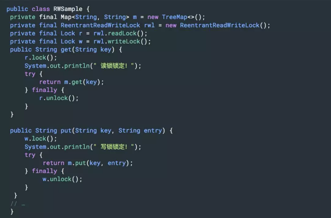
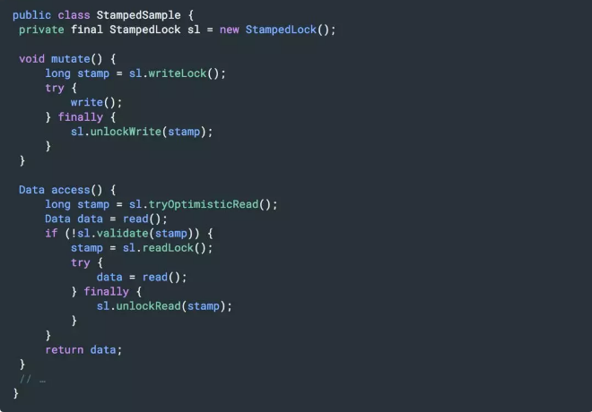
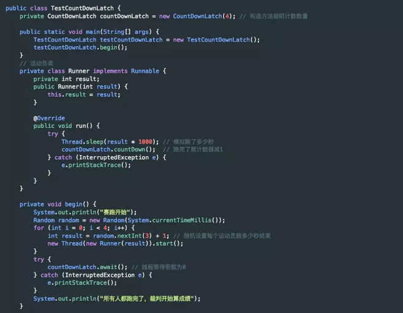
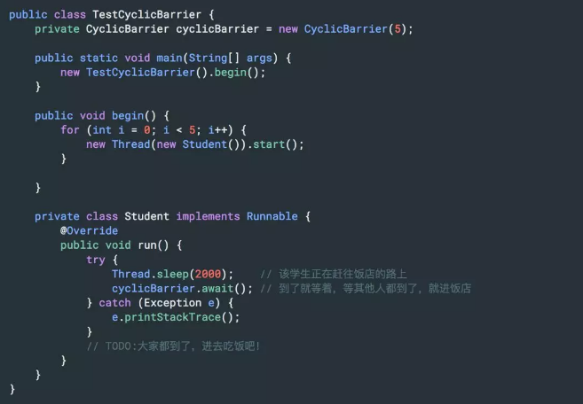
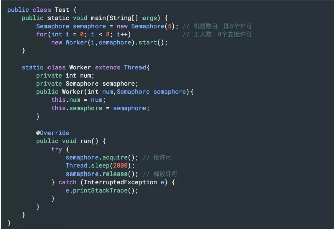

# 2 Lock

## 跟 Synchronized 相比，可重入锁 ReentrantLock 其实现原理有什么不同？

其实，锁的实现原理基本是为了达到一个目的：

让所有的线程都能看到某种标记。

Synchronized 通过在对象头中设置标记实现了这一目的，是一种 JVM 原生的锁实现方式，而 ReentrantLock 以及所有的基于 Lock 接口的实现类，都是通过用一个 volitile 修饰的 int 型变量，并保证每个线程都能拥有对该 int 的可见性和原子修改，其本质是基于所谓的 AQS 框架。

## 那么请谈谈 AQS 框架是怎么回事儿？

AQS（AbstractQueuedSynchronizer 类）是一个用来构建锁和同步器的框架，各种 Lock 包中的锁（常用的有 ReentrantLock、ReadWriteLock），以及其他如 Semaphore、CountDownLatch，甚至是早期的 FutureTask 等，都是基于 AQS 来构建。

1. AQS 在内部定义了一个 volatile int state 变量，表示同步状态：当线程调用 lock 方法时 ，如果 state=0，说明没有任何线程占有共享资源的锁，可以获得锁并将 state=1；如果 state=1，则说明有线程目前正在使用共享变量，其他线程必须加入同步队列进行等待。

2. AQS 通过 Node 内部类构成的一个双向链表结构的同步队列，来完成线程获取锁的排队工作，当有线程获取锁失败后，就被添加到队列末尾。

   o Node 类是对要访问同步代码的线程的封装，包含了线程本身及其状态叫 waitStatus（有五种不同 取值，分别表示是否被阻塞，是否等待唤醒，是否已经被取消等），每个 Node 结点关联其 prev 结点和 next 结点，方便线程释放锁后快速唤醒下一个在等待的线程，是一个 FIFO 的过程。

   o Node 类有两个常量，SHARED 和 EXCLUSIVE，分别代表共享模式和独占模式。所谓共享模式是一个锁允许多条线程同时操作（信号量 Semaphore 就是基于 AQS 的共享模式实现的），独占模式是同一个时间段只能有一个线程对共享资源进行操作，多余的请求线程需要排队等待（如 ReentranLock）。

3. AQS 通过内部类 ConditionObject 构建等待队列（可有多个），当 Condition 调用 wait() 方法后，线程将会加入等待队列中，而当 Condition 调用 signal() 方法后，线程将从等待队列转移动同步队列中进行锁竞争。

4. AQS 和 Condition 各自维护了不同的队列，在使用 Lock 和 Condition 的时候，其实就是两个队列的互相移动。

## 请尽可能详尽地对比下 Synchronized 和 ReentrantLock 的异同。

ReentrantLock 是 Lock 的实现类，是一个互斥的同步锁。

从功能角度，ReentrantLock 比 Synchronized 的同步操作更精细（因为可以像普通对象一样使用），甚至实现 Synchronized 没有的高级功能，如：

- 等待可中断：当持有锁的线程长期不释放锁的时候，正在等待的线程可以选择放弃等待，对处理执行时间非常长的同步块很有用。
- 带超时的获取锁尝试：在指定的时间范围内获取锁，如果时间到了仍然无法获取则返回。
- 可以判断是否有线程在排队等待获取锁。
- 可以响应中断请求：与 Synchronized 不同，当获取到锁的线程被中断时，能够响应中断，中断异常将会被抛出，同时锁会被释放。
- 可以实现公平锁。

从锁释放角度，Synchronized 在 JVM 层面上实现的，不但可以通过一些监控工具监控 Synchronized 的锁定，而且在代码执行出现异常时，JVM 会自动释放锁定；但是使用 Lock 则不行，Lock 是通过代码实现的，要保证锁定一定会被释放，就必须将 unLock() 放到 finally{} 中。

从性能角度，Synchronized 早期实现比较低效，对比 ReentrantLock，大多数场景性能都相差较大。但是在 Java 6 中对其进行了非常多的改进，在竞争不激烈时，Synchronized 的性能要优于 ReetrantLock；在高竞争情况下，Synchronized 的性能会下降几十倍，但是 ReetrantLock 的性能能维持常态。

## ReentrantLock 是如何实现可重入性的？

ReentrantLock 内部自定义了同步器 Sync（Sync 既实现了 AQS，又实现了 AOS，而 AOS 提供了一种互斥锁持有的方式），其实就是加锁的时候通过 CAS 算法，将线程对象放到一个双向链表中，每次获取锁的时候，看下当前维护的那个线程 ID 和当前请求的线程 ID 是否一样，一样就可重入了。

## 除了 ReetrantLock，你还接触过 JUC 中的哪些并发工具？

通常所说的并发包（JUC）也就是 java.util.concurrent 及其子包，集中了 Java 并发的各种基础工具类，具体主要包括几个方面：

- 提供了 CountDownLatch、CyclicBarrier、Semaphore 等，比 Synchronized 更加高级，可以实现更加丰富多线程操作的同步结构。
- 提供了 ConcurrentHashMap、有序的 ConcunrrentSkipListMap，或者通过类似快照机制实现线程安全的动态数组 CopyOnWriteArrayList 等，各种线程安全的容器。
- 提供了 ArrayBlockingQueue、SynchorousQueue 或针对特定场景的 PriorityBlockingQueue 等，各种并发队列实现。
- 强大的 Executor 框架，可以创建各种不同类型的线程池，调度任务运行等。

## 请谈谈 ReadWriteLock 和 StampedLock

虽然 ReentrantLock 和 Synchronized 简单实用，但是行为上有一定局限性，要么不占，要么独占。实际应用场景中，有时候不需要大量竞争的写操作，而是以并发读取为主，为了进一步优化并发操作的粒度，Java 提供了读写锁。

读写锁基于的原理是多个读操作不需要互斥，如果读锁试图锁定时，写锁是被某个线程持有，读锁将无法获得，而只好等待对方操作结束，这样就可以自动保证不会读取到有争议的数据。

ReadWriteLock 代表了一对锁，下面是一个基于读写锁实现的数据结构，当数据量较大，并发读多、并发写少的时候，能够比纯同步版本凸显出优势：

读写锁看起来比 Synchronized 的粒度似乎细一些，但在实际应用中，其表现也并不尽如人意，主要还是因为相对比较大的开销。

所以，JDK 在后期引入了 StampedLock，在提供类似读写锁的同时，还支持优化读模式。优化读基于假设，大多数情况下读操作并不会和写操作冲突，其逻辑是先试着修改，然后通过 validate 方法确认是否进入了写模式，如果没有进入，就成功避免了开销；如果进入，则尝试获取读锁。

## 如何让 Java 的线程彼此同步？你了解过哪些同步器？请分别介绍下。

JUC 中的同步器三个主要的成员：CountDownLatch、CyclicBarrier 和 Semaphore，通过它们可以方便地实现很多线程之间协作的功能。

CountDownLatch 叫倒计数，允许一个或多个线程等待某些操作完成。看几个场景：

- 跑步比赛，裁判需要等到所有的运动员（“其他线程”）都跑到终点（达到目标），才能去算排名和颁奖。
- 模拟并发，我需要启动 100 个线程去同时访问某一个地址，我希望它们能同时并发，而不是一个一个的去执行。

用法：CountDownLatch 构造方法指明计数数量，被等待线程调用 countDown 将计数器减 1，等待线程使用 await 进行线程等待。一个简单的例子：

CyclicBarrier 叫循环栅栏，它实现让一组线程等待至某个状态之后再全部同时执行，而且当所有等待线程被释放后，CyclicBarrier 可以被重复使用。CyclicBarrier 的典型应用场景是用来等待并发线程结束。

CyclicBarrier 的主要方法是 await()，await() 每被调用一次，计数便会减少 1，并阻塞住当前线程。当计数减至 0 时，阻塞解除，所有在此 CyclicBarrier 上面阻塞的线程开始运行。

在这之后，如果再次调用 await()，计数就又会变成 N-1，新一轮重新开始，这便是 Cyclic 的含义所在。CyclicBarrier.await() 带有返回值，用来表示当前线程是第几个到达这个 Barrier 的线程。

举例说明如下：

Semaphore，Java 版本的信号量实现，用于控制同时访问的线程个数，来达到限制通用资源访问的目的，其原理是通过 acquire() 获取一个许可，如果没有就等待，而 release() 释放一个许可。

如果 Semaphore 的数值被初始化为 1，那么一个线程就可以通过 acquire 进入互斥状态，本质上和互斥锁是非常相似的。但是区别也非常明显，比如互斥锁是有持有者的，而对于 Semaphore 这种计数器结构，虽然有类似功能，但其实不存在真正意义的持有者，除非我们进行扩展包装。

## CyclicBarrier 和 CountDownLatch 看起来很相似，请对比下呢？

它们的行为有一定相似度，区别主要在于：

- CountDownLatch 是不可以重置的，所以无法重用，CyclicBarrier 没有这种限制，可以重用。
- CountDownLatch 的基本操作组合是 countDown/await，调用 await 的线程阻塞等待 countDown 足够的次数，不管你是在一个线程还是多个线程里 countDown，只要次数足够即可。 CyclicBarrier 的基本操作组合就是 await，当所有的伙伴都调用了 await，才会继续进行任务，并自动进行重置。

CountDownLatch 目的是让一个线程等待其他 N 个线程达到某个条件后，自己再去做某个事（通过 CyclicBarrier 的第二个构造方法 public CyclicBarrier(int parties, Runnable barrierAction)，在新线程里做事可以达到同样的效果）。而 CyclicBarrier 的目的是让 N 多线程互相等待直到所有的都达到某个状态，然后这 N 个线程再继续执行各自后续（通过 CountDownLatch 在某些场合也能完成类似的效果）。