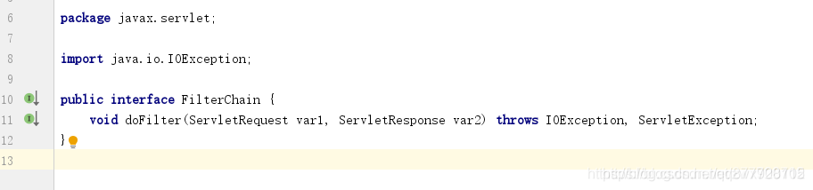

# 一.责任链模式

**责任链模式(Chain of Responsibility Pattern)是指将链中的每一个节点看作是一个对象，每个节点处理的请求均不同，且每个节点内部自动维护了一个下一个节点对象。当一个请求在链路的头部发出时，会沿着链的路径依次传递给每一个节点对象，直到有对象处理这个请求为止。**

- 责任链模式通常会维护一个<font color=#ff00a>单向链表</font>，将同一类请求的对象连成一条链，调用方只需要调用头部节点就可以了，所提交的请求会沿着链传递，由链上的对象逐个判断是否有能力处理该请求，如果能则处理，如果不能则传递给链上的下一个对象处理。

# 二.责任链模式适用场景

1. 一个请求需要多个操作或对象依次处理，形成一条处理链路，常见如：拦截器、过滤器
2. 多个对象可以处理同一请求，将这些对象连成一条链，并沿着这条链传递该请求，具体由哪个对象处理则在运行时动态决定。
3. <font color=#ff00a>-责任链模式一般用于处理流程流转相关的业务场景</font>，**如：请求审批流程、报销流程、接口校验流程**

# 三.责任链模式角色


- **抽象处理者(Handler)**：定义一个请求处理的方法，并维护一个下一个处理节点的Handler对象
- **具体处理者(ConcreteHandler)**：在实现Handler的处理方法中对请求进行处理，处理完之后可以进行转发

# 四.责任链模式的实现方式

## 案例1：登录校验流程

**以登录校验账号密码，角色，权限等信息的功能为例，**

**传统写法**

看起来写法上法简单明了，但是一堆业务代码全部堆在一起，而且我们示例中的逻辑校验比较简单，如果逻辑变得很复杂，那么将各种用户名密码、角色、权限等逻辑校验做一个解耦拆分对后期维护是非常有利的。

```java
public class LoginService {
    public void login(LoginUser loginUser) {
        //1.校验账号密码
        if (loginUser.getLoginName() == null || "".equals(loginUser.getLoginName())) {
            System.out.println("用户名不能为空");
            return;
        }
        if (loginUser.getPassword() == null || "".equals(loginUser.getPassword())) {
            System.out.println("密码不能为空");
            return;
        }
        if (!loginUser.getPassword().equals("123456")) {
            System.out.println("密码不正确");
            return;
        }
        //2.角色
        if (!"admin".equals(loginUser.getRoleName())) {
            System.out.println("角色信息有误");
            return;
        }
        //3.校验权限
        if (!"admin".equals(loginUser.getPermission())) {
            System.out.println("暂无权限");
            return;
        }
        System.out.println("校验通过，登录成功");
    }
}
```

**登录用户信息类**

```java
public class LoginUser {
	//用户名
    private String loginName;
    //密码
    private String password;
    //角色名
    private String roleName;
    //权限
    private String permission;

    public String getLoginName() {  return loginName; }
    public void setLoginName(String loginName) {  this.loginName = loginName; }

    public String getPassword() { return password;  }
    public void setPassword(String password) { this.password = password;  }

    public String getRoleName() {   return roleName;   }
    public void setRoleName(String roleName) {  this.roleName = roleName;  }

    public String getPermission() {  return permission;}
    public void setPermission(String permission) {this.permission = permission; }
}
```

**抽象处理者(Handler)**

该类维护了链路中的下一个对象，并且将真正处理逻辑的方法doHandler只进行了抽象定义，具体留给实现类去实现

```java
public abstract class AbstractHandler {
    /**
     *  下一个处理者
     */
    protected AbstractHandler next;

    public void next(AbstractHandler handler){
        this.next = handler;
    }

    /**
     * 处理请求的核心的业务方法
     * @param loginUser
     */
    public abstract void doHandler(LoginUser loginUser);
}
```

**具体处理者(ConcreteHandler)**

校验账号密码处理者

```java
/**
 * 校验账号密码Handler
 */
public class VerifyAccountHandler extends AbstractHandler {
    @Override
    public void doHandler(LoginUser loginUser) {
        if (loginUser.getLoginName() == null || "".equals(loginUser.getLoginName())) {
            System.out.println("用户名不能为空");
            return;
        }
        if (loginUser.getPassword() == null || "".equals(loginUser.getPassword())) {
            System.out.println("密码不能为空");
            return;
        }
        if (!loginUser.getPassword().equals("123456")) {
            System.out.println("密码不正确");
            return;
        }
        System.out.println("账号密码校验通过");

        //调用链路中下一个节点的处理方法
        next.doHandler(loginUser);
    }
}
```


校验角色处理者

```java
/**
 * 校验角色Handler
 */
public class VerifyRoleHandler extends AbstractHandler {
    @Override
    public void doHandler(LoginUser loginUser) {
        if(!"admin".equals(loginUser.getRoleName())){
            System.out.println("角色信息有误");
            return;
        }
        System.out.println("角色信息校验通过");

        //调用链路中下一个节点的处理方法
        next.doHandler(loginUser);
    }
}
```


校验权限处理者

```java
/**
 * 校验权限Handler
 */
public class VerifyPermissionHandler extends AbstractHandler {
    @Override
    public void doHandler(LoginUser loginUser) {
        if (!"admin".equals(loginUser.getPermission())){
            System.out.println("暂无权限");
            return;
        }
        System.out.println("权限校验通过，登录成功");

        //因为permission已经是最后一个节点，所以这里不需要再继续制定下一个节点了，内部也没有再维护下一个节点对象了。
    }
}
```

**客户类**

```java
public class Client {
    public static void main(String[] args) {
        //1.校验用户名、密码处理者
        AbstractHandler accountHandler = new VerifyAccountHandler();
        //2.校验角色处理者
        AbstractHandler roleHandler = new VerifyRoleHandler();
        //3.校验权限处理者
        AbstractHandler permissionHandler = new VerifyPermissionHandler();

        //校验顺序：1->->2->3
        accountHandler.next(roleHandler);
        roleHandler.next(permissionHandler);

        //构建请求
        LoginUser loginUser = new LoginUser();
        loginUser.setLoginName("孤狼1号");
        loginUser.setPassword("123456");
        loginUser.setRoleName("admin");
        loginUser.setPermission("admin");

        //从起点开始调用
        accountHandler.doHandler(loginUser);
    }
}
```


执行结果


**责任链模式结合建造者模式**

上面的示例写法中，最后在调用过程中有点不是很优雅，由此我们联想到了建造者模式的链式写法，接下来让我们结合建造者模式来对其进行改写。

```java
public abstract class BuildHandler<T> {
    /**
     *  下一个处理者
     */
    protected BuildHandler next;

    /**
     * 设置下一个处理者
     * @param handler
     */
    public void next(BuildHandler handler){
        this.next = handler;
    }

    /**
     * 处理请求的核心的业务方法
     * @param loginUser
     */
    public abstract void doHandler(LoginUser loginUser);

    public static class Builder<T>{
        /**
         * 头节点
         */
        private BuildHandler<T> head;
        /**
         * 尾节点
         */
        private BuildHandler<T> tail;

        public Builder<T> addHandler(BuildHandler handler){
            //head==null表示第一次添加到队列
            if (null == head){
                this.head = handler;
                this.tail = handler;
                return this;
            }
            //新添加进来的节点为当前BuildHandler的下一节点
            this.tail.next(handler);
            //新添加进来的节点为当前Builder的下一节点
            this.tail = handler;
            //返回当前调用者的引用
            return this;
        }

        /**
         * 构建头节点
         * @return
         */
        public BuildHandler<T> build(){
            return this.head;
        }
    }
}
```

```java
public class Client {
    public static void main(String[] args) {
        LoginUser loginUser = new LoginUser();
        loginUser.setLoginName("孤狼1号");
        loginUser.setPassword("123456");
        loginUser.setRoleName("admin");
        loginUser.setPermission("admin");

        BuildHandler.Builder<AbstractHandler> builder = new BuildHandler.Builder<AbstractHandler>();
        builder.addHandler(new VerifyAccountHandler2())//继承BuildHandler实现抽象方法
                .addHandler(new VerifyRoleHandler2())//继承BuildHandler实现抽象方法
                .addHandler(new VerifyPermissionHandler2());//继承BuildHandler实现抽象方法

        //构建链首对象并调用方法
        builder.build().doHandler(loginUser);
    }
}
```


执行结果


## 案例2：请求审批流程

公司里面，请假的审批流程：

- 如果请假天数小于3天，主任审批
- 如果请假天数大于等于3天，小于10天，经理审批
- 如果大于等于10天，小于20天，副总经理审批
- 如果大于等于20天，小于30天，总经理审批
- 如果大于等于30天，提示拒绝

**抽象处理者(Handler)**

```java
/**
 * 抽象处理类-领导
 */
public abstract class Leader {
	// 领导姓名
	protected String name;
	// 下一个处理的领导
	protected Leader nextLeader; //责任链上的后继对象

	public Leader(String name) {
		super();
		this.name = name;
	}

	//设定责任链上的后继对象
	public void setNextLeader(Leader nextLeader) {
		this.nextLeader = nextLeader;
	}

	/**
	 * 处理请求的核心的业务方法
	 * @param request
	 */
	public abstract void handleRequest(LeaveRequest request);
}
```

**具体处理者(ConcreteHandler)**

```java
/**
 * 具体处理类-总经理-如果大于等于20天，小于30天，总经理审批
 */
public class GeneralManager extends Leader {
	public GeneralManager(String name) {
		super(name);
	}

	@Override
	public void handleRequest(LeaveRequest request) {
		if(request.getLeaveDays()<30){
			System.out.println("员工："+request.getEmpName()+"请假，天数："+request.getLeaveDays()+",理由："+request.getReason());
			System.out.println("总经理："+this.name+",审批通过！");
		}else{
			System.out.println("莫非"+request.getEmpName()+"想辞职，居然请假"+request.getLeaveDays()+"天！");
		}
	}
}
```

```java
/**
 *  具体处理类-副总经理-如果大于等于10天，小于20天，副总经理审批
 */
public class ViceGeneralManager extends Leader {

	public ViceGeneralManager(String name) {
		super(name);
	}

	@Override
	public void handleRequest(LeaveRequest request) {
		if(request.getLeaveDays()<20){
			System.out.println("员工："+request.getEmpName()+"请假，天数："+request.getLeaveDays()+",理由："+request.getReason());
			System.out.println("副总经理："+this.name+",审批通过！");
		}else{
			if(this.nextLeader!=null){
				this.nextLeader.handleRequest(request);
			}
		}
	}
}
```

```java
/**
 *具体处理类-经理-如果请假天数大于等于3天，小于10天，经理审批
 */
public class Manager extends Leader {
	public Manager(String name) {
		super(name);
	}

	@Override
	public void handleRequest(LeaveRequest request) {
		if(request.getLeaveDays()<10){
			System.out.println("员工："+request.getEmpName()+"请假，天数："+request.getLeaveDays()+",理由："+request.getReason());
			System.out.println("经理："+this.name+",审批通过！");
		}else{
			if(this.nextLeader!=null){
				this.nextLeader.handleRequest(request);
			}
		}
	}
}
```

```java
/**
 * 具体处理类-主任-如果请假天数小于3天，主任审批
 */
public class Director extends Leader {
	public Director(String name) {
		super(name);
	}

	@Override
	public void handleRequest(LeaveRequest request) {
		if(request.getLeaveDays()<3){
			System.out.println("员工："+request.getEmpName()+"请假，天数："+request.getLeaveDays()+",理由："+request.getReason());
			System.out.println("主任："+this.name+",审批通过！");
		}else{
			if(this.nextLeader!=null){
				this.nextLeader.handleRequest(request);
			}
		}
	}
}
```

**请求接口**

```java
/**
 * 封装请假的基本信息
 */
public class LeaveRequest {
	// 员工名称
	private String empName;
	// 请假天数
	private int leaveDays;
	// 请假原因
	private String reason;

	public LeaveRequest(String empName, int leaveDays, String reason) {
		super();
		this.empName = empName;
		this.leaveDays = leaveDays;
		this.reason = reason;
	}
	public String getEmpName() {
		return empName;
	}
	public void setEmpName(String empName) {
		this.empName = empName;
	}
	public int getLeaveDays() {
		return leaveDays;
	}
	public void setLeaveDays(int leaveDays) {
		this.leaveDays = leaveDays;
	}
	public String getReason() {
		return reason;
	}
	public void setReason(String reason) {
		this.reason = reason;
	}
}
```

**客户类**

```java
public class Client {
    public static void main(String[] args) {
        Leader a = new Director("张三");
        Leader b = new Manager("李四");
        Leader b2 = new ViceGeneralManager("王五");
        Leader c = new GeneralManager("墩墩分墩");
        //组织责任链对象的关系
        a.setNextLeader(b);
        b.setNextLeader(b2);
        b2.setNextLeader(c);

        //开始请假操作
        LeaveRequest req1 = new LeaveRequest("TOM", 29, "老婆生孩子回家探望！");
        a.handleRequest(req1);
    }
}
```


执行结果


# 五.责任链模式的通用模版

## 抽象处理者(Handler)

```java
/**
 * 抽象执行链
 */
public abstract class AbstractHandler {
    /**
     * 下一个处理者
     */
    private AbstractHandler nextHandler;

    // 每个处理者都必须对请求做出处理
    public final Response handleMessage(Request request) {
        Response response = null;
        // 判断是否是自己的处理级别(也可以判断大于等级、小于等级来处理)
        if (this.getHandlerLevel().getLevel() == request.getRequestLevel().getLevel()) {
            response = this.echo(request);
        }
        // 不属于自己的处理级别
        else {
            // 判断是否有下一个处理者
            if (this.nextHandler != null) {
                response = this.nextHandler.handleMessage(request);
            }
            // 没有适当的处理者， 业务自行处理
            else {

            }
        }
        return response;
    }

    /**
     * 设置下一个处理者是谁,返回当前处理者,以便链式调用setNext方法
     */
    public AbstractHandler setNext(AbstractHandler _handler) {
        this.nextHandler = _handler;
        return _handler;
    }

    /**
     * 每个处理者都有一个处理级别
     * @return 处理等级
     */
    protected abstract Level getHandlerLevel();

    /**
     * 每个处理者都必须实现处理任务
     * @param request 请求体
     * @return 响应体
     */
    protected abstract Response echo(Request request);
}
```

**抽象处理者实现3个职责：**

1. 是定义一个请求的处理方法 handleMessage，也是<font color=#ff00a>唯一对外开放的方法</font>
2. 是定义一个链的编排方法 setNext，**设置下一个处理者**
3. 是定义了**具体的请求者必须实现的2个方法**： 定义自己能够处理的级别getHandlerLevel和具体的处理任务 echo。

> 注意：这里 handleMessage 方法加<font color=#ff00a>final 关键字</font>以防止被子类重写，就是<font color=#ff00a>模版方法模式</font>的一个使用，<font color=#ff00a>父类定义了部分方法的执行顺序，实际实现却是子类完成</font>。


## 具体处理者(ConcreteHandler)

```java
/**
 * 具体执行链1
 */
public class ConcreteHandler1 extends AbstractHandler {
    @Override
    protected Level getHandlerLevel() {
        return new ConcreteLevel(1);
    }
    @Override
    protected Response echo(Request request) {
        return new ConcreteResponse("响应等级1");
    }
}
```

```java
/**
 * 具体执行链2
 */
public class ConcreteHandler2 extends AbstractHandler {
    @Override
    protected Level getHandlerLevel() {
        return new ConcreteLevel(2);
    }
    @Override
    protected Response echo(Request request) {
        return new ConcreteResponse("响应等级2");
    }
}
```

```java
/**
 * 具体执行链3
 */
public class ConcreteHandler3 extends AbstractHandler {
    @Override
    protected Level getHandlerLevel() {
        return new ConcreteLevel(3);
    }

    @Override
    protected Response echo(Request request) {
        return new ConcreteResponse("响应等级3");
    }
}
```


具体处理者继承自抽象处理者,对请求就行处理，只处理自己部分，处理完之后可以进行转发

## 其它相关接口类

**抽象请求与具体请求实现**

```java
/**
 * 抽象请求参数
 */
public interface Request {
    //获取请求体
    String getBody();
    //获取请求处理等级
    Level getRequestLevel();
}
```

```java
/**
 * 具体的请求-自己定义请求格式
 */
public class ConcreteRequest implements Request {
    //请求体
    private String body;
    //请求处理等级
    private Level level;

    /**
     * @param level 请求处理等级
     * @param body 请求体
     */
    public ConcreteRequest(int level,String body) {
        this.body = body;
        this.level = new ConcreteLevel(level);
    }

    @Override
    public String getBody() {
        return body;
    }

    /**
     *  获取请求处理等级
     */
    @Override
    public Level getRequestLevel() {
        return level;
    }
}
```

**抽象响应与具体响应实现**

```java
/**
 * 抽象返回的结果
 */
public interface Response {
    //获取响应体
    String getBody();
}
```

```java
/**
 * 具体的响应-自己定义响应格式
 */
public class ConcreteResponse implements Response {
    //响应体
    private String body;

    public ConcreteResponse(String body) {
        this.body = body;
    }

    @Override
    public String getBody() {
        return body;
    }

    public void setBody(String body) {
        this.body = body;
    }
}
```

**抽象处理等级与具体请求等级实现**

```java
/**
 * 抽象等级的定义
 */
public interface Level {
    //获取等级数值
    int getLevel();
}
```

```java
/**
 * 具体的等级
 */
public class ConcreteLevel implements Level {
    //自己定义等级格式
    private int level;

    public ConcreteLevel(int level) {
        this.level = level;
    }

    @Override
    public int getLevel() {
        return level;
    }

    public void setLevel(int level) {
        this.level = level;
    }
}
```


## 客户类

```java
public class Client {
    public static void main(String[] args) {
        // 声明所有的处理节点
        AbstractHandler handler1 = new ConcreteHandler1();
        AbstractHandler handler2 = new ConcreteHandler2();
        AbstractHandler handler3 = new ConcreteHandler3();
        // 设置链中的阶段顺序1-->2-->3
        handler1.setNext(handler2);
        handler2.setNext(handler3);

        //声明具体的请求格式
        Request request = new ConcreteRequest(1,"请求体");

        // 提交请求， 返回结果
        Response response = handler1.handleMessage(request);
        System.out.println(response.getBody());
    }
}
```


执行结果：如果有请求等级为1的执行链就调用对应的echo方法


## 优化封装责任链具体实现

其实在实际应用中，一般还有有<font color=#ff00a>一个类来封装责任链，完成责任链的顺序编排，并返回链中的第一个处理者</font>，**这样上层逻辑就不再需要设置具体的责任链了，简化了上层逻辑，减少了模块间的耦合，系统也会更灵活**。

**责任链封装类**

```java
/**
 * 执行链构造器,简化高层模块对执行链的调用
 */
public class HandlerCreator {
	//链首的具体处理者引用
    private AbstractHandler handler;

    public HandlerCreator() {
        // 1.声明所有的处理节点
        // 2. 设置链中的阶段顺序1-->2-->3
        handler = new ConcreteHandler1()
        .setNext(new ConcreteHandler2())
        .setNext(new ConcreteHandler3());
    }

    /**
     * 设置请求,返回响应
     * @param request  请求体
     * @return 响应体
     */
    public Response create(Request request) {
       return handler.handleMessage(request);
    }
}
```

**客户类**

```java
public class Client2 {
    public static void main(String[] args) {
        //声明具体的请求格式
        Request request = new ConcreteRequest(1,"请求体");
        Response response = new HandlerCreator().create(request);
        System.out.println(response.getBody());
    }
}
```


执行结果


# 六.总结

## 1.责任链模式的优缺点

**优点**

1. 将请求与处理解耦，<font color=#ff00a>请求处理者(链路中的节点)只需关注自己感兴趣的请求进行处理，对于不感兴趣或者无法处理的请求直接转发给下一个处理者</font>
2. 具备链式传递请求的功能，请求发送者不需要知道链路结构，只需等待请求处理结果
3. 链路结构灵活，可以通过改变链路结构动态的新增或者删减链路节点
4. 易于扩展新的请求处理类，符合<font color=#ff00a>开闭原则</font>

**缺点**

1. 请求都是从链头遍历到链尾，如果责任链的<font color=#ff00a>链路太长或者处理时间过长，会影响性能</font>。
   1. 一般我们可以在 Handler 中"设置一个最大节点数量"，在setNext方法中判断是否已经超过最大节点数，超过则不允许继续添加处理者，避免无意识的破坏系统性能。
2. 如果节点对象存在<font color=#ff00a>**循环引用时，会造成死循环，导致内存溢出**</font>

## 2.责任链模式在Java的应用场景

**1.Servler中的过滤器Filter**



只有一个doFilter方法，并没有维护一个链里面的下一个对象。那么这个是怎么实现链路传递的呢？

Spring的实现MockFilterChain


- 从上面两段代码可以发现，子类通过一个List来构建“链路”，最终调用的时候就是通过遍历List来实现“链路”传递。

**2.Java中，异常机制就是一种责任链模式。一个try可以对应多个catch，当第一个catch不匹配类型，则自动跳到第二个catch.**

**3.Struts2中，拦截器的调用也是典型的责任链模式**
