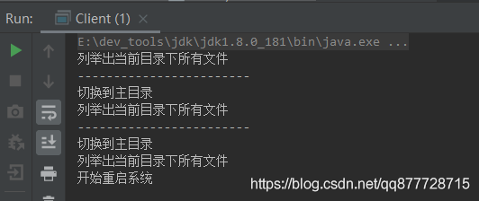

# 一.命令模式

**命令模式（Command Pattern）是对命令的封装，每一个命令都是一个操作。首先请求的一方发出请求要求执行一个操作，然后接收的一方收到请求，并执行操作。**

- 命令模式解耦了**请求方**和**接收方**，请求方只需要发送命令而不需要关心命令是如何被接收的，不关心命令怎么操作，也不关心命令是否被执行等。
- **核心思想**：将命令或者请求封装成对象，通过<font color=#ff00a> 一个中间层来解耦</font>请求调用者和请求最终执行者
- 命令模式的使用场景有限了解思想即可

# 二.命令模式适用场景

在开发中，请求调用者和请求最终执行者通常都是一种紧耦合关系，但是这种情况下，当我们需要修改行为(功能)时，如需要撤销或者重做时，只能修改请求者的源代码，而命令模式会通过在请求调用者和请求最终执行者之间引入**一个抽象接口** 来将请求者和执行者进行解耦，这样如果需要修改行为时，只需要增加对应行为的命令就可以了，完全不需要修改请求者的源码。

主要适用于以下场景：

1. 现实语义中存在具备“命令”的操作，如：dos命令，shell命令。
2. 请求调用者和请求的接收者需要解耦，使得调用者和接收者不直接互相调用。
3. 需要抽象出等待执行的行为，比如撤销和和恢复等操作。
4. 需要支持命令宏(即命令组合)操作

# 三.命令模式角色

- **接收者角色(Receiver)**： 负责具体执行一个请求 (如示例中的LinuxSystem)。

  > 该角色就是具体的干活者，命令就是传递到这里被执行的

- **抽象命令角色(Command)**： 通常该角色是一个接口，定义需要执行的所有命令行为(如示例中的ICommand)

- **具体命令角色(Concrete Command)** ：命令接口的具体实现，该类内部维护一个接收者(Receiver)，收到执行命令请求后会调用Receiver的对应方法 (如示例中的CdCommand，LsCommand，RestartCommand)。

- **调用者角色(Invoker)** ： 接收客户端的命令并调用相应的命令执行 (如示例中的XshellInvoker)。 通常可以持有一个或多个 Command 命令。

# 四.命令模式的实现方式

## 案例1：XShell中执行Linux命令

**接收者角色(Receiver)**

定义一个真正执行命令类

```java
/**
 * 接收者角色-Linux系统-真正执行命令类
 */
public class LinuxSystem {
    /**
     * cd命令
     */
    public void cd() {
        System.out.println("切换到主目录");
    }
    /**
     * ls命令
     */
    public void ls() {
        System.out.println("列举出当前目录下所有文件");
    }
    /**
     * restart命令
     */
    public void restart() {
        System.out.println("开始重启系统");
    }
}
```

**抽象命令角色(Command)**

定义一个命令接口

```java
/**
 * 抽象命令接口
 */
public interface ICommand {
    void execute();
}
```

**具体命令角色(Concrete Command)**

LinuxSystem类中有3个命令，所以为<font color=#ff00a> 每个命令创建一个命令类</font>, 这些类内部维护了一个接收者对象LinuxSystem，用LinuxSystem来调用真正执行命令方法。

cd命令类

```java
/**
 * 具体命令-cd命令类
 */
public class CdCommand implements ICommand {
    /**
     * 持有一个请求接收着
     */
    private LinuxSystem linuxSystem;
    public CdCommand(LinuxSystem linuxSystem) {
        this.linuxSystem = linuxSystem;
    }

    /**
     * 调用真正执行者LinuxSystem的方法,可以在调用LinuxSystem#cd()前后进行相应处理
     */
    @Override
    public void execute() {
        linuxSystem.cd();
    }
}
```


ls命令类

```java
/**
 * 具体命令-ls命令类
 */
public class LsCommand implements ICommand {
    /**
     * 持有一个请求接收着
     */
    private LinuxSystem linuxSystem;

    public LsCommand(LinuxSystem linuxSystem) {
        this.linuxSystem = linuxSystem;
    }

    /**
     * 调用真正执行者LinuxSystem的方法,可以在调用LinuxSystem#cd()前后进行相应处理
     */
    @Override
    public void execute() {
        linuxSystem.ls();
    }
}
```


restart命令类

```java
/**
 * 具体命令-restart命令类
 */
public class RestartCommand implements ICommand {
    /**
     * 持有一个请求接收着
     */
    private LinuxSystem linuxSystem;

    public RestartCommand(LinuxSystem linuxSystem) {
        this.linuxSystem = linuxSystem;
    }

    /**
     * 调用真正执行者LinuxSystem的方法,可以在调用LinuxSystem#cd()前后进行相应处理
     */
    @Override
    public void execute() {
        linuxSystem.restart();
    }
}
```

**调用者角色(Invoker)**

```java
/**
 * 调用者类-提供给客户使用，接收并响应用户请求
 */
public class XshellInvoker {
    /**
     * 命令队列
     */
    private List<ICommand> commandList;

    public XshellInvoker(List<ICommand> commandList) {
        this.commandList = commandList;
    }

    /**
     * 执行指定命令
     *
     * @param command
     */
    public void execute(ICommand command) {
        command.execute();
    }

    /**
     * 执行命令宏　　
     * 所谓宏命令简单点说就是包含多个命令的命令，是一个命令的组合。
     */
    public void executeCdAndLs() {
        for (ICommand command : commandList) {
            if (command instanceof LsCommand || command instanceof CdCommand) {
                command.execute();
            }
        }
    }

    /**
     * 执行多个命令
     */
    public void executeAll() {
        for (ICommand command : commandList) {
            command.execute();
        }
    }
}
```

**客户类**

```java
public class Client {
   public static void main(String[] args) {
        //请求接收者
        LinuxSystem linuxSystem = new LinuxSystem();

        //命令集合
        List<ICommand> commandList = new ArrayList<>();
        //cd命令
        commandList.add(new CdCommand(linuxSystem));
        //ls命令
        commandList.add(new LsCommand(linuxSystem));
        //restart命令
        commandList.add(new RestartCommand(linuxSystem));

        //请求调用者
        XshellInvoker xshellInvoker = new XshellInvoker(commandList);

        //1.执行指定命令
        xshellInvoker.execute(new LsCommand(linuxSystem));
        System.out.println("------------------------");
        //2.指定特定命令宏
        xshellInvoker.executeCdAndLs();
        System.out.println("------------------------");
        //3.执行全部命令
        xshellInvoker.executeAll();
    }
}
```


执行结果




# 五.总结

## 1.命令模式的优缺点

**优点：**

1. 通过引入中间件(抽象接口)解耦了请求与实现。
2. 扩展方便，增加新命令直接增加一个对象即可。
3. 支持命令的组合操作，比较灵活方便。

**缺点：**

1. 如果命令过多的时候，会有大量的具体命令类。因为针对每一个命令都需要设计一个具体命令类。

## 2.命令模式拓展

**1.命令队列**

- 有时候命令不再是单一的一条命令，而是一系列命令，这样就形成了一个命令队列。命令队列的实现有很多种方式，例如我们可以增加一个“队列”来管理命令。

**2.撤销**：用户发出命令，要撤回，怎么办？就类似我们使用 Ctrl+Z 组合键（undo 功能）。通常有2种方式：

1. 是<font color=#ff00a> 结合备忘录模式还原最后状态</font>，该方法适合接收者为状态变更的情况；
2. 是通过<font color=#ff00a> 新增一个命令，实现事件回滚</font>，撤销命令也是一个命令，例如计算机做加法的时候，回滚命令通常就可以设定为加一个相反数实现。

**3.记录请求日志**: 请求日志就是将请求的历史记录保存下来，通常以日志文件的形式永久存储在计算机中。

- 我们可以将 Command 类实现序列化接口，即实现 Serializable 接口。然后在每次执行命令的时候，将该命令写到日志文件中去。

## 3.命令模式在开发中的应用场景

1. Struts2中action的整个调用过程中就有命令模式。
2. 数据库事务机制的底层实现
3. 命令的撤销和恢复
   