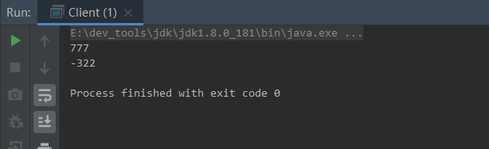
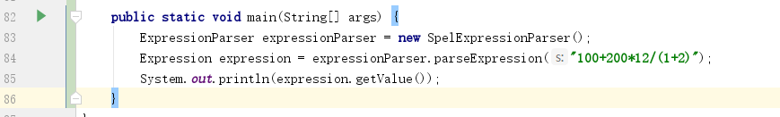
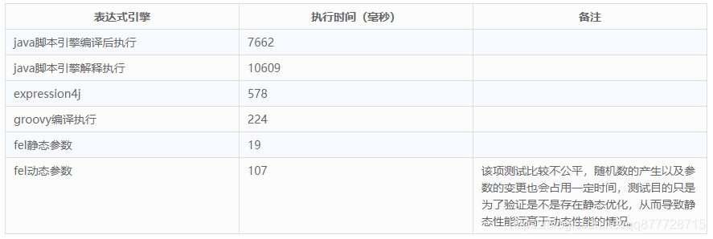

# 一.解释器模式

**解释器模式(Interpreter Pattern) 用于构造一个简单的语言解释器，将字符串按照自定义的方式解释执行 ，是一种不常用的设计模式**

- 除非从事底层开发自己需要去定义较为复杂的表达式，否则基本上不同这个设计模式
- 在项目中，可以使用Jruby，Groovy、java的js引擎来替代解释器的作用，弥补java语言的不足。也可以使用开源工表达式解析工具Expression4J、 MESP（Math Expression String Parser）、Jep等开源的解析工具包。它们功能强大，且容易使用，效率也还不错，没必要自己从头开始编写（使用别人写好的工具也是一个很好的选择）。
  - Math Expression String ParserExpression4J
  - Expression4J

准备使用解释器模式时，可以考虑一下


# 二.解释器模式适用场景

- EL表达式式的处理
- 正则表达式解释器

- SQL语法的解释器

- 数学表达式解析器

- 现成的表达式解析开源工具


# 三.解释器模式角色

**在解释器模式中有终结符表达式和非终结符表达式的概念。**

1. **终结符表达式(Terminal Expression)**：实现语法中与终结符有关的解释操作。语法中每一个终结符都有一个具体的终结符表达式与之相对应。

   > 比如我们的R=M+N运算，M和N就是终结符，对应的解析M和N的解释器就是 "终结符表达式"。

2. **非终符结表达式(Nonterminal Expression)**：实现语法中与非终结符有关的解释操作。语法中的每一条规则都对应了一个非终结符表达式。非终结表达式一般是文法中的运算符或者关键字

   > 如上面公示:R=M+N中的“+”号 就是非终结符，解析“+”号的解释器就是一个 "非终结符表达式"。


**解释器模式有以下4种角色**

1. **抽象解释器(Abstract Expression)**：一般会定义一个解释方法，具体如何解析会交由子类进行实(如示例中的IExpression)

2. **终结符表达式(Terminal Expression)**：实现语法中与终结符有关的解释操作(如下面示例中的NumberExpression)。

   > 例如 a + b 中的 a 和 b，这些运算元素除了需要赋值外，不需要做任何处理，功能也基本相同，是语法中的最小单元，相当于组合模式中的叶子。

3. **非终符结表达式(Nonterminal Expression)**：实现语法中与非终结符有关的解释操作(如下面示例中的AddExpression,SubExpression)

   > 例如 a + b 中的 + 号，这些运算符号都会对应一个具体的业务逻辑，例如加减乘除就是四个不同的非终结符表达式，相当于组合模式中的树枝。

4. **上下文环境(Context)**：包含解释器之外的全局信息。 存储各个解释器需要使用到的数据，或是公共功能。(如下面示例中的ExpressionContext)


# 四.解释器模式的实现方式

**抽象解释器(Abstract Expression)**

首先定义一个顶层的表达式接口

```java
/**
 * 顶层的表达式接口
 */
public interface IExpression {
    int interpret();
}
```

**非终符结表达式(Nonterminal Expression)**

定义一个抽象的非终结表达式(比如加号和减号这种就属于非终结表达式)

```java
/**
 * 抽象非终结表达式
 */
public abstract class AbstractNonTerminalExpression implements IExpression{
    protected IExpression leftExpression;
    protected IExpression rightExpression;

    public AbstractNonTerminalExpression(IExpression leftExpression, IExpression rightExpression) {
        this.leftExpression = leftExpression;
        this.rightExpression = rightExpression;
    }
}
```


本示例中只列举加法和减法，所以我们还需要定义一个加法类和一个减法类，即:<font color=#ff00a>抽象非终结表达式的具体实现</font>：

```java
/**
 * 具体非终结表达式-加法表达式
 */
public class AddExpression extends AbstractNonTerminalExpression {
    public AddExpression(IExpression leftExpression, IExpression rightExpression) {
        super(leftExpression, rightExpression);
    }

    @Override
    public int interpret() {
        return this.leftExpression.interpret() + this.rightExpression.interpret();
    }
}
```


```java
/**
 * 具体非终结表达式-减法表达式
 */
public class SubExpression extends AbstractNonTerminalExpression {

    public SubExpression(IExpression leftExpression, IExpression rightExpression) {
        super(leftExpression, rightExpression);
    }

    @Override
    public int interpret() {
        return this.leftExpression.interpret() - this.rightExpression.interpret();
    }
}
```

**终结符表达式(Terminal Expression)**

定义一个终结表达式(如：加减法运算中的数值)：

```java
/**
 * 终结表达式-数值表达式
 */
public class NumberExpression implements IExpression{
    private int value;

    public NumberExpression(String value) {
        this.value = Integer.valueOf(value);
    }

    @Override
    public int interpret() {
        return this.value;
    }
}
```

**上下文环境(Context)**

```java
/**
 * 上下文信息来存储我们的运算结果
 */
public class ExpressionContext {
    /**
     * 记录当前运算结果，空表示暂未运算
     */
    private Integer currValue;
    private Stack<IExpression> stack = new Stack<>();

    public ExpressionContext(String expression) {
        this.parse(expression);
    }

    private void parse(String expression) {
        //根据空格拆分(这里没有判断取出的字符是否为纯数字)
        String[] elementArr = expression.split(" ");
        for (int i = 0; i < elementArr.length; i++) {
            String element = elementArr[i];
            if (element.equals("+")) {
                //栈内元素出栈
                IExpression leftExpression = stack.pop();
                //取出+号后的下一个元素
                IExpression rightExpression = new NumberExpression(elementArr[++i]);
                //计算并将结果入栈
                IExpression addExpression = new AddExpression(leftExpression, rightExpression);
                stack.push(new NumberExpression(addExpression.interpret() + ""));
            }
            else if (element.equals("-")) {
                //栈内元素出栈
                IExpression leftExpression = stack.pop();
                //取出-号后的下一个元素
                IExpression rightExpression = new NumberExpression(elementArr[++i]);
                //计算并将结果入栈
                IExpression subExpression = new SubExpression(leftExpression, rightExpression);
                stack.push(new NumberExpression(subExpression.interpret() + ""));
            }
            //如果是数字则直接入栈
            else {
                stack.push(new NumberExpression(element));
            }
        }
    }

    public int calculate() {
        //经过前面解析，到这里stack内只会剩下唯一一个数字，即运算结果
        return stack.pop().interpret();
    }
}
```

**客户类**

```java
public class Client {
    public static void main(String[] args) {
    	//先加后减
        ExpressionContext context1 = new ExpressionContext("666 + 888 - 777");
        System.out.println(context1.calculate());
    	//先减后加
        ExpressionContext context2 = new ExpressionContext("123 - 456 + 11");
        System.out.println(context2.calculate());
    }
}
```


执行结果




# 五.总结

## 1.解释器模式的优缺点

**优点：**

- 扩展性比较强。从我们上面的示例中可以看出来了，我们每一个表达式都是一个类，所以如果需要修改某一个规则只需要修改对应的表达式类就可以了，扩展的时候新增一个新类就可以了。

**缺点：**

- 引起类的膨胀，每一个语法都要产生一个非终结符表达式，语法复杂时将会产生大量类文件。
- 当语法规则比较复杂时，如果出错了，调试比较困难。
- 执行效率比较低下。因为当表达式比较复杂，结果层层依赖的话会采用递归方式进行解析，且难以调试。

## 2.解释器模式在Java中的应用场景

- JDK中的正则表达式：Pattern类。
- Spring里面的ExpressionParse接口



**所以我们一开始就提到了，像这种<font color=#ff00a>解释器模式我们一般在业务开发中用的还是相对较少的</font>，常用的表达式都有人已经帮我们解析好了，直接用就可以了，除非我们从事底层开发自己需要去定义较为复杂的表达式。**

## 3.常用表达式引擎计算方案性能对比

选用了一些常用的表达式引擎计算方案，包含：java脚本引擎（javax/script）、groovy脚本引擎、Expression4j、Fel表达式引擎。

- 其中java脚本引擎使用了解释执行和编译执行两种方式、groovy脚本只采用了编译执行（解释执行太慢）、Fel采用了静态参数和动态参数两种方式。以下为测试代码：

```java
public class ExpressionTest {
 
    private int count = 100000;
     
    //javax的编译执行，效率比解释执行略高？为什么才略高？？
    @Test
    public void testCompiledJsScript() throws Throwable {
        javax.script.ScriptEngine se = new ScriptEngineManager().getEngineByName("js");
        Compilable ce = (Compilable) se;
        CompiledScript cs = ce.compile("a*b*c");
        Bindings bindings = se.createBindings();
        bindings.put("a", 3600);
        bindings.put("b", 14);
        bindings.put("c", 4);
        long start = System.currentTimeMillis();
        for (int i = 0; i < count; i++) {
            cs.eval(bindings);
        }
        System.out.println(System.currentTimeMillis() - start);
    }
 
    //javax script解释执行
    @Test
    public void testJsScript() throws Throwable {
        javax.script.ScriptEngine se = new ScriptEngineManager().getEngineByName("js");
        Bindings bindings = se.createBindings();
        bindings.put("a", 3600);
        bindings.put("b", 14);
        bindings.put("c", 4);
        long start = System.currentTimeMillis();
        for (int i = 0; i < count; i++) {
            se.eval("a*b*c", bindings);
        }
        System.out.println(System.currentTimeMillis() - start);
    }
 
    //groovy的编译执行
    @Test
    public void testGroovy() {
        //这里的ScriptEngine和GroovyScriptEngine是自己编写的类，不是原生的
        ScriptEngine se = this.getBean(GroovyScriptEngine.class);
        Map<String, Object> paramMap = new HashMap<String, Object>();
        paramMap.put("param", 5);
        //ScriptEngine首次执行会缓存编译后的脚本，这里故意先执行一次便于缓存
        se.eval("3600*34*param", paramMap);
         
        long start = System.currentTimeMillis();
        for (int i = 0; i < count; i++) {
            se.eval("3600*34*param", paramMap);
        }
        System.out.println(System.currentTimeMillis() - start);
    }
 
    //Expression4J的表达式引擎，这里是通过函数的方式，有点特别
    @Test
    public void testExpression4j() throws Throwable {
        Expression expression = ExpressionFactory.createExpression("f(a,b,c)=a*b*c");
        System.out.println("Expression name: " + expression.getName());
 
        System.out.println("Expression parameters: " + expression.getParameters());
 
        MathematicalElement element_a = NumberFactory.createReal(3600);
        MathematicalElement element_b = NumberFactory.createReal(34);
        MathematicalElement element_c = NumberFactory.createReal(5);
        Parameters parameters = ExpressionFactory.createParameters();
        parameters.addParameter("a", element_a);
        parameters.addParameter("b", element_b);
        parameters.addParameter("c", element_c);
        long start = System.currentTimeMillis();
        for (int i = 0; i < count; i++) {
            expression.evaluate(parameters);
        }
        System.out.println(System.currentTimeMillis() - start);
    }
 
    //fel的表达式引擎（静态参数，同上面）
    @Test
    public void felTest() {
        FelEngine e = FelEngine.instance;
        final FelContext ctx = e.getContext();
        ctx.set("a", 3600);
        ctx.set("b", 14);
        ctx.set("c", 5);
        com.greenpineyu.fel.Expression exp = e.compile("a*b*c", ctx);
        long start = System.currentTimeMillis();
        Object eval = null;
        for (int i = 0; i < count; i++) {
            eval = exp.eval(ctx);
        }
        System.out.println(System.currentTimeMillis() - start);
        System.out.println(eval);
    }
 
    //fel表达式引擎（动态参数，这里动态参数的产生和变量改变都会消耗时间，因此这个测试时间不准确，只是验证对于动态参数的支持）
    @Test
    public void felDynaTest() {
        FelEngine e = FelEngine.instance;
        final FelContext ctx = e.getContext();
        ctx.set("a", 3600);
        ctx.set("b", 14);
        ctx.set("c", 5);
        com.greenpineyu.fel.Expression exp = e.compile("a*b*c", ctx);
        long start = System.currentTimeMillis();
        Object eval = null;
        Random r = new Random();
        for (int i = 0; i < count; i++) {
            ctx.set("a", r.nextInt(10000));
            ctx.set("b", r.nextInt(100));
            ctx.set("c", r.nextInt(100));
            eval = exp.eval(ctx);
        }
        System.out.println(System.currentTimeMillis() - start);
        System.out.println(eval);
    }
 
    public static void main(String[] args) throws Throwable {
        ExpressionTest et = new ExpressionTest();
        //执行100W次的测试
        et.count = 1000000;
        et.testCompiledJsScript();
        et.testJsScript();
        et.testExpression4j();
        et.testGroovy();
        et.felTest();
    }
}
```


测试结果如下：




从以上性能对比来看（抛开表达式的功能），<font color=#ff00a>fel明显占据很大优势，groovy和expression4j也是可以接受的</font>。java脚本引擎的执行偏慢。因此，对于表达式不是很复杂性能要求高的情况下，推荐使用<font color=#ff00a>fel或者groovy编译执行的方式</font>。
