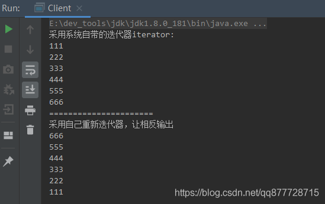

## 一.迭代器模式
迭代器模式，最常⻅的就是开发中使用<font color=#ff00a> JDK自带的Iterator 遍历集合</font>。这个模式在我们实际开发中用的场景并不多。<font color=#ff00a> 另外增强的for循环虽然是循环输出数据，但是他不是迭代器模式， 迭代器具备对元素的删除等操作。⽽增强for循环是不可以的。</font>

迭代器模式（Iterator Pattern）又称为游标者模式(Cursor Pattern)。迭代器模式剥离集合对象迭代行为到迭代器中，并提供统一的访问接口

- 意图 ：分离集合对象的遍历行为(功能)，，即我们无需关心该集合的底层结构是什么样子的。只要拿到相应的迭代器就可以遍历这个对象。

- 主要解决：
  - 1.为遍历不同的聚合结构提供一个统一的接口 
  - 2.通过该接口实现不同的方式来遍历聚合对象。

> 一般来说，我们只要实现一个集合，就需要同时提供这个集合的迭代器，就像java中的List、Set、Map等，这些集合都有自己的迭代器。


# 二.迭代器模式适用场景

1. 访问一个集合对象的内容而无需暴露它的内部实现。
2. 支持对聚合对象的多种遍历。

3. 为遍历不同的聚合结构提供一个统一的接口。


> 1.聚合对象：存储数据
> 2.迭代器：遍历数据

# 三.迭代器模式角色

- **抽象迭代器角色(Iterator)**：<font color=#ff00a> 负责定义访问和遍历元素的基本接口。</font>

> 一般来说迭代器会提供3个方法：
>
> - next()：获取下一个元素
> - hasNext()：是否存在下一个元素，用于判断是否遍历结束
> - remove()：移除当前对象

- **具体迭代器角色(Concrete Iterator)**：实现迭代器接口定义的方法，记录遍历中的当前位置，完成集合的具体迭代行为(功能)。
- **抽象容器角色(Container)** ：负责定义提供创建具体迭代器角色的接口

> 一般是一个接口，提供一个<font color=#ff00a> terator();</font>方法用于获取迭代器，如:Java中的Collection接口，List接口，Set接口在上层都是<font color=#ff00a> 实现了Iterable<T>接口并重写iterator()方法</font>

- **具体容器角色(Concrete Container)**：就是抽象容器的具体实现类

> 比如List接口的有序列表实现ArrayList，List接口的链表实现LinkList等待

# 四.迭代器模式的实现方式

## 案例1: 简单实现迭代器

**抽象迭代器角色(Iterator)**

```java
/**
 * 抽象迭代器角色：定义遍历元素所需要的方法
 */
public interface Iterator {
    /**
     * 是否存在下一个元素
     * @return
     */
    boolean hasNext();

    /**
     * 获取下一个元素
     * @return
     */
    Object next();
}

```

**抽象容器角色(Container)**

```java
/**
 * 抽象容器角色：定义集合可以进行的操作
 */
public interface List {
    /**
     * 新增元素
     * @param obj
     */
    void add(Object obj);
    /**
     * 根据索引获取元素
     * @param index
     * @return
     */
    Object get(int index);
    /**
     * 获取该容器的迭代器
     * @return
     */
    Iterator iterator();
    /**
     * 容器的大小
     * @return
     */
    int getSize();
}
```

**具体迭代器角色(Concrete Iterator)**

```java
/**
 * 具体迭代角色：实现迭代器接口中定义的方法，完成集合的迭代。
 */
public class ConcreteIterator implements Iterator {
    /**
     * 需要迭代的的容器
     */
    private List list = null;
    /**
     * 当前迭代索引
     */
    private int index;

    public ConcreteIterator(List list) {
        super();
        this.list = list;
    }

    /**
     * 是否存在下一个元素
     * @return
     */
    @Override
    public boolean hasNext() {
        if (index >= list.getSize()) {
            return false;
        }

        return true;
    }

    /**
     * 获取下一个元素
     *
     * @return
     */
    @Override
    public Object next() {
        Object obj = null;
        if (this.hasNext()) {
            obj = this.list.get(index++);
        }
        return obj;
    }
}
```


**具体容器角色(Concrete Container)**

```java
/**
 * 具体容器角色
 */
public class ConcreteList implements List {
    /**
     * 具体容器
     */
    private Object[] list;
    /**
     * 容器大小
     */
    private int size = 0;
    /**
     * 当前遍历位置
     */
    private int index = 0;

    /**
     * 初始化容器
     */
    public ConcreteList() {
        //容器初始下标为 0
        index = 0;
        //容器大小下标为 0
        size = 0;
        //容器初始容量为100
        list = new Object[100];
    }

    /**
     * 新增元素
     * @param obj
     */
    @Override
    public void add(Object obj) {
        //自增当前索引，并保存元素到该索引下
        list[index++] = obj;
        //自增容器大小
        size++;
    }

    /**
     * 获取迭代器
     * @return
     */
    @Override
    public Iterator iterator() {
        return new ConcreteIterator(this);
    }

    /**
     * 根据索引获取元素
     * @param index
     * @return
     */
    @Override
    public Object get(int index) {
        return list[index];
    }

    /**
     * 获取元素大小
     * @return
     */
    @Override
    public int getSize() {
        return size;
    }
}
```

**客户类**

```java
public class Client {
    public static void main(String[] args) {
        List list = new ConcreteList();
        list.add("a");
        list.add("b");
        list.add("c");
        list.add("d");

        Iterator it = list.iterator();
        while (it.hasNext()) {
            System.out.println(it.next());
        }
    }
}
```


测试结果


## 案例2：倒叙迭代器

- 我们可以提供多种遍历方式，如有序列表，可以根据需要提供正序遍历，倒序遍历两种迭代器，用户用起来只需要得到我们实现好的迭代器，就可以方便的对集合进行遍历了。下面我们基于案例1新增一个倒叙迭代器

**具体迭代器角色(Concrete Iterator)**

- 具体实现倒叙算法输出元素

  ```java
  /**
   * 具体迭代角色：根据添加顺序倒序迭代
   */
  public class ConcreteReverseIterator implements Iterator {
      /**
       * 需要迭代的的容器
       */
      private List list = null;
      /**
       * 当前迭代索引
       */
      private int index;
  
      public ConcreteReverseIterator(List list) {
          super();
          //倒序的索引为容器大小-1
          index = list.getSize()-1 ;
          this.list = list;
      }
  
      /**
       * 是否存在下一个元素
       * @return
       */
      @Override
      public boolean hasNext() {
          //索引小于0,表示没有下一个元素
          if (index < 0) {
              return false;
          }
  
          return true;
      }
  
      /**
       * 获取下一个元素
       *
       * @return
       */
      @Override
      public Object next() {
          Object obj = null;
          if (this.hasNext()) {
              //自减索引
              obj = this.list.get(index--);
          }
          return obj;
      }
  }
  ```

  

**抽象容器角色(Container)**

- 新增Iterator reverseIterator()接口用于返回倒叙迭代器

```java
/**
 * 抽象容器角色：定义集合可以进行的操作
 */
public interface List {
    /**
     * 新增元素
     * @param obj
     */
    void add(Object obj);
    /**
     * 根据索引获取元素
     * @param index
     * @return
     */
    Object get(int index);
    /**
     * 获取该容器的迭代器
     * @return
     */
    Iterator iterator();

    /**
     * 获取该倒序迭代的迭代器
     * @return
     */
    Iterator reverseIterator();
    /**
     * 容器的大小
     * @return
     */
    int getSize();
}

```


**具体容器角色(Concrete Container)**

- 实现Iterator reverseIterator()接口，返回具体的倒叙迭代器

```java
/**
 * 具体容器角色
 */
public class ConcreteList implements List {
    /**
     * 具体容器
     */
    private Object[] list;
    /**
     * 容器大小
     */
    private int size = 0;
    /**
     * 当前遍历位置
     */
    private int index = 0;

    /**
     * 初始化容器
     */
    public ConcreteList() {
        //容器初始下标为 0
        index = 0;
        //容器大小下标为 0
        size = 0;
        //容器初始容量为100
        list = new Object[100];
    }

    /**
     * 新增元素
     * @param obj
     */
    @Override
    public void add(Object obj) {
        //自增当前索引，并保存元素到该索引下
        list[index++] = obj;
        //自增容器大小
        size++;
    }

    /**
     * 获取迭代器
     * @return
     */
    @Override
    public Iterator iterator() {
        return new ConcreteIterator(this);
    }

    /**
     * 获取倒序迭代的迭代器
     * @return
     */
    @Override
    public Iterator reverseIterator() {
        return new ConcreteReverseIterator(this);
    }

    /**
     * 根据索引获取元素
     * @param index
     * @return
     */
    @Override
    public Object get(int index) {
        return list[index];
    }

    /**
     * 获取元素大小
     * @return
     */
    @Override
    public int getSize() {
        return size;
    }
}

```


**客户类**

```java
public class Client {
    public static void main(String[] args) {
        List list = new ConcreteList();
        list.add("a");
        list.add("b");
        list.add("c");
        list.add("d");

		//获取倒叙迭代器
        Iterator it = list.reverseIterator();
        while (it.hasNext()) {
            System.out.println(it.next());
        }
    }
}
```


测试结果


# 五.JDK内置迭代器

## 1.迭代器接口

在Jdk中,与迭代器相关的接口有2个:Iterator 与 Iterable。

- **Iterator(迭代器)接口**，负责定义访问和遍历元素的基本接口
- **Iterable(可迭代的)接口**，那些想用到迭代器功能的其它类，如AbstractList HashMap等，需要实现该接口。

### 1.1.Iterator

- java.util.terator是迭代器的顶级接口，主要提供一些<font color=#ff00a> "迭代器的基本操作"</font>供子类实现，如删除元素、获取元素等

```java
public interface Iterator<E> {
	//是否有下一个元素
    boolean hasNext();

	//获取下一个元素
	E next();
	
	//移除当前元素
	default void remove() {
	    throw new UnsupportedOperationException("remove");
	}
	
	//forEachRemaining遍历输出剩余元素，只能用一次
	default void forEachRemaining(Consumer<? super E> action) {
	    Objects.requireNonNull(action);
	    while (hasNext())
	        action.accept(next());
	}

}
```


### 1.2.Iterable

- java.util.Iterable接口提供一个“获取迭代器（Iterator）”的方法供子类实现
- 常见的实现该接口的子接口有:
  - Collection<E>
  - Deque<E>
  - List<E>
  - Queue<E>
  - Set<E>等
  - 上述接口的iterator()方法返回一个标准的Iterator实现。

```java
public interface Iterable<T> {
	//返回迭代器
    Iterator<T> iterator();

	//JDK1.8提供的遍历集合方法
	default void forEach(Consumer<? super T> action) {
	    Objects.requireNonNull(action);
	    for (T t : this) {
	        action.accept(t);
	    }
	}
	//JDK1.8的提供能够进行并行遍历的迭代器.
	default Spliterator<T> spliterator() {
	    return Spliterators.spliteratorUnknownSize(iterator(), 0);
	}

}
```


### 1.3.如何实现Java标准迭代器

看完源码,我们来看看迭代器是如何使用的:

1. 若类A想要 “使用迭代器” ,则必须<font color=#ff00a> 实现Iterable接口</font>，并实现Iterable接口中的唯一方法：<font color=#ff00a> Iterator<T> iterator() </font>返回一个具体迭代器,即Iterator接口及其子类；

2. 在类A中,定义一个<font color=#ff00a> 内部类S</font>,专门用于<font color=#ff00a> 实现Iterator接口, 定制类A自已的迭代器实现</font>。


伪代码如下：

```java
//A实现Iterable接口
class A implement Iterable{    
   //该接口返回一个Iterator对象
    Iterator<T> iterator() {//返回类S}    
    
    class S implement Iterator<E> {    
    //上面这个对象会有具体实现的方法
        boolean hasNext() {....}    
        E next() {....}    
        void remove() {....}    
    }    
}
```


下面我们来看下抽象类AbstractList的jdk源码

### 1.4.抽象类AbstractList源码简析

核心

1. 抽象类AbstractList类继承自List<E>接口，而List接口继承Collection<E>接口、 Collection<E>接口又继承了Iterable<E>
2. 抽象类AbstractList内部实现了 Iterator<E>的迭代器的内部类

```java
public abstract class AbstractList<E> extends AbstractCollection<E> implements List<E> { 
   
   protected AbstractList() {    
   }    
     
 
  // 这里返回一个迭代器对象  
   public Iterator<E> iterator() {    
   return new Itr();   
    }    
    
  	// Itr内部类实现迭代器  
    private class Itr implements Iterator<E> { 
         
    int cursor = 0;    
    int lastRet = -1;    
    int expectedModCount = modCount;    

    // 实现hasNext方法  
    public boolean hasNext() {  
            return cursor != size();    
    }    
     // 实现next方法  
    public E next() { 
           //判断是否有下一个
            checkForComodification();    
        try {    
        E next = get(cursor);    
        lastRet = cursor++;   
        //返回下一个 
        return next;    
        } catch (IndexOutOfBoundsException e) {    
        checkForComodification();    
        throw new NoSuchElementException();    
        }    
    }   
     
    // 实现remove方法  
    public void remove() {  
        if (lastRet == -1)    
        throw new IllegalStateException();    
            checkForComodification();    
    
        try {    
        AbstractList.this.remove(lastRet);    
        if (lastRet < cursor)    
            cursor--;    
        lastRet = -1;    
        expectedModCount = modCount;    
        } catch (IndexOutOfBoundsException e) {    
        throw new ConcurrentModificationException();    
        }    
    }    
    //判断是否有下一个方法
    final void checkForComodification() {    
        if (modCount != expectedModCount)    
        throw new ConcurrentModificationException();    
    }    
    }    
}
```


### 1.5.案例3:实现Java的迭代器标准

```java
import java.util.ArrayList;
import java.util.Collections;
import java.util.Iterator;

/**
 * 实现java.util.Iterable的容器，内部实现了两个迭代器(顺序迭代、倒序迭代)
 */
public class MyIterable implements Iterable<String> {

    ArrayList<String> list = new ArrayList<>();

    //为初始appleStore赋值
    MyIterable() {
        Collections.addAll(list, "111", "222", "333", "444", "555", "666");
    }

    /**
     * 重写Iterator方法,顺序输出
     *
     * @return
     */
    @Override
    public Iterator<String> iterator() {
        //返回一个匿名内部类Iterator
        return new Iterator<String>() {
            /**
             * 当前索引
             */
            private int i = 0;

            /**
             * 是否存在下一个元素
             * @return
             */
            @Override
            public boolean hasNext() {
                return i < list.size();
            }

            /**
             * 获取下一个元素
             * @return
             */
            @Override
            public String next() {
                return list.get(i++);
            }

            /**
             * 删除当前元素,未实现
             */
            @Override
            public void remove() {
                System.out.print("not defined!");
            }
        };
    }

    /**
     * 返回一个倒叙输出的Iterable
     *
     * @return
     */
    public Iterable<String> reverseIterator() {
        //返回一个匿名内部类Iterable
        return new Iterable<String>() {
            //重写iterator方法
            @Override
            public Iterator<String> iterator() {
                //返回一个匿名内部类Iterator
                return new Iterator<String>() {
                    /**
                     * 当前索引,容器大小-1
                     */
                    private int i = list.size() - 1;

                    /**
                     * 是否存在下一个元素
                     * @return
                     */
                    @Override
                    public boolean hasNext() {
                        return i > -1;
                    }

                    /**
                     * 获取下一个元素
                     * @return
                     */
                    @Override
                    public String next() {
                        return list.get(i--);
                    }

                    /**
                     * 删除当前元素,未实现
                     */
                    @Override
                    public void remove() {
                        System.out.print("not defined!");
                    }
                };
            }
        };
    }
}
```


```java
public class Client {
    public static void main(String[] args) {
        MyIterable iterable = new MyIterable();

        //采用系统自带的迭代器
        System.out.println("采用系统自带的迭代器iterator:");
        for (String str : iterable) {
            System.out.println(str);
        }

        System.out.println("======================");

        System.out.println("采用自己重新迭代器，让相反输出");
        //采用自己重新迭代器，让相反输出
        for (String str : iterable.reverseIterator()) {
            System.out.println(str);
        }
    }
}
```


测试结果



# 六.总结

## 1.迭代器模式的优缺点

**优点：**

1. 解耦了集合的数据存储与数据遍历行为，由迭代器负责封装具体的遍历算法，即使迭代器内部算法发生变化，也不会影响到原有的集合对象。

2. 多态迭代。为不同聚合结构的集合提供了一致的遍历接口，即<font color=#ff00a> 一个迭代器可以用来迭代不同的集合对象</font>。

   > 即：可以以相同的⽅式，遍历不同的数据结构元素，这些数据结构包括； 数 组 、 链表 、 树 等，⽽⽤户在使⽤遍历的时候并不需要去关⼼每⼀种数据结构的遍历处理逻辑(遍历算法)，从让使⽤变得统⼀易⽤

3. 元素迭代功能的多样化。<font color=#ff00a> 每个集合可以提供一个或者多个不同功能的迭代器</font>，使得同种元素可以有不同的迭代行为。

   > 即：可以提供多种遍历方式，如有序列表，可以根据需要提供正序遍历，倒序遍历两种迭代器，用户用起来只需要得到我们实现好的迭代器，就可以方便的对集合进行遍历了。

4. 在迭代器模式中，增加新的聚合类和迭代器类都很方便，无须修改原有代码。

**缺点：**

1. 由于迭代器模式将存储数据 和 <font color=#ff00a> 遍历数据的职责分离，增加新的聚合类需要对应增加新的迭代器类</font>，类的个数成对增加(<font color=#ff00a> 设计模式都有的问题</font>)，这在一定程度上增加了系统的复杂性。

2. 对于比较简单的遍历使用迭代器方式遍历较为繁琐，像数组或者有序列表，我们宁可愿意使用for循环和get方法来遍历集合。


## 2.迭代器模式在开发中的应用场景

- JDK的List、Set、Map内置的迭代器
  