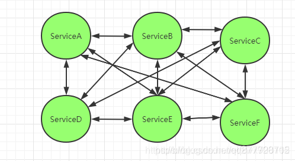
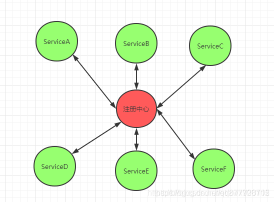
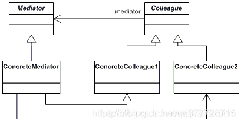
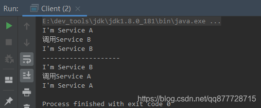
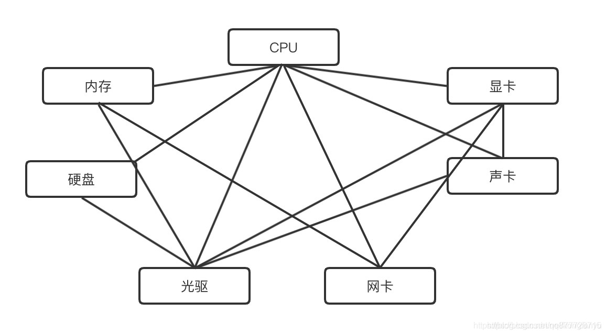
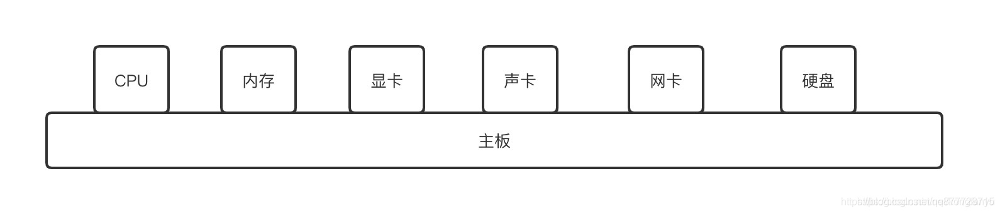
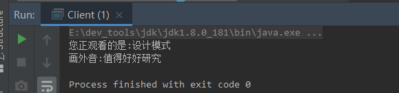

# 一.中介者模式

**中介者模式（Mediator Pattern）又称为调节者模式或者调停者模式，定义了一个<font color=#ff00a>中介对象</font>来封装一系列对象之间的<font color=#ff00a>交互关系</font>，从而使各个对象之间不需要显式地相互引用，达到松耦合的目的。使得当某些对象之间的功能发生改变时，不会立刻影响其他的一些对象之间的功能。**

> 比如生活中我们经常用到的聊天软件QQ、微信群，或者是上网购物的网站淘宝、京东，又或者是房产中介。但是无论是QQ群，还是房产中介，他们都是充当一个中间平台的作用，我们可以直接通过这个平台得到我们想要的信息，避免了独自获取花费的成本。

- 核心思想：通过中介者对象解耦各层级对象的直接耦合，层级对象的对外依赖全部交由中介者转发。
- 简单来说: <font color=#ff00a>对象之间不直接交互，通过中介者来进行交互</font>

**为什么需要中介者模式**

以微服务为例，微服务刚开始诞生的时候是下面这个现象：



各个微服务之间互相依赖，整个依赖关系形成了网状，关系错综复杂，非常难以管理。所以后面就有了注册中心，**注册中心就可以理解为一个中介者**：



可以看到，**所有的微服务都将自己的信息发送到注册中心进行统一管理**，避免了各个微服务之间各自依赖的乱象。

# 二.中介者模式适用场景

中介者模式在日常生活中非常常见，比如租房中介，买房中介等，还有像我们的群聊，聊天室等等都有中介者的身影。中介者模式主要适用于以下场景：

1. 系统中的对象存在非常复杂的引用关系，而且相互依赖，导致依赖关系非常复杂时。
2. 当我们想要使用多个类之间的行为(功能)时，为了避免过多的使用继承，可以考虑使用中介者来实现。

# 三.中介者模式角色

- **抽象中介者(AbstractMediator)**：定义一个抽象角色，定义了各同事对象之间交互需要的方法(如示例中的AbstractMediator)。

  > 抽象中介者: 定义一个接口用于与各同事对象通信

- **抽象同事类(AbstractColleague)**：它定义各个同事类公有的方法，并声明了一些抽象方法来供子类实现，同时它维护了一个对抽象中介者类的引用，其子类可以通过该引用来与中介者通信，从而通过中介者角色进行通信转发。(如示例中的AbstractService)。

  > 抽象同事类, 定义各同事的公有方法:

- **具体中介者(ConcreteMediator)**：实现抽象中介者的方法，它需要知道所有的具体同事类（维护所有的同事）。然后从具体同事对象接收消息，并向具体同事对象发出命令，以协调各个同事对象之间通信协作(如示例中的RegisterCenter)。

  > - 了维护它的各个同事;
  > - 通过协调各同事对象实现协作行为(从同事接收消息, 向具体同事发出命令).
  > - 如果不存在扩展情况, 那么抽象中介者可与具体中介者(合二为一)

- **具体同事类(ConcreteColleague)**：每一个同事对象在需要和其他同事对象通信时，先与中介者通信，通过中介者来间接完成与其他同事类的通信；在具体同事类中实现了在抽象同事类中声明的抽象方法

  > - 负责实现自发行为(Self-Method)，转发依赖方法(Dep-Method)交由中介者进行协调处理(如示例中的ServiceA和ServiceB，自发行为就是方法doSomething()方法，转发行为对应callA()和callB()方法)。
  > - 每一个同事类都知道它的中介者对象.
  > - 每一个同事对象在需与其他同事通信时, 与它的中介者通信.




# 四.介者模式的实现方式

## 案例1：模拟注册中心

**抽象中介者(AbstractMediator)**

```java
/**
 * 抽象中介者-注册中心
 */
public abstract class AbstractMediator {
    /**
     * 服务a
     */
    protected AbstractService serviceA;
    /**
     * 服务n
     */
    protected AbstractService serviceB;

    public void setServiceA(AbstractService serviceA) {
        this.serviceA = serviceA;
    }

    public void setServiceB(AbstractService serviceB) {
        this.serviceB = serviceB;
    }

    /**
     * 调用服务a
     */
    public abstract void callServiceA();

    /**
     * 调用服务b
     */
    public abstract void callServiceB();
}
```


**抽象同事类(AbstractColleague)**

```java
/**
 * 抽象同事类，当然这里其实可以不用抽象类，为了方便功能扩展一般我们都是建议面向抽象编程：
 */
public abstract class AbstractService {
    /**
     * 持有一个抽象中介者对象的引用
     */
    protected AbstractMediator mediator;

    public AbstractService(AbstractMediator mediator) {
        this.mediator = mediator;
    }

    public abstract void doSomething();
}
```

**具体同事类(ConcreteColleague)**

```java
/**
 *具体同事类-服务A
 */
public class ServiceA extends AbstractService {

    public ServiceA(AbstractMediator mediator) {
        super(mediator);
    }

    @Override
    public void doSomething() {
        System.out.println("I'm Service A");
    }

    public void callB(){
        this.doSomething();
        System.out.println("调用Service B");
        //服务A通过中介者调用服务B
        mediator.callServiceB();
    }
}
```

```java
/**
 * 具体同事类-服务B
 */
public class ServiceB extends AbstractService {

    public ServiceB(AbstractMediator mediator) {
        super(mediator);
    }

    @Override
    public void doSomething() {
        System.out.println("I'm Service B");
    }

    public void callA(){
        this.doSomething();
        System.out.println("调用Service A");
        //服务B通过中介者调用服务A
        mediator.callServiceA();
    }
}
```

- 
  上面这2个类，除了重写抽象方法doSomething，另外各自有一个调用对方服务的方法，**如果说我们不使用中介者对象来实现，那么A就必须要持有B，而B又要持有A，服务一多，调用关系就会呈现上面的网状形式**。 而如果有了中介者对象就不一样了，这些服务就可以全部交由中介者来统一管理。

**具体中介者(ConcreteMediator)**

```java
/**
 * 具体中介者
 */
public class RegisterCenter extends AbstractMediator{
    /**
     * 调用服务a
     */
    @Override
    public void callServiceA() {
        super.serviceA.doSomething();
    }
    /**
     * 调用服务b
     */
    @Override
    public void callServiceB() {
        super.serviceB.doSomething();
    }
}
```

**客户类**

```java
public class Client {
    public static void main(String[] args) {
        //定义中介者-注册中心
        AbstractMediator registerCenter = new RegisterCenter();
        //服务A绑定到注册中心
        ServiceA serviceA = new ServiceA(registerCenter);
        //服务B绑定到注册中心
        ServiceB serviceB = new ServiceB(registerCenter);

        //注册中心设置服务A
        registerCenter.setServiceA(serviceA);
        //注册中心设置服务B
        registerCenter.setServiceB(serviceB);

		//服务a调用服务b
        serviceA.callB();
        System.out.println("--------------------");
        //服务b调用服务a
        serviceB.callA();
    }
}
```

- **我们实现了ServiceA和ServiceB的互相调用，但是相互都不持有对方的引用，而是通过一个中介者对象来统一管理**，如果后续需要新增其他服务的调用，那么只需要改变中介者对象就可以了。

执行结果



## 案例2：模拟电脑主板

大家都知道，电脑里面各个配件之间的交互，主要是通过主板完成的；试想一下，如果电脑里面没有主板，那么各个配件之间就必须自行相互交互，以互相传送数据。各配件的交互关系也形成了一个网状结构



这也太复杂了，这还没有完呢，由于各个配件的接口不同，那么相互之间交互的时候，还必须把数据接口进行转换才能匹配上，那就更恐怖了。**所幸有了主板，各个配件的交互完全通过主板来完成，每个配件都只需和主板交互，而主板知道如何和所有的配件打交道，那就简单多了。**



**抽象中介者(AbstractMediator)**

```java
/**
 * 中介者接口，定义各个同事对象通信的接口
 */
interface Mediator {
    /**
     * 同事对象在自身改变的时候来通知中介者的方法
     * 让中介者去负责相应的与其他同事对象的交互
     *
     * @param colleague 同事对象自身，好让中介者对象通过对象实例去获取同事对象的状态
     */
    void changed(Colleague colleague);
}
```

**抽象同事类(AbstractColleague)**

```java
/**
 * 抽象同事
 */
abstract class Colleague {
    //持有一个中介者
    private Mediator mediator;

    public Colleague(Mediator mediator) {
        this.mediator = mediator;
    }

    public Mediator getMediator() {
        return this.mediator;
    }
}
```

**具体同事类(ConcreteColleague)**

```java
 /**
 * 光驱同事类
 */
public class CDDriver extends Colleague {
    /**
     * 光驱读取的数据
     */
    private String data = "";

    public CDDriver(Mediator mediator) {
        super(mediator);
    }

    /**
     * 获取光驱读取出来的数据
     *
     * @return 光驱读取出来的数据
     */
    public String getData() {
        return this.data;
    }

    /**
     * 读取光盘：业务方法，也是和中介者交互的方法
     */
    public void readCD() {
        this.data = "设计模式,值得好好研究";
        this.getMediator().changed(this);
    }
}
```

```java
/**
 * CPU同事类
 */
public class CPU extends Colleague {
    /**
     * 解析的视频数据
     */
    private String videoData;
    /**
     * 解析的音频数据
     */
    private String soundData;

    public CPU(Mediator mediator) {
        super(mediator);
    }

    public String getVideoData() {
        return videoData;
    }

    public String getSoundData() {
        return soundData;
    }

    /**
     * 处理数据，把数据分成音频和视频数据
     *
     * @param data
     */
    public void executeData(String data) {
		//把数据分解开，前面的是视频，后面的是音频
		String[] ss = data.split(",");
		this.videoData = ss[0];
		this.soundData = ss[1];
		//通知主板，CPU的工作完成后
		this.getMediator().changed(this);
	}
}
```

```java
/**
 * 显卡同事类
 */
public class VideoCard extends Colleague {
    public VideoCard(Mediator mediator) {
        super(mediator);
    }

    /**
     * 显示数据
     *
     * @param data
     */
    public void showData(String data) {
        System.out.println("您正观看的是:" + data);
    }
}
```

```java
/**
 * 声卡同事类
 */
public class SoundCard extends Colleague {

    public SoundCard(Mediator mediator) {
        super(mediator);
    }

    /**
     * 发出声音
     */
    public void soundData(String data) {
        System.out.println("画外音:" + data);
    }
}
```

**具体中介者(ConcreteMediator)**

```java
/**
 * 具体中介者-主板类
 */
class MotherBoard implements Mediator {
    /**
     * 光驱同事类
     */
    private CDDriver cdDriver;
    /**
     * CPU同事类
     */
    private CPU cpu;
    /**
     * 显卡同事类
     */
    private VideoCard videoCard;
    /**
     * 声卡同事类
     */
    private SoundCard soundCard;

	//注入光驱
    public void setCdDriver(CDDriver cdDriver) {
        this.cdDriver = cdDriver;
    }
	//注入CPU
    public void setCpu(CPU cpu) {
        this.cpu = cpu;
    }
	//注入显卡
    public void setVideoCard(VideoCard videoCard) {
        this.videoCard = videoCard;
    }
	//注入声卡
    public void setSoundCard(SoundCard soundCard) {
        this.soundCard = soundCard;
    }
    
    /**
     * 同事对象在自身改变的时候来通知中介者的方法
     * 让中介者去负责相应的与其他同事对象的交互
     * @param colleague 同事对象自身，好让中介者对象通过对象实例去获取同事对象的状态
     */
    @Override
    public void changed(Colleague colleague) {
        if (colleague == cdDriver) {
            //表示光驱读取数据了
            this.openCDDriverReadData((CDDriver) colleague);
        }
        else if (colleague == cpu) {
            //表示CPU处理完了
            this.openCUP((CPU) colleague);
        }
    }

    /**
     * 处理光驱读取数据以后与其他对象的交互
     */
    private void openCDDriverReadData(CDDriver cdDriver) {
        //1.先获取光驱读取的数据
        String data = cdDriver.getData();
        //2.把这些数据传递个CPU进行处理
        this.cpu.executeData(data);
    }

    /**
     * 处理CPU处理完数据后与其他对象的交互
     * @param cpu
     */
    private void openCUP(CPU cpu) {
        //1.先获取CPU处理后的数据
        String videoData = cpu.getVideoData();
        String soundData = cpu.getSoundData();
        //2.把这些数据传递给显卡和声卡显示出来
        this.videoCard.showData(videoData);
        this.soundCard.soundData(soundData);
    }
}
```

**客户类**

```java
public class Client {
    public static void main(String[] args) {
        //1.创建中介者——主板对象
        MotherBoard mediator = new MotherBoard();
        //2.创建同事类
        CDDriver cd = new CDDriver(mediator);
        CPU cpu = new CPU(mediator);
        VideoCard vc = new VideoCard(mediator);
        SoundCard sc = new SoundCard(mediator);

        //3.让中介者知道所有的同事
        mediator.setCdDriver(cd);
        mediator.setCpu(cpu);
        mediator.setVideoCard(vc);
        mediator.setSoundCard(sc);

        //4.开始看电影，把光盘放入光驱，光驱开始读盘
        cd.readCD();
    }
}
```


执行结果




# 五.总结

## 1.中介者模式的优缺点

**优点：**

1. 把<font color=#ff00a>各个同事对象之间的交互封装到中介者对象里面</font>，从而使得同事对象之间松散耦合，各个类都各司其职，符合了迪米特法则。

2. 减少了类之间的相互依赖性，<font color=#ff00a>将多对多依赖转化成为了一对多依赖</font>，降低了类间的耦合。

   > 将原先多对多的同事对象关系变成中介者对象一对多同事对象的关系，这样会让对象之间的关系更容易理解和实现

3. 由于同事对象之间的交互都被封装到中介者对象里面集中管理。<font color=#ff00a>当交互发生改变时，着重修改的是中介者对象</font>。当需要扩展中介者对象时，其他同事对象不需要做修改。


**缺点:**

1. <font color=#ff00a>当我们的同事角色非常多的时候，中介者对象需要维护非常多的同事角色对象</font>，会使得中介者变得非常庞大，导致难以维护。

## 2.中介者模式与外观模式、代理模式的区别

中介者模式和外观模式、代理模式比较类似，但是又有不同。

- 和外观模式比较：中介者模式中，<font color=#ff00a>同事类必须依赖与中介者，中介者也知道同事类</font>；而外观模式中，<font color=#ff00a>子系统是不需要知道外观类的存在，并且子系统是可以脱离外观模式的</font>。
- 和代理模式比较：代理模式的核心就是代理作用，<font color=#ff00a>主要还是对原先的类进行扩展或增加功能</font>；而中介者模式主要目的是为了<font color=#ff00a>减少对象之前的耦合，也就是同事类直接相互独立，互不影响</font>。

## 3.中介者模式和桥接模式的区别

两种设计模式的思想是一样的，这两种模式的侧重点和应用场景不一致。

- 桥接模式侧重的是将抽象和具体进行解耦，一般就是特指2个维度，一个抽象，一个具体，比如桥接模式示例中的 消息类型(邮箱消息，SMS消息)这就是抽象维度，而 消息的紧急程度(如普通消息，紧急消息)这就是具体维度，然后将这2个维度通过一个中间对象(抽象角色)进行关联。

- 中介者模式侧重的是通过**中介者将多个相同类型对象之间的关联关系进行统一管理**。
  