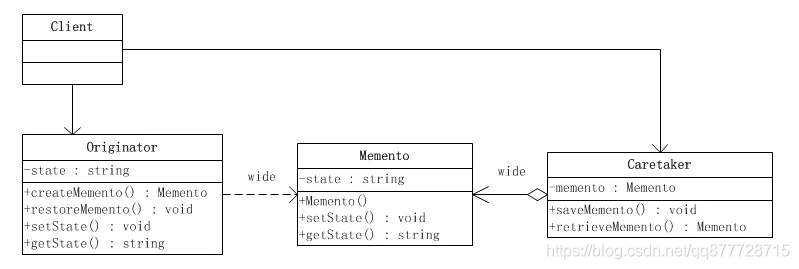
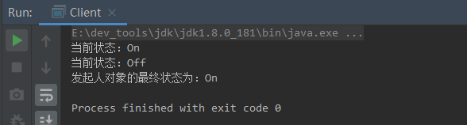
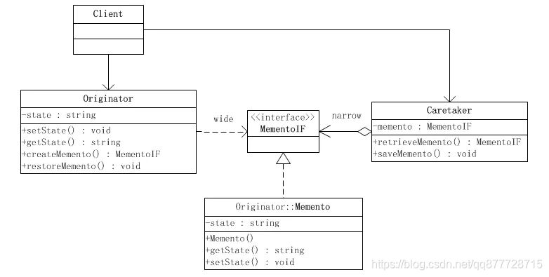
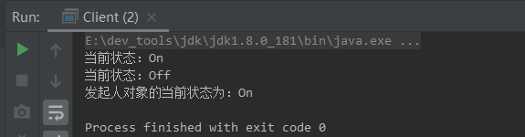
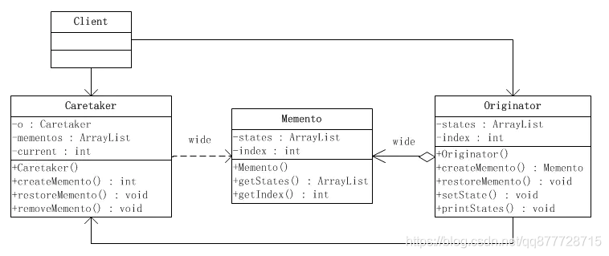
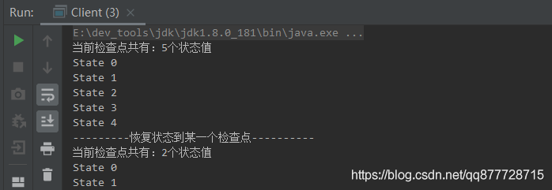
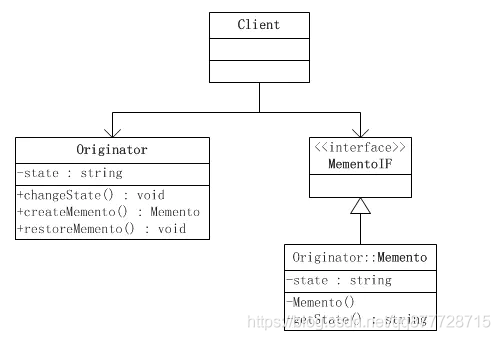
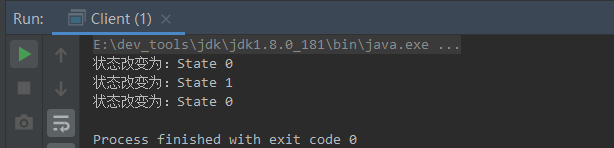
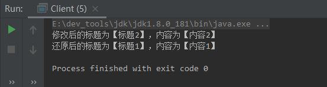

# 一.备忘录模式

> 备忘录模式是一个非常简单的设计模式，简单到已经让我们忽略了这种设计模式的存在了。备忘录模式这个名字可能还是有人会觉得稍微有点陌生，但是它的另一个名字 <font color=#ff00a>快照模式</font> 听起来可能心里就会有点明白这到底是一种什么设计模式了。接下来就让我们看看备忘录模式吧

**备忘录模式（Memento Pattern）又称之为快照模式(Snapshop Pattern)或者令牌模式(Token Pattern),是指在不破坏封装的前提下，捕获一个对象的内部状态，并在对象之外保存这个状态，这样我们就可以在需要的时候将该对象恢复到原先保存的状态了**

- 大白话: 备忘录模式可以为我们提供一种“后悔药”的机制，它通过存储程序中某个对象的历史状态，使我们可以在任一时刻将程序回滚到历史状态。
- 核心：使用第三方角色保存某个对象内部状态的拷贝，便于将该对象恢复到原先的状态
- <font color=#ff00a>备忘录用得不多，一般只用于特定的开发场景,了解集合即可。</font>

# 二.备忘录模式适用场景

1. 需要保存/恢复数据的相关状态场景。
2. 提供一个可回滚的操作。
3. 希望在对象之外保存状态，且除了自己其他对象无法访问状态的具体保存内容

# 三.备忘录模式角色

- **发起人角色/被备份的角色(Originator)**：负责创建一个备忘录，记录自身需要保存的状态，而且需要具备状态的回滚功能。
- **备忘录角色(Memento)**：用于存储Originator角色的内部状态，且可以防止Originator以外的对象进行访问Memento。
- **负责人角色/备忘录管理员角色(Caretaker)**：负责存储，管理备忘录功能。且其本身应该无法对备忘录的内容进行访问

# 四.备忘录模式的实现方式

## 1.“白箱”备忘录模式的实现

- 备忘录角色(Memento)对任何对象都提供一个接口，即**宽接口，且该角色内部所存储的状态就对所有对象公开**。因此这个实现又叫做 “白箱实现”。
- **“白箱” 实现将发起人角色(被备份角色Originator)的状态存储在一个大家都看得到的地方，因此是破坏封装性的**。但是通过程序员约定，同样可以在一定程度上实现模式的大部分用意。因此白箱实现的仍然是有意义的。



**备忘录角色(Memento)**

```java
/**
 * 备忘录角色类，备忘录对象将发起人角色(Originator)传入的状态存储起来。
 *	>>类的信息必须要和原始类一样，否则无法完全备份
 */
public class Memento {
    private String state;

    public Memento(String state) {
        this.state = state;
    }

    public String getState() {
        return state;
    }

    public void setState(String state) {
        this.state = state;
    }
}
```

**发起人角色/被备份的角色(Originator)**

```java
/**
 * 发起人角色/被备份的角色(Originator)，利用一个新创建的备忘录对象(Memento)将自己的内部状态存储起来。
 *	>>注意：类中除了getter/setter方法之外还有一个方法createMemento用来备份，一个方法restoreMemento用来还原。
 */
public class Originator {
    private String state;

    /**
     * 备份：工厂方法，返回一个新的备忘录对象(Memento)
     * @return
     */
    public Memento createMemento() {
        return new Memento(state);
    }
    /**
     * 还原：将发起人的状态恢复到备忘录对象所记录的状态
     * @param memento
     */
    public void restoreMemento(Memento memento) {
        this.state = memento.getState();
    }


    public String getState() {
        return state;
    }
    public void setState(String state) {
        this.state = state;
        System.out.println("当前状态：" + this.state);
    }
}
```

**负责人角色/备忘录管理员角色(Caretaker)**

```java
/**
 * 负责人角色/备忘录管理员角色，负责保存备忘录对象，但不关心所备忘录对象的内容。
 */
public class Caretaker {
    private Memento memento;
    /**
     * 获取备份
     * @return
     */
    public Memento retrieveMemento() {
        return this.memento;
    }
    /**
     * 保存备份
     * @param memento
     */
    public void saveMemento(Memento memento) {
        this.memento = memento;
    }
}
```

**客户类**

```java
public class Client {
    public static void main(String[] args) {
        //1.定义发起人/被备份角色
        Originator originator = new Originator();
        //设置发起人的初始化状态为 On
        originator.setState("On");

        //2.定义备份管理角色
        Caretaker caretaker = new Caretaker();

        //3.调用发起人角色的createMemento()方法，创建一个备忘录对象(Memento)将发起人初始状态On存储起来
        Memento memento =  originator.createMemento();
        caretaker.saveMemento(memento);

        //4.修改发起人对象的状态位Off
        originator.setState("Off");


        //5.从备份管理对象中恢复发起人对象的状态
        originator.restoreMemento(caretaker.retrieveMemento());


        System.out.println("发起人对象的最终状态为：" + originator.getState());
    }
}
```


执行结果



## 2.“黑箱”备忘录模式的实现

- 备忘录角色对发起人角色(Originator)对象提供一个宽接口，而为其他对象提供一个窄接口。这样的实现叫做 “黑箱实现”。
  - 在Java语言中，实现双重接口的办法就是将备忘录角色类（Memento）设计成发起人角色类(Originator)的 “内部成员类”，从而将Memento对象封装在Originator里面。
    - 然后在外面提供一个标识接口MementoIF给备份管理角色(Caretaker)及其他对象。发起人角色(Originator)可以调用备忘录角色(Memento)所有的接口，而备份管理角色(Caretaker)及其他对象仅仅只能调用标识接口MementoIF所暴露出来的接口。



**备忘录角色(Memento)-窄接口**

- 窄接口MementoIF，这是一个标识接口，因此没有定义出任何的方法。

```java
public interface MementoIF {}
```

**发起人角色/被备份的角色(Originator)**

- 发起人角色定义了一个内部类Memento，由此Memento类的全部接口都是私有的，因此只有它自己和发起人角色(Originator)可以调用。

```java
/**
 * 发起人角色/被备份的角色(Originator)
 */
public class Originator {
    private String state;

    /**
     * 还原: 将发起人(Originator)的状态恢复到备忘录对象(Memento)所记录的状态
     * @param memento
     */
    public void restoreMemento(MementoIF memento) {
        this.state = ((Memento)memento).getState();
    }

    /**
     * 备份: 工厂方法，返回一个新的备忘录对象(MementoIF)
     * @return
     */
    public MementoIF createMemento() {
        return new Memento(this.state);
    }

    public String getState() {
        return state;
    }
    public void setState(String state) {
        this.state = state;
        System.out.println("当前状态：" + this.state);
    }


    /**
     * 内部类-备忘录角色
     */
    private class Memento implements MementoIF {
        private String state;
        /**
         * 构造方法
         * @param state
         */
        private Memento(String state) {
            this.state = state;
        }

        public String getState() {
            return state;
        }

        public void setState(String state) {
            this.state = state;
        }
    }
}
```

**负责人角色/备忘录管理员角色(Caretaker)**

- 负责人角色/备忘录管理员角色(Caretaker)能够得到的备忘录对象是以MementoIF为接口的，由于这个接口仅仅是一个标识接口，因此负责人角色(MementoIF )不可能改变这个备忘录对象MementoIF的内容。

```java
/**
 * 负责人角色/备忘录管理员角色
 */
public class Caretaker {
    private MementoIF memento;
    /**
     * 备忘录的取值方法
     * @return
     */
    public MementoIF retrieveMemento() {
        return this.memento;
    }
    /**
     * 备忘录的赋值方法
     * @param memento
     */
    public void saveMemento(MementoIF memento) {
        this.memento = memento;
    }
}
```

**客户类**

```java
public class Client {
    public static void main(String[] args) {
        //1.定义发起人/被备份角色
        Originator originator = new Originator();
        //设置发起的初始化状态为 On
        originator.setState("On");

        //2.定义备份管理角色
        Caretaker caretaker = new Caretaker();

        //3.调用发起人角色的createMemento()方法，创建一个备忘录对象(MementoIF)将发起人初始状态On存储起来
        MementoIF mementoIF = originator.createMemento();
        caretaker.saveMemento(mementoIF);

        //4.修改发起人对象的状态位Off
        originator.setState("Off");

        //5.从备份管理对象中恢复发起人对象的状态
        originator.restoreMemento(caretaker.retrieveMemento());

        //发起人对象的状态
        System.out.println("发起人对象的当前状态为：" + originator.getState());
    }
}
```


执行结果




## 3.“多重检查点”备忘录模式的实现

- 前面所给出的白箱和黑箱的示意性实现都是只存储一个状态的简单实现，也可以叫做只有一个检查点(Memento)。常见的系统往往需要存储不止一个状态，而是需要存储多个状态，或者叫做多个检查点(Memento)。
- 通过备忘录模式可以将发起人角色(Originator)的状态存储到备忘录角色(Memento)里面，也可以将发起人角色(Originator)的恢复到备忘录角色(Memento)所存储的某一个检查点上。



**备忘录角色(Memento)**

- 备忘录角色类可以存储任意多的状态，外界可以使用检查点索引index来取出检查点上的状态：

```java
/**
 * 备忘录角色
 */
public class Memento {
    private List<String> states;
    private int index;

    /**
     * 构造方法
     *
     * @param states
     * @param index
     */
    public Memento(List<String> states, int index) {
        //该处需要注意，我们在这里重新构建了一个新的集合，拷贝状态集合到新的集合中，保证原有集合变化不会影响到我们记录的值
        this.states = new ArrayList<>(states);
        this.index = index;
    }

    public List<String> getStates() {
        return states;
    }

    public int getIndex() {
        return index;
    }
}
```

**发起人角色/被备份的角色(Originator)**

```java
/**
 * 发起人角色
 */
public class Originator {
    private List<String> states;
    //检查点序号
    private int index;
    /**
     * 构造函数
     */
    public Originator() {
        this.states = new ArrayList<>();
        index = 0;
    }
    /**
     * 备份: 工厂方法，返回一个新的备忘录对象(Memento)
     * @return
     */
    public Memento createMemento() {
        return new Memento(states, index);
    }
    /**
     * 还原: 将发起人(Originator)恢复到备忘录对象(Memento)记录的状态上。
     * @param memento
     */
    public void restoreMemento(Memento memento) {
        this.states = memento.getStates();
        this.index = memento.getIndex();
    }
    /**
     * 状态的赋值方法
     * @param state
     */
    public void setState(String state) {
        this.states.add(state);
        this.index++;
    }
    public List<String> getStates() {
        return states;
    }
    /**
     * 辅助方法，打印所有状态
     */
    public void printStates() {
        System.out.println("当前检查点共有：" + states.size() + "个状态值");
        for (String state : states) {
            System.out.println(state);
        }
    }
}
```

**负责人角色/备忘录管理员角色(Caretaker)**

```java
/**
 * 负责人角色/备忘录管理角色
 */
public class Caretaker {
    /**
     * 发起人角色/被备份角色
     */
    private Originator originator;
    /**
     * 备忘录角色集合
     */
    private List<Memento> mementos = new ArrayList<>();
    /**
     * 当前检查点
     */
    private int current;

    /**
     * 构造函数
     *
     * @param originator
     */
    public Caretaker(Originator originator) {
        this.originator = originator;
        //检查点初始化为0
        this.current = 0;
    }

    /**
     * 创建一个新的检查点(Memento)
     *
     * @return
     */
    public int createMemento() {
        Memento memento = this.originator.createMemento();
        this.mementos.add(memento);
        return this.current++;
    }

    /**
     * 将发起人角色(Originator)状态恢复到某一个检查点(Memento)
     *
     * @param index
     */
    public void restoreMemento(int index) {
        Memento memento = mementos.get(index);
        originator.restoreMemento(memento);
    }

    /**
     * 将某一个检查点(Memento)删除
     *
     * @param index
     */
    public void removeMemento(int index) {
        mementos.remove(index);
    }

    /**
     * 打印所有检查点
     */
    public void printAll() {
        for (int i = 0; i < mementos.size(); i++) {
            System.out.println("index i : " + i + " : " + mementos.get(i) + " : " + mementos.get(i).getStates());
            System.out.println("---------------------------------");
        }
    }
}
```

**客户类**

```java
public class Client {
    public static void main(String[] args) {
        //1.定义发起人/被备份角色
        Originator originator = new Originator();
        //设置发起人的初始化状态为 State 0
        originator.setState("State 0");

        //2.定义备份管理角色
        Caretaker caretaker = new Caretaker(originator);
        //建立一个检查点
        caretaker.createMemento();

        //3.改变发起人状态为State 1
        originator.setState("State 1");
        //建立一个检查点
        caretaker.createMemento();

        //4.改变发起人状态为State 2
        originator.setState("State 2");;
        //建立一个检查点
        caretaker.createMemento();

        //5.改变发起人状态为State 3
        originator.setState("State 3");
        //建立一个检查点
        caretaker.createMemento();

        //6.改变发起人状态为State 4
        originator.setState("State 4");
        //建立一个检查点
        caretaker.createMemento();

        //7.打印出所有的检查点
        originator.printStates();

        System.out.println("---------恢复状态到某一个检查点----------");
        //8.恢复到第二个检查点
        caretaker.restoreMemento(1);
        //打印出所有的检查点.
        originator.printStates();
    }
}
```


执行结果




## 4."自述历史"模式实现

- 所谓“自述历史”模式(History-On-Self Pattern)实际上就是备忘录模式的一个变种。在备忘录模式中，发起人角色(Originator)、负责人角色(Caretaker)和备忘录角色(Mementor)都是独立的角色。虽然在实现上备忘录角色类可以成为发起人角色类的内部成员类，但是备忘录角色类仍然保持作为一个角色的独立意义。
- 在“自述历史”模式里面，发起人角色自己兼任负责人角色。



**备忘录角色(Memento)-窄接口**

- 窄接口MementoIF，这是一个标识接口，因此没有定义任何方法

```java
public interface MementoIF {}
```

**发起人角色/被备份的角色(Originator)**

- 发起人角色类，发起人角色同时还要兼任负责人角色(Caretaker)，也就是说它自己负责保持自己的备忘录对象。

```java
/**
 * 发起人角色类
 */
public class Originator {
    private String state;

    /**
     * 改变状态
     *
     * @param state
     */
    public void changeState(String state) {
        this.state = state;
        System.out.println("状态改变为：" + this.state);
    }

    /**
     * 备份: 工厂方法，返回一个新的备忘录对象
     *
     * @return
     */
    public Memento createMemento() {
        return new Memento(this);
    }

    /**
     * 还原:将发起人状态恢复到备忘录对象所记录的状态上
     *
     * @param memento
     */
    public void restoreMemento(MementoIF memento) {
        changeState(((Memento) memento).getState());
    }

    /**
     * 成员内部类-备份角色
     */
    public class Memento implements MementoIF {
        private String state;

        /**
         * 构造方法
         *
         * @param originator
         */
        private Memento(Originator originator) {
            this.state = originator.state;
        }

        private String getState() {
            return this.state;
        }
    }
}
```

**客户类**

```java
public class Client {
    public static void main(String[] args) {
        Originator originator = new Originator();
        //修改状态
        originator.changeState("State 0");

        //创建备忘录
        MementoIF memento = originator.createMemento();

        //修改状态
        originator.changeState("State 1");
        //按照备忘录对象存储的状态恢复发起人对象的状态
        originator.restoreMemento(memento);
    }
}
```


执行结果




## 5.案例:富文本编辑器(白箱)

**以常见的富文本编辑器来编辑文章的功能为例来写一个简单的示例来看看备忘录模式是如何实现的**


**备忘录角色(Memento)**

- 定义一个类用来保存历史数据，类的信息必须要和原始类一样，否则无法完全备份：

```java
public class ArticleMemento {
    /**
     * 文章标题
     */
    private String title;
    /**
     * 文章内容
     */
    private String content;
    /**
     * 文章创建时间
     */
    private Date createTime;

    public ArticleMemento(String title, String content, Date createTime) {
        this.title = title;
        this.content = content;
        this.createTime = createTime;
    }

    public String getTitle() {
        return title;
    }

    public void setTitle(String title) {
        this.title = title;
    }

    public String getContent() {
        return content;
    }

    public void setContent(String content) {
        this.content = content;
    }

    public Date getCreateTime() {
        return createTime;
    }

    public void setCreateTime(Date createTime) {
        this.createTime = createTime;
    }
}
```

**发起人角色/被备份的角色(Originator)**

- 定义一个类来保存最新文章信息：

> 注意：类中除了getter/setter方法之外还有**一个方法用来备份，一个方法用来还原**。

```java
public class ArticleText {
    /**
     * 文件标题
     */
    private String title;
    /**
     * 文章内容
     */
    private String content;
    /**
     * 文章创建时间
     */
    private Date createTime;

    public ArticleText(String title, String content, Date createTime) {
        this.title = title;
        this.content = content;
        this.createTime = createTime;
    }

    public String getTitle() {
        return title;
    }

    public void setTitle(String title) {
        this.title = title;
    }

    public String getContent() {
        return content;
    }

    public void setContent(String content) {
        this.content = content;
    }

    public Date getCreateTime() {
        return createTime;
    }

    public void setCreateTime(Date createTime) {
        this.createTime = createTime;
    }

    /**
     * 备份：工厂方法，返回一个新的备忘录对象
     * @return
     */
    public ArticleMemento saveToMemento(){
        ArticleMemento articleMemento = new ArticleMemento(this.title,this.content,this.createTime);
        return articleMemento;
    }

    /**
     * 还原：将发起人的状态恢复到备忘录对象所记录的状态
     * @param articleMemento
     */
    public void getArticleFromMemento(ArticleMemento articleMemento){
        this.title = articleMemento.getTitle();
        this.content = articleMemento.getContent();
        this.createTime = articleMemento.getCreateTime();
    }
}
```

**负责人角色/备忘录管理员角色(Caretaker)**

- 定义一个类来管理历史快照信息

```java
public class ArticleCaretaker {
    /**
     * 快照信息集合
     */
    private final List<ArticleMemento> list = new ArrayList<>();

    /**
     * 根据索引获取快照信息
     * @param index
     * @return
     */
    public ArticleMemento getArticle(int index) {
        return list.get(index);
    }

    /**
     * 新增快照信息
     * @param articleMemento
     */
    public void setArticle(ArticleMemento articleMemento) {
        list.add(articleMemento);
    }
}
```

**客户类**

```java
public class Client {
    public static void main(String[] args) {
        //备忘录管理员角色(Caretaker)
        ArticleCaretaker articleCaretaker = new ArticleCaretaker();

        //发起人角色-文章1-(Originator)
        ArticleText articleText = new ArticleText("标题1","内容1",new Date());

        //生成文章备份
        ArticleMemento articleMemento = articleText.saveToMemento();

        //备份1次到Caretaker
        articleCaretaker.setArticle(articleMemento);

        //发起人角色-文章2-(Originator)
        articleText = new ArticleText("标题2","内容2",new Date());
        System.out.println(String.format("修改后的标题为【%s】，内容为【%s】",articleText.getTitle(),articleText.getContent()));

        //使用Caretaker的备份还原文章
        articleText.getArticleFromMemento(articleCaretaker.getArticle(0));
        System.out.println(String.format("还原后的标题为【%s】，内容为【%s】",articleText.getTitle(),articleText.getContent()));
    }
}
```


执行结果



**额，写的有点多了，备忘录模式用的场景不多，大家了解了解即可**

# 五.总结

## 1.备忘录模式的优缺点

**优点：**

1. 它提供了一种状态恢复的实现机制，使得用户可以方便地回到一个特定的历史状态，当新的状态无效或者存在问题时，可以使用暂时存储起来的备忘录将状态复原。
2. 简化了发起人角色的的职责，将状态的存储和获取进行了隔离，而且客户端无需关心状态的保存细节。
3. 备忘录角色是一种发起人角色状态的表示，不会被其他代码所改动。备忘录角色保存了发起人角色的状态，采用列表、堆栈等集合来存储备忘录对象可以实现多次撤销操作。

**缺点：**

1. 消耗过大，如果需要保存的发起人角色类的成员变量太多，就不可避免需要占用大量的存储空间，每保存一次对象的状态都需要消耗一定的系统资源。

> 为了节约内存，可使用 原型模式+备忘录模式。


## 2.备忘录模式在开发中的应用场景

1. 棋类游戏中的，悔棋
2. 普通软件中的，撤销操作
3. 数据库软件中的，事务管理中的，回滚操作
4. Photoshop软件中的，历史记录