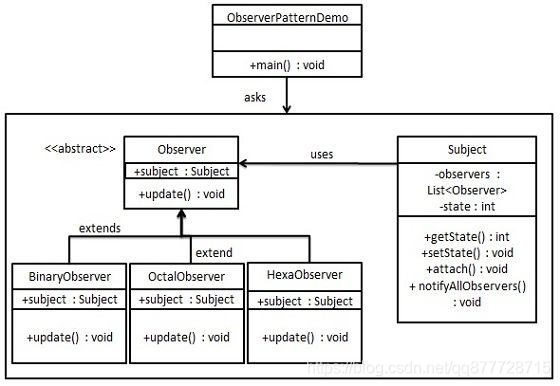
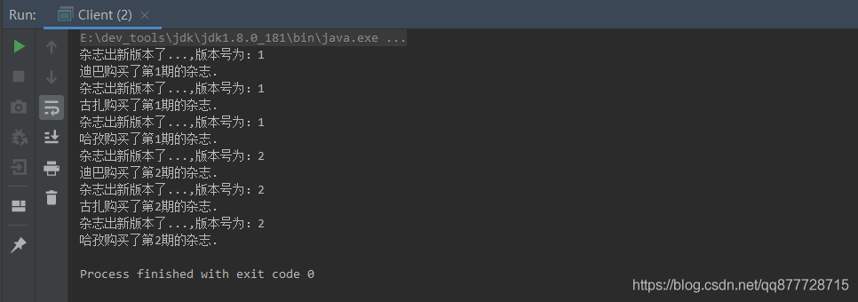
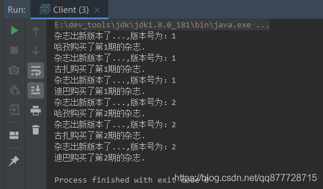

# 一.观察者模式

**观察者模式（Observer Pattern）又称为<font color=#ff00a>发布/订阅(Publish/Subscribe)模式</font>,在对象之间定义了一对多的依赖关系，当一个对象改变状态，依赖它的对象会收到通知并自动更新.**

- 观察者模式无外乎2个操作，观察者订阅自己关心的主题(Subject）和主题有数据变化后通知观察者们。
- 核心：那就是一定有一个地方存放了所有的观察者，然后在事件发生的时候，遍历观察者，调用它们的回调函数。
- 实际生产过程中，观察者模式往往用**消息中间件**来实现，如果要实现**单机观察者模式，可以使用Guava 中的 EventBus**，它有同步实现也有异步实现，本文主要介绍设计模式，就不展开说了。


# 二.观察者模式适用场景

1. 
   聊天室程序的创建。服务器创建好后，A,B,C三个客户端连上来公开聊天。A向服务器发送数据，服务器端聊天数据改变。我们希望将这些聊天数据分别发给他在线的客户。也就是说，每个客户端需要更新服务器端得数据。

2. 网站上，很多人订阅了”java主题”的新闻。当有这个主题新闻时，就会将这些新闻发给所有订阅的人。

3. 大家一起玩CS游戏时，服务器需要将每个人的方位变化发给所有的客户

4. 网络游戏(多人联机对战)场景中，服务器将客户端的状态进行分发

5. 邮件订阅

6. Servlet中，监听器的实现

7. JDK的AWT中事件处理模型,基于观察者模式的委派事件模型(DelegationEventModel)

8. 京东商城中，群发某商品打折信息


上面这些场景，我们都可以使用观察者模式来处理。我们可以**把多个订阅者、客户称之为 观察者**； 需要同步给多个订阅者的数据封装到对象中，称之为 **目标**.


# 三.观察者模式角色

- **抽象被观察者角色/抽象主题角色/抽象发布者(Abstract Subject)**： 一般用一个抽象类和接口来实现。 定义了增加、删除以及通知观察者对象的方法，职责就是管理和通知观察者。持有观察者对象的集合
- **具体被观察者角色具体/主题角色/具体发布者(ConcreteSubject)**： 一般继承抽象被观察者，实现自己本身的业务逻辑，当主题状态发生改变时，向所有注册过的观察者发起通知。
- **抽象观察者角色/抽象订阅者(Abstract Observer)**： 为所有的具体观察者定义在收到通知时更新自己的方法。
- **具体观察者角色/具体订阅者(Concrete Observer)**： 实现抽象观察者角色，观察者接收到消息后，即进行update（更新方法）操作，对接收到的数据进行处理。

# 四.观察者模式的实现方式



## 案例1：订阅杂志

**抽象被观察者角色/主题角色/抽象发布者(Abstract Subject)**

```java
/**
 * 抽象发布者
 */
interface Subject {
    /**
     *   添加发布者
     */
    void addObserver(Observer obj);
    /**
     * 移除发布者
     * @param obj
     */
    void deleteObserver(Observer obj);
    /**
     * 当发布者状态改变时,这个方法被调用,通知所有的观察者--带参数
     */
    void notifyObservers(Object arg);

    /**
     * 当发布者状态改变时,这个方法被调用,通知所有的观察者--不带参数
     */
    void notifyObservers();
}
```

**具体被观察者角色具体/主题角色/具体发布者(ConcreteSubject)**

- 每个主题需要持有观察者列表的引用，用于在数据变更的时候通知各个观察者：

```java
/**
 * 具体发布者，某某杂志
 */
public class MagazineSubject implements Subject{
	/**
	 * 存储所有的观察者
	 */

	private List<Observer> list = new ArrayList<>();
	/**
	 * 	期刊版本
	 */
    private int version;
	/**
	 * 添加观察者
	 */
	@Override
	public void addObserver(Observer obj) {
		list.add(obj);
	}

	/**
	 * 删除观察者
	 * @param obj
	 */
	@Override
	public void deleteObserver(Observer obj) {
		list.remove(obj);
	}

	/**
	 * 通知所有观察者,带参数
	 */
	@Override
	public void notifyObserver(Object args) {
		for(Observer o : list) {
			o.update(this,args);//调用观察者的更新方法
		}
	}

	/**
	 * 通知所有观察者
	 */
	@Override
	public void notifyObservers() {
		notifyObservers(null);
	}

	/**
	 * 该杂志发行了新版本
	 */
	public void publish() {
		//新版本
		this.version ++;
		//信息更新完毕，通知所有观察者
		notifyObservers(version);
	}
}
```

**抽象观察者角色/抽象订阅者(Abstract Observer)**

```java
/**
 * 订阅者接口
 */
interface Observer {
    /**
     * 当发布者状态改变时,更新通知
     * @param subject 订阅者
     * @param arg 发布的数据
     */
    void update(Subject subject, Object arg);
}
```

**具体观察者角色/具体订阅者(Concrete Observer)**

```java
/**
 *订阅者实现类
 */
class CustomerObserver implements Observer{
	/**
	 * 订阅者名字
	 */
	private String name;
	/**
	 * 订阅杂志的版本
	 */
	private int version;

	public  CustomerObserver(String name) {
		this.name  =name;
	}

	/**
	 * 杂志的版本更新时将受到通知
	 * @param
	 */
	@Override
	public void update(Subject subject, Object arg) {
		this.version = (int) arg;
		System.out.println("杂志出新版本了...,版本号为："+version);
		this.buy();
	}
	public void buy() {
		System.out.println(name + "购买了第"+this.version +"期的杂志.");
	}
}
```

**客户类**

```java
public class Client {
	public static void main(String[] args) {
		// 创建主题(被观察者)
		MagazineSubject subject = new MagazineSubject();

		//创建三个不同的观察者
		CustomerObserver c1 = new CustomerObserver("迪巴");
		CustomerObserver c2 = new CustomerObserver("古扎");
		CustomerObserver c3 = new CustomerObserver("哈孜");

		//将观察者注册到主题中
		subject.addObserver(c1);
		subject.addObserver(c2);
		subject.addObserver(c3);

		//更新主题的数据，当数据更新后，会自动通知所有已注册的观察者
		subject.publish();

		subject.publish();
	}
}
```


执行结果




# 五.Java内置观察者模式实现

-在java.util包中包含有基本的Observer接口和Observable抽象类.功能上和Subject接口和Observer接口类似.不过在使用上,就方便多了,因为许多功能比如说注册,删除,通知观察者的那些功能已经内置好了.

**抽象被观察者角色/主题角色/抽象发布者(Abstract Subject)**

- 下例是 Java 内置的java.util.Observable 类，主题角色需要继承这个类，然后调用已写好的setChanger addObserver 方法、deleteObserver 方法和通知方法 notifyObservers 即可。
- Observable 持有观察者列表的引用，用于在数据变更的时候通知各个观察者：

```java
//被观察者
public class Observable {
	//保存被观察者的状态 true:改变  false:未改变
    private boolean changed = false;
    //保存所有被注册的观察者
    private Vector<Observer> obs;

    public Observable() {
    	//Observable被构造时初始化容器
        obs = new Vector<>();
    }
 
 	//新增观察者
    public synchronized void addObserver(Observer o) {
        if (o == null)
            throw new NullPointerException();
        if (!obs.contains(o)) {
            obs.addElement(o);
        }
    }
 
 	//删除指定观察者
    public synchronized void deleteObserver(Observer o) {
        obs.removeElement(o);
    }
    
 	//通知所有观察者,不带参数传入
    public void notifyObservers() {
        notifyObservers(null);
    }
 
 	//通知所有观察者,带参数传入
    public void notifyObservers(Object arg) {
        Object[] arrLocal;
 
        synchronized (this) {
            if (!hasChanged())
                return;
            arrLocal = obs.toArray();
            clearChanged();
        }
 
        for (int i = arrLocal.length-1; i>=0; i--)
            ((Observer)arrLocal[i]).update(this, arg);
    }

	//删除所有观察者
    public synchronized void deleteObservers() {
        obs.removeAllElements();
    }

	//设置为状态已改变
    protected synchronized void setChanged() {
        changed = true;
    }
 
	//设置为状态未改变
    protected synchronized void clearChanged() {
        changed = false;
    }
 
	//返回当前状态
    public synchronized boolean hasChanged() {
        return changed;
    }
    
 	//返回观察者的个数
    public synchronized int countObservers() {
        return obs.size();
    }
}
```

**具体被观察者角色具体/主题角色/具体发布者(ConcreteSubject)**

- 继承 java.util.Observable类,通过setChanged()改变主题状态、notifyObservers()通知所有观察者

```java
/**
 * 具体发布者，某某杂志
 */
class MagazineSubject extends Observable {

    /**
     * 期刊版本
     */
    private int version;

    /**
     * 该杂志发行了新版本
     */
    public void publish() {
        //新版本
        this.version++;
        //状态改变
        super.setChanged();
        //信息更新完毕，通知所有观察者
        super.notifyObservers(version);
    }
}
```

**抽象观察者角色/抽象订阅者(Abstract Observer)**

- 下例是 Java 内置的java.util.Observer 接口，订阅者需要实现这个接口，然后在update()中收到消息后进行相应的处理即可

```java
public interface Observer {
    /**
     * 处理所有来自被观察者的通知
     * @param o 被观察的对象
     * @param arg  传过来的参数
     */
    void update(Observable o, Object arg);
}
```

**具体观察者角色/具体订阅者(Concrete Observer)**

```java
/**
 * 订阅者实现类
 */
class CustomerObserver implements Observer {
    /**
     * 订阅者名字
     */
    private String name;
    /**
     * 订阅杂志的版本
     */
    private int version;

    public CustomerObserver(String name) {
        this.name = name;
    }

    /**
     * 杂志的版本更新时将受到通知
     *
     * @param o   发布者
     * @param arg 发布的数据
     */
    @Override
    public void update(Observable o, Object arg) {
        this.version = (int) arg;
        System.out.println("杂志出新版本了...,版本号为：" + version);
        this.buy();
    }

    public void buy() {
        System.out.println(name + "购买了第" + this.version + "期的杂志.");
    }
}
```

**客户类**

```java
public class Client {

	public static void main(String[] args) {
		// 创建主题(被观察者)
		MagazineSubject subject = new MagazineSubject();

		//创建三个不同的观察者
		CustomerObserver c1 = new CustomerObserver("迪巴");
		CustomerObserver c2 = new CustomerObserver("古扎");
		CustomerObserver c3 = new CustomerObserver("哈孜");

		//将观察者注册到主题中
		subject.addObserver(c1);
		subject.addObserver(c2);
		subject.addObserver(c3);

		//更新主题的数据，当数据更新后，会自动通知所有已注册的观察者
		subject.publish();

		subject.publish();
	}
}
```


执行结果




# 六.总结

## 1.观察者模式的优缺点

**优点：**

1. 观察者和被观察者是抽象耦合的。
2. 建立一套触发机制。

**缺点：**

1. 如果一个被观察者对象有很多的直接和间接的观察者的话，将所有的观察者都通知到会花费很多时间。
2. 如果在观察者和观察目标之间有循环依赖的话，观察目标会触发它们之间进行循环调用，可能导致系统崩溃。
3. 观察者模式没有相应的机制让观察者知道所观察的目标对象是怎么发生变化的，而仅仅只是知道观察目标发生了变化。
4. 多个观察者不容易调试
5. <font color=#ff00a>通知默认是顺序执行的</font>，一个观察者阻塞，会影响到整体效率，一般使用异步的方法避免

## 2.Spring之事件监听(观察者模型)

[Spring之事件监听(观察者模型)](https://dpb-bobokaoya-sm.blog.csdn.net/article/details/88231314)
