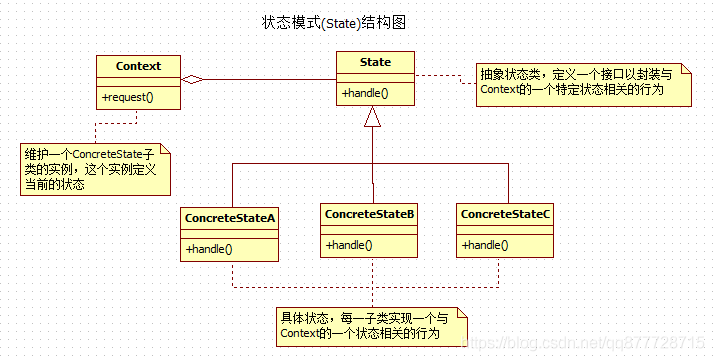

# 一.状态模式

**状态模式(State Pattern)也称为状态机模式(State Machine Pattern)，当控制一个<font color=#ff00a>对象状态的条件表达式过于复杂的时候</font>，就可以考虑使用状态模式，通过把状态的<font color=#ff00a>判断逻辑</font>转移到表示不同状态的一系列类中，这样就可以把复杂的逻辑简单化，使得对象的行为依赖于它的状态，并且会随着状态的改变而同时改变行为。**

- 所谓**对象的状态**，通常指的就是**对象实例**的<font color=#ff00a>属性的值</font>；而**行为**指的就是<font color=#ff00a>对象的功能</font>，再具体点说，行为大多可以 <font color=#ff00a>对应到方法上</font>。

- 状态模式的核心就是 <font color=#ff00a>分离对象的状态和行为</font>，**通过维护状态的变化，来调用不同状态对应的不同功能**。 也就是说，状态和行为是相关联的，即: **状态决定行为（功能）**

- 由于状态是在<font color=#ff00a>运行期被改变</font>的，因此**行为也会在运行期根据状态的改变而改变**。

- 和 <font color=#ff00a>策略模式</font> 一样可以减少if-else或switch-case等条件判断逻辑。


**日常开发中总是离不开对象的状态，比如我们审批流程，订单流程就是一个状态不断改变的过程，**

- 审批工作流-报销审批，销售发起审批，如果金额小于200，只需要主管审批，如果金额在200-500之间需要经理审批，金额大于500小于2000，需要总监审批，大于2000需要老板审批。每一个审批人审批都对应着状态的变化。

- 订单状态的变化，下单、待支付、支付、发货、待收货、收货、取消、待退款、已退款等等，每一个订单背后承载着很多不同的状态。每一个状态，都有不一样的业务逻辑。


**状态模式可以更好地处理我们状态流转过程中的业务处理逻辑。**


# 二.状态模式适用场景
状态模式主要应用于以下场景：

1. 对象的**行为(功能)**需要随着状态的改变而改变时。
2. 当我们一个操作中需要根据状态来写大量的if/else逻辑时

# 三.状态模式角色

- **环境类角色/状态处理角色(Context)**：定义客户类需要的接口，内部<font color=#ff00a>一个具体状态的实例</font>，并<font color=#ff00a>负责具体状态的切换</font>

  > 在状态模式中，<font color=#ff00a>环境(Context)是持有状态的对象</font>，但是环境(Context)自身并不处理跟状态相关的行为，而是把处理状态的功能委托给了状态对应的状态处理类来处理。

- **抽象状态角色(Abstract State)**：接口或者抽象类。定义每个状态下对应的<font color=#ff00a>行为(功能方法)</font>，可以有一个或者多个行为(功能方法)。

- **具体状态角色/上下文角色(Concrete State)**：具体实现该状态对应的<font color=#ff00a>行为(功能方法)</font>，并且在需要的情况下实现状态的切换。

  > 具体的状态处理类中经常需要<font color=#ff00a>获取环境(Context)自身的数据</font>，甚至在必要的时候会回调环境(Context)的方法，因此，<font color=#ff00a>通常将环境(Context)自身当作一个参数传递给具体的状态处理类</font>

- **客户类(Client)**：使用环境类角色完成状态装换

  > 客户端一般只和环境(Context)交互。客户端可以用状态对象来配置一个环境(Context)，一旦配置完毕，就不再需要和状态对象打交道了。客户端通常不负责运行期间状态的维护，也不负责决定后续到底使用哪一个具体的状态处理对象。


# 四.状态模式的实现方式

## 案例1:订单状态

**抽象状态角色(Abstract State)**

定义立一个抽象状态类，这个类需要定义所有状态的所有行为：

```java
/**
 * 抽象的订单状态类
 */
public abstract class AbstractOrderState {
    /**
     * 订单状态上下文类-用来负责具体状态的切换
     */
    protected OrderContext orderContext;

    /**
     *传入订单状态上下文
     */
    public AbstractOrderState(OrderContext orderContext) {
        this.orderContext = orderContext;
    }

    /**
     *支付行为
     */
    public abstract void pay();

    /**
     *发货行为
     */
    public abstract void deliver();

    /**
     *收货行为
     */
    public abstract void receive();
}
```

> 注意这里面集成了一个OrderContext对象，这个对象是用来负责状态的切换的。

**具体状态角色(Concrete State)**

有3个状态，所以我们新建3个具体的状态类来实现抽象状态类：

待支付状态类

```java
/**
 * 具体状态-待支付订单状态
 */
public class WaitPaidOrderState extends AbstractOrderState {
    /**
     * 传入上下文类用于设置具体状态的状态
     * @param orderContext
     */
    public WaitPaidOrderState(OrderContext orderContext) {
        super(orderContext);
    }

    /**
     * 支付
     */
    @Override
    public void pay() {
        //相当于待支付的状态绑定了支付行为
        System.out.println("支付成功");
        //切换状态
        this.orderContext.setState(this.orderContext.waitDeliver);
    }
    /**
     * 发货
     */
    @Override
    public void deliver() {
        System.out.println("对不起，请先付钱");
    }
    /**
     * 收货
     */
    @Override
    public void receive() {
        System.out.println("对不起，请先付钱");
    }
}
```


待发货状态类

```java
/**
 * 具体状态-待发货订单状态
 */
public class WaitDeliverOrderState extends AbstractOrderState {
    /**
     * 传入上下文类用于设置具体状态的状态
     * @param orderContext
     */
    public WaitDeliverOrderState(OrderContext orderContext) {
        super(orderContext);
    }

    /**
     * 支付
     */
    @Override
    public void pay() {
        System.out.println("你已经付过钱了");
    }
    /**
     * 发货
     */
    @Override
    public void deliver() {
        System.out.println("商品已发货并送达目的地");
        //切换状态
        this.orderContext.setState(this.orderContext.receiveGoods);
    }
    /**
     * 收货
     */
    @Override
    public void receive() {
        System.out.println("请稍等，商品即将发货");
    }
}
```


待收货状态类

```java
/**
 * 具体状态-待收货订单状态
 */
public class ReceiveGoodsOrderState extends AbstractOrderState{
    /**
     * 传入上下文类用于设置具体状态的状态
     * @param orderContext
     */
    public ReceiveGoodsOrderState(OrderContext orderContext) {
        super(orderContext);
    }

    /**
     * 支付
     */
    @Override
    public void pay() {
        System.out.println("您已经付过钱啦，不要重复付钱哦");
    }
    /**
     * 发货
     */
    @Override
    public void deliver() {
        System.out.println("商品已发货并送达，请不要重复发货");
    }
    /**
     * 收货
     */
    @Override
    public void receive() {
        System.out.println("用户已收到商品，此次交易结束");
    }
}
```


> 上面的每个状态都绑定了一个行为(也可以支持绑定多个)，并且在对应的行为处理完毕之后会流转到下一个状态，对于不属于当前状态的行为则做出相应的回应。

**环境角色/上下文角色(Context)**

定义一个状态上下文环境类，用来负责具体状态的切换：

```java
/**
 * 订单环境类-负责具体状态的转换
 */
public class OrderContext {
    /**
     * 待支付状态
     */
    AbstractOrderState waitPaid;
    /**
     * 待发货状态
     */
    AbstractOrderState waitDeliver;
    /**
     * 待收货状态
     */
    AbstractOrderState receiveGoods;

    /**
     * 当前状态
     */
    AbstractOrderState currState;

    /**
     * 初始化所有状态以设置当前状态为待支付状态
     */
    public OrderContext() {
        this.waitPaid = new WaitPaidOrderState(this);
        this.waitDeliver = new WaitDeliverOrderState(this);
        this.receiveGoods = new ReceiveGoodsOrderState(this);
        currState = waitPaid;
    }

    /**
     * 设置当前状态
     * @param state
     */
    void setState(AbstractOrderState state){
        this.currState = state;
    }

    /**
     * 当前状态的支付操作
     */
    public void pay(){
        currState.pay();
    }

    /**
     * 当前状态的发货操作
     */
    public void deliver(){
        currState.deliver();
    }
    /**
     * 当前状态的收货操作
     */
    public void receive(){
        currState.receive();
    }
}
```

**客户类(Client)**

```java
/**
 * 调用环境类封装好的行为
 */
public class Client {
    public static void main(String[] args) {
        OrderContext orderContext = new OrderContext();
        //支付
        orderContext.pay();
        //发货
        orderContext.deliver();
        //收货
        orderContext.receive();
    }
}
```


执行结果


## 案例2:投票系统

**实现一个在线投票系统的应用**

1. 要实现控制同一个用户只能投一票，如果一个用户反复投票，而且投票次数**超过5次**，则判定为**恶意刷票**，要**取消该用户投票的资格**，当然同时也要**取消他所投的票数**
2. 如果一个用户的投票次数**超过8次**，将进入黑名单，**禁止再登录和使用系统**

> 使用状态模式实现，首先需要把投票过程的各种状态定义出来，根据以上描述大致分为4种状态：正常投票、反复投票、恶意刷票、进入黑名单。然后创建一个投票管理对象（相当于Context）。
>
> 


**抽象状态角色(Abstract State)**

定义立一个抽象状态类，这个类需要定义所有状态的所有行为：

```java
/**
 * 抽象状态类
 */
public interface IVoteState {
    /**
     * 处理状态对应的行为
     *
     * @param user        投票人
     * @param voteItem    投票项
     * @param voteManager 投票上下文，用来在实现状态对应的功能处理的时候，可以回调上下文的数据
     */
    void vote(String user, String voteItem, VoteManager voteManager);
}
```

**具体状态角色(Concrete State)**

有4个状态，所以我们新建4个具体的状态类来实现抽象状态类：

正常投票状态类

```java
/**
 * 　具体状态类——正常投票
 */
public class NormalVoteState implements IVoteState {
    @Override
    public void vote(String user, String voteItem, VoteManager voteManager) {
        //正常投票，记录到投票记录中
        voteManager.getMapVote().put(user, voteItem);
        System.out.println("恭喜投票成功");
    }
}
```


重复投票状态类

```java
/**
 * 　具体状态类——重复投票
 */
public class RepeatVoteState implements IVoteState {
    @Override
    public void vote(String user, String voteItem, VoteManager voteManager) {
        //重复投票，暂时不做处理
        System.out.println("请不要重复投票");
    }
}
```

恶意刷票状态类

```java
/**
 * 具体状态类——恶意刷票
 */
public class SpiteVoteState implements IVoteState {
    @Override
    public void vote(String user, String voteItem, VoteManager voteManager) {
        // 恶意投票，取消用户的投票资格，并取消投票记录
        String str = voteManager.getMapVote().get(user);
        if(str != null){
            voteManager.getMapVote().remove(user);
        }
        System.out.println("你有恶意刷票行为，取消投票资格");
    }
}
```


黑名单状态类

```java
/**
 *　具体状态类——黑名单
 */
public class BlackVoteState implements IVoteState {
    @Override
    public void vote(String user, String voteItem, VoteManager voteManager) {
        //记录黑名单中，禁止登录系统
        System.out.println("进入黑名单，将禁止登录和使用本系统");
    }
}
```

**环境角色/上下文角色(Context)**

定义一个状态上下文环境类，用来负责具体状态的切换：

```java
public class VoteManager {
    /**
     * 持有状态处理对象
     */
    private IVoteState currentState = null;
    /**
     *  记录用户投票的结果，Map<String,String>对应Map<用户名称，投票的选项>
     */
    private Map<String,String> mapVote = new HashMap<>(16);
    /**
     * 记录用户投票次数，Map<String,Integer>对应Map<用户名称，投票的次数>
     */
    private Map<String,Integer> mapVoteCount = new HashMap<>(16);

    /**
     * 获取用户投票结果的Map
     */
    public Map<String, String> getMapVote() {
        return mapVote;
    }

    /**
     * 执行投票
     * @param user    投票人
     * @param voteItem    投票的选项
     */
    public void vote(String user,String voteItem){
        //1.从记录中取出该用户已有的投票次数
        Integer oldVoteCount = mapVoteCount.get(user);
        
        //2.首次投票初始化为0
        if(oldVoteCount == null){
            oldVoteCount = 0;
        }
        
        //3.增加该用户投票次数,并缓存
        oldVoteCount += 1;
        mapVoteCount.put(user, oldVoteCount);
        
        //4.根据投票次数判断该用户的投票状态,到底是正常投票、重复投票、恶意投票还是上黑名单的状态
        //正常投票状态
        if(oldVoteCount == 1){
            currentState = new NormalVoteState();
        }
        //重复投票状态
        else if(oldVoteCount > 1 && oldVoteCount < 5){
            currentState = new RepeatVoteState();
        }
        //恶意刷票状态
        else if(oldVoteCount >= 5 && oldVoteCount <8){
            currentState = new SpiteVoteState();
        }
        //黑名单状态
        else if(oldVoteCount > 8){
            currentState = new BlackVoteState();
        }

        //5.执行当前状态对应的具体操作
        currentState.vote(user, voteItem, this);
    }
}
```

**客户类(Client)**

```java
public class Client {
    public static void main(String[] args) {
        //实例化上下文类,执行投票
        VoteManager vm = new VoteManager();
        for (int i = 0; i < 9; i++) {
            vm.vote("u1", "A");
        }
    }
}
```


执行结果


从上面的示例可以看出，状态的转换基本上都是内部行为，主要在状态模式内部来维护。比如对于投票的人员，任何时候他的操作都是投票，但是投票管理对象的处理却不一定一样，会根据投票的次数来判断状态，然后根据状态去选择不同的处理。


# 五.总结

## 1.状态模式的优缺点

**优点：**

1. 通过**将每个状态设置为独立的对象**，**消除了代码中存在的大量if/else等判断分支**，使得代码更加简洁，更容易维护。
2. **将不同的状态通过不同的类**来表示，使得**状态切换**时比用数字或者字符串来表示时更加直观转换目的也更加明确。
3. 每个状态类的职责单一明确，易于扩展。
4. 封装性好，**状态的转换在类的内部实现**，外部调用就不需要知道类的内部是如何实现状态和行为的变换了。

**缺点：**

1. 状态过多会引起**类膨胀(事实上这也是大部分设计模式的通病)**。
2. 对于支持状态切换的**环境类(Context)违反了开闭原则**，因为一旦状态修改或者中间要新增状态，则需要**修改对应的源代码**，否则会出现状态切换错误。
3. 状态模式的结构与实现相对较为复杂，容易造成代码混乱。

# 2.状态模式与责任链模式

**上面的状态模式的实现是有点和<font color=#ff00a>责任链模式</font>相似，都是一条链去处理，可以这么说在某种场景下这两种模式可以互相替换，但是这两种模式也是有本质区别的。**

1. 状态模式的**下一个节点是各个状态对象已经了解**的，而且**状态的流转就是由内部进行流转**，客户端无法决定。

2. 责任链模式的**“链路”上的对象并不知道下一个节点处理人是谁**，而是由客户端自行组装决定的。


## 3.状态模式与策略模式的区别

**状态模式，策略模式的孪生兄弟，两者之间极其相似**




状态模式和策略模式都能用来消除大量的if/else场景，但是也有本质区别。

**思想不同**

- 状态模式是： 将类的"状态"封装了起来，在运行时进行自动的转换，从而实现，类在同一行为下不同状态得都不同的个。它与策略模式的区别在于，这种转换是"自动"，"无意识"的。
- 策略模式是：将类的变化的部分抽离出来，组合进类中，根据不同的子类替换实现动态改变行为(功能)。

**角色的不同**

> 策略模式
>
> - Strategy: 定义所有支持的算法的公共接口抽象类.
> - ConcreteStrategy: 封装了具体的算法或行为，继承于Strategy
> - Context: 用一个ConcreteStrategy来配置，维护一个对Strategy对象的引用。
>
> 状态模式
>
> - State: 抽象状态类，定义一个接口以封装与context的一个状态相关的行为
> - ConcreteState: 具体状态，每一子类实现一个与Context的一个状态相关的行为
> - Context: 维护一个ConcreteState子类的实例，这个实例定义当前的状态。


**环境角色的职责不同**

- 两者都有一个叫做Context环境角色的类，但区别很大，策略模式的环境角色只是**一个委托作用，负责策略的替换**；而状态模式的环境角色**不仅仅是委托行为，它还具有记录状态变化的功能**，与具体的状态类协作，共同完成状态切换行为随之切换的任务。

**解决问题的重点不同**

- 策略模式旨在解决内部策略如何改变的问题，也就是将内部策略的改变对外界的影响降低到最小，使策略可以自由地切换；而状态模式旨在解决内在状态的改变而引起行为(功能)改变的问题，它的出发点是状态，封装状态而暴露行为(功能)，一个对象的状态改变，从外界来看就好像是行为(功能)改变。
  