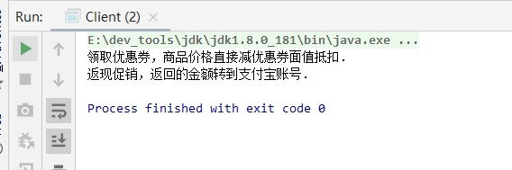
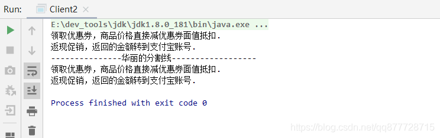
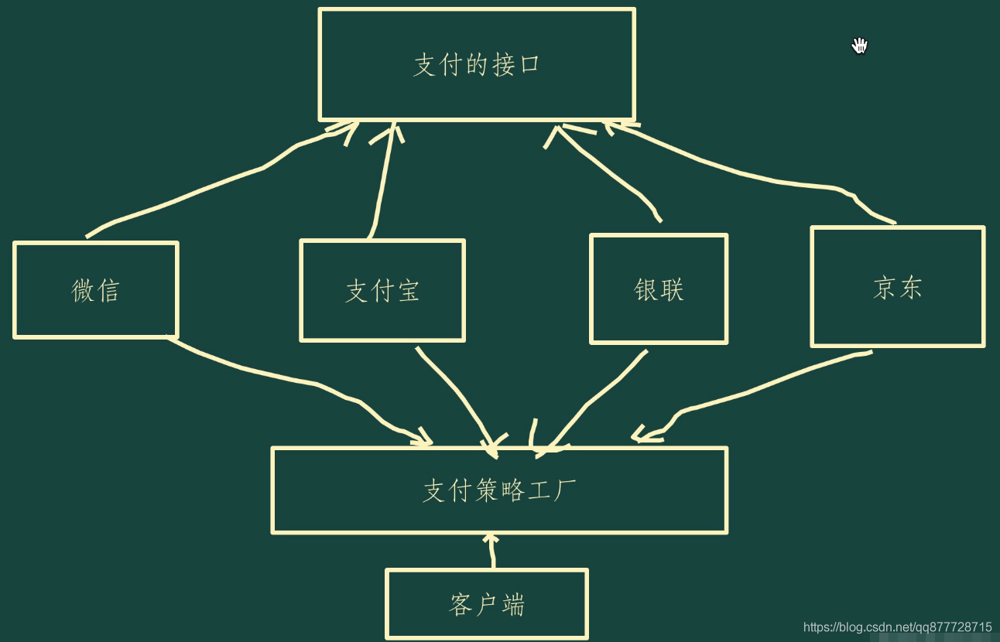
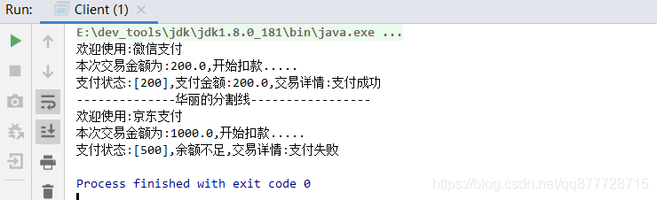
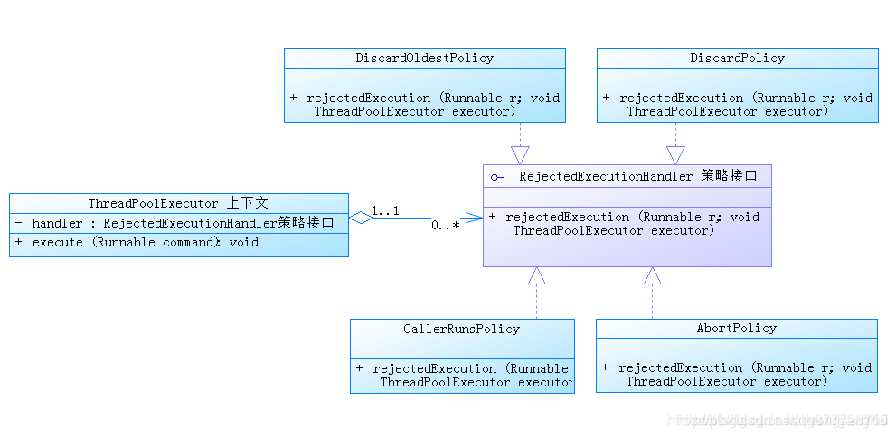
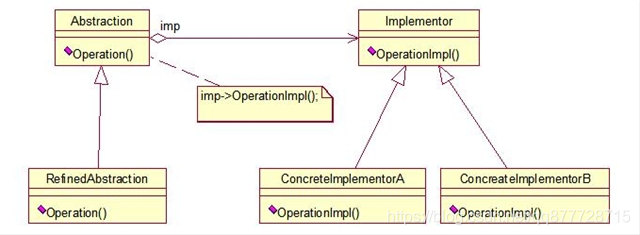
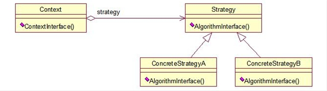

# 一.策略模式

**策略模式（Strategy Pattern）是当有多种算法且调用和返回方式相似的情况下，仅类型不同时，可以通过该模式将其封装起来，让它们之间可以互相替换。**

- 策略模式可以用于改造代码中的if-else逻辑


# 二.策略模式适用场景

如果在一个系统里面有许多类，它们之间的区别仅在于它们的类型，那么使用策略模式可以动态地让一个对象在许多类型中选择一种类型进行处理。<font color=#ff00a> 避免使用多重的if-else来实现</font>。


# 三.策略模式角色

- **抽象策略角色(Abstract Strategy)**：通常为<font color=#ff00a>接口 或 抽象类</font>，定义每个策略必须具有的方法和属性。
- **具体策略角色(Concrete Strategy)**：具体<font color=#ff00a>实现抽象策略中的接口</font>，编写具体的业务逻辑
- **策略上下文角色/环境角色(Context Strategy)**： 该角色用于<font color=#ff00a>屏蔽高层模块对具体策略的直接访问，持有具体策略引用</font>，将对具体策略的处理封装成对外api


# 四.策略模式的实现方式

## 1.案例1:商场优惠策略

模拟商城优惠策略

1. 优惠券抵扣
2. 返现促销，满100返回20
3. 拼团

不使用策略模式之前

```java
    /**
     * 促销策略类型
     * @param type
     */
    public void doPromotion(String type) {
        //优惠券策略
        if ("COUPON".equals(type)) {
            System.out.println("领取优惠券，商品价格直接减优惠券面值抵扣.");
        }
        //返现策略
        else if ("CASHBACK".equals(type)) {
            System.out.println("返现促销，返回的金额转到支付宝账号.");
        }
        //拼团策略
        else if ("GROUPBY".equals(type)) {
            System.out.println("拼团,满2人成团,全团享受团购特价");
        }
        //无策略
        else {
            System.out.println("无促销活动..");
        }
    }
```


使用策略模式进行优化之后

**抽象策略角色(Abstract Strategy)**

```java
/**
 * 抽象策略接口
 */
public interface PromotionStrategy {
	//执行促销策略
    void doPromotion();
}
```

**具体策略角色(Concrete Strategy)**

```java
/**
 * 优惠券策略类
 */
public class CouponStrategy implements PromotionStrategy {
    public void doPromotion() {
        System.out.println("领取优惠券，商品价格直接减优惠券面值抵扣.");
    }
}
```

```java
/**
 *返现策略
 */

public class CashbackStrategy implements PromotionStrategy {
    public void doPromotion() {
        System.out.println("返现促销，返回的金额转到支付宝账号.");
    }
}
```

```java
/**
 * 拼团策略
 */
public class GroupbuyStrategy implements PromotionStrategy {
    public void doPromotion() {
        System.out.println("拼团,满2人成团,全团享受团购特价");
    }
}
```

```java
/**
 * 没有优惠策略
 */
public class EmptyStrategy implements PromotionStrategy {
    public void doPromotion() {
        System.out.println("无促销活动..");
    }
}
```

**策略上下文角色/环境角色(Context Strategy)**

```java
/**
 * 创建促销活动方案上下文类
 */
public class PromotionActivityContext {
	/**
	 * 具体策略引用
	 */
    private PromotionStrategy promotionStrategy;

	/**
	 * 通过构造方法传入具体策略
	 * @param promotionStrategy 具体策略
	 */
	public PromotionActivityContext(PromotionStrategy promotionStrategy) {
        this.promotionStrategy = promotionStrategy;
    }

	/**
	 * 调用具体策略
	 */
	public void execute() {
        promotionStrategy.doPromotion();
    }
}
```

**客户类**

```java
public class Client {
    public static void main(String[] args) {
        //创建优惠券的促销策略
        PromotionActivityContext context = new PromotionActivityContext(new CouponStrategy());
        context.execute();

		//创建返现的促销策略
        context = new PromotionActivityContext(new CashbackStrategy());
        context.execute();
    }
}
```


执行结果




**优化具体策略角色**

代码还有可以优化的地方，可以把具体策略集中存放，用户想使用哪种策略直接取出就行。我们使用**枚举类**或者**工厂模式**进行改造。

工厂方法模式

```java
/**
 * 策略工厂类
 */
public class PromotionStrategyFactory {
    /**
     * 创建一个map存储所有的策略，管理方便
     */
    private static final Map<String, PromotionStrategy> PROMOTION_STRATEGY_MAP = new HashMap<>(8);
    /**
     * 无促销策略
     */
    private static final PromotionStrategy NON_PROMOTION = new EmptyStrategy();

    //类加载时初始化所有策略到Map中
    static {
        //优惠券策略
        PROMOTION_STRATEGY_MAP.put(PromotionKey.COUPON, new CouponStrategy());
        //返现策略
        PROMOTION_STRATEGY_MAP.put(PromotionKey.CASHBACK, new CashbackStrategy());
        //拼团策略
        PROMOTION_STRATEGY_MAP.put(PromotionKey.GROUPBY, new GroupbuyStrategy());
    }

    /**
     * 根据策略标识获取指定策略,否则返回无策略
     *
     * @param promotionKey 策略标识
     * @return PromotionStrategy
     */
    public static PromotionStrategy getStrategy(String promotionKey) {
        //根据key获取策略
        PromotionStrategy promotionStrategy = PROMOTION_STRATEGY_MAP.get(promotionKey);

        //如果获取不到则返回空策略,否则返回指定策略
        return promotionStrategy == null ? NON_PROMOTION : promotionStrategy;
    }

    /**
     * 定义一个常量接口
     */
    interface PromotionKey {
        //优惠券策略
        String COUPON = "COUPON";
        //返现策略
        String CASHBACK = "CASHBACK";
        //拼团策略
        String GROUPBY = "GROUPBY";
    }
}
```


枚举类

```java
/**
 * 策略枚举类
 */
public enum PromotionStrategyEnum {
        //优惠券策略
        COUPON("COUPON", new CouponStrategy()),
        //返现策略
        CASHBACK("CASHBACK", new CashbackStrategy()),
        //拼团策略
        GROUPBY("GROUPBY", new GroupbuyStrategy()),
        //无策略
        NULL("NULL", new EmptyStrategy());

        /**
         * 策略标识
         */
        private String key;
        /**
         * 具体实现策略
         */
        private PromotionStrategy value;
        /**
         * 初始化策略
         * @param key promotionEnum
         * @param value 具体实现策略
         */
        PromotionStrategyEnum(String key, PromotionStrategy value) {
            this.key = key;
            this.value = value;
        }

        /**
         * 根据策略标识获取指定策略,否则返回无策略
         * @param key 策略标识
         * @return PromotionStrategy
         */
        public static PromotionStrategy getStrategy(String key) {
            for (PromotionStrategyEnum promotionEnum : PromotionStrategyEnum.values()) {
                if (promotionEnum.key.equals(key)) {
                    return promotionEnum.value;
                }
            }

            return NULL.value;//没有合适key则空策略
        }
    }
```


客户类

```java
public class Client2 {
    public static void main(String[] args) {
        //------------使用工厂方法获取策略,然后执行策略---------------
        //获取优惠卷策略
        PromotionStrategy couponStrategy = PromotionStrategyFactory.getStrategy(PromotionStrategyFactory.PromotionKey.COUPON);
        //执行策略
        PromotionActivityContext context = new PromotionActivityContext(couponStrategy);
        context.execute();


        //获取返现的促销策略
        PromotionStrategy cashbackStrategy = PromotionStrategyFactory.getStrategy(PromotionStrategyFactory.PromotionKey.CASHBACK);
        //执行策略
        context = new PromotionActivityContext(cashbackStrategy);
        context.execute();

        System.out.println("---------------华丽的分割线------------------");


        //------------使用枚举获取策略,然后执行策略---------------
        //获取优惠卷策略
        PromotionStrategy couponStrategy2 = PromotionStrategyEnum.getStrategy(PromotionStrategyEnum.COUPON.getKey());
        //执行策略
         context = new PromotionActivityContext(couponStrategy2);
        context.execute();


        //获取返现的促销策略
        PromotionStrategy cashbackStrategy2 = PromotionStrategyEnum.getStrategy(PromotionStrategyEnum.CASHBACK.getKey());
        //执行策略
        context = new PromotionActivityContext(cashbackStrategy2);
        context.execute();
    }
}
```


执行结果




## 2.案例2：网上支付

**一个场景的应用场景是大家在支付的时候回提示选择支付方式，如果用户没有选择，系统也会使用默认的支付方式结算。**

支付方式有 ：

1. 支付宝支付
2. 微信支付
3. 银联支付
4. 京东白条支



**抽象策略角色(Abstract Strategy)**

```java
/**
 * 策略抽象类
 */
public abstract class AbstractPayment{
	/**
	 * 支付类型
	 */
	public abstract String getType();
	/**
	 * 查询余额
	 * @param uid 用户id
	 * @return 余额
	 */
	protected abstract double queryBalance(String uid);

	/**
	 * 扣款支付
	 * @param uid 用户编号
	 * @param amount 支付金额
	 * @return
	 */
	public PayState pay(String uid,double amount) {
		//根据
		if(queryBalance(uid) < amount) {
			return new PayState(500,"支付失败","余额不足");
		}
		return new PayState(200,"支付成功","支付金额:"+amount);
	}
}
```

**具体策略角色(Concrete Strategy)**

```java
/**
 * 支付宝支付策略
 */
class AliPay extends AbstractPayment{
	@Override
	public String getType() {
		return "支付宝";
	}
	@Override
	protected double queryBalance(String uid) {
		return 900;
	}
}
```

```java
/**
 * 微信支付策略
 */
class WechatPay extends AbstractPayment{
	public String getType() {
		return "微信支付";
	}
	protected double queryBalance(String uid) {
		return 256;
	}
}
```

```java
/**
 * 银联支付策略
 */
class UnionPay extends AbstractPayment{
	public String getType() {
		return "银联支付";
	}
	protected double queryBalance(String uid) {
		return 120;
	}
}
```

```java
/**
 * 京东支付策略
 */
class JDPay extends AbstractPayment{
	public String getType() {
		return "京东支付";
	}
	protected double queryBalance(String uid) {
		return 500;
	}
}
```

**策略上下文角色/环境角色(Context Strategy)**

```java
/**
 * 支付策略上下文类
 */
public class PaymentStrategyContext {
    /**
     * 具体策略引用
     */
    private AbstractPayment payment;

    /**
     * 通过构造方法传入具体策略
     *
     * @param payment 具体策略
     */
    public PaymentStrategyContext(AbstractPayment payment) {
        this.payment = payment;
    }

    /**
     * 扣款支付
     *
     * @param uid    用户编号
     * @param amount 支付金额
     * @return
     */
    public PayState pay(String uid, double amount) {
        return payment.pay(uid, amount);
    }
}
```

**策略工厂(Strategy Factory)**

```java
/**
 * 策略工厂类
 */
public class PaymentStrategyFactory{
	/**
	 * 支付宝支付
	 */
	public static final String ALI_PAY = "ALI_PAY";
	/**
	 * 京东白条支付
	 */
	public static final String JD_PAY = "JDPAY";
	/**
	 * 银联支付
	 */
	public static final String UNION_PAY = "UNION_PAY";
	/**
	 * 微信支付
	 */
	public static final String WECHAT_PAY = "WECHAT_PAY";
	/**
	 * 默认支付方式:支付宝
	 */
	public static final String DEFAULT_PAY = ALI_PAY;

	/**
	 * 策略存放容器
	 */
	private static final Map<String,AbstractPayment> PAY_MAP = new HashMap<>(8);

	//类加载时初始化所有策略具体实现
	static {
		//支付宝支付策略
		PAY_MAP.put(ALI_PAY, new AliPay());
		//京东白条支付策略
		PAY_MAP.put(JD_PAY, new JDPay());
		//银联支付策略
		PAY_MAP.put(UNION_PAY, new UnionPay());
		//微信支付策略
		PAY_MAP.put(WECHAT_PAY, new WechatPay());
	}

	/**
	 * 根据支付类型获取支付策略,如果没有支付类型,默认为支付宝支付策略
	 * @param payKey
	 * @return
	 */
	public static AbstractPayment getPayment(String payKey) {
		//无支付类型,默认使用支付宝支付
		if( !PAY_MAP.containsKey(payKey) ) {
			return PAY_MAP.get(DEFAULT_PAY);
		}
		return PAY_MAP.get(payKey);
	}
}
```

**客户类**

```java
public class Client {
    public static void main(String[] args) {
        //创建订单
        Order order = new Order("1001", UUID.randomUUID().toString(), 200);
        //根据支付类型进行订单扣费
        PayState payState = order.pay(PaymentStrategyFactory.WECHAT_PAY);
        System.out.println(payState);


        System.out.println("--------------华丽的分割线-----------------");

        //创建订单
        Order order2 = new Order("1002", UUID.randomUUID().toString(), 1000);
        //根据支付类型进行订单扣费
        PayState payState2 = order2.pay(PaymentStrategyFactory.JD_PAY);
        System.out.println(payState2);
    }
}
```


执行结果




# 五.总结

## 1.策略模式的优缺点

**优点:**

1. 符合开闭原则
2. 可避免使用多重条件语句，如if—else语句、switch语句
3. 可以提高算法的保密性和安全性

**缺点:**

1. <font color=#ff00a>调用端必须知道所有的策略，并且自行决定使用哪一个策略类</font>

   > <font color=#ff00a>上层模块必须知道有哪些策略，然后才能决定使用哪一个策略，这与迪米特法则(最少知道原则)是相违背的</font>，我只是想使用了一个策略，我凭什么就要了解这个策略呢？那要你的封装类还有什么意义？这是原装策略模式的一个缺点，幸运的是，我们可以使用其他模式来修正这个缺陷，如工厂方法模式、代理模式或享元模式。

2. <font color=#ff00a>代码中会产生非常多的策略类，增加了代码的维护难度。</font>

   > 如果系统中的一个策略家族的具体策略数量<font color=#ff00a>超过4个</font>，则需要考虑使用混合模式，解决策略类膨胀和对外暴露的问题，否则日后的系统维护就会成为一个烫手山芋。


## 2.策略模式在JDK中的应用场景

1. 比较器Comparator

   - 在Java的集合框架中，经常需要通过构造方法传入一个比较器Comparator，或者创建比较器传入Collections#sort中作为方法参数，进行比较排序等，使用的是策略模式。

   - 在该比较架构中，Comparator接口就是抽象策略接口；一个类实现Comparator接口，并实现里面的compare方法，该类成为具体策略类；Collections类就是环境角色，他将集合的比较封装成静态方法对外提供api。

2. ThreadPoolExecutor中的四种拒绝策略

   - 在创建线程池时，需要传入拒绝策略，当创建新线程使当前运行的线程数超过maximumPoolSize时，将会使用传入的拒绝策略进行处理
     - AbortPolicy：直接抛出异常。
     - CallerRunsPolicy：只用调用者所在线程来运行任务。
     - DiscardOldestPolicy：丢弃队列里最近的一个任务，并执行当前任务。
     - DiscardPolicy：不处理，丢弃掉。
   - 这里使用的就是策略模式。




## 3.策略模式与桥接模式的区别

桥接模式



策略模式



- 
  桥接模式 **属于结构型模式**,主要关注类和对象的组合，而 策略模式 则**属于行为模式**，主要关注对象间的通信。
  - 桥接模式关注点：当一个类内部具有2种及以上维度变化时，可以解耦这些维度
  - 策略模式关注点：如果在一个系统里面有许多类，类的区别仅在于它们的类型不同，可以通过该模式动态的选择一种类型进行处理
- 在桥接模式中,抽象实现角色(Abstraction)通过聚合方式引用具体实现角色(Implementor).
- 在策略模式中，策略上下文角色(Context)也通过聚合引用具体实现策略(Strategy).

- 这2种模式中，都存在<font color=#ff00a>一个对象使用聚合的方式引用另一个对象的抽象接口的情况</font>，而且<font color=#ff00a>该抽象接口的实现可以有多种并且可以替换</font>。
  - 两种模式都是让<font color=#ff00a>调用者与被调用者之间的解耦，以及抽象接口与具体实现的分离</font>。
- 策略模式在解耦上还仅仅是**某一个算法**的层次，没有到**体系**这一层次。从结构图中可以看到，策略模式的结构是包含在桥接结构中的，“桥接模式中必然存在着策略模式 (Abstraction与Implementor之间就可以认为是策略模式)”
  