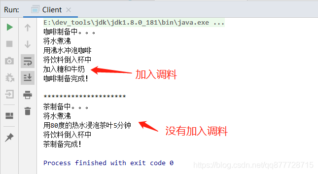

# 一.模板模式

**模板模式（Template Pattern）也叫模板方法模式，指在抽象类中将业务逻辑划分为多个方法，通过模板方法中调用这些方法后，组成完整的业务处理流程。子类只需重写相关方法实现，即可实现同一流程的不同处理方式**

- 核心思想：定义一个抽象模板类，提供子类实现。

- 模式动机：许多业务有着相同的执行步骤，这些步骤中有许多是相同的代码实现，部分步骤是不同代码的实现。<font color=#ff00a>此时就可以在抽象类中定义所有的步骤，提供程序的方法主入口。由抽象类来实现通用的步骤方法，抽象类无法实现的具体步骤交给子类来实现。</font>


# 二.模板模式适用场景

1. 有多个子类共有的方法，且逻辑相同。
2. 用于流程相同、相似的业务处理，可重写模板方法提供不同的处理方式


# 三.模板模式角色

- **抽象模板角色(Abstract Template)**：抽象模板类，定义了一个用于<font color=#ff00a>控制执行流程的具体模板方法、公共实现方法</font> 以及 一些子类必须实现的抽象方法。
- **具体模板角色(Concrete Template)**：实现抽象模板类中的抽象方法，<font color=#ff00a>子类可以编写自己独有的实现逻辑，但是执行流程受抽象模板类控制</font>。


# 四.模板模式的实现方式

## 案例1：验证接口请求参数

接口处理，无一例外都需要遵守相同的处理步骤：

1. 验证来源是否合法
2. 解密请求的报文
3. 进行对应的业务处理
4. 将业务处理返回的对象字符串进行加密
5. 字符串进行加密后，再进加签
6. 最后再返回给调用方加签后的结果

**抽象模板角色(Abstract Template)**

```java
/**
 * 抽象角色类
 */
public abstract class AbstractTemplate {
    /**
     * 入口方法
     *
     * @param str
     * @return
     */
    public final String handle(String str) {
        //验证签名
        if (!this.step1(str)) {
            return "验签失败";
        }

        //解密
        String plainText = this.step2(str);
        
        //将解密后的报文交给子类去处理，并且得到子类返回的对象
        String childResStr = this.busiHandle(plainText);

        //加密子类返回的内容
        String cipherText = this.step4(childResStr);

        //密文再加上签名
        String resStr = this.step5(cipherText);

        //最后返回给调用方
        return resStr;
    }

    /**
     * 对报文进行验证签名，检查来源是否合法
     *
     * @param str
     * @return
     */
    private boolean step1(String str) {
        //省略具体实现...
        System.out.println("对请求对象:[" + str + "]校验来源是否合法!");
        return true;
    }

    /**
     * 对报文解密，得到明文报文
     *
     * @param str
     * @return
     */
    private String step2(String str) {
        //省略具体实现...
        System.out.println("对请求对象:[" + str + "]进行解密!");
        String plainText = "明文" + str;
        return plainText;
    }

    /**
     * 对解密后的报文，进行业务处理，得到返回报文
     *
     * @param str
     * @return
     */
    protected abstract String busiHandle(String str);

    /**
     * 对要返回出去的报文进行加密，得到密文
     *
     * @param str
     * @return
     */
    private String step4(String str) {
        //省略具体实现...
        System.out.println("对返回对象:[" + str + "]进行加密!");
        return str;
    }

    /**
     * 对密文进行加签，得到含有签名的密文
     *
     * @param str
     * @return
     */
    private String step5(String str) {
        //省略具体实现...
        System.out.println("对返回对象:[" + str + "]进行加签名!");
        return str;
    }
}
```

**具体模板角色(Concrete Template)**

```java
/**
 * 遵守AbstractTemplate的其中一种业务实现
 */
public class BusinessA extends AbstractTemplate {
    @Override
    protected String busiHandle(String str) {
        //我只需要做好关于BusinessA的实现就行了，其他相关的都是由父类去统筹
        //省略具体实现...
        String resStr = "BusinessA";
        System.out.println("关于BusinessA的实现，入参内容:[" + str + "]出参内容：[" + resStr + "]");
        return resStr;
    }
}
```

```java
/**
 * 遵守AbstractTemplate的其中一种业务实现
 */
public class BusinessB extends AbstractTemplate {
    @Override
    protected String busiHandle(String str) {
        //我只需要做好关于BusinessA的实现就行了，其他相关的都是由父类去统筹
        //省略具体实现...
        String resStr = "BusinessB";
        System.out.println("关于BusinessB的实现，入参内容:[" + str + "]出参内容：[" + resStr + "]");
        return resStr;
    }
}
```

**调用端**

```java
public class Client {
    public static void main(String[] args) {
        String str1 = "业务1";
        AbstractTemplate at1 = new BusinessA();
        at1.handle(str1);

        System.out.println("------------------------------");

        String str2 = "业务2";
        AbstractTemplate at2 = new BusinessB();
        at2.handle(str2);
    }
}
```


执行结果


## 案例2：制作饮料

**抽象模板角色(Abstract Template)**

什么是钩子方法呢？

- 钩子方法的主要目的是用来**控制流程执行顺序**，**返回值的返回值（如 boolean、int 等），钩子方法不是必须的**，可以根据实际业务场景确认是否需要

```java
/**
 * 抽象角色类
 */
public abstract class AbstractRereshBaverage {
    /**
     * 制备饮料的模板方法-封装了所有子类共同遵守的算法骨架
     */
    public final void prepreBvergeTemplage(){
        //步骤一 将水煮沸
        boilWater();
        //步骤二 炮制饮料
        brew();
        //步骤三 将饮料倒入杯中
        pourInCup();
        //步骤四 询问用户是否加入调料
        if(isCustomerWantsCondments()) {
        	//步骤五 加入调味料
            addCondiments();
        }
    }
    /**
     * 钩子函数，提供一个默认或空的实现-子类可以自行决定是否挂钩以及如何挂钩
     * 询问用户是否加入调料
     * @return true 默认允许加入调料
     */
    protected boolean isCustomerWantsCondments() {
    	return true;
    }

    /**
     * 基本方法，将水煮沸 这对所有子类而言是一个共同的行为，所以声明为private,无需向子类开放
     */
    private void boilWater(){
        System.out.println("将水煮沸");
    }

    /**
     * 抽象的基本方法 泡制饮料
     * 在算法框架中并不知道具体实现是什么样子的，所以做成了抽象方法，并且由于我们需要在子类中可见，便于复写而提供具体的实现所以将
     * 权限设置为protected
     */
    protected abstract void brew();

    /**
     * 基本方法，将饮料倒入杯中 这对所有子类而言是一个共同的行为，所以声明为private,无需向子类开放
     */
    private void pourInCup(){
        System.out.println("将饮料倒入杯中");
    }
    
    /**
     * 加入调味料，需要加什么让子类去实现
     */
    protected abstract void addCondiments();
}
```

**具体模板角色(Concrete Template)**

```java
/**
 * 咖啡
 */
class Coffee extends AbstractRereshBaverage {
    @Override
    protected void brew() {
        System.out.println("用沸水冲泡咖啡");
    }
    //加入调味料
    @Override
    protected void addCondiments() {
        System.out.println("加入糖和牛奶");
    }
}
```

```java
/**
 * 茶
 */
public class Tea extends AbstractRereshBaverage {
    @Override
    protected void brew() {
        System.out.println("用80度的热水浸泡茶叶5分钟");
    }
    
    /**
     * 子类通过重写的形式选择挂载钩子函数,false表示不允许加入调料,即:不调用addCondiments方法
     */
    @Override
    protected boolean isCustomerWantsCondments() {
    	return false;
    }
    @Override
    protected void addCondiments() {
        System.out.println("加入柠檬");
    }
}
```

**调用端**

```java
public class Client {
	public static void main(String[] args) {
        System.out.println("咖啡制备中。。。");
        AbstractRereshBaverage coffee = new Coffee();
        coffee.prepreBvergeTemplage();
        System.out.println("咖啡制备完成！ ");


        //必须用父类引用子类对象，为什么？
        System.out.println("\n*********************");
        System.out.println("茶制备中。。。");
        AbstractRereshBaverage tea = new Tea();
        tea.prepreBvergeTemplage();
        System.out.println("茶制备完成！");
    }
}
```


执行结果




## 案例3：JDBC模板方法实现

创建一个**模板类JdbcTemplate**，封装所有的JDBC操作。以查询为例，每次查询的表不一样，返回的数据结构也就不一样。我们针对不同的数据，都要将其封装成不同的实体类。而每个实体类的封装逻辑是不一样的，有的有日期类型数据有的没有。但是封装数据之前和之后的处理流程是不变的，因此可以使用模板模式来进行设计。

**封装实例类的接口RowMapper**

```java
/**
 * 封装实例类的接口RowMapper
 * @param <T> 当前结果的类型
 */
public interface RowMapper<T> {
	/**
	 *
	 * @param rs 结果集
	 * @param rowNum 结果的行号
	 * @return
	 * @throws Exception
	 */
	T mapRow(ResultSet rs,int rowNum) throws Exception;
}
```

**抽象模板角色(Abstract Template)**

```java
public abstract class JdbcTemplate<T> {
	/**
	 * 1.四个常量 driver 驱动 url 连接地址 username数据库登录名 password 密码
	 */
	private static final String DRIVER = "com.mysql.jdbc.Driver";
	private static final String URL = "jdbc:mysql://127.0.0.1:3306/test?characterEncoding=utf-8";
	private static final String USERNAME = "root";
	private static final String PASSWOED = "root";

	// 2.类初始化时加载驱动类
	static {
		try {
			Class.forName(DRIVER);
		} catch (ClassNotFoundException e) {
			e.printStackTrace();
		}
	}

	/**
	 * 执行增、删、改语句,返回影响行数
	 * 模板方法sql="delete  from user where id=?";
	 * @param sql  sql语句
	 * @param params sql参数
	 * @return 影响行数
	 */
	public final int executeUpdate(String sql,Object... params){
		//影响的行数
		int result = 0;
		//连接
		Connection conn = null;
		//语句集
		PreparedStatement pstm = null;
		try {
			//获取连接
			 conn = this.getConnection();
			//创建语句集(用connection对象获取preparedStatement预编译执行对象)
			 pstm = conn.prepareStatement(sql);
			//执行语句,设置参数
			 result = this.executeUpdate(pstm,params);
			//返回结果
			return result;
		} catch (Exception e) {
			e.printStackTrace();
		} finally {
			//关闭语句集
			this.closeStatement(pstm);
			//关闭连接
			this.closeConnection(conn);
		}
		return 0;
	}


	/**
	 * 执行查询语句
	 * 模板方法sql="select * from user where id=?";
	 * @param sql sql语句
	 * @param rowMapper
	 * @param params sql参数
	 * @return 多个对象
	 */
	public final List<T> executeQuery(String sql,RowMapper<T> rowMapper,Object... params){
		//影响的行数
		List<T>  result = null;
		//连接
		Connection conn = null;
		//语句集
		PreparedStatement pstm = null;
		//结果集
		ResultSet rs = null;

		try {
			//获取连接
			 conn = this.getConnection();
			//创建语句集(用connection对象获取preparedStatement预编译执行对象)
			 pstm = conn.prepareStatement(sql);
			//执行语句,设置参数
			 rs = this.executeQuery(pstm,params);
			//处理结果集
			result  = this.parseResultRet(rs,rowMapper);
			//返回结果
			return result;
		} catch (Exception e) {
			e.printStackTrace();
		} finally {
			//关闭结果集
			this.closeResultSet(rs);
			//关闭语句集
			this.closeStatement(pstm);
			//关闭连接
			this.closeConnection(conn);
		}

		return result;
	}


	/**
	 * 解析结果集
	 * @param rs 结果集
	 * @param rowMapper
	 * @return
	 * @throws Exception
	 */
	private List<T> parseResultRet(ResultSet rs, RowMapper<T> rowMapper)throws Exception {
		List<T> result = new ArrayList<>();
		int rowNum = 1;
		while(rs.next()) {
			result.add(rowMapper.mapRow(rs, rowNum));
		}
		return result;
	}

	/**
	 * 设置sql条件
	 * @param pstm 预编译语句集
	 * @param params sql参数
	 */
	private void setStatementParams (PreparedStatement pstm, Object... params) throws SQLException {
		// 标识“？”占位符的位置，默认为1，表示第一个？
		for(int i=0; i<params.length; i++) {
			pstm.setObject(i+1, params[i]);
		}
	}

	/**
	 * 执行查询,返回结果集
	 * @param pstm 预编译语句集
	 * @param params sql参数
	 * @return 结果集
	 * @throws Exception
	 */
	protected ResultSet executeQuery(PreparedStatement pstm, Object... params) throws Exception {
		//设置sql条件
		setStatementParams(pstm,params);

		return pstm.executeQuery();
	}

	/**
	 * 执行更新操作,返回影响行数
	 * @param pstm 预编译语句集
	 * @param params sql参数
	 * @return 影响行数
	 * @throws Exception
	 */
	protected int executeUpdate(PreparedStatement pstm, Object... params) throws Exception {
		//设置sql条件
		setStatementParams(pstm,params);

		return pstm.executeUpdate();
	}


	/**
	 * 用DriverManager获取数据库连接对象Connection
	 * @return
	 */
	protected Connection  getConnection() {
		Connection conn = null;
		try {
			conn = DriverManager.getConnection(URL, USERNAME, PASSWOED);
		} catch (Exception e) {
			e.printStackTrace();
		}
		return conn;
	}


	/**
	 * 关闭连接
	 * @param conn 连接
	 * @throws SQLException
	 */
	protected void closeConnection(Connection conn)  {
		if(conn != null) {
			try {
				conn.close();
			} catch (SQLException e) {
				e.printStackTrace();
			}
		}
	}

	/**
	 * 关闭PreparedStatement
	 * @param pstm 语句集
	 * @throws SQLException
	 */
	protected void closeStatement(PreparedStatement pstm){
		if(pstm != null) {
			try {
				pstm.close();
			} catch (SQLException e) {
				e.printStackTrace();
			}
		}

	}
	/**
	 * 关闭结果集
	 * @param rs 结果集
	 * @throws SQLException
	 */
	protected void closeResultSet(ResultSet rs)  {
		if(rs != null) {
			try {
				rs.close();
			} catch (SQLException e) {
				e.printStackTrace();
			}
		}
	}
}
```

**实体类**

对应数据表test.sys_user

```java
public class SysUser {

	private Integer id; //Long String UUID就是一个String的主键
	private String username;
	private String password;
	
	public SysUser() {
		super();
	}
	public SysUser(Integer id, String username, String password) {
		super();
		this.id = id;
		this.username = username;
		this.password = password;
	}
	public Integer getId() {
		return id;
	}
	public void setId(Integer id) {
		this.id = id;
	}
	public String getUsername() {
		return username;
	}
	public void setUsername(String username) {
		this.username = username;
	}
	public String getPassword() {
		return password;
	}
	public void setPassword(String password) {
		this.password = password;
	}
	@Override
	public String toString() {
		return "SysUser [id=" + id + ", username=" + username + ", password=" + password + "]";
	}
}
```

**具体模板角色(Concrete Template)-Dao类**

```java
public class UserDao extends JdbcTemplate<SysUser> {

	/**
	 * 查询多个
	 * @return
	 */
	public List<SysUser> selectAllById(Integer id){
		String sql  = "select * from sys_user where id >= ?";
		return super.executeQuery(sql, new SysUserRowMapper() , new Object[] {id});
	}

	/**
	 * 新增用户
	 * @param username
	 * @param password
	 * @return
	 */
	public int add(String username,String password){
		String sql  = "insert into  sys_user(username,password) values(?,?)";
		return super.executeUpdate(sql,new Object[] {username,password});
	}

	/**
	 * 根据id修改密码
	 * @param id
	 * @return
	 */
	public int updatePasswordById(Integer id,String password){
		String sql  = "update sys_user set password = ? where id = ?";
		return super.executeUpdate(sql,new Object[] {password,id});
	}

	/**
	 * 根据id删除
	 * @param id
	 * @return
	 */
	public int deleteById(Integer id){
		String sql  = "delete from sys_user  where id = ?";
		return super.executeUpdate(sql,new Object[] {id});
	}
}

/**
 * 查询结果的封装
 */
class SysUserRowMapper implements RowMapper<SysUser>{
	@Override
	public SysUser mapRow(ResultSet rs, int rowNum) throws Exception {
		SysUser user = new SysUser();
		user.setId(rs.getInt("id"));
		user.setUsername(rs.getString("username"));
		user.setPassword(rs.getString("password"));
		return user;
	}
}
```

**调用端**

```jav
public class Client {
    public static void main(String[] args) {
        UserDao dao = new UserDao();
        //查询
        System.out.println("查询结果1:");
        List<SysUser> list1 = dao.selectAllById(1);
        for (SysUser sysUser : list1) {
            System.out.println(sysUser);
        }

        //新增
        int result = dao.add("addUser111","addUser111");
        System.out.println("新增结果:"+result);

        //修改
        result = dao.updatePasswordById(1,"666666");
        System.out.println("修改结果:"+result);


        //查询
        System.out.println("查询结果1:");
        List<SysUser> list2 = dao.selectAllById(1);
        for (SysUser sysUser : list2) {
            System.out.println(sysUser);
        }

        //删除
        result = dao.deleteById(10);
        System.out.println("删除结果:"+result);

        //查询
        System.out.println("查询结果3:");
        List<SysUser> list3 = dao.selectAllById(1);
        for (SysUser sysUser : list3) {
            System.out.println(sysUser);
        }
    }
}
```


执行结果


# 五.总结

## 注意事项

1. 为了防止恶意操作，·一般模版方法都加上 final 关键字，不允许被子类被重写`。
2. 抽象模版中的**基本方法尽量设计为 protected 类型**，公共实现方法都用符合迪米特法则。

3. 抽象模版类**不想被子类重写的方法可以用final、或者private修饰**


# 1.模板模式的优缺点

**优点：**

1. 封装不变部分，扩展可变部分,提高代码的复用性。
2. 提取公共代码，便于维护。
3. 行为由父类控制，子类实现。

**缺点：**

1. 每一个不同的实现都需要一个子类来实现，导致类的个数增加，使得系统更加庞大。
2. 继承关系自身缺点，如果父类添加新的抽象方法，所有子类都要改一遍。

## 2.模板模式在开发中的应用场景

- 数据库访问的封装

- Junit单元测试

- servlet中的doGet和doPost方法

  > Servlet是Java中很经典的模板使用，HttpService类提供了一个service()方法，这个方法调用七个doXXX方法中的一个或几个，完成对客户端调用的响应。这些do方法需要由HttpServlet的具体则由子类提供。

- Hibernate中的模板程序

- Spring中的JdbcTemplate,HibernateTemplate,RedisTemplate等
  