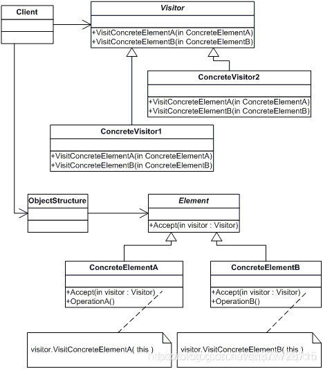
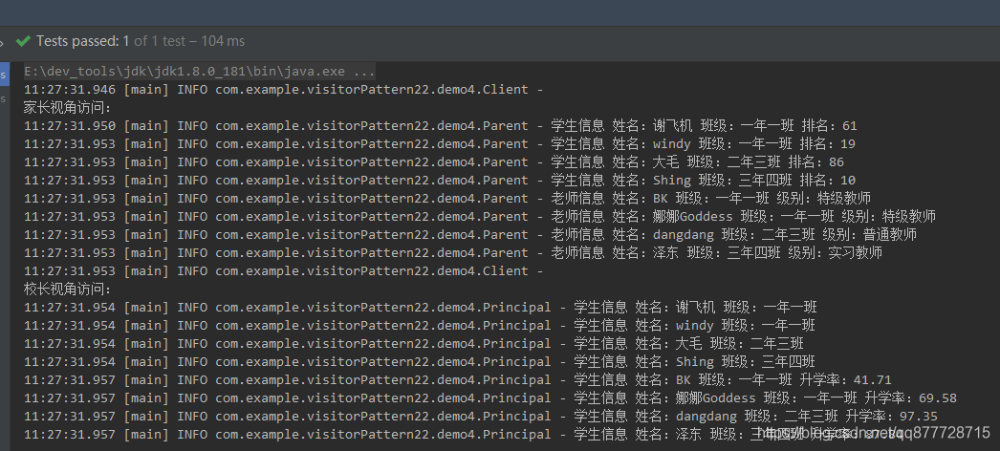
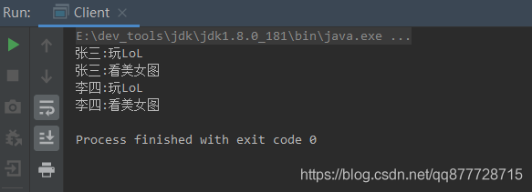

# 一.访问者模式

> 访问者模式也可以说是所有设计模式中最难的一种设计模式了，**当然我们平常也很少会用到它**。设计模式的作者是这么评价访问者模式的：大多情况下，你并不需要使用访问者模式，但是一旦需要使用它时，那就真的需要使用了。

**访问者模式(Vistor Pattern)是用于数据结构与数据操作分离的一种设计模式。是指封装一些作用于某种数据结构中的各种元素的操作，它可以在不改变数据结构的前提下定义作用于这些元素的新操作。**

- 模式动机：对于存储在一个集合中的对象，他们可能具有不同的类型(即使有一个公共的接口)，对于该集合中的对象，可以接受一类称为访问者的对象来访问，不同的访问者其访问方式也有所不同。
- 核心思想：将**数据结构与数据操作(访问者角色)分离**。使得对元素的操作具备优秀的扩展性，我们可以**通过扩展不同的数据操作类型(访问者角色)实现对相同元素的不同操作**。


# 二.访问者模式适用场景

1. 数据结构稳定，但是作用于数据结构上的操作经常变化(如下面示例中如果菜谱经常发生变化，那么每次变化都要修改访问者对象)。
2. 需要对不同数据类型(元素)进行操作，而不使用分支判断具体类型的场景。


# 三.访问者模式角色

- **抽象访问者角色(AbstractVisitor)**：接口或者抽象类。声明了一个或者多个具体访问者角色必须实现的方法

  > 定义对具体元素的visit方法，参数就是具体元素，理论上来说方法数等于元素个数 (如示例中的ICustomerVisitor)。
  >
  > - 访问者模式适用于元素结构比较稳定的场景。 如果元素不稳定经常变化的话，那么访问者是要一直修改的，不适合使用访问者模式。

- **具体访问者(ConcreteVistor)**：实现抽象访问者角色所声明的接口，也就是抽象访问者所声明的各个具体访问元素操作。如示例中的CustomerAVisitor。

- **抽象元素角色(AbstractElement)**：接口或者抽象类。声明一个接受方法，接收一个访问者对象作为一个参数 。

  > 如示例中的IRecipe， 定义了一个接受访问者访问的方法accept()。接受不同的访问者对象，然后在内部将自己转发到访问者对象visit()方法内。

- **具体元素(ConcreteElement)**：实现了抽象元素角色所规定的接受操作。

  > 提供接受访问者访问的具体实现，通常都是采用visitor.visit()来实现 (如示例中的Cabbage和Meat)。

- **结构对象角色(ObjectStruture)**：用来维护元素，并提供一个方法来接受访问者访问所有的元素 (如示例中的RestaurantMenu)。

示例图如下:




# 四.访问者模式的实现方式

## 案例1:模拟校园家长和校长的关注

模拟校园中有学⽣和⽼师两种身份的⽤户，那么对于家⻓和校⻓关⼼的⻆度来看，他们的视⻆是不同的。

- 家⻓更关⼼孩⼦的成绩和⽼师的能⼒，
- 校⻓更关⼼⽼师所在班级学⽣的⼈数和升学率{ 此处模拟的 }。

那么这样学⽣和⽼师就是⼀个固定信息的内容，⽽想让不同视⻆的⽤户获取关⼼的信息，就⽐较适合使⽤访问者模式来实现，从⽽让实体与业务解耦，增强扩展性。但观察者模式的整体类结构相对复杂，需要梳理清楚再开发

1. 建⽴⽤户抽象类和抽象访问⽅法，再由不同的⽤户实现；⽼师和学⽣。
2. 建⽴访问者接⼝，⽤于不同⼈员的访问操作；校⻓和家⻓。
3. 最终是对数据的看板建设，⽤于实现不同视⻆的访问结果输出。

**抽象元素角色(AbstractElement)**

```java
/**
 * 基础用户信息
 */
public abstract class User {
    /**
     *  姓名
     */
    public String name;
    /**
     * 身份；重点班、普通班 | 特级教师、普通教师、实习教师
     */
    public String identity;
    /**
     * 班级
     */
    public String clazz;     

    public User(String name, String identity, String clazz) {
        this.name = name;
        this.identity = identity;
        this.clazz = clazz;
    }

    /**
     * 核心访问方法
     * @param visitor 访问者
     */
    public abstract void accept(Visitor visitor);
}
```

- 基础信息包括；姓名、身份、班级，也可以是⼀个业务⽤户属性类。
- 定义抽象核⼼⽅法， abstract void accept(Visitor visitor) ，这个⽅法是为了让后续的⽤户具体实现者都能提供出⼀个访问⽅法，供外部使⽤

**抽象访问者角色(AbstractVisitor)**

```java
/**
 * 抽象访问者
 */
public interface Visitor {
    /**
     *  访问学生信息
     * @param student
     */
    void visit(Student student);
    /**
     *  访问老师信息
     * @param teacher
     */
    void visit(Teacher teacher);
}
```

- 访问的接⼝⽐较简单，相同的⽅法名称，不同的⼊参⽤户类型。
- 让具体的访问者类，在实现时可以关注每⼀种⽤户类型的具体访问数据对象，例如；升学率和排名。

**具体元素(ConcreteElement)-老师和学生**

```java
/**
 * 老师
 */

public class Teacher extends User {

    /**
     * @param name 名称
     * @param identity 身份
     * @param clazz 班级
     */
    public Teacher(String name, String identity, String clazz) {
        super(name, identity, clazz);
    }

    /**
     * 访问操作
     * @param visitor 访问者
     */
    public void accept(Visitor visitor) {
        visitor.visit(this);
    }

    /**
     * 升本率
     */
    public double entranceRatio() {
        return BigDecimal.valueOf(Math.random() * 100).setScale(2, BigDecimal.ROUND_HALF_UP).doubleValue();
    }
}
```

```java
/**
 * 学生
 */
public class Student extends User {
    /**
     * @param name 名称
     * @param identity 身份
     * @param clazz 班级
     */
    public Student(String name, String identity, String clazz) {
        super(name, identity, clazz);
    }

    /**
     * 访问操作
     * @param visitor 访问者
     */
    public void accept(Visitor visitor) {
        visitor.visit(this);
    }

    /**
     * 成绩
     * @return
     */
    public int ranking() {
        return (int) (Math.random() * 100);
    }
}
```

- 
  这⾥实现了⽼师和学⽣类，都提供了⽗类的构造函数。
- 在 accept ⽅法中，提供了本地对象的访问；visitor.visit(this)，这块需要加深理解。
- ⽼师和学⽣类⼜都单独提供了各⾃的特性⽅法；升本率( entranceRatio )、排名( ranking )，类似这样的⽅法可以按照业务需求进⾏扩展。

**具体访问者(ConcreteVistor)-校长和家长**

```java
/**
 * 家长-关注⾃⼰家孩⼦的排名，⽼师的班级和教学⽔平
 */
public class Parent implements Visitor {
    private Logger logger = LoggerFactory.getLogger(Parent.class);
 
    /**
     * 访问学生
     * @param student
     */
    public void visit(Student student) {
        logger.info("学生信息 姓名：{} 班级：{} 排名：{}", student.name, student.clazz, student.ranking());
    }
    
    /**
     * 访问老师
     * @param teacher
     */
    public void visit(Teacher teacher) {
        logger.info("老师信息 姓名：{} 班级：{} 级别：{}", teacher.name, teacher.clazz, teacher.identity);
    }
}
```

```java
/**
 * 校长-关注学⽣的名称和班级，⽼师对这个班级的升学率
 */
public class Principal implements Visitor {
    private Logger logger = LoggerFactory.getLogger(Principal.class);

    /**
     * 访问学生
     * @param student
     */
    public void visit(Student student) {
        logger.info("学生信息 姓名：{} 班级：{}", student.name, student.clazz);
    }

    /**
     * 访问老师
     * @param teacher
     */
    public void visit(Teacher teacher) {
        logger.info("学生信息 姓名：{} 班级：{} 升学率：{}", teacher.name, teacher.clazz, teacher.entranceRatio());
    }
}
```


以上是两个具体的访问者实现类，他们都有⾃⼰的视⻆需求。

- 校⻓关注；学⽣的名称和班级，⽼师对这个班级的升学率
- 家⻓关注；⾃⼰家孩⼦的排名，⽼师的班级和教学⽔平


**结构对象角色(ObjectStruture)**

- 最后我们还需要定义一个结构对象角色，**提供一个的接口并允许该访问者进行访问**，它可以对这些角色进行增加、修改或删除等操作和遍历。

```java
/**
 * 数据看版
 */
public class DataView {
    /**
     * 具体元素
     */
    List<User> userList = new ArrayList<User>();

    public DataView() {
        userList.add(new Student("谢飞机", "重点班", "一年一班"));
        userList.add(new Student("windy", "重点班", "一年一班"));
        userList.add(new Student("大毛", "普通班", "二年三班"));
        userList.add(new Student("Shing", "普通班", "三年四班"));
        userList.add(new Teacher("BK", "特级教师", "一年一班"));
        userList.add(new Teacher("娜娜Goddess", "特级教师", "一年一班"));
        userList.add(new Teacher("dangdang", "普通教师", "二年三班"));
        userList.add(new Teacher("泽东", "实习教师", "三年四班"));
    }

    /**
     * 展示
     */
    public void show(Visitor visitor) {
        for (User user : userList) {
            user.accept(visitor);
        }
    }
}
```

**客户类**

```java
public class Client {
    private Logger logger = LoggerFactory.getLogger(Client.class);
    @Test
    public void test() {
        DataView dataView = new DataView();

        logger.info("\r\n家长视角访问：");
        dataView.show(new Parent());     // 家长

        logger.info("\r\n校长视角访问：");
        dataView.show(new Principal());  // 校长
    }
}
```


执行结果




## 案例2:模拟电脑的访问

- 图书馆有一台电脑，有两个账户，其中一个是管理员的账户，拥有所有权限，但是设置了密码；另一个账户是不需要密码，但是只能玩游戏和看图片。张三和李四先后使用了这台电脑，那么他们就可以当作是访问者。
  - 那么我们便可以根据这里例子来使用访问者模式进行开发，首先定义一个抽象访问者，拥有玩游戏和看图片的方法；然后再定义一个抽象元素电脑，接受这个请求。

**抽象元素角色(AbstractElement)**

```java
/**
 * 抽象元素-电脑
 */
public interface IComputer {
   void accept(IVisitor visitor);
}
```

**抽象访问者角色(AbstractVisitor)**

```java
/**
 * 抽象访问者
 */
public interface IVisitor {
   void visit(Games games);
   void visit(Photos photos);
}
```

**具体元素(ConcreteElement)**

```java
/**
 * 具体元素-游戏
 */
class Games implements IComputer {
   //接受不同的访问者对象，然后在内部将自己转发到访问者对象visit()方法内
   @Override
   public void accept(IVisitor visitor) {
   	visitor.visit(this);
   }

   public void play() {
   	System.out.println("玩LoL");
   }
}
```

```java
/**
 *具体元素-看照片
 */
class Photos implements IComputer {
	//接受不同的访问者对象，然后在内部将自己转发到访问者对象visit()方法内
   @Override
   public void accept(IVisitor visitor) {
   	visitor.visit(this);
   }

   public void watch() {
   	System.out.println("看美女图");
   }
}
```

**具体访问者(ConcreteVistor)**

```java
/**
 * 具体访问者-张三
 */
public class ZhangSanVisitor implements IVisitor {
    @Override
    public void visit(Games games) {
        System.out.print("张三:");
        games.play();
    }

    @Override
    public void visit(Photos photos) {
        System.out.print("张三:");
        photos.watch();
    }
}
```

```java
/**
 * 具体访问者-李四
 */
public class LiSiVisitor implements IVisitor {
    @Override
    public void visit(Games games) {
        System.out.print("李四:");
        games.play();
    }

    @Override
    public void visit(Photos photos) {
        System.out.print("李四:");
        photos.watch();
    }
}
```

- 
  定义好该抽象类之后，我们需要设计不同的访问者对元素进行不同的处理。并且需要设计具体元素类实现抽象元素的方法。

**结构对象角色(ObjectStruture)**

- 最后我们还需要定义一个结构对象角色，**提供一个的接口并允许该访问者进行访问**，它可以对这些角色进行增加、修改或删除等操作和遍历。

```java
/**
 * 结构对象角色
 */
public class ObjectStructure {
	/**
	 * 保存具体元素
	 */
	private List<IComputer> computers = new ArrayList<>();


	/**
	 * 供访问者进行访问元素的接口
	 * @param visitor 访问者
	 */
	public void action(IVisitor visitor) {
		computers.forEach(c -> {
			c.accept(visitor);
		});
	}

	/**
	 * 增加具体元素
	 * @param computer 元素
	 */
	public void add(IComputer computer) {
		computers.add(computer);
	}
}
```

**客户类**

```java
public class Client {
    public static void main(String[] args) {
        // 创建一个结构对象
        ObjectStructure os = new ObjectStructure();
        // 给结构增加一个节点
        os.add(new Games());
        // 给结构增加一个节点
        os.add(new Photos());

        // 创建一个访问者-张三
        IVisitor zhangsan = new ZhangSanVisitor();
        os.action(zhangsan);


        // 创建一个访问者-李四
        IVisitor list = new LiSiVisitor();
        os.action(list);
    }
}
```


执行结果




# 五.总结

## 1.访问者模式的优缺点

**优点：**

1. <font color=#ff00a>解耦了数据结构和数据操作</font>，使得操作集合可以独立变化。

2. 访问者角色非常易于扩展。

   > 可以在不修改对象结构中的元素的情况下，为对象结构中的元素添加新的功能；

3. 每种角色各司其职，符合单一职责原则。

   > 通过访问者将无关的行为分离,，使职责单一

**缺点：**

1. 增加元素类型困难，<font color=#ff00a>如果元素类型变化就需要修改访问者角色代码</font>，违反了开闭原则，也不利于维护。

   > 对象结构变化困难，若对象结构发生了改变，访问者的接口和访问者的实现也都要发生相应的改变；

2. 违反了依赖倒置原则，依赖了具体类，没有依赖抽象。

   > 比如我们示例中的访问者接口，<font color=#ff00a>定义的方法依赖的是具体元素而不是抽象元素</font>。

3. 违反了迪米特原则，因为具体元素对访问者公布细节；


## 2.访问者模式在开发中的应用场景

- XML文档解析器设计
- 编译器的设计
- 复杂集合对象的处理
  