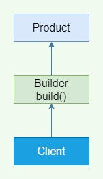
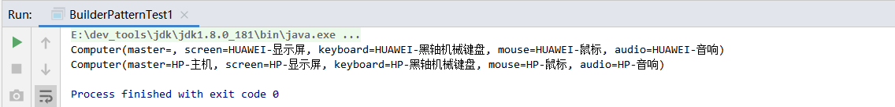
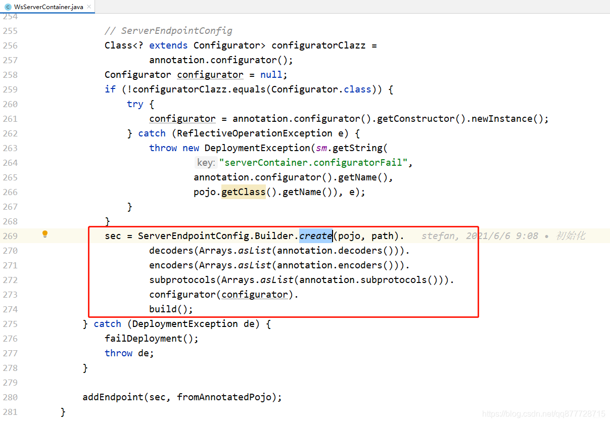
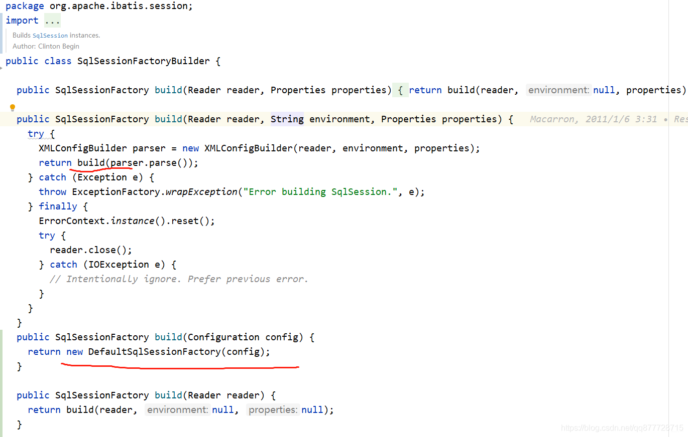
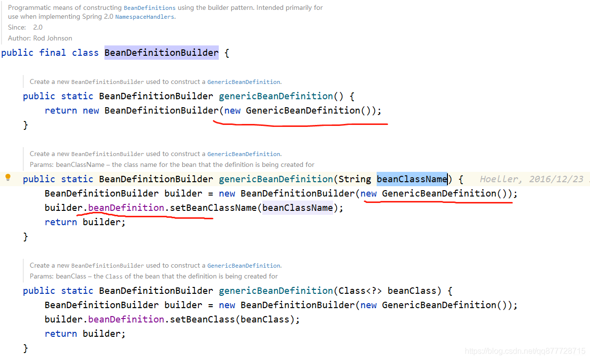
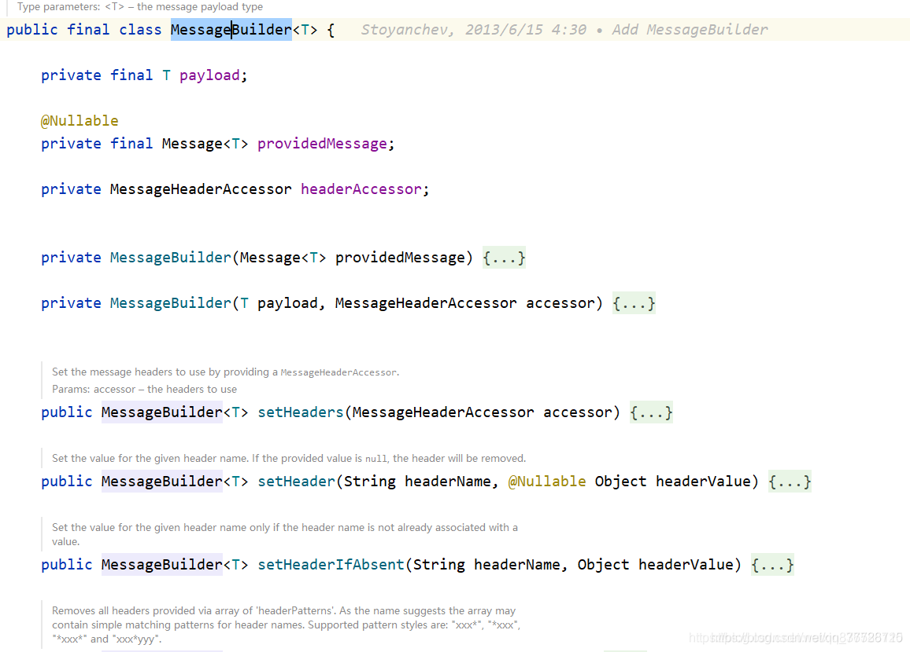
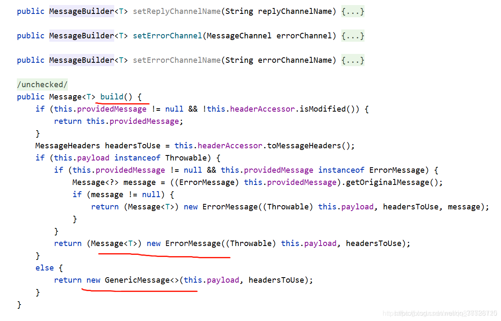

# 一.建造者模式

**生活中的场景**

- 去肯德基，汉堡、可乐、薯条、炸鸡翅等是不变的，而其组合是经常变化的，不同的组合而成了不同的”套餐“

- 计算机是由 CPU、主板、内存、硬盘、显卡、机箱、显示器、键盘、鼠标等部件组装而成的，不同组件会组成不同的电脑

- 游戏中的不同角色，其`性别、个性、能力、脸型、体型、服装、发型等特性都有所差异；

- 汽车中的方向盘、发动机、车架、轮胎等部件也多种多样；

- 每封电子邮件的发件人、收件人、主题、内容、附件等内容也各不相同。


> 以上所有这些产品都是由多个部件构成的，各个部件可以灵活选择，但其创建步骤都大同小异。这类产品的创建无法用前面介绍的工厂模式描述，只有建造者模式可以很好地描述该类产品的创建，在这种场景下我们可以通过建造者模式来实现

**建造者模式（Builder Pattern）也叫 “生成器模式”，”对象构建时非常复杂，且有很多步骤需要处理时，可以使用<font color=#ff00a> 多个简单的对象一步一步组装成这个复杂对象</font>。**

**建造模式的本质：**

1. 分离了对象子组件的<font color=#ff00a> 单独构造</font>(由Builder来负责)和<font color=#ff00a> 装配</font>(由Director负责)。 从而可以构造出复杂的对象。这个模式适用于：<font color=#ff00a> 某个对象的构建过程复杂的情况下使用</font>。
2. 由于实现了<font color=#ff00a> 构建和装配的解耦。不同的构建器，相同的装配</font>，也可以做出不同的对象； <font color=#ff00a> 相同的构建器，不同的装配顺序</font>也可以做出不同的对象。也就是**实现了构建逻辑、装配逻辑的解耦，实现了更好的复用**

# 二.建造者模式角色

建造者模式的设计中，主要有4个角色。

1. **产品(Product)**：一个具体的产品对象
2. **抽象建造者(Builder)**：建造者的抽象类，规范产品对象的各个组成部分的建造，一般由子类实现具体建造过程
3. **具体建造者(ConcreteBuilder)**：具体的建造者，根据不同的业务逻辑，具体到各个对象的各个组成部分的建造
4. **建造指挥者(Director)**：调用具体的建造者来创建各个对象的各个部分，然后根据不同组合封装起一个个方法供外界调用

**核心思想**

1. 将复杂对象的创建过程（比如设置属性值），交给构建者Builder去做。
2. 最后通过构建者的构建方法build()，真正去创建对象。
3. 构建方法里调用需要实例化的类的构造函数，并将构建者的属性值复制给该对象。复制前可以做一些参数校验和默认值赋值等操作。



# 三.建造者的代码实现

引入依赖
```
        <dependency>
            <groupId>org.projectlombok</groupId>
            <artifactId>lombok</artifactId>
            <version>1.18.16</version>
        </dependency>
```
## 1.案例a：组装电脑

无论组装一台什么电脑的电脑总是需要包含以下部件：

1. 需要一个主机

2. 需要一个显示器

3. 需要一个键盘

4. 需要一个鼠标

5. 需要音响等

   但每个部件都使用不同类型的牌子，如主机我用华硕的，显示器用微软的。。。。对于这个例子，我们就可以使用建造者模式组合成成一台电脑。

**所以，我们可以将生成器模式理解为，假设我们有一个对象需要建立，这个对象是由多个组件（Component）组合而成，每个组件的建立都比较复杂，但运用组件来建立所需的对象非常简单，可以使用建造者模式将构建复杂组件的步骤与运用组件构建对象分离**

### 1.1.产品(Product)

具体的产品-电脑

```java
@Getter
@Setter
@ToString
public class Computer {
    private String master;
    private String screen;
    private String keyboard;
    private String mouse;
    private String audio;
}
```

### 1.2.抽象建造者(Builder)

```java
//抽象建造者-电脑建造者
public  abstract class AbstractComputerBuilder {
    protected Computer computer;

    public Computer getComputer() {
        return computer;
    }
    
    //构造电脑
    public void buildComputer() {
        this.computer = new Computer();
    }
    
    //构造主机
    public abstract AbstractComputerBuilder buildMaster(String master);
    
    //构造显示器
    public abstract AbstractComputerBuilder buildScreen(String screen);
    
    //构造键盘
    public abstract AbstractComputerBuilder buildKeyboard(String keyBoard);
    
    //构造鼠标
    public abstract AbstractComputerBuilder buildMouse(String mouse);
    
    //构造音响
    public abstract AbstractComputerBuilder buildAudio(String audio);

}
```


### 1.3.具体建造者(ConcreteBuilder)

```java
//具体建造者-构建一台具体电脑
public  class SpecificComputerBuilder extends AbstractComputerBuilder {
    @Override
    public AbstractComputerBuilder buildMaster(String master) {
        this.computer.setMaster(master);
        return this;
    }

    @Override
    public AbstractComputerBuilder buildScreen(String screen) {
        this.computer.setScreen(screen);
        return this;
    }
    
    @Override
    public AbstractComputerBuilder buildKeyboard(String keyboard) {
        this.computer.setKeyboard(keyboard);
        return this;
    }
    
    @Override
    public AbstractComputerBuilder buildMouse(String mouse) {
        this.computer.setMouse(mouse);
        return this;
    }
    
    @Override
    public AbstractComputerBuilder buildAudio(String audio) {
        this.computer.setAudio(audio);
        return this;
    }

}
```


### 1.4.建造指挥者(Director)

**本例会将不同组合封装起一个个方法供外界调用，这也是一种最严格标准的写法，只适合于排列组合较少结果的产品。如果有很多种搭配，实例案例2的链式写法比较合适，直接由使用者自己来选择搭配。**

```java
public class Director {
    //电脑建造者
    private AbstractComputerBuilder computerBuilder;

    public void setComputerBuilder(AbstractComputerBuilder computerBuilder) {
        this.computerBuilder = computerBuilder;
    }
    
    public Computer getComputer() {
        return computerBuilder.getComputer();
    }
    
    /**
     * 产品构建与组装方法-构建华为电脑
     */
    public void constructHuaweiComputer() {
        //实例化Computer
        computerBuilder.buildComputer();
        //链式赋值
        computerBuilder.buildMaster("")
                .buildScreen("HUAWEI-显示屏")
                .buildKeyboard("HUAWEI-黑轴机械键盘")
                .buildMouse("HUAWEI-鼠标")
                .buildAudio("HUAWEI-音响");
    }
    
    /**
     * 产品构建与组装方法-构建华为电脑
     */
    public void constructHpComputer() {
        //实例化Computer
        computerBuilder.buildComputer();
        //链式赋值
        computerBuilder
                .buildMaster("HP-主机")
                .buildScreen("HP-显示屏")
                .buildKeyboard("HP-黑轴机械键盘")
                .buildMouse("HP-鼠标")
                .buildAudio("HP-音响");
    }

}
```


### 1.5.测试

```java
    public static void main(String[] args) {
        //建造指挥者
        Director director = new Director();

        //华为电脑构建者
        AbstractComputerBuilder computerBuilder = new SpecificComputerBuilder();
        //调用华为构造器
        director.setComputerBuilder(computerBuilder);

        //构造华为电脑
        director.constructHuaweiComputer();
        //获取电脑
        Computer huaweiPc = director.getComputer();
        System.out.println(huaweiPc);

        //构造惠普电脑
        director.constructHpComputer();
        //获取电脑
        Computer hpPc = director.getComputer();
        System.out.println(hpPc);
    }

```




## 2.案例b: 做蛋糕

假如有一个蛋糕Cake对象，蛋糕这个对象有一个必选属性size，还有一些可选属性apple，banana，orange，mango等，

- 必传属性代表用户必须要指定蛋糕的大小，非必传属性代表这些蛋糕要加哪些材料。
- 非必传属性组合可能特别多 并且 和必传属性间存在<font color=#ff00a> 依赖关系 或者 有先后顺序</font>，需要在构造蛋糕时需要<font color=#ff00a> 对属性进行校验</font>。

### 2.1.具体产品(Product)

```java
/**
 * 具体产品-蛋糕
 */
public class Cake {
    //蛋糕尺寸
    private int size;
    //加苹果
    private String apple;
    //加香蕉
    private String banana;
    //加橘子
    private String orange;
    //加芒果
    private String mango;

    /**
     * 静态方法，用于生成一个 Builder，这个不一定要有，不过写这个方法是一个很好的习惯，
     * 有些代码要求别人写 new User.UserBuilder().a()...build() 看上去就没那么好
     */
    public static CakeBuilder builder() {
        return new CakeBuilder();
    }

    // 只提供getter供外呼或者属性值,不提供setter供外呼修改
    public int getSize() {return size;}
    public void setSize(int size) {this.size = size;}

    public String getApple() {return apple;}
    public void setApple(String apple) { this.apple = apple;}

    public String getBanana() { return banana;}
    public void setBanana(String banana) { this.banana = banana; }

    public String getOrange() { return orange;  }
    public void setOrange(String orange) {this.orange = orange; }

    public String getMango() {return mango; }
    public void setMango(String mango) { this.mango = mango;}

    @Override
    public String toString() {
        return "Cake [size=" + size + ", apple=" + apple + ", banana=" + banana + ", orange=" + orange + ", mango=" + mango + "]";
    }
}


```


### 2.2.抽象建造者(Builder)

```java
/**
 * 抽象建造者
 */
public abstract class AbstractCakeBuilder {
    public abstract AbstractCakeBuilder size(int size);

    public abstract AbstractCakeBuilder apple(String apple);

    public abstract AbstractCakeBuilder orange(String orange);

    public abstract AbstractCakeBuilder banana(String banana);

    public abstract AbstractCakeBuilder mango(String mango);

    public abstract Cake build();
}

```


### 2.3.具体建造者(ConcreteBuilder)

CakeBuilder 继承自AbstractCakeBuilder，实现了构造蛋糕的相关操作

```java
/**
 * 外部类,专门用来与外界打交道
 * 核心是：先把所有的属性都设置给 CakeBuilder，然后 build() 方法的时候，将这些属性复制给实际产生的对象。
 */
public class CakeBuilder extends AbstractCakeBuilder {
    // 下面是和 Cake 一模一样的一堆属性
    //蛋糕尺寸
    private int size;
    //加苹果
    private String apple;
    //加香蕉
    private String banana;
    //加橘子
    private String orange;
    //加芒果
    private String mango;


    // 链式调用设置各个属性值，返回 this，即 CakeBuilder
    @Override
    public AbstractCakeBuilder size(int size) {
        this.size = size;
        return this;
    }

    @Override
    public AbstractCakeBuilder apple(String apple) {
        this.apple = apple;
        return this;
    }

    @Override
    public AbstractCakeBuilder orange(String orange) {
        this.orange = orange;
        return this;
    }

    @Override
    public AbstractCakeBuilder banana(String banana) {
        this.banana = banana;
        return this;
    }

    @Override
    public AbstractCakeBuilder mango(String mango) {
        this.mango = mango;
        return this;
    }

    /**
     * build() 方法负责将 CakeBuilder 中设置好的属性“复制”到 Cake 中。
     * 可以在 “复制” 之前对参数进行校验,检查参数之间的依赖关系是否正确
     */
    @Override
    public Cake build() {
        // 1. size 必传
        if (size <= 0) {
            throw new RuntimeException("请正确设置蛋糕的尺寸");
        }

        // 2.apple/banana/orange/mango非必传，但是具有依赖关系，即size >= 10 ，apple/banana/orange/mango 必须传
        if (size >= 10) {
            if (apple == null || banana == null || orange == null || mango == null) {
                throw new RuntimeException("大于等于10磅的蛋糕,apple、banana、orange、mango必须要加");
            }
        }

        Cake cake = new Cake();
        cake.setSize(this.size);
        cake.setApple(this.apple);
        cake.setBanana(this.banana);
        cake.setOrange(this.orange);
        cake.setMango(this.mango);
        return cake;
    }
}


```


### 2.4.建造指挥者(Director)

通过 Cake.builder().xxx().xxx().build()自由组装即可

```java
    public static void main(String[] args) {
        //链式编程
        Cake cake1 = Cake.builder()
                .size(10)
                .apple("apple")
                .orange("orange")
                .banana("banana")
                .mango("mango")
                .build();
        System.out.println(cake1);


        Cake cake2 = new CakeBuilder()
                .size(20)
                .apple("apple")
                .orange("orange")
                .banana("banana")
                .mango("mango")
                .build();
        System.out.println(cake2);
    }

```


测试结果


## 3.案例c：做蛋糕-简化版

```java

/**
 * 具体产品-蛋糕
 */
public class Cake {
    //蛋糕尺寸
    private int size;
    //加苹果
    private String apple;
    //加香蕉
    private String banana;
    //加橘子
    private String orange;
    //加芒果
    private String mango;

    /**
     * private,让外面无法直接创建,并且将Builder的值赋值给Cake
     * @param builder 蛋糕构造器
     */
    private Cake(CakeBuilder builder) {
        this.size = builder.size;
        this.apple = builder.apple;
        this.banana = builder.banana;
        this.orange = builder.orange;
        this.mango = builder.mango;
    }

    // 只提供getter供外呼或者属性值,不提供setter供外呼修改
    public int getSize() { return size; }
    public String getApple() { return apple; }
    public String getBanana() { return banana; }
    public String getOrange() { return orange; }
    public String getMango() { return mango; }

    /**
     * 静态方法，用于生成一个 Builder，这个不一定要有，不过写这个方法是一个很好的习惯，
     *      有些代码要求别人写 new User.UserBuilder().a()...build() 看上去就没那么好
     */
    public static CakeBuilder builder() {
        return new CakeBuilder();
    }

    @Override
    public String toString() {
        return "Cake [size=" + size + ", apple=" + apple + ", banana=" + banana + ", orange=" + orange + ", mango=" + mango + "]";
    }

    /**
     * 静态内部类,专门用来与外界打交道
     *  核心是：先把所有的属性都设置给 CakeBuilder，然后 build() 方法的时候，将这些属性复制给实际产生的对象。
     */
    public static class CakeBuilder  {
        // 下面是和 Cake 一模一样的一堆属性
        //蛋糕尺寸
        private int size;
        //加苹果
        private String apple;
        //加香蕉
        private String banana;
        //加橘子
        private String orange;
        //加芒果
        private String mango;


        // 链式调用设置各个属性值，返回 this，即 CakeBuilder
        public CakeBuilder size(int size) {
            this.size = size;
            return this;
        }

        public CakeBuilder apple(String apple) {
            this.apple = apple;
            return this;
        }

        public CakeBuilder orange(String orange) {
            this.orange = orange;
            return this;
        }

        public CakeBuilder banana(String banana) {
            this.banana = banana;
            return this;
        }

        public CakeBuilder mango(String mango) {
            this.mango = mango;
            return this;
        }

        /**
         * build() 方法负责将 CakeBuilder 中设置好的属性“复制”到 Cake 中。
         *  可以在 “复制” 之前对参数进行校验,检查参数之间的依赖关系是否正确
         */
        public Cake build() {
            // 1. size 必传
            if (size <= 0) {
                throw new RuntimeException("请正确设置蛋糕的尺寸");
            }

            // 2.apple/banana/orange/mango非必传，但是具有依赖关系，即size >= 10 ，apple/banana/orange/mango 必须传
            if (size >= 10) {
                if (apple == null || banana == null || orange == null || mango == null) {
                    throw new RuntimeException("大于等于10磅的蛋糕,apple、banana、orange、mango必须要加");
                }
            }
            return new Cake(this);
        }
    }

    public static void main(String[] args) {
        //链式编程
        Cake cake = Cake.builder()
                .size(10)
                .apple("apple")
                .orange("orange")
                .banana("banana")
                .mango("mango")
                .build();
        System.out.println(cake);
    }
}

```


## 4.注意事项

1. <font color=#ff00a> Builder可以是内部类，也可以是外部类</font>，视情况而定，一般情况是作为<font color=#ff00a> 具体产品的内部类</font>，这样产品类多了，不至于多出很多Builder类，让代码结构变得复杂。
2. 产品类的属性需要<font color=#ff00a> 复制一份到Builder</font>，并且要保持<font color=#ff00a> 同步更新</font>。
3. Builder中赋值方法需要<font color=#ff00a> 返回Builder本身</font>，达到<font color=#ff00a> 链式调用</font>的效果。
4. Builder的<font color=#ff00a> build()方法中实例化产品类，并且做一些必要的参数校验，非必填的参数校验也可以放Builder的赋值方法中</font>。
5. Product产品类的<font color=#ff00a> 构造函数设置成private的</font>，并且没有对外提供set方法，主要是为了<font color=#ff00a> 创建产品类只能通过Builder，并且创建出来的对象是不可修改的</font>。
6. Product产品的<font color=#ff00a> 构造函数的参数为Builder</font>，这样为了<font color=#ff00a> 方便将值复制给Product，也可以不用这样做</font>。

# 四.总结

## 1.建造者模式优缺点

**优点：**

1. 封装性好，创建和使用分离
2. 扩展性好，建造类之间独立，一定程度上实现了解耦

**缺点：**

1. 产生多余的Builder对象
2. 产品内部发生变化时，建造者都需要修改，成本较大

# 2.建造者模式和工厂模式区别

1. 建造者模式根据<font color=#ff00a> 不同的产品零件和顺序</font>可以创造出<font color=#ff00a> 不同的产品</font>，而工厂模式创建出来的产品都是<font color=#ff00a> 一样的</font>

   > **构建者模式是用来创建一种类型的复杂对象，通过设置不同的可选参数，“定制化”创建不同的对象。**

2. 建造者模式使用者需要知道这个产品有哪些零件组成，而工厂模式的使用者不需要知道，直接创建就行

3. 工厂模式是用来创建<font color=#ff00a> 不同但是相关类型的对象（继承同一父类或者接口的一组子类）</font>，由给定的参数来决定创建哪种类型的对象，一般这个创建过程也比较简单，如果复杂的话，可以工厂模式和构建者模式结合。


## 3.构建者模式在框架中的体现

### 3.1. JDK的StringBuilder、StringBuffer、StringJoiner

- JDK中StringBuilder其实就是用了构建者模式，append拼接字符串，最后toString生成一个String对象。

```java
StringBuilder sb = new StringBuilder();
sb .append("1").append("2").toString();
```


### 3.2.Tomcat中ServerEndpointConfig的构建



### 3.3.MyBatis中SqlSessionFactoryBuilder

SqlSessionFactoryBuilder中只有<font color=#ff00a> 多个build方法</font>，并且<font color=#ff00a> 参数直接从build中传入</font>，这就是灵活应用，必填项有多种情况，那就对外提供多个不同参数列表的build，外界一看build方法就知道怎么调用。



### 3.4.Spring中也大量用到构建者模式

1. 比如org.springframework.beans.factory.support.BeanDefinitionBuilder，BeanDefinition中存在多个属性，但是Spring没有在BeanDefinitionBuilder再复制一遍，而是直接new一个BeanDefinition给BeanDefinitionBuilder，后面设置属性时，也是直接设置给了BeanDefinition对象，这样做的好处是减少重复代码，灵活使用构建者模式。

   

2. 再比如org.springframework.messaging.support.MessageBuilder，这个构建者模式就用的比较中规中矩了：

   

   