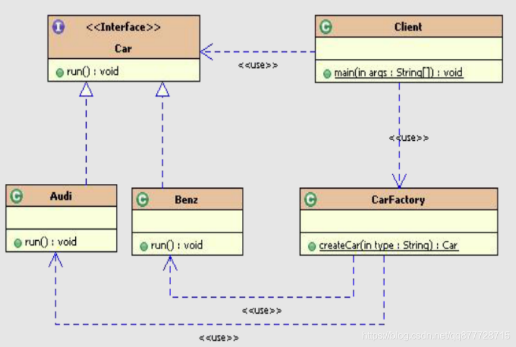
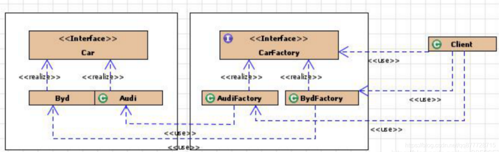
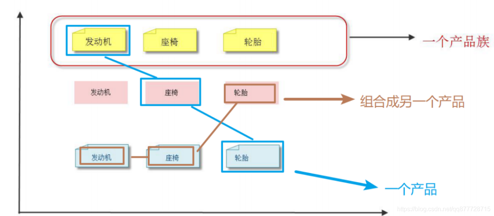
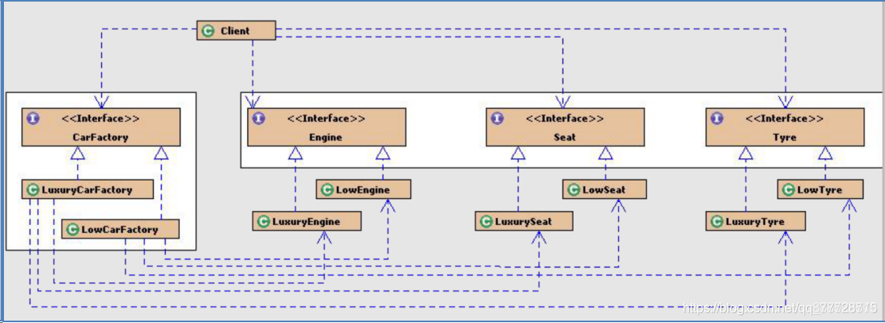

# 一.工厂模式

**工厂模式是最常用的实例化对象模式，主要用来<font color=#ff00a> 创建大规模的同类实例</font>。通过工厂提供方式创建对象，而无须关心其具体创建逻辑。<font color=#ff00a> 被创建对象实例的类型可以是接口、抽象类，也可以是具体的类</font>。**

**应用场景**：

1. 大量的具有相同父类或接口的对象需要创建
2. 需要统一的创建该类对象的入口

> 例如：
>
> 客户在餐厅吃饭，根据客户性质不同，需要采取不同的折扣结算方案
> 根据消息通知的及时性不同，采取不同的消息发送方式（邮件/短信）
> 根据外部传入的标识不同，进行系统不同缓存的类型刷新操作

**Java中应用场景**

1. JDK中Calendar的getInstance方法
2. JDBC中Connection对象的获取
3. Hibernate中SessionFactory创建Session
4. Spring中IOC容器创建管理bean对象
5. XML解析时的DocumentBuilderFactory创建解析器对象
6. 反射中Class对象的newInstance()

# 二.工厂的实现方式

|                模式                 |                             说明                             |                             特点                             |
| :---------------------------------: | :----------------------------------------------------------: | :----------------------------------------------------------: |
| 简单工厂（不属于GoF的23种设计模式） | 用来生产同一等级结构中的任意产品。(<font color=#ff00a>对于增加新的产品，需要修改已有代码</font>) | 适用于工厂类负责创建的对象较少的场景。虽然某种程度不符合设计原则，但实际使用最多。 |
|              工厂方法               | 用来生产同一等级结构中的固定产品。（<font color=#ff00a>支持增加任意产品</font>） |      不修改已有类的前提下，通过增加新的工厂类实现扩展。      |
|              抽象工厂               | 用来生产不同产品族的全部产品。(<font color=#ff00a>对于增加新的产品，无能为力；支持增加产品族</font>) |               不可以增加产品，可以增加产品族！               |


# 三.简单工厂模式(Simple Factory Pattern–不属于标准的设计模式)

## 1.概念

- 简单工厂模式也叫静态工厂模式，是指由 “”一个工厂“ 决定创建哪一种产品类的实例，但它不属于GoF的23种设计模式。简单工厂模式适用于工厂类负责创建的对象较少的场景。
  - 该工厂类一般是使用静态方法，根据我们传参的不同，<font color=#ff00a> 返回不同的派生自同一个父类 或 实现同一接口</font>的实例对象。

## 2.代码示例



抽象产品：工厂创建的具体对象的父类或者共同接口

```java
public interface Car {
	void run();
}
```


具体产品：是抽象产品的具体实现

```java
public class Audi implements Car {
	@Override
	public void run() {
		System.out.println("奥迪running...");
	}
}
public class Byd implements Car {
	@Override
	public void run() {
		System.out.println("比亚迪running...");
	}
}
```


产品工厂类，负责所有对象实例的内部逻辑

```java
//写法1：普通简单工厂
public class CarFactory {
	public static  Car createCar(String type){
		if("Audi".equals(type)){
			return new Audi();
		}else if("Byd".equals(type)){
			return new Byd();
		}else{
			 throw new RuntimeException("不存在类型");
		}
	}
}

//写法2：多方法简单工厂
//是对普通工厂方法模式的改进，在普通工厂方法模式中，如果传递的字符串出错，则不能正确创建对象；
//而多个工厂方法模式是提供多个工厂方法，分别创建对应对象。
public class CarFactory2 {
	

	public static  Car createAudi(){
		return new Audi();
	}
	public static  Car createByd(){
		return new Byd();
	}

}


//写法3:使用反射,这样新增产品也不需要修改代码
class CarFactory3{
	public Car createCar(String className) {
		try {
			if( className != null && !className.equals("") ) {
				return (Car) Class.forName(className).newInstance();
			}
		} catch (Exception e) {
			e.printStackTrace();
		}
		return null;
	}
}


//加入泛型支持： ？ extends表示传入的参数类型必须是Car的实现类
class CarFactory4{
	public Car createCar( Class<? extends Car> clazz) {
		try {
			if(clazz != null) {
				return clazz.newInstance();
			}
		} catch (Exception e) {
			e.printStackTrace();
		}
		return null;
	}
}
```


调用者

```java
public class Client{   //调用者
	public static void main(String[] args) {
		Car c1 =CarFactory.createCar("奥迪");
		Car c2 = CarFactory.createCar("比亚迪");
		

		c1.run();
		c2.run();
	}

}
```


优点：

1. 代码编写简单
2. 工厂都具有的优点：通过工厂创建对象，不关心对象实例化的具体逻辑

缺点：

1. 多个产品的创建逻辑耦合在一起，不符合<font color=#ff00a> 单一职责原则</font>，一旦工厂出现问题，整个系统都要受到影响。
2. 系统扩展困难，一旦添加新产品就得修改工厂逻辑，<font color=#ff00a> 违反了“开闭原则”</font>

# 四.工厂方法模式（Fatory Method Pattern）

## 1.概念

**简单工厂模式很简单，如果它能满足我们的需要，我觉得就不要折腾了。工厂方法模式，又被称为· ”多态工厂模式“·，是对简单工厂模式的进一步抽象化，其好处是可以<font color=#ff00a> 使系统在不修改原来代码的情况下引进新的产品，即满足开闭原则</font>。**

- 工厂方法模式<font color=#ff00a> 抽象出工厂接口</font>，声明<font color=#ff00a> 具体工厂子类必须实现的方法</font>。将对象实际创建工作交由<font color=#ff00a> 工厂的具体实现类</font>完成。这样进一步抽象化的好处是 <font color=#ff00a> 每添加一个具体对象只需要添加一个对应的具体工厂对象，原有工厂对象不需要进行任何修改，很好的符合了“开放-关闭”原则</font>。

**工厂方法模式和简单工厂模式最大的不同在于：**

- <font color=#ff00a> 简单工厂模式只有 "一个工厂类"</font>（对于一个项目或者一个独立模块而言），
- <font color=#ff00a> 工厂方法模式 有 "一组实现了相同接口的工厂类"</font>，一个工厂只创建一类产品的实例，不同产品使用各自的工厂创建各自的实例

## 2.代码示例



抽象产品：是工厂方法模式所创建的产品的抽象

```java
public interface Car {
	void run();
}
```


具体产品：是抽象产品的具体实现

```java
public class Audi implements Car {
	@Override
	public void run() {
		System.out.println("奥迪running...");
	}
}
public class Byd implements Car {
	@Override
	public void run() {
		System.out.println("比亚迪running...");
	}
}
```


抽象工厂：声明了工厂方法

```java
public interface CarFactory {
	Car createCar();
}
```


> <font color=#ff00a> 如果同一个工厂需要根据类型生成不同的实例,可以在createCar加一个类型形参，来判断不同的类型</font>

具体工厂：具体的工厂方法，实现了抽象工厂，用来生产具体的产品

```java
//奥迪工厂
public class AudiFactory implements CarFactory {
	@Override
	public Car createCar() {
		return new Audi();
	}
}

//比亚迪工厂
public class BydFactory implements CarFactory {
	@Override
	public Car createCar() {
		return new Byd();
	}
}
```


调用者

```java
public class Client {
	public static void main(String[] args) {
		Car c1 = new AudiFactory().createCar();
		Car c2 = new BydFactory().createCar();
		

		c1.run();
		c2.run();
	}

}
```


优点：

1. 扩展性高，如果想增加一个产品，只要扩展一个工厂类就可以。，原有工厂类不需要进行任何修改，很好的符合了“开放-关闭”原则。
2. 工厂都具有的优点：通过工厂创建对象，不关心对象实例化的具体逻辑

缺点：

- <font color=#ff00a> 每次增加一个产品时，都需要增加一个具体类和对应的具体工厂对象(需要写很多工厂)</font>，使得系统中类的个数成倍增加，在一定程度上增加了系统的复杂度。

# 五.抽象工厂模式（Abstract Factory Pattern）

## 1.概念

前面2种模式都是<font color=#ff00a> 创建单一的产品</font>，即<font color=#ff00a> 一个工厂只生产一种产品</font>，但是大部分的工厂都是多元产品的，

- 譬如：美的工厂生产空调，风扇，电饭煲，机器人；格力工厂: 空调，冰箱，电饭煲。以上两种模式都不可以实现。<font color=#ff00a> 抽象工厂模式就是解决此类问题的</font>;

- 抽象工厂模式(Abstract Factory Pattern)：顾名思义，对工厂进行抽象，<font color=#ff00a> 在一个工厂里聚合创建多个同类产品、同系列产品方法</font>，无须指定产品具体的类型，就可以获取指定对象。


**抽象工厂模式特点**

1. 用来生产不同产品族的全部产品。（对于增加新的产品，无能为力；支持增加产品族）

   

2. <font color=#ff00a> 抽象工厂模式是工厂方法模式的升级版本</font>，在有多个业务品种、业务分类时，通过抽象工厂模式产生需要的对象是一种非常好的解决方式。

**抽象工厂模式与工厂方法模式最大的区别在于：**

> 工厂方法模式：
>
> - 一个抽象产品类，可以派生出多个具体产品类。
> - 一个抽象工厂类，可以派生出多个具体工厂类。
> - 每个具体工厂类只能创建一个具体产品类的实例。
>
> 抽象工厂模式：
>
> - 多个抽象产品类，每个抽象产品类可以派生出多个具体产品类。
> - 一个抽象工厂类，可以派生出多个具体工厂类。
> - 每个具体工厂类可以创建多个具体产品类的实例，也就是创建的是一个产品线下的多个产品。
>
> 其他区别：
>
> - 工厂方法模式只有一个抽象产品类，而抽象工厂模式有多个；
> - 工厂方法模式的具体工厂类只能创建一个具体产品类的实例，而抽象工厂模式可以创建多个；
> - 抽象工厂更像工厂，可以生产不同类的产品。而工厂方法则更像是工厂的一种产品生产线，生产同类不同规格的产品。

## 2.代码示例



抽象产品、以及抽象产品的具体实现

```java
/**
 * 引擎
 */
public interface Engine {
	void run();
	void start();
}
/**
 * 高级引擎
 */
class LuxuryEngine implements Engine{
	@Override
	public void run() {
		System.out.println("转的快！");
	}
	@Override
	public void start() {
		System.out.println("启动快!可以自动启停！");
	}

}
/**
 * 低级引擎
 */
class LowEngine implements Engine{
	@Override
	public void run() { System.out.println("转的慢！"); }
	@Override
	public void start() { System.out.println("启动慢!"); }
}
```

```java
/**
 * 座椅接口
 */
public interface Seat {
	void massage();
}
/**
 * 高级座椅
 */
class LuxurySeat implements Seat {
	@Override
	public void massage() { System.out.println("可以自动按摩！"); }
}
/**
 * 低级座椅
 */
class LowSeat implements Seat {
	@Override
	public void massage() { System.out.println("不能按摩！"); }
}
```

```java
/**
 * 轮胎接口
 */
public interface Tyre {
	void revolve();
}
/**
 * 高级轮胎
 */
class LuxuryTyre implements Tyre {
	@Override
	public void revolve() { System.out.println("旋转不磨损！"); }
}
/**
 * 低级轮胎
 */
class LowTyre implements Tyre {
	@Override
	public void revolve() { System.out.println("旋转磨损快！"); }
}
```


抽象工厂：声明了工厂方法

```java
/**
 * 产品工厂接口
 */
public interface CarFactory {
	/**
	 * 生成引擎
	 */
	Engine createEngine();
	/**
	 * 生成座椅
	 */
	Seat createSeat();
	/**
	 * 生成轮胎
	 */
	Tyre createTyre();
}
```


具体工厂：具体的工厂方法，实现了抽象工厂，用来生产具体的产品

```java
/**
 * 低级产品生成工厂
 */
public class LowCarFactory implements CarFactory {
	/**
	 * 生成低级引擎
	 */
	@Override
	public Engine createEngine() { return new LowEngine(); }
	/**
	 * 生成低级座椅
	 */
	@Override
	public Seat createSeat() { return new LowSeat(); }
	/**
	 * 生成低级轮胎
	 */
	@Override
	public Tyre createTyre() { return new LowTyre(); }
}
```

```java
/**
 * 高级产品生成工厂
 */
public class LuxuryCarFactory implements CarFactory {
	/**
	 * 生成高级引擎
	 */
	@Override
	public Engine createEngine() { return new LuxuryEngine(); }
	/**
	 * 生成高级引擎
	 */
	@Override
	public Seat createSeat() { return new LuxurySeat(); }
	/**
	 * 生成高级引擎
	 */
	@Override
	public Tyre createTyre() { return new LuxuryTyre(); }
}

```


> 如果同一种产品又多种型号，还可以在方法中根据类型返回不同实例

测试

```java
public class Client {
    public static void main(String[] args) {
    	//声明高级产品生成工厂
        CarFactory factory = new LuxuryCarFactory();
        //生成高级引擎
        Engine e = factory.createEngine();

        e.run();
        e.start();
    }
}

```


# 六.总结

工厂模式作为一种创建型模式，在任何需要生成复杂对象的地方，都可以使用工厂方法模式。有一点需要注意的地方就是复杂对象适合使用工厂模式，而简单对象，特别是只需要通过 new 就可以完成创建的对象，无需使用工厂模式。如果使用工厂模式，就需要引入一个工厂类，会增加系统的复杂度。
