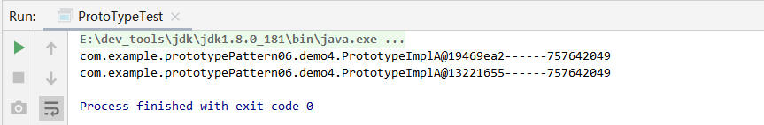
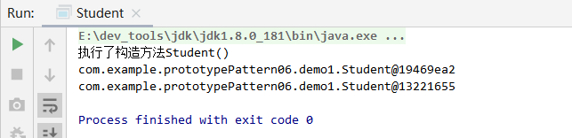
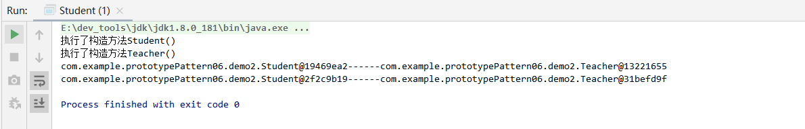

# 一.原型模式(用得最少)

我们知道通过new关键字创建的对象是非常繁琐的(类加载判断，内存分配，初始化等)，当直接创建对象的代价比较大时，我们可以采用原型模式（Prototype Pattern）。<font color=#ff00a> 通过克隆已存在的对象，减少重新创建对象的时间开销</font>

- 原型模式也称为<font color=#ff00a> "克隆模式"</font>， 即某个对象为原型克隆出来一个一模一样的对象，该对象的属性和原型对象一模一样。而且对于原型对象没有任何影响。原型模式的克隆方式有2种：<font color=#ff00a> 浅克隆和深度克隆</font>
  - 这里我简单的说明一下什么是浅克隆和深克隆

> **浅克隆和深克隆的概念**：
>
> - 浅克隆：将一个对象复制后，基本数据类型的变量都会重新创建，而引用类型，指向的还是原对象所指向的。
> - 实现Cloneable 接口，重写clone()方法
> - 深克隆：将一个对象复制后，不论是基本数据类型还有引用类型，都是重新创建的。简单来说，就是深克隆进行了完全彻底的复制，而浅克隆不彻底。
> - `实现Serializable接口,将对象进行序列化成二进制流，然后再将二进制流进行反序列化成Java对象

浅克隆和深克隆的实现可以看这片文章[【Java基础】对象深克隆和浅克隆的原理及实现](https://blog.csdn.net/qq877728715/article/details/103858729)

# 二.原型模式适用场景

1. 在需要一个类的大量对象的时候，使用原型模式是最佳选择，因为原型模式是<font color=#ff00a> 在内存中对这个对象进行拷贝</font>，要比直接new这个对象性能要好很多。
2. 如果一个对象的初始化需要很多<font color=#ff00a> 其他对象的数据准备或其他资源的繁琐计算</font>，那么可以使用原型模式，这样创建新的对象的时候，可以避免其他对象的数据准备和计算，<font color=#ff00a> 直接得到当前对象的副本</font>。
3. 当需要<font color=#ff00a> 保留一个复杂对象的绝大部分信息，少量字段进行个性化设置的时候</font>，也可以使用原型模式拷贝出现有对象的副本后再进行加工处理。


# 三.原型模式角色

## 1.角色分类

- **抽象原型角色(Abstract Prototype)**：这是一个抽象角色，通常由一个Java接口或java抽象类实现，此抽象角色规定了所有的具体原型类所需的接口(如果要提供深拷贝，则必须具有实现clone的规定)。
- **具体原型角色(Concrete Prototype)**：即被复制的对象，此角色需要实现抽象的原型角色所要求的接口。
- **客户角色(Client)**：使用原型对象的客户程序

## 2.标准的原型模式实现方式

- **主要思想：实现原型接口，基于现有的对象克隆一个新的对象出来，由对象的内部提供克隆的方法，通过clone方法返回一个对象的副本。**

### 2.1.抽象原型角色(Abstract Prototype)

原型接口

```java
public interface IPrototype {
    IPrototype clone();
}
```


### 2.2.具体原型角色(Concrete Prototype)

PrototypeImplA实现了接口IPrototype，并且实现了clone方法，返回了一个新的对象

```java
public class PrototypeImplA implements IPrototype{
    private String name;
    private int age;
    private List<String> phoneList;

    public String getName() {return name;}
    public void setName(String name) { this.name = name; }
    
    public int getAge() {return age;}
    public void setAge(int age) {this.age = age;}
    
    public List<String> getPhoneList() {return phoneList;}
    public void setPhoneList(List<String> phoneList) {this.phoneList = phoneList; }
    
    //实现原型接口clone()方法
    @Override
    public IPrototype clone() {
        PrototypeImplA prototypeImplA = new PrototypeImplA();
        prototypeImplA.setAge(this.age);
        prototypeImplA.setName(this.name);
        prototypeImplA.setPhoneList(this.phoneList);
        return prototypeImplA;
    }

}
```

### 2.3.测试类

```java
public class ProtoTypeTest {
    public static void main(String[] args) throws Exception {
        PrototypeImplA prototypeImplA = new PrototypeImplA();
        prototypeImplA.setAge(18);
        prototypeImplA.setName("张三");

        List<String> phoneList = new ArrayList<>();
        phoneList.add("88888888");
        phoneList.add("77777777");
        prototypeImplA.setPhoneList(phoneList);
    
        PrototypeImplA cloneProtoTypeA = (PrototypeImplA) prototypeImplA.clone();
    
        System.out.println(prototypeImplA+"------"+prototypeImplA.getPhoneList().hashCode());
        System.out.println(cloneProtoTypeA+"------"+cloneProtoTypeA.getPhoneList().hashCode());
    }

}
```



**生成了2个不同的PrototypeImplA，但因为这种克隆方式是<font color=#ff00a> 浅克隆，对象中如果有引用对象那么被克隆后的对象依然会指向原对象<font color=#ff00a> ，如果需要复制两个独立的对象，则需要使用深克隆，后面示例中我们会对比一下2种克隆方式**

> 对象的HashCode相同，说明是指向的是同一个内存地址


# 四.Java中原型模式的实现方式

## 1.浅克隆

### 1.1.代码实现

```java
/**
 * 原型类：被克隆的类型
 * 	 Object有clone()方法，但不能直接使用，需要实现Cloneable，重写里面的clone()方法才能使用
 */

public class Student implements Cloneable {
    public Student() {
        System.out.println("执行了构造方法Student()");
    }

    /**
     * 返回类型是Object
     */
    @Override
    protected Object clone() throws CloneNotSupportedException {
        //调用Object的clone()
        return super.clone();
    }
}

```


测试

```java
    public static void main(String[] args) {
        Student student = new Student();
        try {
            Student cloneStudent= (Student) student.clone();  //通过克隆来创建实例

            System.out.println(student);
            System.out.println(cloneStudent);
        } catch (CloneNotSupportedException e) {
            e.printStackTrace();
        }
    }

```


测试结果




### 1.2.原型模式和直接new对象方式的比较

测试通过原型模式创建100万对象 和通过new创建100万对象的性能

```java
    public static void main(String[] args) throws CloneNotSupportedException {
        int size = 1_000_000;
        long start1 = System.currentTimeMillis();
        for (int i = 0; i < size; i++) {
            Student t = new Student();
        }
        long end1 = System.currentTimeMillis();


        long start2 = System.currentTimeMillis();
        Student t = new Student();
        for (int i = 0; i < size; i++) {
            Student temp = (Student) t.clone();
        }
        long end2 = System.currentTimeMillis();


        System.out.println("new的方式创建耗时：" + (end1 - start1));
        System.out.println("clone的方式创建耗时：" + (end2 - start2));
    }

```


执行结果:


结论：

- **通过clone的方式在获取大量对象的时候性能开销基本没有什么影响，而new的方式随着实例的对象越来越多，性能会急剧下降，所以原型模式是一种比较重要的获取实例的方式。**

优点:

- 使用clone方法创建的新对象的<font color=#ff00a> 构造函数是不会被执行的</font>，也就是说会绕过任何构造函数（有参和无参），因为clone方法的原理是从堆内存中以二进制流的方式进行拷贝，直接分配一块新内存。
- 一句话: <font color=#ff00a> clone()直接复制二进制流，不调用构造器创建实例</font>

缺点：

- 被拷贝对象的所有基本类型变量都含有与原对象相同的值，而且<font color=#ff00a> 引用类型的变量仍然是指向原对象地址</font>。即<font color=#ff00a> 浅拷贝只拷贝当前基本类型属性值，对引用的属性值不做拷贝</font>。

## 2.深克隆

### 2.1.基于浅克隆嵌套

```java
public class Student implements Cloneable {
    //引用型成员变量。注意：Teacher类也要实现Cloneable接口，并重写clone()方法
    private Teacher teacher;

    public Student() {
        System.out.println("执行了构造方法Student()");
    }

    @Override
    protected Object clone() throws CloneNotSupportedException {
        Student student = (Student) super.clone();  //克隆整个对象
        student.teacher = (Teacher) teacher.clone();
        return student;
    }
}
class Teacher implements Cloneable {
    public Teacher() {
        System.out.println("执行了构造方法Teacher()");
    }
    @Override
    protected Object clone() throws CloneNotSupportedException {
        //克隆整个对象
        Teacher teacher = (Teacher) super.clone();
        return teacher;
    }
}


```


测试

```java
    public static void main(String[] args) {
        Student student = new Student();
        student.teacher= new Teacher();

        try {
            Student cloneStudent= (Student) student.clone();  //通过克隆来创建实例

            System.out.println(student+"------"+student.teacher);
            System.out.println(cloneStudent+"------"+cloneStudent.teacher);
        } catch (CloneNotSupportedException e) {
            e.printStackTrace();
        }
    }

```


执行结果



### 2.2.基于序列化反序列化

- **序列化 把对象转换为字节流。**
- **反序列化 把字节流恢复为对象。**

```java
/**
 * 序列化实现深克隆
 */
public class Student implements Cloneable, Serializable {
    //引用型成员变量。注意：Teacher类也要实现Serializable
    private Teacher teacher;

    public Student() {
        System.out.println("执行了构造方法Student()");
    }


    public static void main(String[] args) throws  CloneNotSupportedException {
        //原对象
        Student student = new Student();
        student.teacher = new Teacher();

        //克隆对象
        Student cloneStudent = (Student) student.clone();
        System.out.println(student+"-----"+student.teacher);
        System.out.println(cloneStudent+"-----"+cloneStudent.teacher);
    }


    //序列化实现深克隆
    private Object deepClone() {
        try {
            //----------序列化
            //字节数组输出流
            ByteArrayOutputStream bos = new ByteArrayOutputStream();
            //对象输出流
            ObjectOutputStream oos = new ObjectOutputStream(bos);
            //将对象写入对象输出流
            oos.writeObject(this);
            //输出成字节数组
            byte[] bytes = bos.toByteArray();

            //----------反序列化
            //读取对象字节数组
            ByteArrayInputStream bis = new ByteArrayInputStream(bytes);
            //读取字节数组流
            ObjectInputStream ois = new ObjectInputStream(bis);
            //从字节流中生成对象
            Student cloneStudent = (Student) ois.readObject();
            return cloneStudent;
        } catch (Exception e) {
            e.printStackTrace();
            return null;
        }
    }

    @Override
    protected Object clone() throws CloneNotSupportedException {
        return deepClone();
    }
}


class Teacher implements Serializable {
    public Teacher() {
        System.out.println("执行了构造方法Teacher()");
    }
}

```


测试

```java
    public static void main(String[] args) throws  CloneNotSupportedException {
        //原对象
        Student student = new Student();
        student.teacher = new Teacher();

        //克隆对象
        Student cloneStudent = (Student) student.clone();
        System.out.println(student+"-----"+student.teacher);
        System.out.println(cloneStudent+"-----"+cloneStudent.teacher);
    }


```


# 五.总结

## 1.原型模式的优缺点

- **优点**：减少了重新创建实例、反复的相同赋值操作的性能开销；
  - 原型模式是在内存二进制流的拷贝， 要比直接new一个对象性能好很多， 特别是要在一个循环体内产生大量的对象时， 原型模式可以更快
- **缺点**：克隆<font color=#ff00a> 包含循环引用的复杂对象</font>会非常麻烦，需要编写较为复杂的代码

> 无论是深克隆还是、浅克隆在没有经过处理时，都会破坏单例模式，重新生成一个新的实例

## 2.原型模式在开发中的应用场景

- 原型模式很少单独出现，<font color=#ff00a> 一般是和工厂方法模式一起出现，通过clone的方法创建一个对象，然后由工厂方法提供给调用者</font>。
- Spring中bean的创建实际就是两种：单例模式和原型模式。（原型模式需要和工厂模式搭配起来）

**原型模式了解到这里我觉得就够了，各种变着法子说这种代码或那种代码是原型模式，没什么意义。**
