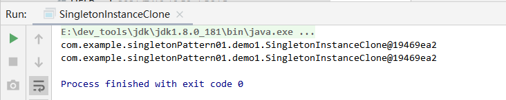

# 一.单例模式


单例模式的核心是保证一个类只有一个实例，并且提供一个全局访问方法访问该实例。

- 解决问题：避免一个全局使用的类频繁地创建与销毁

- 如何解决：判断是否已经有这个单例，如果有则返回，如果没有则创建。

- 关键代码：


```
1.将类的构造函数设为私有。 类的静态方法仍能调用构造函数， 但是其他对象不能调用。
2.在类中添加一个私有静态成员变量用于保存单例实例。
3.声明一个公有静态方法用于获取单例实例。
4.在静态方法中实现"延迟初始化"。 该方法会在首次被调用时创建一个新对象， 并将其存储在静态成员变量中。 此后该方法每次被调用时都返回该实例。
```


# 二.单例的使用场景

1. Spring中bean对象的模式实现方式
2. servlet中每个servlet的实例
3. spring mvc和struts1框架中，控制器对象是单例模式
4. MyBatis的SqlSessionFactory对象，Spring的BeanFactory对象都是单例的
5. 读取配置文件的类，一般也只有一个对象。没有必要每次使用配置文件数据，每次new一个对象去读取。
6. 数据库连接池的设计一般也是采用单例模式，因为数据库连接是一种数据库资源

# 三.单例模式优点

优点:

1. 在内存里只有一个实例，减少了内存的开销，尤其是频繁的创建和销毁实例
2. 避免对资源的多重占用（比如写文件操作）。

缺点：

​	没有接口，不能继承，与单一职责原则冲突，一个类应该只关心内部逻辑，而不关心外面怎么样来实例化。

# 四.单例的实现方式

| 实现方式                                              | 优缺点                                            |
| :---------------------------------------------------- | ------------------------------------------------- |
| 饿汉式                                                | 线程安全，调用效率高 ，但是不能延迟加载           |
| 懒汉式                                                | 线程安全，调用效率不高，能延迟加载                |
| 双检锁/双重校验锁式（DCL，即 double-checked locking） | 由于JVM底层内部模型原因，偶尔会出问题。不建议使用 |
| 登记式/静态内部类式                                   | 线程安全，资源利用率高，可以延时加载              |
| 枚举单例式                                            | 线程安全，调用效率高，但是不能延迟加载            |


## 1.饿汉式

就是<font color=#ff00a>类加载的时候立即实例化对象</font>，实现的步骤是<font color=#ff00a> 先私有化构造方法，对外提供唯一的静态入口方法</font>，实现如下

```java
public class SingletonInstance1 {
    // 声明此类型的变量，并实例化，当该类被加载的时候就完成了实例化并保存在了内存中
    private static SingletonInstance1 singletonInstance = new SingletonInstance1();

    // 私有化所有的构造方法,防止直接通过new关键字实例化
    private SingletonInstance1() {
    }
    
    // 对外提供一个获取实例的静态方法
    public static SingletonInstance1 getInstance() {
        return singletonInstance;
    }
}
```

饿汉式通过classloader 机制保证在类加载(static变量会在类装载时初始化)的时候就立即初始化对象，此时也不会涉及多个线程对象访问该对象的问题。<font color=#ff00a> 虚拟机保证只会装载一次该类，肯定不会发生并发访问的问题。</font>因此，**可以省略synchronized关键字**

- 优点: 没有加锁，执行效率高，性能比懒汉式更好
- 缺点: 类加载的时候就初始化，不管用与不用都会占用空间，浪费内存。


## 2.懒汉式
```java
public class SingletonInstance2 {
    // 声明此类型的变量,但没有实例化
    private static SingletonInstance2 singletonInstance = null;

    // 私有化所有的构造方法,防止直接通过new关键字实例化
    private SingletonInstance2() {
    
    }
    
    // 对外提供一个获取实例的静态方法，为了数据安全添加synchronized关键字
    public static synchronized SingletonInstance2 getInstance() {
        return singletonInstance;
    }
}
```

被外部调用 getInstance()的时候才会实例化对象。从而实现了延迟加载，但因为在方法上添加了<font color=#ff00a> synchronized关键字</font>上锁，每次调用getInstance方法都会同步，所以对性能的影响比较大


## 3.双重校验锁式

```java
public class SingletionInstance3 {
    // 声明此类型的变量,,但没有实例化(使用volatile关键字修饰会直接操作主内存)
    private volatile static SingletionInstance3 singletionInstance = null;

    // 私有化所有的构造方法,防止直接通过new关键字实例化
    private SingletionInstance3() {
    
    }
    
    // 对外提供一个获取实例的静态方法，
    public static SingletionInstance3 getInstance() {
        if (singletionInstance == null) {
            synchronized (SingletionInstance3.class) {
                if (singletionInstance == null) {
                    singletionInstance = new SingletionInstance3();
                }
            }
        }
        return singletionInstance;
    }

}
```


## 4.静态内部类式

```java
public class SingletonInstance4 {
    //使用SingletonInstance4 的时候，默认先初始化内部类SingletonClassInstance 
	//如果不使用，则内部类不加载
    private static class SingletonClassInstance {
        // 声明外部类型的静态常量
        public static final SingletonInstance4 SINGLETON_INSTANCE = new SingletonInstance4();
    }
    

    // 私有化构造方法
    private SingletonInstance4() {
    }
    
    // 对外提供的唯一获取实例的方法
    public static SingletonInstance4 getInstance() {
        return SingletonClassInstance.SINGLETON_INSTANCE;
    }

}
```


注意点:

1. 外部类没有static属性，则不会像饿汉式那样立即加载对象。
2. 只有真正调用getInstance(),才会加载静态内部类。加载类时是线程 安全的，SINGLETON_INSTANCE 是<font color=#ff00a> static final类型</font>， 保证了<font color=#ff00a>内存中只有这样一个实例存在，而且只能被赋值一次</font>，从而保证了线程安全性.
3. 兼备了并发高效调用和延迟加载的优势！

## 5.枚举单例式

```java
public enum  SingletonInstance5 {
    // 定义一个枚举元素，则这个元素就代表了SingletonInstance5的实例
    INSTANCE;

    public void singletonOperation(){
        // 功能处理
    }
    
    public static void main(String[] args) {
        SingletonInstance5 s1  = SingletonInstance5.INSTANCE;
        SingletonInstance5 s2  = SingletonInstance5.INSTANCE;
        System.out.println(s1 == s2); // 输出的是 true
    }

}
```


枚举类会在类加载的时候会初始化里面的所有的实例，而且 JVM 保证了它们不会再被实例化，所以它天生就是单例的。

优点：

1. 实现简单
2. 枚举本身就是单例模式。由JVM从根本上提供保障！避免通过反射和反序列化的漏洞！

缺点：

1. 无延迟加载

## 6.ThreadLocal式单例(单线程单例)

ThreadLocal不能保证其创建的对象是<font color=#ff00a> 全局唯一</font>，但是能保证<font color=#ff00a> 在单个线程中是唯一的，天生的线程安全</font>

```java
public class ThreadLocalSingleton {
	//初始化实例
    private static final ThreadLocal<ThreadLocalSingleton> singleton =
            new ThreadLocal<ThreadLocalSingleton>() {
                @Override
                protected ThreadLocalSingleton initialValue() {
                    return new ThreadLocalSingleton();
                }
            };

 	// 对外提供的唯一获取实例的方法
    public static ThreadLocalSingleton getInstance(){
        return singleton.get();
    }

	// 私有化构造方法
	private ThreadLocalSingleton() {}

}
```


# 五.单例模式漏洞

## 1.反射破坏单例

通过反射的方式我们依然可用获取多个实例(<font color=#ff00a> 除了枚举的方式</font>)

```java
public static void main(String[] args) throws Exception, IllegalAccessException {
    //获取饿汉式单例对象
    SingletonInstance1 s1a = SingletonInstance1.getInstance();
    SingletonInstance1 s1b = SingletonInstance1.getInstance();
    System.out.println(s1a+"----"+s1b);
    // 反射方式获取实例
    Class<SingletonInstance1> c1 = SingletonInstance1.class;
    Constructor<SingletonInstance1> constructor = c1.getDeclaredConstructor(null);
    //放开私有构造器访问权限
    constructor.setAccessible(true);
    //调用构造方法实例化对象
    SingletonInstance1 s2 = constructor.newInstance(null);
    System.out.println(s2);
}
```


执行结果


结论：通过调用getInstance()获取的对象是同一个对象，但是序列化单例类会重新一个新的对象，不符合单例模式思想了。

- 解决方式：<font color=#ff00a> 在无参构造方法中手动抛出异常控制</font>

  ```java
   // 私有化所有的构造方法,防止直接通过new关键字实例化
      private SingletonInstance1() {
          if(singletonInstance != null){
              // 只能有一个实例存在，如果再次调用该构造方法就抛出异常，防止反射方式实例化
              throw new RuntimeException("单例模式只能创建一个对象");
          }
      }
  ```


  再次执行main方法

  


## 2.浅克隆破坏单例模式

```java
public class SingletonInstanceClone implements Cloneable{
    // 声明此类型的变量，并实例化，当该类被加载的时候就完成了实例化并保存在了内存中
    private static SingletonInstanceClone singletonInstance = new SingletonInstanceClone();

    // 私有化所有的构造方法,防止直接通过new关键字实例化
    private SingletonInstanceClone() {
        if (singletonInstance != null) {
            // 只能有一个实例存在，如果再次调用该构造方法就抛出异常，防止反射方式实例化
            throw new RuntimeException("单例模式只能创建一个对象");
        }
    }
    
    // 对外提供一个获取实例的静态方法
    public static SingletonInstanceClone getInstance() {
        return singletonInstance;
    }
    
    //浅克隆破坏单例
    public static void main(String[] args) throws Exception, IllegalAccessException {
        SingletonInstanceClone s1a = SingletonInstanceClone.getInstance();
        SingletonInstanceClone s1b = (SingletonInstanceClone) s1a.clone();
        System.out.println(s1a);
        System.out.println(s1b);
    }

}
```


测试结果


**解决方式：重写clone()然后返回唯一实例**

```java
@Override
protected Object clone() throws CloneNotSupportedException {
    return singletonInstance;
}
```




## 3.序列化破坏单例

通过反序列化的方式也可以破解上面几种方式 (除了枚举的方式)

一个单例对象创建后，有时候需要将对象序列化然后写入磁盘，下次使用的时候再从磁盘中读取对象并进行反序列化，将其转化为对象。反序列化后的对象会重新分配内存，即重新创建对象。如果序列化的目标对象为单例对象，就违背了单例模式的初衷，相当于破坏了单例

- 序列化就是把内存中的对象的状态通过转换成字节码的形式存储到磁盘从而转换一个I/O流，写入其他地方；内存中的状态数据会永久的保存下来。
- 反序列化就是将已经持久化的字节码内容转换成I/O流，通过I/O流读取，进而将读取的内容转换成java对象
- 了解序列化和反序列化可以点击看这篇文章，写的清楚


<font color=#ff00a> 注意: 序列化SingletonInstance1类要实现 Serializable 接口,否则抛出异常java.io.NotSerializableException</font>

```java
    public static void main(String[] args) throws Exception, IllegalAccessException {
        SingletonInstance1 s1 = SingletonInstance1.getInstance();

        // 将实例对象序列化到文件中
        ObjectOutputStream oos = new ObjectOutputStream(new FileOutputStream("a.txt"));//当前项目所在的目前会生成一个a.text
        oos.writeObject(s1);
        oos.flush();
        oos.close();


        // 将实例从文件中反序列化出来
        ObjectInputStream ois = new ObjectInputStream(new FileInputStream("a.txt"));
        SingletonInstance1 s2 = (SingletonInstance1) ois.readObject();
        ois.close();

        System.out.println(s1);
        System.out.println(s2);
    }

```


执行结果


结论：序列化后会生成一个新的对象，同样破坏了单例模式

**解决办法: 在单例类中重写readResolve方法并在该方法中返回单例对象即可**

```java
/**
 * 饿汉式
 */
public class SingletonInstance1 implements Serializable {
    // 声明此类型的变量，并实例化，当该类被加载的时候就完成了实例化并保存在了内存中
    private static SingletonInstance1 singletonInstance = new SingletonInstance1();

    // 私有化所有的构造方法,防止直接通过new关键字实例化
    private SingletonInstance1() {
        if (singletonInstance != null) {
            // 只能有一个实例存在，如果再次调用该构造方法就抛出异常，防止反射方式实例化
            throw new RuntimeException("单例模式只能创建一个对象");
        }
    }

    // 对外提供一个获取实例的静态方法
    public static SingletonInstance1 getInstance() {
        return singletonInstance;
    }

    // 重写该方法，防止序列化和反序列化获取实例
    private Object readResolve() throws ObjectStreamException {
        return singletonInstance;
    }
}

```

再次执行main()


**结论**: 序列化后获取的是同一个对象，说明<font color=#ff00a> readResolve方法是基于回调的，反序列化时，如果定义了readResolve()则直接返回此方法指定的对象，而不需要在创建新的对象！</font>


# 六.Spring容器式单例拓展

核心思想是: 创建一个容器，把所有的对象都放到容器中，在存储对象的时候:如果容器中已经存在了就不放，如果容器中不存在对象则放到容器。

```java
public class SingletonContainer {

    //创建一个线程安全的map对象
    private static Map<String, Object> ioc = new ConcurrentHashMap<>();
    
    //构造器私有
    private SingletonContainer() {
    }
    
    //存储单例对象
    public static Object getBean(String className) {
        synchronized (ioc) {
            if (!ioc.containsKey(className)) {
                Object obj = null;
                try {
                    obj = Class.forName(className).newInstance();//反射创建对象
                    ioc.put(className, obj);//放到容器
                } catch (Exception e) {
                    e.printStackTrace();
                }
                return obj;
            }
    
            //如果存在这个对象
            return ioc.get(className);
    
        }
    }

}
```

```java
public static void main(String[] args) {
		//注意存放的是公有的构造方法
		Object obj1 = SingletonContainer.getBean("com.hanker.entity.Student");
		Object obj2 = SingletonContainer.getBean("com.hanker.entity.Student");
		System.out.println(obj1);
		System.out.println(obj2);
		System.out.println(obj1 == obj2);
	}
```


容器式单例模式适用于实例非常多的情况，便于管理。但是它是<font color=#ff00a> 非线程安全的</font>。**Spring的ApplicationContext实现的容器就是单例模式的**。


# 七.总结
1. 一般情况下，不建议使用懒汉方式，建议使用饿汉方式。
2. 只有在要明确实现延迟加载时，才会使用第 静态内部方式。
3. 如果涉及到反序列化创建对象时，可以尝试使用第枚举方式。
4. 如果有其他特殊的需求，可以考虑使用双重校验锁方式。