# 软件设计的七大原则
## 1.单一职责原则
### 1.1.概述
单一职责原则（Single Responsibility Principle，SRP）：一个类、接口、方法只负责一项功能，降低因类的复杂度、变更引起的风险，提高类的可读性，易于维护。

- 一句话: 一个类只负责一项职责

- 如类A负责两个不同职责：<font color=#ff00a>职责1，职责2</font>。当职责1需求变更而改变类A时，可能造成职责2执行错误，所以需要将类A的分解为<font color=#ff00a>A1、A2</font>

  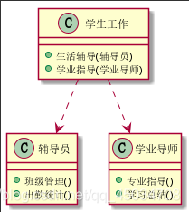

- 通常情况下，我们应当遵守单一职责原则，<font color=#ff00a>只有逻辑足够简单，才可以在代码违反单一职责原则；只有类中方法数量足够少</font>，可以在方法级别保持单一职责原则

### 1.2.举个栗子
比如说超市里面的商品需要进货然后再卖出去，这就是2件事。

新建一个超市商品类：
~~~
public class Goods {
    public void action(String type){
        if ("in".equals(type)){
            System.out.println("我要去进货了");
        }else if("out".equals(type)){
            System.out.println("我要卖商品");
        }
    }
}
~~~
这时候一个方法里面有两个功能，假如业务逻辑非常复杂，那么一个功能发生变化需要修改有很大的风险导致另一个功能也发生异常。所以我们应该进行如下改写，将这两个职责拆分成两个类：
~~~
//进货类
public class BuyGoods {
    public void action(){
        System.out.println("我要去进货了");
    }
}
~~~
~~~
//销售类
public class SaleGoods {
    public void action(){
        System.out.println("我要卖商品");
    }
}
~~~

## 2.接口隔离原则
### 2.1.概述
接口隔离原则（Interface Segregation Principle）：接口之间相互独立，尽量通过接口来访问

- 一句话: 建立单一接口，不要建立庞大臃肿的接口，尽量细化接口，接口中的方法尽量少

- 比如：类A通过接口I依赖类B，类C通过接口I依赖类D，如果接口接口I对于类A和类C来说不是最小接口，那么类B和类D必须去实现他们不需要的方法。

   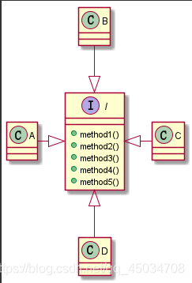

按隔离原则应当这样处理：**将接口I拆分为独立的几个接口，将类分别与他们需要的接口建立依赖关系**，也就是采用接口隔离原则。

  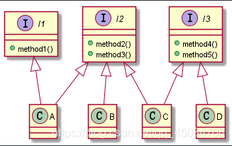


### 2.2.举个栗子
我们以常见的动物的行为来举个栗子

新建一个动物接口，抽象出动物的行为
~~~
public interface IAnimal {
    void run();
    void swim();
    void fly();
}
~~~

这个动物接口里面包含了3个行为接口：地上走，水里游，天上飞。但是是不是所有动物都有这三种行为呢？显然不是，比如狗肯定不能天上飞，鱼只能水里游，这样没用的行为只能空着什么都不做了：
~~~
public class Dog implements IAnimal {
    @Override
    public void run() {
        System.out.println("我跑的很快");
    }
    @Override
    public void swim() {
        System.out.println("我还会游泳");
    }

    @Override
    public void fly() {}
}
~~~

而如果鱼，那就得空着两个方法什么也不能做了，这就是一个臃肿的接口设计，如果遵循接口隔离原则，那么应该这么改写：

飞行类动物
~~~
public interface IFlyAnimal {
    void fly();
}
~~~
陆生动物
~~~
public interface IRunAnimal {
    void run();
}
~~~
水生动物
~~~
public interface ISwimAnimal {
    void swim();
}
~~~

这时候就狗可以实现IRunAnimal,ISwimAnimal接口，从而不会具备一些无用的行为
~~~
public class Dog implements IRunAnimal,ISwimAnimal {
    @Override
    public void run() {
        System.out.println("我跑的很快");
    }

    @Override
    public void swim() {
        System.out.println("我还会游用");
    }
}
~~~

## 3.依赖倒转原则
### 3.1.概述
依赖倒置原则（Dependence Inversion Principle，DIP）：高层某块不应该依赖低层模块的具体实现，而是依赖低层模块的接口，将耦合度降低到接口层次

- 一句话: 要依赖于抽象，不要依赖于具体实现，核心思想是面向接口编程，依赖倒转原则是对开闭原则的具体实现

- 依赖倒转(倒置)的中心思想是面向接口编程，所谓“倒转”是指抽象不应该依赖具体实现，而是具体实现应该依赖抽象。也就是高层模块不应该依赖低层模块，二者都应该依赖其抽象。因为相对于具体实现的多变性，抽象的东西要稳定的多。

- 比如有个Person类，可以接受Email、QQ和微信的消息。如果都为其提供一个专门接收消息的方法，就会让代码非常的冗余：

  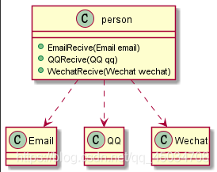

可以引入一个IReceiver接口，让Person类依赖该接口。这样QQ、微信和Email各自实现IReceiver接口里面的方法即可：

  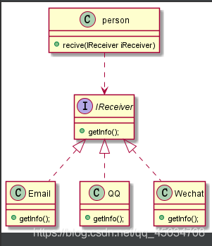

### 3.2.举个栗子
我们以马爸爸的兴趣爱好为栗子

新建一个马云类，有兴趣爱好唱歌、演讲
~~~
//演示依赖倒置原则
public class JackMa {
    public void sing(){
        System.out.println("马云在唱摇滚");
    }
    public void speech(){
        System.out.println("马云在演讲");
    }
}
~~~

随着年龄增大，马云爸爸的兴趣也越来越多，比如打高尔夫，拍电影，此时如果我们在JackMa类中新增方法，但是这么一来底层要改，调用者也要改，不利于维护，修改代码的风险也提高了，所以应该不依赖于具体实现来编程。接下来优化我们的代码，新增一个兴趣爱好的抽象接口：
```
public interface IHobby {
    void doSomthing();
}
```

然后写唱歌类SingHobby，演讲类SpeechHobby
```
public class SingHobby implements IHobby {
    @Override
    public void doSomthing() {
        System.out.println("马云在唱歌");
    }
}

public class SpeechHobby implements IHobby {
    @Override
    public void doSomthing() {
        System.out.println("马云在演讲");
    }
}
```

修改JackMa类：
```
public class JackMa {
   public void doHobbyThing(IHobby hobby){
       hobby.doSomthing();
   }
}
```

最后来看调用：
```
public class JackMaTest {
    public static void main(String[] args) {
        JackMa jackMa = new JackMa();
        jackMa.doHobbyThing(new SingHobby());
        jackMa.doHobbyThing(new SpeechHobby());
    }
}
```

这时候马云类已经<font color=#ff00a>面向接口了，而不面向具体(唱歌)</font>，无论马云的兴趣爱好多广泛，只要新增一个对应的爱好实现类，<font color=#ff00a>再调用的时候传参，而不需要修改底层代码就实现了扩展</font>，其实这就是本质上的依赖注入。注入的方式还有<font color=#ff00a>构造器方式</font>和<font color=#ff00a>Setter方式</font>.

来看构造器注入方式的代码：
```
public class JackMa {
    private IHobby hobby;
    public JackMa(IHobby hobby){
        this.hobby = hobby;
    }
    public void doHobbyThing(){
       hobby.doSomthing();
    }
    
  public static void main(String[] args) {
        JackMa jackMa = new JackMa(new SingHobby());
        jackMa.doHobbyThing();
        JackMa jackMa = new JackMa(new SpeechHobby());
        jackMa.doHobbyThing();
    }
}
```

使用构造器注入每次调用都要创建实例，如果JackMa是单例的，我们只能选择Setter方式注入了
```
public class JackMa {
    private IHobby hobby;
    public void setHobby(IHobby hobby) {
        this.hobby = hobby;
    }
    public void doHobbyThing(){
       hobby.doSomthing();
    }

    public static void main(String[] args) {
        JackMa jackMa = new JackMa();
        jackMa.setHobby(new SingHobby());
        jackMa.doHobbyThing();
        jackMa.setHobby(new SpeechHobby());
        jackMa.doHobbyThing();
    }
}
```

## 4.里氏替换原则
### 4.1.概述
里氏替换原则（Liskov Substitution Principle，LSP）：父类对象都可以替换为子类对象，即父类适用的地方，子类也应该适用

- 一句话: 子类可以扩展父类的功能，但不能改变父类原有的功能，换句话说，子类继承父类时，除添加新的方法完成新增功能外，尽量不要重写父类的方法。
  - 继承实际上让两个类耦合性增强了，如果通过重写父类的方法来完成新的功能，这样写起来虽然简单，但是整个继承体系的可复用性会比较差，特别是运用多态比较频繁时，程序运行出错的概率会非常大。
```
总结的几条原则:
1.子类可以实现父类的抽象方法，但是不能覆盖父类的非抽象方法。
2.子类中可以增加自己的特有方法。
3.当子类方法重载父类的方法时，方法的前置条件(即方法的输入/入参)要比父类方法输入的参数更宽松
4.当子类实现父类的方法(重载/重写/实现抽象方法)，方法的后置条件（即方法的输出/返回值）要比父类更严格或者相等
```
- 比如一种极端情况：一个类继承了另一个类，但却重写了所有方法，那么继承的意义何在？说好的复用呢？

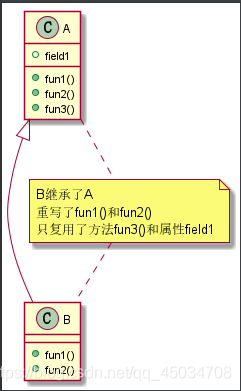

解决方法是<font color=#ff00a>把原来的父类和子类都继承一个更通俗的基类</font>，在适当的情况下，可以通过<font color=#ff00a>聚合，组合，依赖</font>等来代替。

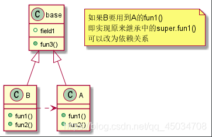

### 4.2.举个栗子
里氏替换原则中经典例子：<font color=#ff00a>正方形不是长方形</font>

我们都知道正方形是一个特殊的矩形，那么就可以创建一个矩形父类Rectangle 类：
```
public class Rectangle {
	//高
    private int height;
    //宽
    private int width;

    public int getHeight() { return height; }
    public void setHeight(int height) { this.height = height; }
    
    public int getWidth() { return width; }
    public void setWidth(int width) { this.width = width; }
}
```

创建正方形 Square 类继承长方形：
```
public class Square extends Rectangle {
    //边长
    private int side;

    public int getSide() { return side; }
    public void setSide(int side) { this.side = side; }
    
    @Override
    public int getHeight() { return side; }
    @Override
    public void setHeight(int height) { this.side = height; }
    
    @Override
    public int getWidth() { return  this.side ; }
    @Override
    public void setWidth(int width) { this.side = width; }
}
```

在测试类中创建resize()方法，我们让高一直自增，直到高等于宽变成正方形
```
public class TestDemo {
    /**
     * 依赖于Rectangle,用于自增矩形的高,直到高大于宽
     *
     * @param rectangle
     */
    public static void resize(Rectangle rectangle) {
        //宽大于高,则高+1
        while (rectangle.getWidth() > rectangle.getHeight()) {
            rectangle.setHeight(rectangle.getHeight() + 1);
            System.out.println("width:" + rectangle.getWidth() + ",height:" + rectangle.getHeight());
        }
        System.out.println("resize 方法结束" + "width:" + rectangle.getWidth() + ",height:" + rectangle.getHeight());
    }

    public static void main(String[] args) {
        testRectangle();
        //testSquare();
    }
    
    public static void testRectangle() {
        System.out.println("==============长方形==============");
        Rectangle rectangle = new Rectangle();
        rectangle.setWidth(20);
        rectangle.setHeight(10);
        resize(rectangle);
    }
    
    public static void testSquare() {
        System.out.println("==============正方形==============");
        Square square = new Square();
        square.setHeight(10);
        square.setSide(10);
        TestDemo.resize(square);
    }
}
```

调用testRectangle()方法测试长方形，方法结束长方形变成正方形了。

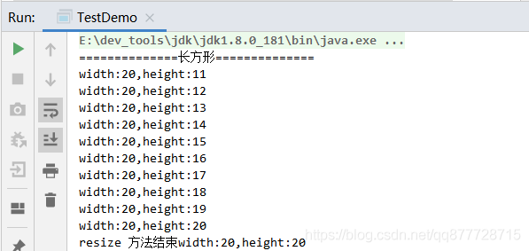

调用testSquare()方法测试正方形，出现了死循环，违背了里氏替换原则，将父类替换为子类后，程序运行结果没有达到预期。因此，我们的代码设计是存在一定风险的。里氏替换原则只存在父类与子类之间，约束继承泛滥。

我们再来创建一个基于长方形与正方形共同的抽象四边形 Quadrangle
```
public interface Quadrangle {
    int getHeight();
    int getWidth();
}
```

修改长方形 Rectangle 类：
```
public class Rectangle implements Quadrangle {
    //高
    private int height;
    //宽
    private int width;

    @Override
    public int getHeight() { return height; }
    public void setHeight(int height) { this.height = height; }
    
    @Override
    public int getWidth() { return width; }
    public void setWidth(int width) {
        this.width = width;
    }
}
```

修改正方形类 Square 类：
```
public class Square implements Quadrangle {
    //边长
    private int side;

    public int getSide() { return side; }
    public void setSide(int side) { this.side = side; }
    
    @Override
    public int getHeight() { return side; }
    @Override
    public int getWidth() {
        return side;
    }
}
```

此时，如果我们把resize()方法的参数换成四边形 Quadrangle 类，方法内部就会报错，因为正方形 Square已经没有了setWidth()和 setHeight()方法了。**因此，为了约束继承泛滥，resize()的方法参数只能用 Rectangle 长方形**。

## 5.开闭原则
### 5.1.概述
开闭原则（Open Close Principle，OCP）：开放扩展、关闭修改。抽象出接口，通过实现接口 或 继承类进行扩展，但尽量不要修改接口。

- 一句话: 对扩展开放，对修改关闭。在程序需要进行拓展的时候，不能去修改原有的代码，实现一个热插拔的效果。简言之，是为了使程序的扩展性好，易于维护和升级。想要达到这样的效果，我们需要使用 "接口" 和 "抽象类"。
- 开闭原则是编程中最基础、最重要的设计原则。编程中遵循其它原则，以及使用设计模式的目的就是遵循开闭原则。
  - 一个类应该对扩展开放(对提供方)，对修改关闭(对使用方)。也就是需要变化时，尽量通过重新派生一个实现类来实现变化，而不是通过修改已有的代码来实现变化。用抽象构建框架，用实现扩展细节。

**举个违反开闭原则的例子：**

矩形Retangle和圆形Circle继承了图形类Shape（提供方），画图类GraphicEditor（使用方）会调用矩形和圆形类的相关属性。

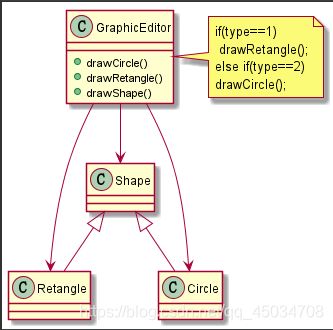

但是如果再新增一个三角形，就要在使用方画图类GraphicEditor新增对应方法，修改地方较多，违背开闭原则。

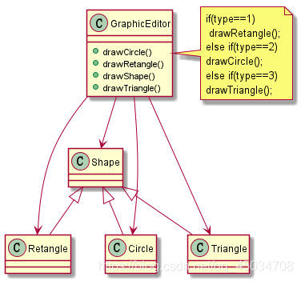

改进：把图形类Shape做成抽象类并提供抽象方法draw，让子类去实现即可。当新增图形种类时，只需让新的图形类继承Shape，并实现draw方法即可。使用方的代码就不需要修改，满足开闭原则。

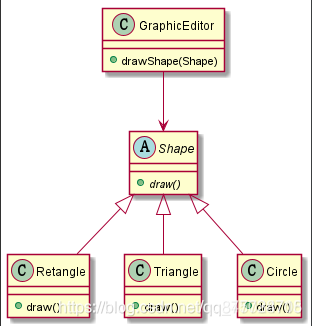

### 5.2.举个栗子
以超市里面的商品需要出售为例子。

新建一个商品接口：
```
public interface IGoods {
	//获取名称
    String getName();
    //获取价格
    Double getPrice();
}
```

新建一个白菜商品类：
```
public class Cabbage implements IGoods {
    private String name;
    private Double price;

    public Cabbage(String name, Double price) {
        this.name = name;
        this.price = price;
    }
    
    @Override
    public String getName() {   return this.name;    }
    
    @Override
    public Double getPrice() {   return this.price;  }
}
```

问题来了，这时候到了晚上了，白菜要打0.5折清仓，。这时候应该怎么做？

1. 直接改白菜商品类的getPrice()方法？不可行，万一别处也在调用，可能会影响到其他地方。

2. 那直接改接口呢，新增一个打折方法？假如有几千种商品，我就只有白菜这一个商品需要打折呢，那么这显然也不合理

3. 直接在白菜类里面单独新增一个打折方法？

这些方法看似可行，但是都违背了开闭原则中的对修改关闭。**所以我们的做法是遵循开闭原则，不应在原有类中修改，新增一个白菜打折类 ，扩展原有白菜类的功能**，代码如下：
```
public class CabbageDiscount extends Cabbage{
    public CabbageDiscount(String name, Double price) {
        super(name, price);
    }


    //折扣价
    public Double getDiscountPrice(){
        return super.getPrice()*0.5;
    }
}
```

这样子就符合了开闭原则，扩展灵活，后续有其他商品需要打折可以一样处理

### 6.迪米特原则
## 6.1.概述
迪米特原则，又称最少知道原则（Demeter Principle）：使用其它模块时只关心暴露出来的接口，不关系内部的具体实现

- 一句话: 一个对象应该对其他对象保持最少的了解，和朋友交流，不和陌生人(非直接朋友)说话。
- 即一个类对自己依赖的类(自己使用的类)知道的越少越好，核心是降低类之间的耦合。也就是说，对于被依赖的类(被使用的类)不管多么复杂，都尽量将逻辑封装在类的内部。对外除了提供的public 方法，不对外泄露任何信息。
  - 避免与非直接朋友的耦合，只与直接的朋友通信，所谓的 “直接朋友” 是指出现在当前类成员变量，方法参数，方法返回值中的类。而 “非直接朋友”是指出现在局部变量中的类。也就是说，陌生的类最好不要以 "局部变量" 的形式出现在类的内部。
```
成员变量：定义在方法外
局部变量：定义在代码块、方法参数列表、方法体内
```
比如有学院员工类 CollegeEmployee和学校员工类 SchoolEmployee，然后各有一个管理类(学院管理类CollegeManager、学校管理类SchoolManager)有可以获取其所有员工，学校员工管理类有方法打印全部员工。

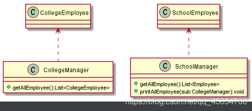

具体代码
```
void printAllEmployee(CollegeManager sub) {
		//获取到学院员工
		List<CollegeEmployee> list1 = sub.getAllEmployee();
		System.out.println("---学院员工---");
		for (CollegeEmployee e : list1) {
			System.out.println(e.getId());
		}
		//获取到学校总部员工
		List<Employee> list2 = this.getAllEmployee();
		System.out.println("---学校员工---");
		for (Employee e : list2) {
			System.out.println(e.getId());
		}
	}
```

分析学校管理类SchoolManager：发现员工类Employee和学校管理类CollegeManager都是它的直接朋友（出现在参数和返回值中），但学院员工类CollegeEmployee不是直接朋友，是以局部变量的形式，违背了迪米特原则。

你以前是不是就这样写的，细思极恐，当头一棒

改进：避免依赖学院员工类CollegeEmployee，将该类封装在学院管理类CollegeManager中，对外提供public方法即可。

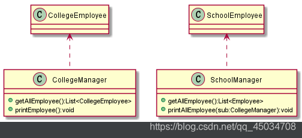

### 6.2.举个栗子
比如说上面的超市售卖的商品青菜，老板(Boss)想知道卖出去了多少斤

首先新建一个青菜商品：
```
public class Cabbage {
    public void getName(){
        System.out.println("上海青");
    }
    //售卖记录
    public void saleRecord(){
        System.out.println("我今天卖出去了100斤");
    }
}
```

一般做法可以在Boss类里面集成Cabbage类，这样就可以拿到售卖记录，但是这就违背了迪米特法则，因为老板Boss类不应该直接和商品类Cabbage 打交道，要不然商品一多，老板哪有闲情自己一个个去查，所以一般Boss类可以找对应的Manager经理类获取结果。

再新建一个经理类：
```
public class Manager {
    private Cabbage cabbage;
    public Manager(Cabbage cabbage){
    	this.cabbage = cabbage;
    }
	//获取白菜的销售记录
    public void getCabbageSaleRecord(){
        cabbage.saleRecord();
    }
}
```

最后再新建Boss类：
```
public class Boss {
    private Manager manager;
    public Boss (Manager manager){
    	this.manager= manager;
    }
    //向经理询问白菜销售金额
    public void getCabbageSaleRecord(Manager manager){
        manager.getCabbageSaleRecord();
    }
}
```

可以看到Boss完全不需要和青菜打交道，找经理就好了，这就是迪米特法则，不该知道的不要知道，我只要让该知道的人知道就好了，你想知道那你就去找那个该知道的人。<font color=#ff00a>中介者模式</font>就是一种典型的遵守了迪米特法则的设计模式。

## 7.合成复用原则
### 7.1.概述
组合复用原则，又称组合/聚合复用原则（Composite Reuse Principle）：要尽量先使用组合(has-a)或者聚合(contains-a)等关联关系来代替继承( is -a)实现复用，这样可以使系统更加灵活，降低类与类之间的耦合度，一个类的变化对其他类造成的影响相对较少。 <font color=#ff00a>eg. controller要使用某个service，尽量写成成员变量包含进来，而不是继承service</font>

- 一句话: 尽量使用依赖、组合、聚合的方式，而不是使用继承。
- 继承 通常也称之为白箱复用，相当于把所有的实现细节暴露给子类。组合/聚合 也称之为黑箱复用，对类以外的对象是无法获取到实现细节的。

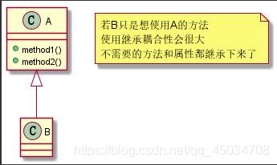

依赖

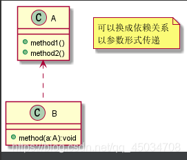

聚合

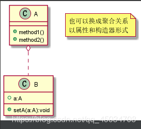

组合

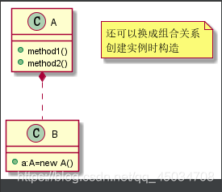

### 7.2.举个栗子
以数据库操作为例，先来创建 DBConnection 类：
```
public abstract class DBConnection {
    public abstract String getConnection();
}
```

将 支撑MySQL 的逻辑抽离：
```
public class MySQLConnection extends DBConnection {
    @Override
    public String getConnection() {
        return "MySQL 数据库连接";
    }
}
```

将 支撑Oracle 的逻辑抽离：
```
public class OracleConnection extends DBConnection {
    @Override
    public String getConnection() {
        return "Oracle 数据库连接";
    }
}
```

创建 ProductDao 类：
```
public class ProductDao{
    private DBConnection dbConnection;
    public void setDbConnection(DBConnection dbConnection) {
        this.dbConnection = dbConnection;
    } 
    public void addProduct(){
        String conn = dbConnection.getConnection();
        System.out.println("使用"+conn+"增加产品");
    }
}
```

最后看下类图结构，更加容易理解(组合尾部为实心菱形的实现箭头)

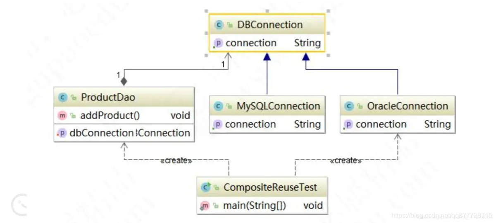

通过抽象类 继承 的方式 定义了所有的数据库 都是 DBconnection 都可以获取 数据库 在Dao 层 引入了数据库 因为增加产品方法和 数据库之间属于组合 has -a 关系 。

## 8.小结
1. 针对接口编程，而不是针对实现编程 。

2. 把应用中可能需要变化的代码和不需要变化的代码剥离。


# 设计模式概括
设计模式是对大家实际工作中写的各种代码进行高层次抽象的总结，使用设计模式是为了可重用代码、让代码更容易被他人理解、保证代码可靠性、程序的重用性。，其中最出名的当属Gang of Four (GoF) 的分类了，他们将设计模式分类为23 种经典的模式，根据用途我们又可以分为三大类

- 创建型模式（Creational Patterns）
- 结构型模式（Structural Patterns）
- 行为型模式（Behavioral Patterns）

**其中创建型模式比较简单，但是会比较没有意思，结构型和行为型比较有意思。**

## 0.用设计模式的好处
1. 代码重用性 ：即相同功能的代码，不用多次编写
2. 可读性：即编程规范性, 便于其他程序员的阅读和理解
3. 可扩展性：即当需要增加新的功能时，非常的方便，也称为可维护性
4. 可靠性：即当我们增加新的功能后，对原来的功能没有影响
5. 使程序呈现高内聚，低耦合的特性，模块内部紧密，但模块间依赖小，一者出错不影响他者

## 1.创建型模式（共5种）
主要关注在创建对象的同时隐藏创建逻辑的方式，而不是使用 new 运算符直接实例化对象。将对象的创建于使用分离，这使得程序在判断针对某个给定实例需要创建哪些对象时更加灵活。

创建型模式的作用就是创建对象，说到创建一个对象，最熟悉的就是 new 一个对象，然后 set 相关属性。但是，在很多场景下，我们<font color=#ff00a>需要给客户端提供更加友好的创建对象的方式，尤其是那种我们定义了类，但是需要提供给其他开发者用的时候</font>。


|<div style="width:150px">模式</div>	| <div style="width:150px">英文</div> | 一句话总结 |
| :------| :------ | :------: |
| 单例模式(常见) | Singleton Pattern | 只为对象提供一个全局的访问点（世上只有一个地球）|
|工厂模式(常见) | Factory Pattern | 由子类来决定创建具体对象 |
| 抽象工厂模式(常见)|Abstract Factory Pattern|允许使用者创建对象的家族，无需指定具体类|
|建造者模式|Builder Pattern|允许使用者自由搭配组合对象|
|原型模式(常见)|Prototype Pattern|通过复制原对象来创建新对象|

## 2.结构型模式（共7种）
主要关注类和对象的组合。虽然面向对象的继承机制提供了最基本的子类扩展父类的功能，但结构型模式不仅仅简单地使用继承，而更多地通过组合与运行期的动态组合来实现更灵活的功能。

|<div style="width:150px">模式</div>	| <div style="width:150px">英文</div> | 一句话总结 |
| :------| :------ | :------: |
|适配器模式(常见)|Adapter Pattern|兼容转换(我所做的一切，只是为了配得上你)兼容客户类对目标类的调用，使客户类能够按自己期望的方式调用目标类|
|装饰器模式(常见)|Decorator Pattern|在不修改原对象的情况下为对象附加新的功能|
|代理模式(常见)|Proxy Pattern|增强对象功能|
|外观模式(门面模式)|Facade Pattern|统一访问入口（拨开云雾见天日）|
|桥接模式(桥梁模式)|Bridge Pattern|将抽象与具体分离开来|
|组合模式|Composite Pattern|以树形结构统一整体和个体的处理方式|
|享元模式|Flyweight Pattern|共享资源池（节省资源，从我做起）|

## 3.行为型模式（共11种）
行为型模式 **关注对象之间的通信**。 通过使用对象组合，使一组对象协作来完成一个整体任务。

|<div style="width:150px">模式</div>	| <div style="width:150px">英文</div> | 一句话总结 |
| :------| :------ | :------: |
|策略模式(常见)|	Strategy Pattern|	定义可互相替换策略，使用者爱用哪个用哪个(条条道路通罗马)|
|模板模式 (常见)|	Template Pattern|	定义完整流程，只允许子类微调|
|观察者模式(常见)|	Observer Pattern|	解耦观察者和被观察者，状态发生改变时主动通知观察者|
|迭代器模式|	Iterator Pattern|	统一对集合的访问方式|
|责任链模式 (常见)	|Chain of Responsibility Pattern|	链路上每个对象只处理自己能处理的(个人自扫门前雪，休管他人瓦上霜)|
|命令模式|	Command Pattern|	将请求与处理进行解耦(运筹帷幄之中，决胜千里之外)|
|备忘录模式|	Memento Pattern|	备份对象(专卖“后悔药”)|
|状态模式|	State Pattern|	绑定状态和行为|
|访问者模式(常见)|	Visitor Pattern|	解耦数据结构和数据操作|
|中介者模式 (常见)|	Mediator Pattern|	将网状结构统一通过中介进行管理|
|解释器模式|	Interpreter Pattern|	实现特定语法的解析(我的地盘我做主)|

## 4.设计模式之间的关系

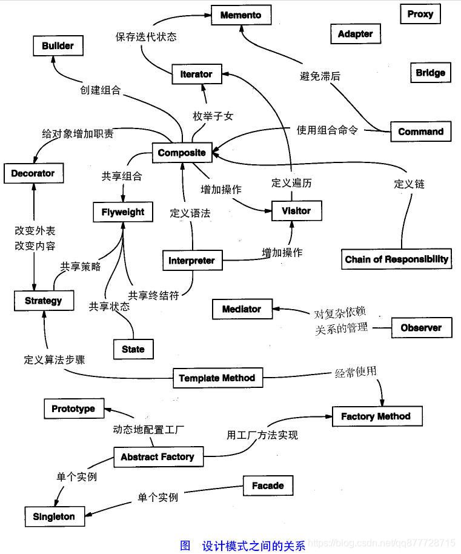

# 拓展模式(等写完23种基本模式后面拓展)
## J2EE模式
**这些设计模式特别关注表示层。这些模式是由 Sun Java Center 鉴定的**

- MVC 模式（MVC Pattern）
- 业务代表模式（Business Delegate Pattern）
- 组合实体模式（Composite Entity Pattern）
- 数据访问对象模式（Data Access Object Pattern）
- 前端控制器模式（Front Controller Pattern）
- 拦截过滤器模式（Intercepting Filter Pattern）
- 服务定位器模式（Service Locator Pattern）
- 传输对象模式（Transfer Object Pattern）

**扩展模式**
- 规则模式
- 对象池模式
- 雇工模式
- 黑板模式
- 空对象模式
