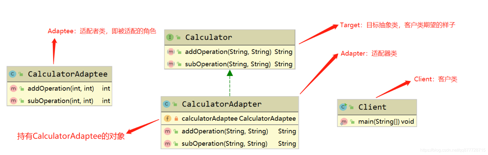
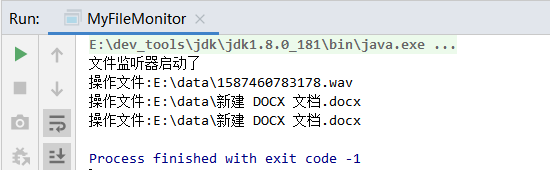
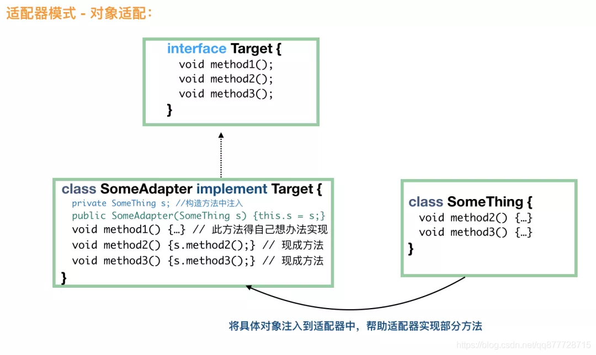
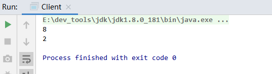
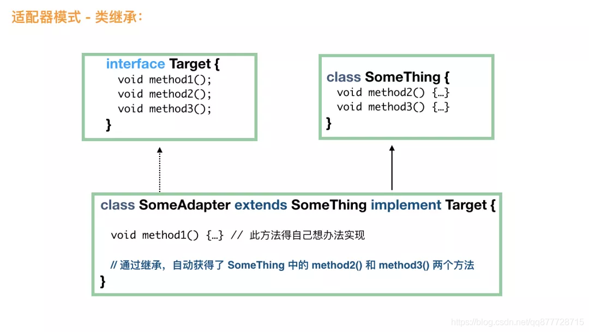
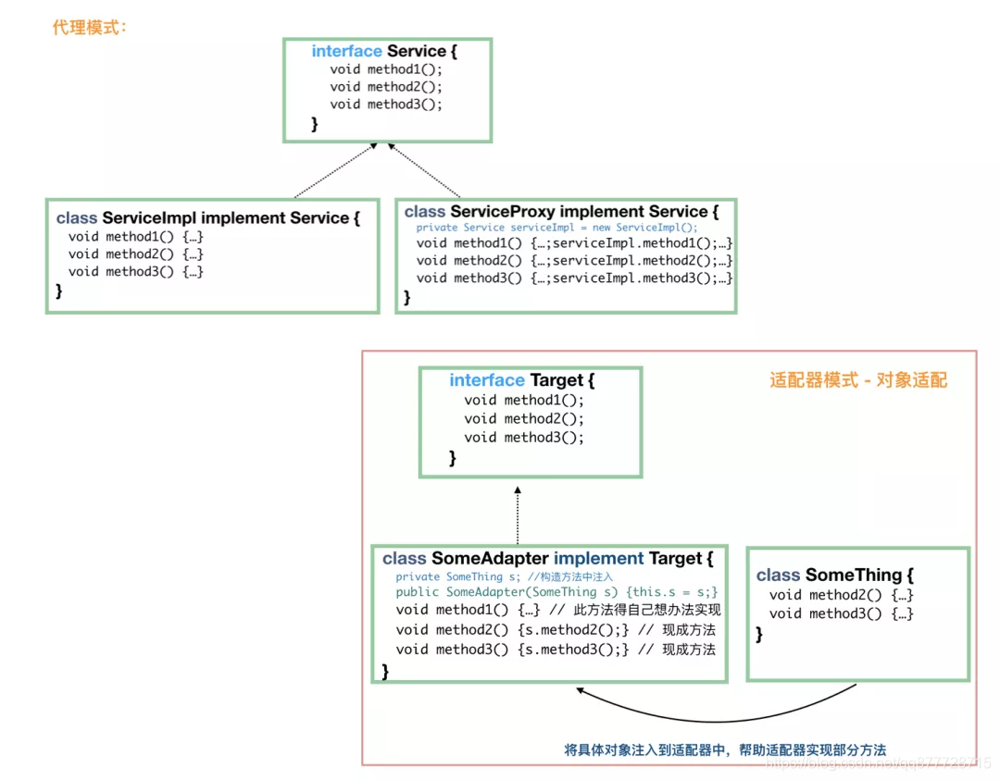
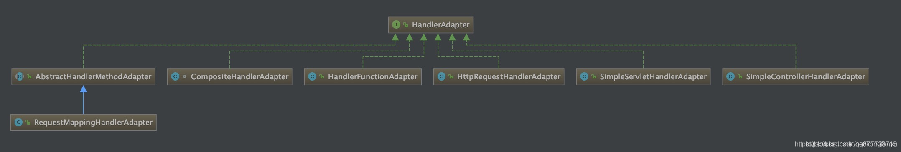

# 一.适配器模式

**适配器模式（Adapter Pattern）是指将一个类的接口转换成符合调用方规范的另一个接口，使原本的接口不兼容的类可以一起工作**

- 适配器模式又叫做<font color=#ff00a>变压器模式</font>，也叫做<font color=#ff00a>包装模式（Wrapper）</font>，但是包装模式可不止一个，还包括<font color=#ff00a>装饰者模式</font>。
- 适配器模式有3种实现；

    1. 默认适配器
    2. 对象适配器
    3. 类适配器

生活中的场景：

- 生活中电源插座转接口，
- 电脑视频输出的转接头，
- 手机充电转接头，
- 笔记本电源(适配器)

适配器模式本质：

- **原有类方法较难修改或修改风险较高，调用者类又必须使用原有代码功能，但是无法遵守原有方法的接口标准；<font color=#ff00a>为了保持开闭原则，避免对原有类的修改</font>，可以使用适配器模式作为调用方类和原有功能之间的桥梁。**
- 在适配器模式中可以定义一个<font color=#ff00a>包装类xxxAdapter，包装不兼容接口的对象</font>，这个包装类指的就是<font color=#ff00a>适配器(Adapter)</font>，它所包装的对象就是<font color=#ff00a>适配者(Adaptee)，即被适配的类</font>。
  - 也就是说：当调用者类调用适配器的方法时，<font color=#ff00a>在适配器(Adapter)类的内部将调用适配者适配者(Adaptee)类的方法</font>，而这个过程对调用者是透明的，调用者类并不直接访问适配者类。因此，适配器可以使由于接口不兼容而不能交互的类可以一起工作。

# 二.适配器模式适用场景

1. 针对<font color=#ff00a>已经存在的类</font>，它的方法和需求不匹配（方法结果相同或相似） 的情况。
2. 适配器模式<font color=#ff00a>不是软件设计阶段考虑的设计模式，是随着软件维护</font>，产生了**许多功能类似而接口不相同情况下的一种解决方案**。

# 三.适配器模式角色

本UML类图是以<font color=#ff00a>对象适配器</font>方式进行描述的




**适配器模式包含如下角色：**

- **Target（目标抽象类）**：定义客户类所期望的接口方法(<font color=#ff00a>即适配器将要实现的方法</font>)，可以是一个<font color=#ff00a>抽象类或接口</font>，也可以是<font color=#ff00a>具体类</font>。

  > 该角色定义把适配者转换为何种接口，也就是我们的期望接口。

- **Adaptee（适配者类/源角色）**：即<font color=#ff00a>被适配的类</font>，一个现存需要适配的接口，<font color=#ff00a>适配者类一般是一个具体类，包含了客户类希望使用的业务方法</font>，在某些情况下可能没有适配者类的源代码。

- **Adapter（适配器类）**：是一个具体的类，负责<font color=#ff00a>Adaptee(适配者类)</font>转换成<font color=#ff00a>Target(目标抽象类)</font>进行适配，是适配器模式的<font color=#ff00a>核心</font>，在对象适配器中，它**通过<font color=#ff00a>继承/实现Target</font>(目标抽象类）并<font color=#ff00a>关联一个Adaptee(适配者类)对象</font>使二者产生联系**。

  > 通过包装被适配对象(Adaptee)，<font color=#ff00a>把原接口转换成目标接口(Target)</font>

- **Client（客户类/调用者）**：实际需要使用Adaptee功能的类

# 四.Java中适配器模式的实现方式

## 0.案例: 把鸡当鸭用

如何通过适配器模式把鸡也能当鸭来用，现在鸭这个接口，我们没有合适的实现类可以用，所以需要一个<font color=#ff00a>适配器adapter</font>。

```java
//鸭接口
public interface Duck {
	// 鸭的嘎嘎叫
    public void quack(); 
     // 飞
    public void fly();
}
//鸡接口
public interface Chicken {
	 // 鸡的咕咕叫
    public void gobble();
     // 飞
    public void fly();
}
//野鸡类，实现了鸡接口
public class WildChicken implements Chicken {
    public void gobble() {
        System.out.println("咕咕叫");
    }
    public void fly() {
        System.out.println("鸡也会飞哦");
    }
}
```


鸭接口有 fly() 和 quack()2个方法，鸡 Chicken 如果要冒充鸭，fly() 方法是现成的，但是鸡不会鸭的<font color=#ff00a>嘎嘎叫，没有 quack() 方法</font>。这个时候就需要适配器了：

```java
// 毫无疑问，首先，这个适配器肯定需要 implements Duck，这样才能当做鸭来用
public class ChickenAdapter implements Duck {
  
    private Chicken chicken;
    // 构造方法中需要一个鸡的实例，此类就是将这只鸡适配成鸭来用
   public ChickenAdapter(Chicken chicken) {
        this.chicken = chicken;
    }
  
    // 实现鸭的嘎嘎叫方法
    @Override
   public void quack() {
        // 内部其实是一只鸡的咕咕叫
        chicken.gobble();
    }
  
   @Override
   public void fly() {
        chicken.fly();
    }
}
```


客户端调用

```java
public static void main(String[] args) {
    // 有一只野鸡
   Chicken wildChicken = new WildChicken();
   // 成功将野鸡适配成鸭
   Duck duck = new CockAdapter(wildChicken);
   	//调用鸭嘎嘎叫方法，实际上确实鸡在叫
 	duck.quack();
 	duck.fly();
}
```

- 
  大家也就知道了适配器模式是怎么回事了？ 无非是我们需要一只鸭，但是我们只有一只鸡，这个时候就需要定义一个适配器，由这个适配器来充当鸭，但是适配器里面的方法还是由鸡来实现的。

## 1.默认适配器方式

看最简单的适配器模式 默认适配器模式(Default Adapter) 是怎么样的。

- Appache commons-io 包中的<font color=#ff00a>FileAlterationListener</font>接口 做例子，该接口定义了很多的方法，<font color=#ff00a>用于对文件或文件夹进行监控，一旦发生了对应的操作，就会触发相应的方法</font>。

引入依赖

```
<dependency>
   <groupId>commons-io</groupId>
   <artifactId>commons-io</artifactId>
   <version>2.8.0</version>
</dependency>
```

**监听器 FileAlterationListener 用于实现文件改变时触发的方法**

```java
public interface FileAlterationListener {
    void onStart(final FileAlterationObserver observer);
    void onDirectoryCreate(final File directory);
    void onDirectoryChange(final File directory);
    void onDirectoryDelete(final File directory);
    void onFileCreate(final File file);
    void onFileChange(final File file);
    void onFileDelete(final File file);
    void onStop(final FileAlterationObserver observer);
}
```

- 
  实现FileAlterationListener 接口就要实现该接口下的所有方法，我们只是想要<font color=#ff00a>监控文件夹中的文件创建和文件删除事件</font>，可是我们还是不得不实现所有的方法，很明显，这不是我们想要的。

因此：

**声明一个适配器（FileAlterationListenerAdaptor）实现FileAlterationListener接口，实现后的<font color=#ff00a>所有的方法都是空方法</font>，**

```java
public class FileAlterationListenerAdaptor implements FileAlterationListener {

    void onStart(final FileAlterationObserver observer);

    void onDirectoryCreate(final File directory);

    void onDirectoryChange(final File directory);

    void onDirectoryDelete(final File directory);

    void onFileCreate(final File file);

    void onFileChange(final File file);

    void onFileDelete(final File file);

    void onStop(final FileAlterationObserver observer);
}
```


然后在<font color=#ff00a>定义自己的类MyFileListener 来继承FileAlterationListenerAdaptor类</font>即可。

```java
public class MyFileListener extends FileAlterationListenerAdaptor {
    public void onFileCreate(final File file) {
        // 文件创建
        doSomething(file);
    }

    public void onFileDelete(final File file) {
        // 文件删除
        doSomething(file);
    }

    /**
     * 自己的逻辑
     * @param file
     */
    public void doSomething(File file) {
        System.out.println("操作文件:"+file);
    }
}
```


测试方法

```java
    public static void main(String[] args) throws InterruptedException {
    	//声明监视器 FileAlterationMonitor，通过一个线程，每间隔一段时间调用一次注册的观察者检查文件。
        FileAlterationMonitor fileAlterationMonitor = new FileAlterationMonitor();
        
        //声明监听规则,这里监听文件夹 以及 文件
        IOFileFilter filter = FileFilterUtils.or(FileFilterUtils.directoryFileFilter(), FileFilterUtils.fileFileFilter());
		//声明观察者 FileAlterationObserver用于观察文件的改变，通知注册的监听器执行相应的事件。检查E:\\data的所有文件和文件夹的改变
        FileAlterationObserver fileAlterationObserver = new FileAlterationObserver(new File("E:\\data"), filter);
        
		//向观察者中注册监听事件
        fileAlterationObserver.addListener( new MyFileListener());
        //向监视器中注册观察者
        fileAlterationMonitor.addObserver(fileAlterationObserver);
        try {
          	//启动监听
            fileAlterationMonitor.start();
            System.out.println("文件监听器启动了 ");
        } catch (Exception e) {
            System.out.println("文件监听启动失败->"+e.getMessage());
        }

		//主线程休眠5分钟
        TimeUnit.MINUTES.sleep(5);
    }
```


测试结果



## 2.对象适配器方式

**通过<font color=#ff00a>类的关联关系(组合)跟被适配对象(Adaptee)</font>整合，一般<font color=#ff00a>适配器(Adapter)</font>会持有<font color=#ff00a>适配者(Adaptee)</font>的引用，在设计时也比较灵活**



**Adaptee（适配者类）**

```java
/*(
 * 适配者类，即被适配的角色
 * 算数运算类，出入参必须是int类型
 */
public class CalculatorAdaptee {

    /**
     * 求a + b
     *
     * @param a
     * @param b
     * @return
     */
    public int addOperation(int a, int b) {
        return a + b;
    }

    /**
     * 求a - b
     *
     * @param a
     * @param b
     * @return
     */
    public int subOperation(int a, int b) {
        return a - b;
    }
}
```

**Target（目标抽象类）**

```java
/**
 * 目标抽象类
 * 算数运算，出入参必须是String，客户类所能接受的样子
 */
public interface Calculator {

    /**
     * 求a + b
     *
     * @param a
     * @param b
     * @return
     */
    String addOperation(String a, String b);

    /**
     * 求a - b
     *
     * @param a
     * @param b
     * @return
     */
    String subOperation(String a, String b);
}
```

**Adapter（适配器类）**

- 持有适配者引用(Adaptee)，实现<font color=#ff00a> 目标抽象类接口(Target)</font>，重写目标抽象方法, 在方法内通过适配者引用 调用真实方法

```java
/**
 * 适配器类
 * 承担客户端和CalculatorAdaptee目标类之间的桥梁
 */
public class CalculatorAdapter implements Calculator {
    private CalculatorAdaptee calculatorAdaptee;
    
    //传入一个具体适配者类
    public CalculatorAdapter(CalculatorAdaptee calculatorAdaptee) {
		this.calculatorAdaptee = calculatorAdaptee;
	}

    @Override
    public String addOperation(String a, String b) {
        int ai = Integer.parseInt(a);
        int bi = Integer.parseInt(b);
        int sum = calculatorAdaptee.addOperation(ai, bi);
        return String.valueOf(sum);
    }

    @Override
    public String subOperation(String a, String b) {
        int ai = Integer.parseInt(a);
        int bi = Integer.parseInt(b);
        int sub = calculatorAdaptee.subOperation(ai, bi);
        return String.valueOf(sub);
    }
}
```


**Client（客户类/调用者）**

```java
public class Client {
    public static void main(String[] args) {
        Calculator calculator = new CalculatorAdapter(new CalculatorAdaptee());
        System.out.println(calculator.addOperation("5", "3"));
        System.out.println(calculator.subOperation("5", "3"));
    }
}
```


测试结果



## 3.类适配器方式

**通过<font color=#ff00a> 继承关系</font>进行适配，<font color=#ff00a> 类适配器(Adapter)</font>一般是通过<font color=#ff00a> 重写目标抽象类(Target)</font>的方法进行扩展**



看到这个图，大家应该很容易理解的吧，通过继承的方法，适配器自动获得了所需要的大部分方法。这个时候，客户端使用更加简单，直接**Target t = new SomeAdapter();**就可以了。


**Adaptee（适配者类）**

```java
/*(
 * 适配者类，即被适配的角色
 * 算数运算类，出入参必须是int类型
 */
public class CalculatorAdaptee {

    /**
     * 求a + b
     *
     * @param a
     * @param b
     * @return
     */
    public int addOperation(int a, int b) {
        return a + b;
    }

    /**
     * 求a - b
     *
     * @param a
     * @param b
     * @return
     */
    public int subOperation(int a, int b) {
        return a - b;
    }
}
```

**Target（目标抽象类）**

- 继承适配器(Adpater)实现目标抽象类接口(Target)

```java
/**
 * 目标抽象类
 * 算数运算，出入参必须是String，客户类所能接受的样子
 */
public interface Calculator {

    /**
     * 求a + b
     *
     * @param a
     * @param b
     * @return
     */
    String addOperation(String a, String b);

    /**
     * 求a - b
     *
     * @param a
     * @param b
     * @return
     */
    String subOperation(String a, String b);
}
```

**Adapter（适配器类）**

- 继承适配者(Adpatee)实现目标抽象类接口(Target)，重写目标抽象方法， 在方法内调用继承自适配者的真实方法

```java
/**
 * 适配器类(类适配器)
 * 承担客户端和CalculatorAdaptee目标类之间的桥梁
 */
public class CalculatorAdapter extends CalculatorAdaptee implements Calculator {

    @Override
    public String addOperation(String a, String b) {
        int ai = Integer.parseInt(a);
        int bi = Integer.parseInt(b);
        int sum = super.addOperation(ai, bi);
        return String.valueOf(sum);
    }

    @Override
    public String subOperation(String a, String b) {
        int ai = Integer.parseInt(a);
        int bi = Integer.parseInt(b);
        int sub = super.subOperation(ai, bi);
        return String.valueOf(sub);
    }
}
```

**Client（客户类/调用者）**

```java
public class Client {
    public static void main(String[] args) {
        Calculator calculator = new CalculatorAdapter();
        System.out.println(calculator.addOperation("5", "3"));
        System.out.println(calculator.subOperation("5", "3"));
    }
}
```


测试结果


## 4.类适配和对象适配的异同

- 一个采用继承，一个采用组合；
- 类适配属于<font color=#ff00a> 静态实现</font>，对象适配属于<font color=#ff00a> 组合的动态实现，对象适配需要多实例化一个对象</font>。总的来说，对象适配用得比较多。

# 五.总结

## 1.适配器模式的优缺点

**优点**

- 通过引入一个适配器类来重用现有的适配者类 可以在不修改原有代码的基础上来复用现有类，很好地符合 “开闭原则”;

**缺点**

- 过多使用适配器会使得系统非常凌乱，明明调用的是A接口，内部却被适配成了B接口。因此除非必要，不推荐使用适配器，而是直接对系统重构


## 2.适配器模式与装饰者模式比较

1. 适配器模式与装饰者模式比较类似，但是<font color=#ff00a> 装饰者模式主要是添加新的功能</font>，而适配器模式主要做的是转换工作。
2. 适配器将一个对象<font color=#ff00a> 包装起来以改变其接口</font>；装饰者将一个对象<font color=#ff00a> 包装起来以增加新的属性和方法</font>。

## 3.适配器模式和代理模式的比较

- 两者在代码结构上，它们很相似，都需要一个具体的实现类的实例。但是它们的目的不一样，**代理模式的目的是<font color=#ff00a> 增强原方法</font>；适配器模式的目的是<font color=#ff00a> 适配2个接口</font>，为的是提供“把鸡包装成鸭，然后当做鸭来使用”，而鸡和鸭它们之间原本没有继承关系**。



## 4.适配器模式在spring中的体现

Spring中适配器模式也应用非常广泛，例如SpringAOP中的AdvisorAdapter类，它有2个实现类: MethodBeforeAdviceAdapter、AfterReturnningAdvisorAdapter、和ThrowsAdvisorAdapter。

顶层接口AdvisorAdapter的源码:

```java
public interface AdvisorAdapter {
	boolean supportsAdvice(Advice advice);
	MethodInterceptor getInterceptor(Advisor advisor);
}
```


再看MethodBeforeAdviceAdapter类:

```java
@SuppressWarnings("serial")
class MethodBeforeAdviceAdapter implements AdvisorAdapter, Serializable {
	@Override
	public boolean supportsAdvice(Advice advice) {
		return (advice instanceof MethodBeforeAdvice);
	}
	@Override
	public MethodInterceptor getInterceptor(Advisor advisor) {
		MethodBeforeAdvice advice = (MethodBeforeAdvice) advisor.getAdvice();
		return new MethodBeforeAdviceInterceptor(advice);
	}
}
```


SpringMVC中的HandlerAdapter类，也有多个子类




---

[java 监听文件或者文件夹变化的几种方式](https://www.cnblogs.com/appium/p/10172585.html)

[Java实现实时监控目录下文件变化的方法](https://www.jb51.net/article/157855.htm)

[Java中实时监控目录下文件变化的两种实现方法](https://blog.csdn.net/tianshan2010/article/details/103867014)

[Java实现监听文件变化的监听器](https://blog.csdn.net/u013223806/article/details/85858494)


