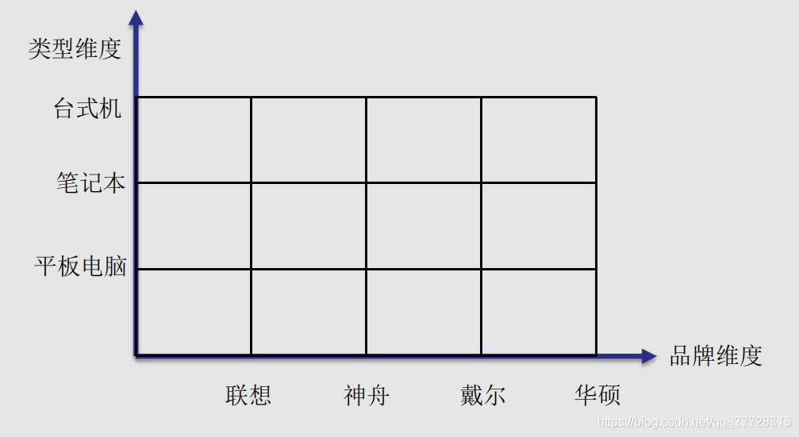
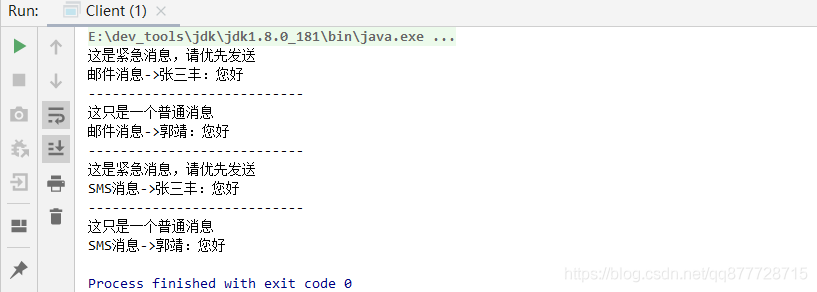

# 一.桥接模式

**桥接模式（Bridge Pattern）也叫做桥梁模式， 使用<font color=#ff00a> 组合</font>代替继承建立类之间的关系，将抽象和具体实现解耦，使得两者可以独立地变化。**

- 是一个非常简单的模式，它只是使用了<font color=#ff00a>类间的聚合关系、继承、重写</font>等常用功能，但是它却提供了一个非常清晰、稳定的架构。
- 桥接模式也是通过<font color=#ff00a>组合</font>来实现的。解耦的实质—就是 减少对象之间的关联，而继承是一种 "强关联"，一旦通过继承，子类就会拥有父类所有公开的方法和属性，有些可能并不是子类需要的，而 “组合” 就不一样，<font color=#ff00a>组合是一种 "弱关联"</font>，只是<font color=#ff00a>持有一个对象</font>且持有对象所拥有的功能并不是我的，和我并没有很强烈的关系。所以实质上在很多场景我们都可以通过组合来解耦继承对象之间的强关联关系。
- 编程原则：<font color=#ff00a>多用组合，少用继承</font>。

# 二.桥接模式适用场景

当<font color=#ff00a>一个类内部具有2种及以上维度变化</font>时，使用桥接模式可以解耦这些维度，使得高层代码结构稳定，桥接模式一般适用于以下场景：

1. 接口或者抽象类不稳定的场景

2. <font color=#ff00a>一个类存在2个或者2个以上独立变化的维度(如下面的)</font>，而这些维度又需要独立进行扩展时。

> 如以电脑为例子,有2个变化的维度：电脑类型(台式机、笔记本、 平板电脑）、电脑品牌(联想、神舟、戴尔、华硕)
>
> 

3. <font color=#ff00a>不希望使用继承</font>，或因为多层继承导致类的个数剧增时可以考虑使用桥接模式

> PS：桥接模式的其中一个目的就是为了替换继承


# 三.桥接模式角色

- **Implementor(抽象实现角色)**： 它是<font color=#ff00a>接口或者抽象类</font>，定义角色必需的行为(方法)和属性。

  > 定义角色需要实现的接口，这个接口不一定要与Abstraction的接口完全一致，事实上这两个接口可以完全不同，一般而言，Implementor接口仅提供基本操作，而Abstraction定义的接口可能会做更多更复杂的操作。Implementor接口对这些基本操作进行了声明，而具体实现交给其子类。通过关联关系，在Abstraction中不仅拥有自己的方法，还可以调用到Implementor中定义的方法，<font color=#ff00a>使用关联关系来替代继承关系</font>。

- **ConcreteImplementor(具体实现角色)**, 是Implementor的具体实现 ，通过实现Implementor定义的方法和属性。不同的ConcreteImplementor中可以提供的不同实现。

- **Abstraction(抽象角色)**： 一般为抽象类。该类持有一个个Implementor（实现角色）类型的对象，并通过构造方法传入一个ConcreteImplementor，它与Implementor之间具有关联(组合)关系，它既可以定义抽象业务方法，也可以定义自己的具体业务方法。

- **RefinedAbstractio(拓展抽象角色)** : 继承Abstraction，并通过构造方法传入一个ConcreteImplementor引用，通过重写Abstraction方法，以及调用ConcreteImplementor的具体业务方法来实现拓展


# 四.桥接模式的实现方式

**首先<font color=#ff00a>"消息类型" 是一个维度</font>，比如可以 “发邮件，发短信”。然后消息根据"消息紧急程度" 又可以有 “紧急消息，普通消息”。**

**Implementor(抽象实现角色)**
消息接口类

```java
/**
 * 消息接口类
 */
public interface IMessage {
    void send(String content,String toUser);
}
```

**ConcreteImplementor(具体实现角色)**
2个实现类，分别是邮件消息和短信消息

```java
/**
 * 短信消息
 */
public class SmsMessage implements IMessage {
    @Override
    public void send(String content, String toUser) {
        System.out.println(String.format("SMS消息->%s：%s",toUser,content));
    }
}
```

```java
/**
 * 邮件消息
 */
public class EmailMessage implements IMessage {
    @Override
    public void send(String content, String toUser) {
        System.out.println(String.format("邮件消息->%s：%s", toUser, content));
    }
}
```

**假如需要按普通消息和紧急消息来分别发不同的短信，一般是直接修改SmsMessage类，在分别去继承紧急消息UrgentMessage类和普通消息类CommonMsg：**

```java
//继承普通消息类实现IMessage接口
public class SmsMessage extends CommonMsg implements IMessage {}
```

- 
  Java是单继承，要么就把普通消息和紧急消息设置为接口，<font color=#ff00a>要么就作为组合的形式，将紧急消息和普通消息分别作为消息类型具体实现的成员变量</font>。但是不论是哪种形式，都需要修改原先的SmsMessage 类。

所以这时候就需要使用桥接模式，将 抽象(**消息类型)**与 实现(**消息紧急程度**)进行分离。

**Abstraction(抽象角色)**
新建一个抽象类，将IMessage集成进去

```java
/**
 * 抽象类，持有IMessage引用
 */
public abstract class AbstractMessage {
    protected IMessage iMessage;

    protected AbstractMessage(IMessage iMessage) {
        this.iMessage = iMessage;
    }

    public abstract void sendMessage(String content,String toUser);
}
```

**RefinedAbstractio(拓展抽象角色)**
紧急程度为普通的消息类

```java
/**
 * 紧急程度为普通的消息类
 */
public class CommonMsg extends AbstractMessage {
    public CommonMsg(IMessage iMessage) {
        super(iMessage);
    }

    @Override
    public void sendMessage(String content, String toUser) {
        this.doSomething();
        super.iMessage.send(content, toUser);
    }

    private void doSomething() {
        System.out.println("这只是一个普通消息");
    }
}
```


紧急程度为紧急的消息类

```java
/**
 * 紧急程度为紧急的消息类
 */
public class UrgentMessage extends AbstractMessage{
    public UrgentMessage(IMessage iMessage) {
        super(iMessage);
    }

    @Override
    public void sendMessage(String content, String toUser) {
        this.doSomething();
        super.iMessage.send(content, toUser);
    }

    private void doSomething() {
        System.out.println("这是紧急消息，请优先发送");
    }
}
```


要新增其他紧急程度那直接再建一个类就好了，非常方便。

**调用端**

```java
public class Client {
    public static void main(String[] args) {
        //声明消息类型维度-邮箱
        IMessage emailMessage = new EmailMessage();
        //紧急邮件消息
        AbstractMessage abstractMessage = new UrgentMessage(emailMessage);
        abstractMessage.sendMessage("您好", "张三丰");

        System.out.println("---------------------------");

        //普通邮件消息
        abstractMessage = new CommonMsg(emailMessage);
        abstractMessage.sendMessage("您好", "郭靖");

        System.out.println("---------------------------");
        //声明消息类型维度-短信
        IMessage smsMessage = new SmsMessage();
        //普通短信消息
         abstractMessage = new UrgentMessage(smsMessage);
        abstractMessage.sendMessage("您好", "张三丰");

        System.out.println("---------------------------");

        //普通短信消息
        abstractMessage = new CommonMsg(smsMessage);
        abstractMessage.sendMessage("您好", "郭靖");
    }
}
```


执行结果



# 五.总结

## 1.桥接模式的优缺点

**优点：**

- 桥接模式可以<font color=#ff00a>取代多层继承的方案</font>。也可以极大的减少子类的个数，从而降低维护和管理类的成本。

  > 多层继承违背了单一职责原则，复用性较差，类的个数也非常多。

- 在2个变化维度中任意扩展一个维度，只需要<font color=#ff00a>新增类</font>，无需修改代码，提高了拓展性，符合<font color=#ff00a>开闭原则</font>。

- 通过<font color=#ff00a>组合</font>而不是继承来实现耦合，符合<font color=#ff00a>合成复用原则</font>。

**缺点：**

- 增加了系统的理解难度和设计难度(<font color=#ff00a>这也算是大部分设计模式的共性</font>)
- 需要正确识别系统中各个独立变化的维度

## 2.桥接和装饰、适配器模式的不同

- 装饰者模式：主要是为了<font color=#ff00a>不改变原类的情况下，对原类附加新的功能</font>
- 适配器模式：主要是为了<font color=#ff00a>兼容转换客户类对目标类的调用，使客户类能够按自己期望的方式调用目标类</font>（目标类通常无法直接修改成客户类期望的样子）
- 桥接模式：主要是将一个<font color=#ff00a>有着多个维度的类进行拆分，以降低复杂度</font>，以满足各维度能够独立扩展和维护，然后通过聚合的方式使用这些维度的功能。