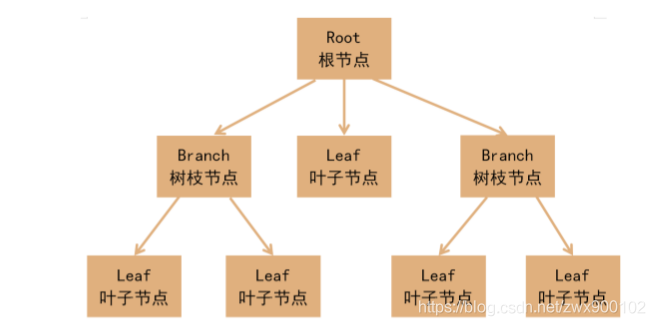
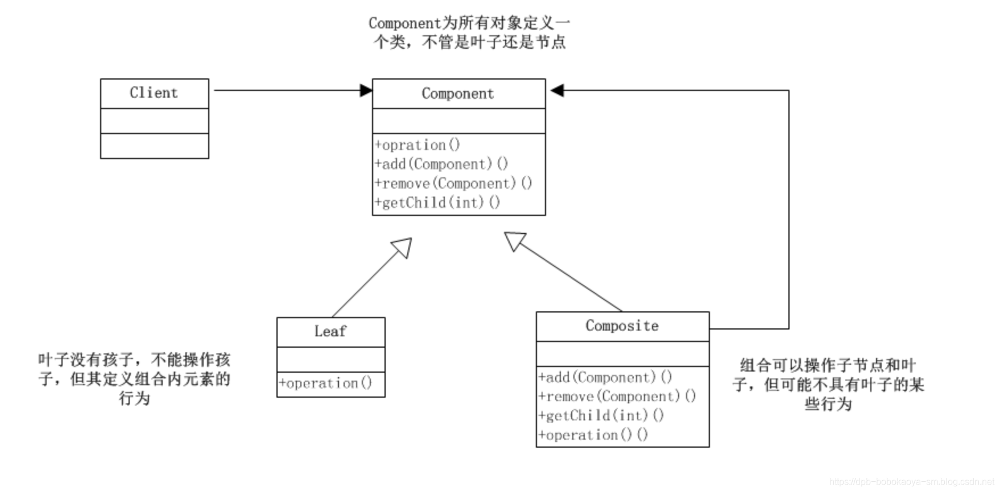
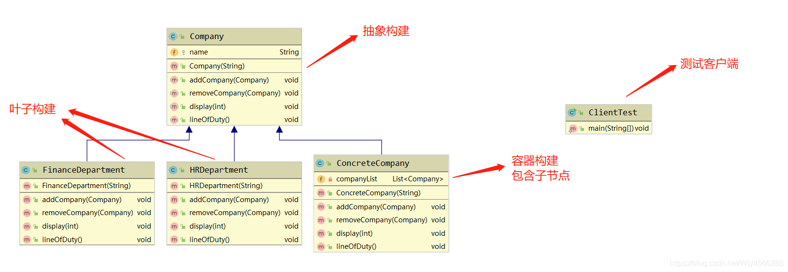
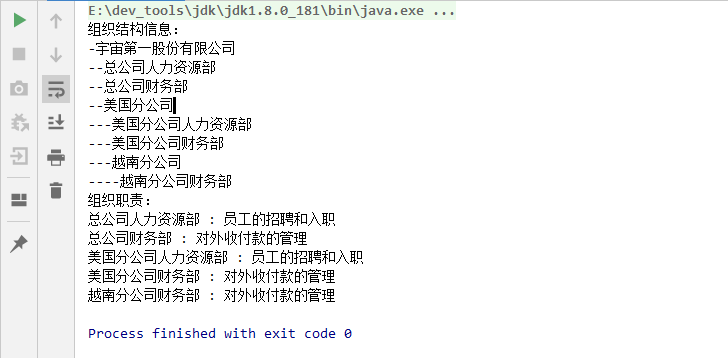
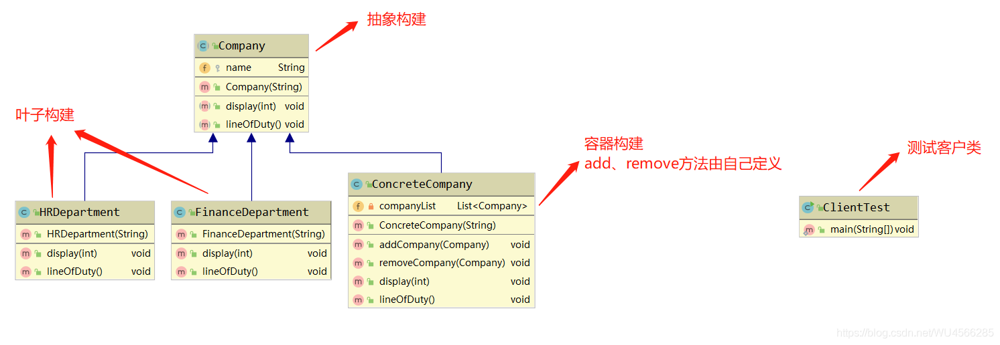
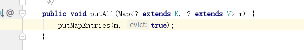
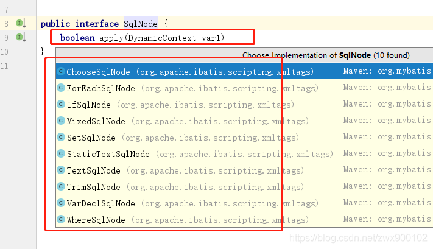
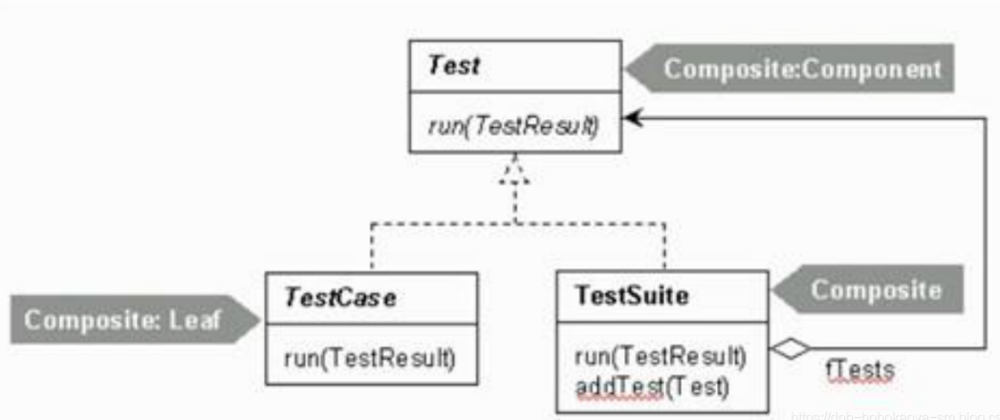

# 一.组合模式

**组合模式(Composite Pattern)也称之为整体-部分(Part-Whole)模式。核心是通过将<font color=#ff00a>单个对象(叶子节点)和组合对象(树枝节点)用相同的接口进行表示，组合成树形结构</font>，使得<font color=#ff00a>单个对象（即叶子对象）</font>和<font color=#ff00a>组合对象（即容器对象）</font>的使用具有一致性。**

- 它将对象以树形结构表示，最顶层的节点称为根节点，根节点下面可以包含树枝节点和叶子节点，树枝节点下面又可以包含树枝节点和叶子节点


如下图所示：




# 二.组合模式适用场景

组合模式一般应用在有层级关系的场景，最经典的就是树形菜单，文件和文件夹的管理等。

# 三.组合模式角色

- **抽象根节点/ 抽象构建(Component)**：定义了树叶节点和树枝节点的公有属性和方法，可预先定义一些默认行为(方法)和属性。
- **树枝节点/容器节点(Composite)**：定义树枝节点的行为(方法)，存储子节点，组合树枝节点和叶子节点形成一个树形结构。
- **树叶节点(Leaf)**：是树级结构中的中的最小单位，下面没有子节点。



**模式动机**

- 组合模式的关键是定义了一个<font color=#ff00a>抽象类，既可以代表叶子，又可以代表容器</font>，而对于调用端来说针对该抽象类进行编程，无须知道它到底表示的是叶子还是容器，可以对其进行统一处理。
- 容器对象与抽象类之间还建立一个<font color=#ff00a>聚合关联关系</font>，在<font color=#ff00a>容器对象中既可以包含叶子，也可以包含容器</font>，以此实现递归组合，形成一个树形结构。

# 四.组合模式的实现方式

**组合模式有2种写法，分别是<font color=#ff00a>透明模式</font>和<font color=#ff00a>安全模式</font>**

- 以公司的层级结构为例，一个集团公司，下属可以有很多独立的子公司，子公司也允许继续有子公司，集团公司和子公司都有属于自己的各种智能部门，例如：财务部、人事部、法务部等

## 1.透明组合模式

**特点：**

- 将组合对象所有的公共方法都定义在了抽象类，不管**叶子对象**还是**树枝对象**都有相同的结构，这样做的好处就是叶子节点和树枝节点对于外界没有区别，它们具备完全一致的行为接口。

**缺点：**

- **不安全，因为叶子和容器在本质上是有区别的**。**叶子不可能有下一个层次的对象，不可能包含成员，因此为其提供add()、remove()等方法是没有意义**的，如果没有提供相应的错误处理代码，虽然在编译阶段不会出错，但在运行阶段调用这些方法就会出错。这违背了接口隔离性原则。



**抽象根节点(Component)**
公司的抽象

```java
/**
 * 抽象类-定义公司公共的属性和行为
 */
public abstract class Company {
    /**
     * 公司名称
     */
    protected String name;

    /**
     * 构造方法，机构名称
     */
    public Company(String name) {
        this.name = name;
    }

    /**
     * 添加一个子公司
     *
     * @param company
     */
    public abstract void addCompany(Company company);

    /**
     * 移除一个子公司
     *
     * @param company
     */
    public abstract void removeCompany(Company company);

    /**
     * 打印组织信息
     *
     * @param depth 当前层级
     */
    public abstract void display(int depth);

    /**
     * 打印职责
     */
    public abstract void lineOfDuty();
}
```

**树叶节点(Leaf)**

抽象构建的具体实现：人力资源部 和 财务部

```java
/**
 * 抽象具体实现-人力资源部
 */
public class HRDepartment extends Company {
    /**
     * 构造方法，机构名称
     */
    public HRDepartment(String name) {
        super(name);
    }

    @Override
    public void addCompany(Company company) {
        //组合模式之透明模式的缺点：空实现
    }

    @Override
    public void removeCompany(Company company) {
        //组合模式之透明模式的缺点：空实现
    }

    @Override
    public void display(int depth) {
        //输出树形结构的子节点
        for (int i = 0; i < depth; i++) {
            System.out.print('-');//不换行
        }
        System.out.println(name);//换行
    }

    @Override
    public void lineOfDuty() {
        System.out.println(name + " : 员工的招聘和入职");
    }
}
```

```java
/**
 * 抽象具体实现-财务部
 */
public class FinanceDepartment extends Company {

    /**
     * 构造方法，机构名称
     */
    public FinanceDepartment(String name) {
        super(name);
    }

    @Override
    public void addCompany(Company company) {
        //组合模式之透明模式的缺点：空实现
    }

    @Override
    public void removeCompany(Company company) {
        //组合模式之透明模式的缺点：空实现
    }

    @Override
    public void display(int depth) {
        //输出树形结构的子节点
        for (int i = 0; i < depth; i++) {
            System.out.print('-');//不换行
        }
        System.out.println(name);//换行
    }

    @Override
    public void lineOfDuty() {
        System.out.println(name + " : 对外收付款的管理");
    }
}
```

**树枝节点/容器节点(Composite)**

```java
/**
 * 抽象的具体实现-公司的具体实现-具有容器功能
 */
public class ConcreteCompany extends Company {

    private List<Company> companyList = new ArrayList<Company>();

    /**
     * 构造方法，机构名称
     */
    public ConcreteCompany(String name) {
        super(name);
    }

    @Override
    public void addCompany(Company company) {
        this.companyList.add(company);
    }

    @Override
    public void removeCompany(Company company) {
        this.companyList.remove(company);
    }
 
     //被调用时，将遍历整个树形结构，递归的执行这个方法
    @Override
    public void display(int depth) {
        //输出当前节点信息
        for (int i = 0; i < depth; i++) {
            System.out.print('-');
        }
        System.out.println(name);

        //向下级遍历
        for (Company component : companyList) {
            component.display(depth + 1);
        }
    }

     //被调用时，将遍历整个树形结构，递归的执行这个方法
    @Override
    public void lineOfDuty() {
        //职责遍历
        for (Company company : companyList) {
            company.lineOfDuty();
        }
    }
}
```

**客户类(Client)**

```java
public class Client {
    public static void main(String[] args) {
        //总公司
        ConcreteCompany root = new ConcreteCompany("宇宙第一股份有限公司");
        root.addCompany(new HRDepartment("总公司人力资源部"));
        root.addCompany(new FinanceDepartment("总公司财务部"));

        //分公司1
        ConcreteCompany company1 = new ConcreteCompany("美国分公司");
        company1.addCompany(new HRDepartment("美国分公司人力资源部"));
        company1.addCompany(new FinanceDepartment("美国分公司财务部"));
        root.addCompany(company1);

        //分公司2
        ConcreteCompany company2 = new ConcreteCompany("越南分公司");
        company2.addCompany(new FinanceDepartment("越南分公司财务部"));
        company1.addCompany(company2);

        System.out.println("组织结构信息：");
        root.display(1);

        System.out.println("组织职责：");
        root.lineOfDuty();
    }
}
```


测试结果



## 2.安全组合模式

**特点：**

- 把<font color=#ff00a>树枝节点和树叶节点彻底分开</font>，树枝节点单独拥有用来组合的方法，这种方法比较安全。

**缺点：**

- 不够透明，因为树叶节点和树枝节点具有不同的方法，且**容器/树枝节点中那些用于管理成员对象的方法没有在抽象类中定义**，因此调用端不能完全针对抽象编程，必须区别地<font color=#ff00a>对待树叶节点和树枝节点</font>。




**抽象根节点(Component)**

公司的抽象

```java
/**
 * 抽象类-定义公司的抽象
 */
public abstract class Company {
    protected String name;

    /**
     * 构造方法，机构名称
     */
    public Company(String name) {
        this.name = name;
    }

    /**
     * 打印组织信息
     *
     * @param depth 当前层级
     */
    public abstract void display(int depth);

    /**
     * 打印职责
     */
    public abstract void lineOfDuty();
}
```

**树叶节点(Leaf)**

抽象构建的具体实现：人力资源部 和 财务部

```java
/**
 * 抽象具体实现-人力资源部
 */
public class HRDepartment extends Company {
    /**
     * 构造方法，机构名称
     */
    public HRDepartment(String name) {
        super(name);
    }

    @Override
    public void display(int depth) {
        //输出树形结构的子节点
        for (int i = 0; i < depth; i++) {
            System.out.print('-');
        }
        System.out.println(name);
    }

    @Override
    public void lineOfDuty() {
        System.out.println(name + " : 员工的招聘和入职");
    }
}
```

```java
/**
 * 抽象具体实现-财务部
 */
public class FinanceDepartment extends Company {

    /**
     * 构造方法，机构名称
     */
    public FinanceDepartment(String name) {
        super(name);
    }

    @Override
    public void display(int depth) {
        //输出树形结构的子节点
        for (int i = 0; i < depth; i++) {
            System.out.print('-');
        }
        System.out.println(name);
    }

    @Override
    public void lineOfDuty() {
        System.out.println(name + " : 对外收付款的管理");
    }
}
```

**树枝节点/容器节点(Composite)**

```java
/**
 * 抽象的具体实现-公司的具体实现
 */
public class ConcreteCompany extends Company {

    private List<Company> companyList = new ArrayList<Company>();

    /**
     * 构造方法，机构名称
     */
    public ConcreteCompany(String name) {
        super(name);
    }

    public void addCompany(Company company) {
        this.companyList.add(company);
    }

    public void removeCompany(Company company) {
        this.companyList.remove(company);
    }

     //被调用时，将遍历整个树形结构，递归的执行这个方法
    @Override
    public void display(int depth) {
        //输出当前节点信息
        for (int i = 0; i < depth; i++) {
            System.out.print('-');
        }
        System.out.println(name);

        //向下级遍历
        for (Company component : companyList) {
            component.display(depth + 1);
        }
    }

     //被调用时，将遍历整个树形结构，递归的执行这个方法
    @Override
    public void lineOfDuty() {
        //职责遍历
        for (Company company : companyList) {
            company.lineOfDuty();
        }
    }
}
```

**客户类(Client)**

```java
public class Client {
    public static void main(String[] args) {
        //总公司
        ConcreteCompany root = new ConcreteCompany("宇宙第一股份有限公司");
        root.addCompany(new HRDepartment("总公司人力资源部"));
        root.addCompany(new FinanceDepartment("总公司财务部"));

        //分公司1
        ConcreteCompany company1 = new ConcreteCompany("美国分公司");
        company1.addCompany(new HRDepartment("美国分公司人力资源部"));
        company1.addCompany(new FinanceDepartment("美国分公司财务部"));
        root.addCompany(company1);

        //分公司2
        ConcreteCompany company2 = new ConcreteCompany("越南分公司");
        company2.addCompany(new FinanceDepartment("越南分公司财务部"));
        company1.addCompany(company2);

        System.out.println("组织结构信息：");
        root.display(1);

        System.out.println("组织职责：");
        root.lineOfDuty();
    }
}
```


测试结果


# 五.组合模式在JDK源码中的体现

## 1.HashMap

HashMap中有一个putAll方法，参数是一个Map，这就是一种组合模式的体现：




## 2.MyBatis的SqlNode

MyBatis中有一个SqlNode接口，下面很多一级标签



然后一级标签下面又有二级标签(这就是组合模式的体现)

# 六.总结

## 1.组合模式的优缺点

**优点：**

- 定义了一个<font color=#ff00a>抽象类，既可以代表叶子，又可以代表容器</font>，而对于调用端来说针对该抽象类进行编程，无须知道它到底表示的是叶子还是容器，可以对其进行统一处理。
- 定义了包含<font color=#ff00a>叶子对象</font>和<font color=#ff00a>容器对象</font>的类层次结构，叶子对象可以被组合成更复杂的容器对象，而这个容器对象又可以被组合，这样不断递归下去，可以形成复杂的树形结构。

**缺点：**

- 其叶子和树枝的声明是<font color=#ff00a>实现类</font>而不是接口，违反了依赖倒置原则，而且组合模式会使设计更加抽象不好理解。

## 2.开发中的应用场景：

- Java GUI中的容器层次图

- XML文件解析

- OA系统中，组织结构的处理

- Junit单元测试框架

  - 底层设计就是典型的组合模式，TestCase(叶子)、TestUnite(容器)、Test接口(抽象)

    

