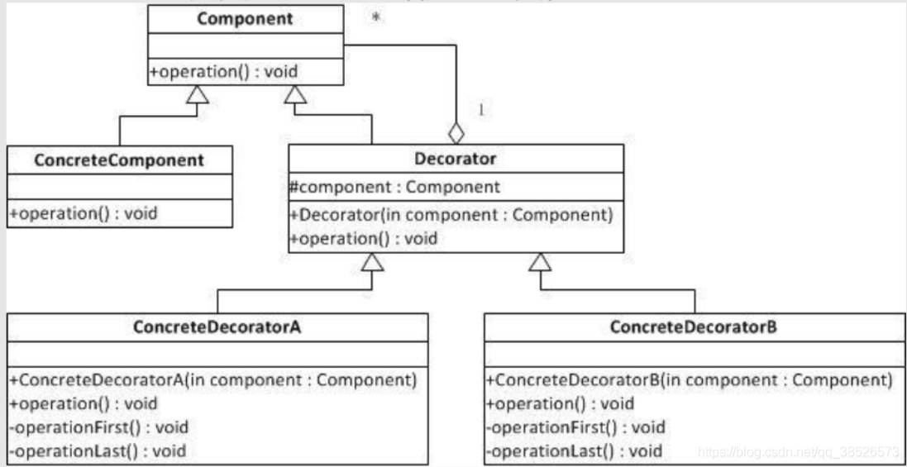
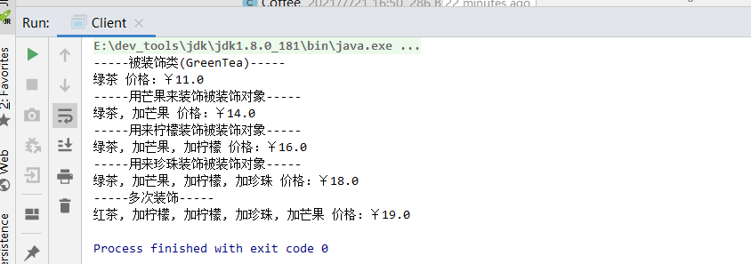
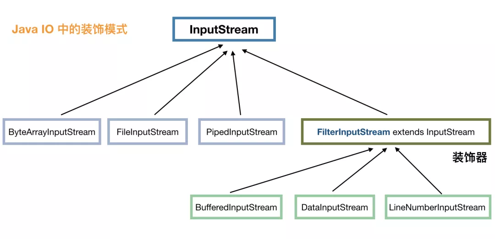

# 一.装饰器模式

**装饰器模式（Decorator Pattern）指在不改变原有对象结构的基础之上，将功能附加到对象上，提供了比继承更有弹性的替代方案（扩展原有对象的功能）。符合开闭原则，对拓展开发，对修改关闭**

模式动机：一般有2种方式可以实现给一个类或对象<font color=#ff00a>增加行为(方法)</font>

- **继承**：通过继承一个现有类可以使得子类在拥有自身方法的同时还拥有父类的方法。但是这种方法是静态的，用户不能控制增加行为的方式和时机。
- **关联**，即将一个类的对象嵌入另一个对象中，由另一个对象来决定是否调用嵌入对象的行为，以便扩展自己的行为，我们称这个嵌入的对象为<font color=#ff00a>装饰器(Decorator)</font>
  - 继承可以扩展类，但会破坏了原类的封装性，而装饰者模式提供了一种<font color=#ff00a>新的类扩展方式（继承关系的一个替代方案）</font>，不会破坏原类的封装性。可以在不需要创造更多子类的情况下，将对象的功能加以扩展。这就是装饰器模式的模式动机。

# 二.装饰器模式适用场景

1. 用于扩展一个类的功能或给一个类添加附加职责。
2. 动态的给一个对象添加功能，这些功能可以再动态的撤销。

**Java中的应用场景**

- IO中输入流和输出流的设计
- Swing包中图形界面构件功能
- Servlet API 中提供了一个request对象的Decorator设计模式的默认实现类HttpServletRequestWrapper，HttpServletRequestWrapper类，增强了request对象的功能。
- Struts2中，request，response,session对象的处理

# 三.装饰器模式角色




装饰器模式由<font color=#ff00a>组件</font>和<font color=#ff00a>装饰者</font>组成。

- **抽象组件(Component)**：<font color=#ff00a>需要装饰的抽象对象</font>。 装饰者模式必须要有这样一个抽象的组件，<font color=#ff00a>被装饰者ConcreteComponent 和装饰者Decorator 都是这个抽象的具体实现</font>。定义我们最核心、最基本的方法。
- **具体组件/被装饰者/真实对象(ConcreteComponent)**：是我们需要装饰的对象。如IO流中的FileInputStream,FileOutputStream
- **抽象装饰类(Decorator)**：持有<font color=#ff00a>Component的引用</font>及<font color=#ff00a>装饰者共有的方法（即继承Component类 或者实现Component接口）</font>。
- **具体装饰类(ConcreteDecorator)** ：被装饰的对象， 继承抽象装饰类Decorator，负责给Component附加新的功能。

# 四.Java中装饰器模式的实现方式

**案例：奶茶加料**

- 饮料分为2类：红茶、绿茶，在红茶和绿茶的基础上面，又增加了许多的口味柠檬红茶、柠檬绿茶、芒果红茶、芒果绿茶、芒果珍珠红茶、柠檬珍珠红茶等等
- 可以在2种饮料的基础上 加不同的配料调成不同口味的奶茶，然后卖不同的价格

**抽象组件/公共接口(Component)**

饮料抽象基类

```java
/**
 * 抽象组件-饮料
 */
public abstract class AbstractDrink {
   // 返回描述
   public abstract String getDescription();
   // 返回价格
   public abstract double cost();
}
```

**具体组件/被装饰者(ConcreteComponent)**

饮料具体实现类，红茶、绿茶

```java
/**
 * 具体组件、被修饰者-绿茶
 */
public class GreenTea extends AbstractDrink {
    public String getDescription() {
        return "绿茶";
    }
    public double cost() {
        return 11;
    }
}
```

```java
/**
 * 具体组件、被修饰者-红茶
 */
public class RedTea extends AbstractDrink {
    public String getDescription() {
        return "红茶";
    }

    public double cost() {
        return 10;
    }
}
```

**抽象装饰类(Decorator)**

装饰者的基类，此类必须继承自 AbstractDrink ：

```java
/**
 * 抽象修饰类-调料
 */
public abstract class CondimentDecorator extends AbstractDrink {
    protected AbstractDrink drink;

    //持有被装饰类引用，以构造方法接收
    public CondimentDecorator(AbstractDrink drink) {
        this.drink = drink;
    }

    @Override
    public double cost() {
        return drink.cost();
    }

    @Override
    public String getDescription() {
        return drink.getDescription();
    }
}
```

**具体装饰类(ConcreteDecorator)**

具体的装饰类，柠檬、芒果、珍珠，这些调料需要继承抽象调料类CondimentDecorator

```jav
/**
 * 具体装饰者类-柠檬
 */
public class Lemon extends CondimentDecorator {
    private AbstractDrink drink;
    //持有被装饰类，以公共接口接收
    public Lemon(AbstractDrink drink) {
        super(drink);
        this.drink = drink;
    }
    public String getDescription() {
        // 装饰
        return drink.getDescription() + ", 加柠檬";
    }
    public double cost() {
        // 装饰
        return drink.cost() + 2; // 加柠檬需要 2 元
    }
}
```

```java
/**
 * 具体装饰者类-芒果
 */
public class Mongo extends CondimentDecorator {
    private AbstractDrink drink;

    public Mongo(AbstractDrink drink) {
        super(drink);
        this.drink = drink;
    }

    public String getDescription() {
        return drink.getDescription() + ", 加芒果";
    }

    public double cost() {
        // 加芒果需要 3 元
        return drink.cost() + 3;
    }
}
```

```java
/**
 * 具体装饰者类-珍珠
 */
public class Pearl extends CondimentDecorator {
    private AbstractDrink drink;

    public Pearl(AbstractDrink drink) {
        super(drink);
        this.drink = drink;
    }

    public String getDescription() {
        return drink.getDescription() + ", 加珍珠";
    }

    public double cost() {
        // 加珍珠需要 2 元
        return drink.cost() + 2;
    }
}
```

**客户端**

```java
public class Client {
    public static void main(String[] args) {
        //点一杯绿茶
        System.out.println("-----被装饰类(GreenTea)-----");
        AbstractDrink drink = new GreenTea();
        System.out.println(drink.getDescription() + " 价格：￥" + drink.cost());

        //加芒果
        System.out.println("-----用芒果来装饰被装饰对象-----");
        drink = new Mongo(drink);
        System.out.println(drink.getDescription() + " 价格：￥" + drink.cost());

        //加柠檬
        System.out.println("-----用来柠檬装饰被装饰对象-----");
        drink = new Lemon(drink);
        System.out.println(drink.getDescription() + " 价格：￥" + drink.cost());

        //加珍珠
        System.out.println("-----用来珍珠装饰被装饰对象-----");
        drink = new Pearl(drink);
        System.out.println(drink.getDescription() + " 价格：￥" + drink.cost());

        //在点一杯奶茶,加芒果-珍珠-双份柠檬-红茶
        System.out.println("-----多次装饰-----");
        AbstractDrink drink2 = new Mongo(new Pearl(new Lemon(new Lemon(new RedTea()))));
        System.out.println(drink2.getDescription() + " 价格：￥" + drink2.cost());
    }
}
```


测试结果




# 五.装饰器模式在IO流中的应用

看下图 InputStream 派生出来的部分类：



- 
  InputStream 代表了输入流，具体的输入来源可以是<font color=#ff00a>文件（FileInputStream）、管道（PipedInputStream）、字节数组（ByteArrayInputStream）</font>等，这些就像前面奶茶的例子中的红茶、绿茶，属于<font color=#ff00a>基础输入流</font>。

- FilterInputStream 是装饰器模式的<font color=#ff00a>核心</font>，**它的实现类是一系列装饰器**


> IO流实现细节
>
> - **抽象组件-Component**
>   - InputStream、OutputStream、Reader、Writer
> - **具体组件ConcreteComponent**
>   - FileInputStream、FileOutputStream
> - **抽象装饰类-Decorator**
>   - 持有一个抽象组件的引用：FilterInputStream、FilterOutputStream
> - **具体装饰类ConcreteDecorator**
>   - 负责给Component附加新的功能：BufferedOutputStream、BufferedInputStream等


比如: BufferedInputStream 代表用缓冲来装饰，也就使得输入流具有了缓冲的功能，LineNumberInputStream 代表用行号来装饰，在操作的时候就可以取得行号了，DataInputStream 的装饰，使得我们可以从输入流转换为 java 中的基本类型值。

```java
InputStream inputStream = 
new LineNumberInputStream(
	new BufferedInputStream(
		new FileInputStream("")));
```

- 
  结果：InputStream 还是不具有读取行号的功能，因为读取行号的方法定义具体实现类 LineNumberInputStream中。

应该使用具体装饰器来接收：

```java
LineNumberInputStream inputStream = 
new LineNumberInputStream(
	new BufferedInputStream(
		new FileInputStream("")));
```

- 如果我们使用装饰器的话，就不太适合面向接口编程了。所以说有得必有失去，没有绝对符合软件7大设计原则的设计模式

# 六.总结

## 1.装饰器模式的优缺点

**优点**

1. 装饰者模式是<font color=#ff00a>继承的补充，一种类的拓展方式</font>，比继承灵活，<font color=#ff00a>不改变原有对象的情况下动态地给一个对象 扩展功能</font>，即插即用。

2. 通过使用不同装饰类以及这些装饰类的排列组合，得到功能更加强大的对象。

3. 装饰者完全遵守开闭原则


**缺点**

1. 会出现更多的代码，更多的类，出错后调试排查比较麻烦，增加程序复杂性。
2. 动态装饰以及多层装饰时会更加复杂。
3. 产生大量小对象占据内存，一定程度上影响性能。
   