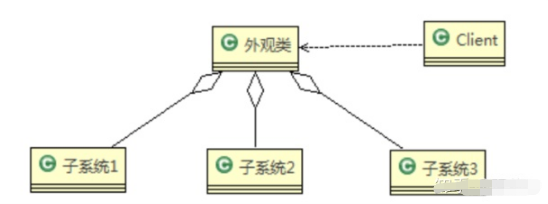
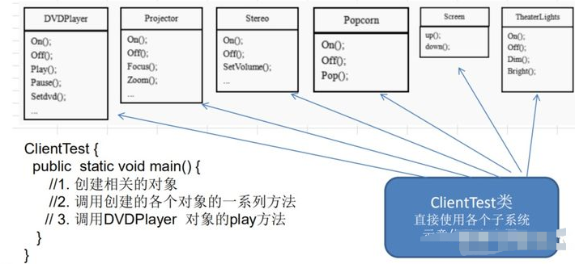
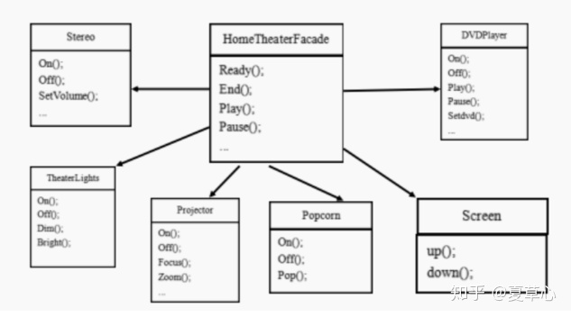
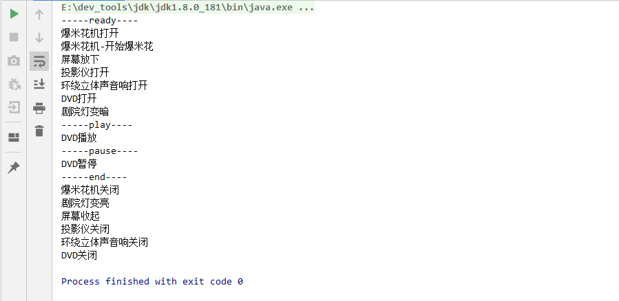

# 一.外观模式

**门面模式(Facade Pattern)，又被称之为外观模式。该模式提供一个统一的接口，用来访问相同子系统或者不同子系统之中的一群接口。使得子系统更加容易调用。**

- 可以理解为：<font color=#ff00a>将多个接口功能组合到一个接口中，使得客户只要调用一个接口，而不用调用多个接口就能达到目的</font>，避免外部直接访问具体的业务方法
  - **例如**：SpringMvc的三层开发模式：controller -> service -> dao，将controller作为接口暴露给外部调用，<font color=#ff00a>外部不直接访问处理业务的service、dao</font>
- 解决多个复杂接口带来的使用困难，起到简化用户操作的作用
  - **例如**：在pc上安装软件的时候经常有一键安装选项（省去选择安装目录、安装的组件等等），还有就是手机重启功能（把关机和启动合为一个操作）。

# 二.外观模式适用场景

1. 当各个子系统越来越复杂时，可以提供门面接口来统一调用
2. 当系统需要进行<font color=#ff00a>分层设计</font>时，可以考虑使用门面模式，利用门面对象来作为每层的入口，这样可以<font color=#ff00a>简化分层间的接口调用</font>

**开发中常见的场景**

- 频率很高。哪里都会遇到。各种技术和框架中，都有外观模式的使用。
  - JDBC封装后的，commons提供的DBUtils类，
  - Hibernate提供的工具类、
  - Spring JDBC工具

# 三.外观模式角色

简单地说，门面对象是外界访问子系统内部的唯一通道，外部模块不用管子系统内部是多么复杂以及如何实现的。

- 就好像controller是我们调用service下面方法唯一入口一样



- **Facade(门面角色/外观角色)**：为调用端提供<font color=#ff00a>统一的调用接口, Facade知道哪些子系统负责处理请求,从而将调用端的请求代理给适当子系统对象</font>。
  - 一般情况下，Facade不参与子系统的任何业务逻辑，仅持有了子系统具体实现的引用。
- **SubSystem(子系统角色)**：指模块或者子系统，可以有一个或多个SubSystem，负责处理Facade指派的任务，他是功能的实际提供者，SubSystem并不知道门面角色的存在，对于SubSystem来说，Facade也仅仅只是一个<font color=#ff00a>调用者(客户端)</font>而已。
- **Client(调用者)**: 外观接口的调用者

# 四.外观模式的实现方式

**案例：影院管理**

家庭影院组成：DVD播放器、投影仪、自动屏幕、环绕立体声音响、爆米花机、灯光设备

要求完成使用家庭影院的功能： 用遥控器统筹各设备开关

> 1. 爆米花机打开
> 2. 放下屏幕
> 3. 投影仪打开
> 4. 音响打开
> 5. DVD打开，选dvd
> 6. 开始爆爆米花
> 7. 灯光调暗
> 8. 播放影片
> 9. 观影结束后，关闭各种设备

**传统方式解决影院管理**

> - 创建各个子系统的对象，并直接去调用子系统(对象)相关方法，会造成调用过程混乱，没有清晰的过程相关方法，会造成调用过程混乱，没有清晰的过程
>
> 


**使用外观模式来解决家庭影院管理**

**<font color=#ff00a>解决思路</font>：定义一个高层接口，给子系统中的一组接口提供一个统一的访问入口 (比如在高层接口提供4个方法 ready, play, pause, end )，用来访问子系统中的一群接口**

UML类图



示例代码

```java
//客户端
public class Client {
    public static void main(String[] args) {
        HomeTheaterFacade homeTheaterFacade = new HomeTheaterFacade();
        System.out.println("-----ready----");
        homeTheaterFacade.ready();
        System.out.println("-----play----");
        homeTheaterFacade.play();
        System.out.println("-----pause----");
        homeTheaterFacade.pause();
        System.out.println("-----end----");
        homeTheaterFacade.end();
    }
}

//家庭电影院门面类
class HomeTheaterFacade {
    /*定义各个子系统对象*/
    private TheaterLight theaterLight;//剧院灯
    private Popcorn popcorn;//爆米花机
    private Stereo stereo;//立体声
    private Projector projector;//投影仪
    private Screen screen;//自动投
    private DVDPlayer dvdplayer;//DVD播放机

    public HomeTheaterFacade() {
        this.theaterLight = TheaterLight.getInstance();
        this.popcorn = Popcorn.getInstance();
        this.stereo = Stereo.getInstance();
        this.projector = Projector.getInstance();
        this.screen = Screen.getInstance();
        this.dvdplayer = DVDPlayer.getInstance();
    }

    //启动组
    public void ready() {
        popcorn.on();
        popcorn.pop();
        screen.down();
        projector.on();
        stereo.on();
        dvdplayer.on();
        theaterLight.dim();
    }

    //播报
    public void play() {  dvdplayer.play(); }

    //暂停
    public void pause() { dvdplayer.pause(); }

    //关闭组
    public void end() {
        popcorn.off();
        theaterLight.bright();
        screen.up();
        projector.off();
        stereo.off();
        dvdplayer.off();
    }
}

class DVDPlayer {
    //使用单例模式，使用饿汉式
    private static DVDPlayer instance = new DVDPlayer();

    public static DVDPlayer getInstance() { return instance;}

    public void on() { System.out.println("DVD打开");}

    public void off() { System.out.println("DVD关闭");}

    public void play() {  System.out.println("DVD播放");}

    public void pause() {  System.out.println("DVD暂停");}
}

//爆米花机
class Popcorn {
    //使用单例模式，使用饿汉式
    private static Popcorn instance = new Popcorn();

    public static Popcorn getInstance() {return instance; }

    public void on() {  System.out.println("爆米花机打开");}

    public void off() {  System.out.println("爆米花机关闭"); }

    public void pop() { System.out.println("爆米花机-开始爆米花"); }

    public void pause() {  System.out.println("爆米花机暂停"); }
}

//投影仪
class Projector {
    //使用单例模式，使用饿汉式
    private static Projector instance = new Projector();

    public static Projector getInstance() { return instance;}

    public void on() {System.out.println("投影仪打开"); }

    public void off() {System.out.println("投影仪关闭"); }

    public void focus() {  System.out.println("投影仪对焦");  }

    public void pause() { System.out.println("投影仪暂停"); }
}

//屏幕
class Screen {
    //使用单例模式，使用饿汉式
    private static Screen instance = new Screen();

    public static Screen getInstance() { return instance; }

    public void up() { System.out.println("屏幕收起"); }

    public void down() {  System.out.println("屏幕放下"); }
}

//环绕立体声音响
class Stereo {
    //使用单例模式，使用饿汉式
    private static Stereo instance = new Stereo();

    public static Stereo getInstance() { return instance; }

    public void on() { System.out.println("环绕立体声音响打开"); }

    public void off() { System.out.println("环绕立体声音响关闭");}

    public void up() { System.out.println("环绕立体声音响调大"); }
}

//灯光
class TheaterLight {
    //使用单例模式，使用饿汉式
    private static TheaterLight instance = new TheaterLight();

    public static TheaterLight getInstance() { return instance; }

    public void on() {  System.out.println("剧院灯打开"); }

    public void off() {System.out.println("剧院灯关闭"); }

    public void dim() { System.out.println("剧院灯变暗"); }

    public void bright() {System.out.println("剧院灯变亮"); }
}
```


执行结果




# 五.总结

## 1.外观模式的优缺点

**优点：**

1. 简化了调用过程，调用者无需深入了解子系统，以防给子系统带来风险
2. <font color=#ff00a>可以帮我们更好的划分访问的层级</font>,当系统需要进行分层设计时，可以考虑使用Facade模式
3. 遵循了迪米特法则(即最少知道原则)

**缺点：**

1. 当增加子系统或者扩展子系统功能时，可能容易带来未知风险
2. 不符合开闭原则
3. 某些情况下可能会违背单一职责原则
   