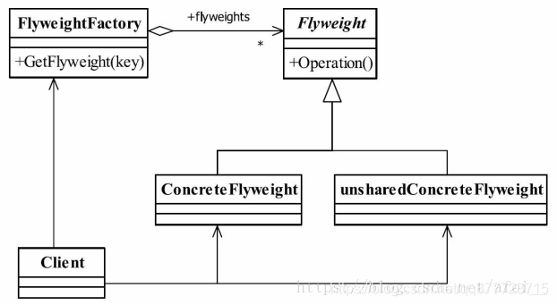
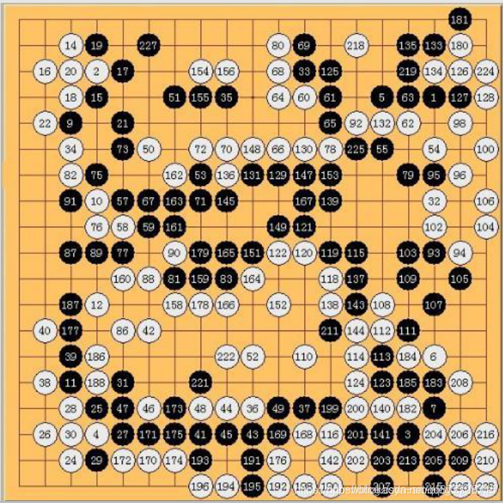
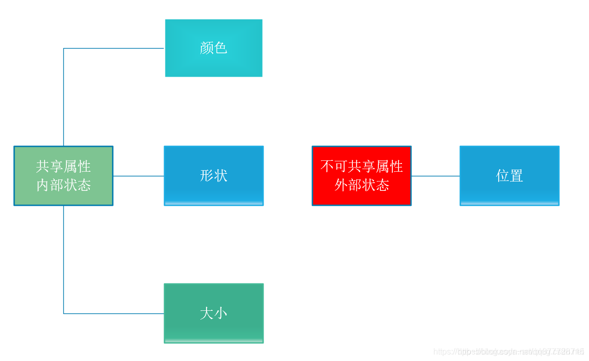
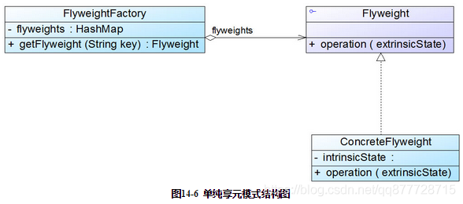
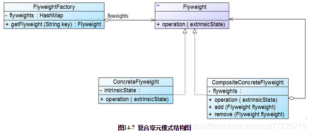
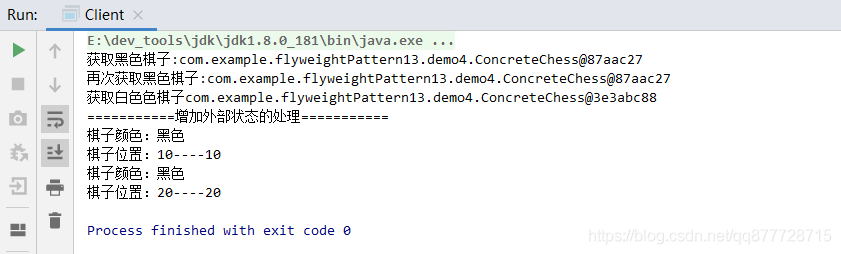
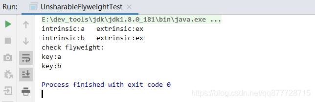
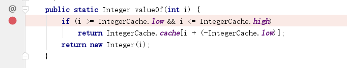
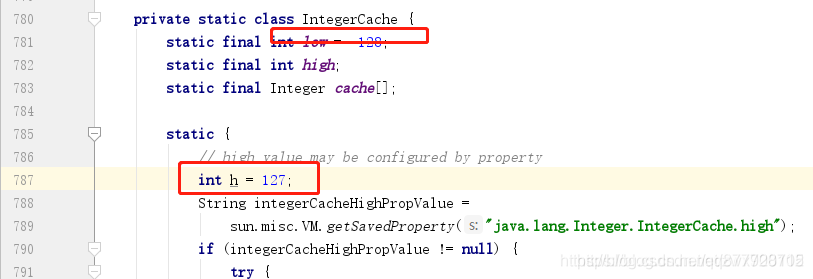

# 一.享元模式

**享元模式（Flyweight Pattern）是 "资源池技术"实现方式，主要用于减少创建对象的数量，以减少内存占用和提高性能。**

- 模式动机：在创建大量对象时，有可能会造成内存溢出，享元模式把其中共同的部分抽象出来，保存在内存中，如果有相同的业务请求，直接返回在内存中已有的对象，避免重新创建。

- 解决思路：复用对象最简单的方式是，用一个 HashMap 来存放每次新生成的对象。每次需要一个对象的时候，先到 HashMap 中看看有没有，如果没有，再生成新的对象，然后将这个对象放入 HashMap 中。

- 享元模式通常需要和其他模式一起联用，几种常见的联用方式如下：
  - 享元模式的享元工厂类中通常<font color=#ff00a>提供一个静态的工厂方法</font>用于返回享元对象，使用<font color=#ff00a>简单工厂模式</font>来生成享元对象
  - 在一个系统中，<font color=#ff00a>通常只有唯一一个享元工厂</font>，因此可以使用<font color=#ff00a>单例模式</font>进行享元工厂类的设计。
  - 享元模式可以<font color=#ff00a>结合组合模式形成复合享元模式</font>，统一对多个享元对象设置外部状态。

# 二.享元模式适用场景

1. <font color=#ff00a>有大量相同或者相似的对象</font>，造成内存的大量耗费

2. 对象的<font color=#ff00a>大部分状态都可以外部化</font>，可以将这些外部状态传入对象中。

3. 需要缓冲池的场景

   > 在使用享元模式时需要维护一个存储享元对象的享元池，而这需要耗费一定的系统资源，因此，应当在需要多次重复使用享元对象时才值得使用享元模式

# 三.享元模式角色



- **Flyweight(抽象享元角色)** : <font color=#ff00a>享元对象的抽象基类或者接口</font>，声明所有具体享元角色需要实现的方法，这些方法可以<font color=#ff00a>向外界提供对象的内部状态，设置外部状态</font>。

  > 内部状态（intrinsic）：是<font color=#ff00a>享元对象可共享的属性</font>，存储在享元对象内部并且不会随环境改变而改变。
  >
  > 外部状态（extrinsic）：是<font color=#ff00a>对象得以依赖的一个标记</font>，是随环境改变而改变的、不可以共享的状态。

- **ConcreteFlyweight( 具体享元角色)**: <font color=#ff00a>Flyweight的具体实现</font>，实现抽象角色定义的方法。 为内部状态提供成员变量进行存储

- **UnsharedConcreteFlyweigh( 非共享的享元角色)**： <font color=#ff00a>不能被共享的子类</font>可以设计为非共享享元类

- **FlyweightFactory(享元工厂角色)**： <font color=#ff00a>负责管理享元对象池和创建享元对象</font>，就是<font color=#ff00a>构造一个池容器，同时提供从池中获得对象的方法</font>,

  > - 当请求获取一个享元对象时，享元工厂判断是否存在该享元对象，如果存在则返回；如果不存在的话，则创建一个新的享元对象，保存到池容器中，然后返回给请求者。
  > - <font color=#ff00a>享元池一般设计成键值对</font>。
  > - <font color=#ff00a>享元模式一般都是和工厂模式一起出现</font>


**享元模式状态**

> 享元对象能做到共享的关键是区分了内部状态和外部状态。


**案例：每个围棋棋子都是一个享元对象，**

有如下属性：

>
>
>

# 四.享元模式的实现方式

享元模式可以分成单纯享元模式和复合享元模式两种形式

- 单纯享元模式：**所有的具体享元类都是可以共享的，不存在非共享具体享元类**

>

- 
  复合享元模式：**将一些<font color=#ff00a>单纯享元对象</font>使用<font color=#ff00a>组合模式加以组合</font>，还可以形成复合享元对象，这样的<font color=#ff00a>复合享元对象本身不能共享，但是可以分解成单纯享元对象，而后者则可以共享</font>。**


> 
>
> 通过复合享元模式，可以确保复合享元类CompositeConcreteFlyweight中所包含的每个单纯享元类ConcreteFlyweight都具有相同的外部状态，而这些单纯享元的内部状态往往可以不同。<font color=#ff00a>如果希望为多个内部状态不同的享元对象设置相同的外部状态，可以考虑使用复合享元模式</font>。


## 1.单纯享元模式

**Flyweight(抽象享元角色)**

```java
/**
 * 抽象享元类
 */
public interface ChessFlyWeight {
	//设置颜色
	void setColor(String c);
	//获取颜色
	String getColor();
	//展示棋子信息
	void show(Coordinate c);
}
```

**ConcreteFlyweight(具体享元角色)**

```java
/**
 *具体享元类-棋子
 *
 */
class ConcreteChess implements ChessFlyWeight {

	private String color;//外部状态

	public ConcreteChess(String color) {
		super();
		this.color = color;
	}

	@Override
	public void show(Coordinate c) {
		System.out.println("棋子颜色："+color);
		System.out.println("棋子位置："+c.getX()+"----"+c.getY());
	}

	@Override
	public String getColor() {
		return color;
	}

	@Override
	public void setColor(String c) {
		this.color = c;
	}
}
```

**UnsharedConcreteFlyweigh( 非共享的享元角色)**

```java
/**
 * 外部状态
 */
public class Coordinate {
	private int x,y;

	public Coordinate(int x, int y) {
		super();
		this.x = x;
		this.y = y;
	}

	public int getX() {
		return x;
	}

	public void setX(int x) {
		this.x = x;
	}

	public int getY() {
		return y;
	}

	public void setY(int y) {
		this.y = y;
	}
}
```

**FlyweightFactory(享元工厂角色)**

**<font color=#ff00a>工厂类</font>用于对<font color=#ff00a>享元对象</font>进行管理和扩展，尝试重用现有的同类对象，如果未找到匹配的对象，再创建新对象。**

```java
/**
 *享元工厂类-创建棋子
 */
public class ChessFlyWeightFactory {
	//享元池  根据颜色保存不同的棋子对象
	private static Map<String,ChessFlyWeight> map = new HashMap<String, ChessFlyWeight>();

	public static ChessFlyWeight  getChess(String color){
		// 如果已经存在该颜色的棋子返回
		if(map.get(color)!=null){
			return map.get(color);
		}
			// 如果享元池中没有该颜色的棋子就创建一个新的返回 并存储在享元池中
		ChessFlyWeight cfw = new ConcreteChess(color);
		map.put(color, cfw);
		return cfw;
	}
}
```

**调用端**

```java
public class Client {
    public static void main(String[] args) {
    	//获取黑色棋子
        ChessFlyWeight chess1 = ChessFlyWeightFactory.getChess("黑色");
		//再次获取黑色棋子
        ChessFlyWeight chess2 = ChessFlyWeightFactory.getChess("黑色");
		//获取白色色棋子
        ChessFlyWeight chess3 = ChessFlyWeightFactory.getChess("白色");

        System.out.println("获取黑色棋子:"+chess1);
        System.out.println("再次获取黑色棋子:"+chess2);
        System.out.println("获取白色色棋子"+chess3);

        System.out.println("===========增加外部状态的处理===========");
        chess1.show(new Coordinate(10, 10));
        chess2.show(new Coordinate(20, 20));
    }
}
```


测试结果



## 2.复合享元模式

**Flyweight(抽象享元角色)**

```java
/**
 * 抽象享元类
 */
public interface Flyweight{
    void operation(String extrinsicState);
}
```

**ConcreteFlyweight(具体享元角色)**

```java
/**
 * 具体享元
 */
public class ConcreteFlyweight implements Flyweight{
    private Character intrinsicState;

    public ConcreteFlyweight(Character intrinsicState){
        this.intrinsicState = intrinsicState;
    }

    /**
     * 外部状态改变方法行为，但不会改变内部状态
     */
    @Override
    public void operation(String extrinsicState){
        String str = "intrinsic:" + intrinsicState;
        str += "   extrinsic:" + extrinsicState;
        System.out.println(str);
    }
}
```

**UnsharedConcreteFlyweigh( 复合享元角色)**

- **复合享元是不能共享的，所以叫UnsharableFlyweight。但是复合享元是可以分解为可共享的单纯享元**。

```java
/**
 * 复合享元
 */
class UnsharableFlyweight implements Flyweight {
    private Map<Character, Flyweight> map;

    public UnsharableFlyweight() {
        map = new HashMap<Character, Flyweight>();
    }

    public void add(Character c, Flyweight fly) {
        map.put(c, fly);
    }

    @Override
    public void operation(String extrinsicState) {
        Iterator<Map.Entry<Character, Flyweight>> it = map.entrySet().iterator();
        while (it.hasNext()) {
            Map.Entry<Character, Flyweight> entry = it.next();
            Flyweight fly = entry.getValue();
            fly.operation(extrinsicState);
        }
    }
}
```

**FlyweightFactory(享元工厂角色)**

- **工厂类用于对享元对象进行管理和扩展，尝试重用现有的同类对象，如果未找到匹配的对象，再创建新对象**。

```java
/**
 * 复合享元工厂
 */
public class FlyweightFactory {
    private Map<Character, Flyweight> map;

    public FlyweightFactory() {
        map = new HashMap<Character, Flyweight>();
    }

    /**
     * 单纯享元工厂
     */
    public Flyweight factory(Character state) {
        Flyweight flyweight = null;

        if (map.containsKey(state)) {
            flyweight = map.get(state);
        }
        else {
            flyweight = new ConcreteFlyweight(state);
            map.put(state, flyweight);
        }

        return flyweight;
    }

    /**
     * 复合享元工厂
     * 此处Character的复合类型恰好是String，
     * 当无此巧合时，可使用List等聚集类型传入.
     */
    public Flyweight factory(String compositeState) {
        UnsharableFlyweight composite = new UnsharableFlyweight();

        for (int i = 0; i < compositeState.length(); i++) {
            Character c = compositeState.charAt(i);
            composite.add(c, this.factory(c));
        }

        return composite;
    }

    /**
     * 辅助方法
     */
    public void checkFlyweight() {
        Iterator<Map.Entry<Character, Flyweight>> it = map.entrySet().iterator();
        System.out.println("check flyweight:");
        while (it.hasNext()) {
            Map.Entry<Character, Flyweight> entry = it.next();
            Character key = entry.getKey();
            System.out.println("key:" + key);
        }
    }
}
```

**调用端**

```java
public class Client{
    public static void main(String[] args){
        FlyweightFactory f = new FlyweightFactory();

        Flyweight fly = f.factory("aba");
        fly.operation("ex");

        f.checkFlyweight();
    }
}
```


测试结果




# 五.总结

## 1.注意事项

1. 多线程场景又会带来<font color=#ff00a>线程安全</font>的问题，该如何设计需要依靠经验权衡。
2. <font color=#ff00a>外部状态（通常就是 HashMap 的键）尽量使用基本数据类型</font>。如果使用<font color=#ff00a>对象类型作为外部状态</font>，必须<font color=#ff00a>重写 equals 方法和 hashCode 方法</font>。

# 2.享元模式的优缺点

**优点：**

- 极大<font color=#ff00a>减少内存中对象的数量</font>，相同或相似对象内存中只存一份，降低程序内存的占用，增强程序的性能。
- 外部状态相对独立，不影响内部状态

**缺点：**

- 提高了系统复杂性，需要分离出外部状态和内部状态，而且外部状态不应该随内部状态改变而改变，否则导致系统的逻辑混乱。
- 为了节省内存，共享了内部状态，分离出外部状态，而读取外部状态使运行时间变长。用时间换取了空间。

# 3.享元模式在Java中的应用

1. **字符串常量池**：字符串当第一次使用之后，就会存在于常量池内，下次使用时可以直接从常量池内取出，不需要重复创建。
2. **所有基本类型的包装类**：如: Integer中也使用到了享元模式。

> 来看看valueOf的源码：
>
> 
>
> 这里用到了享元模式，首先会去缓存里面取，但是我们看到取缓存时候有个条件，那就是<font color=#ff00a>数字必须在low和high之间</font>：
>
> 
>
> 可以看到low是-128，high默认是127，Interger在第一次加载时会初始化-128-127之前对象
>
> - 为什么限定-128~127之间才缓存因为这个区间的数字是最常用的。其他的基本类型的包装类型也使用了享元模式，在这里就不继续举例了。

3. **数据库连接池**。
4. **线程池**