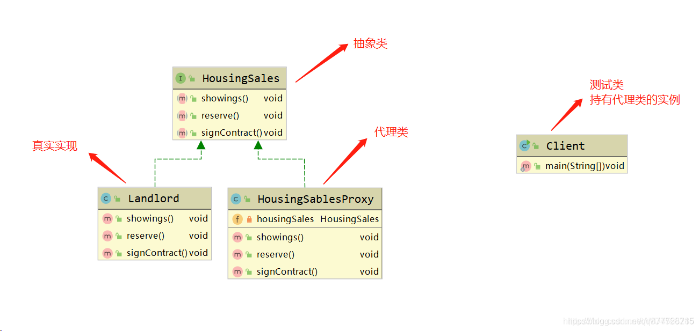
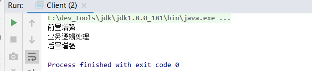

# 一.代理模式

**代理模式（Proxy Pattern）是指用一个代理类来包装具体实现类，由代理类代替目标类执行，从而为目标类增加一些额外的功能、处理。**

- 简单说就是：在操作一个对象和对象中的方法时，不是直接操作这个对象，而是通过一个代理对象来操作这个目标对象，在调用代理方法前后或者抛出异常增加一些额外处理
- <font color=#ff00a>Sping AOP（面向切面编程）</font>底层就是动态代理实现的。

**应用场景**

- 一般是需要在执行某个已经写好的方法前后加一些<font color=#ff00a>与业务本身无关的逻辑</font>，比如执行方法前打印日志，或者在执行方法之后打印方法的执行时间，诸如此类的。

# 二.代理模式角色

供参考的UML类图



- **Subject(抽象主题角色/共同接口)**: ，通过接口或抽象类定义代理角色与真实角色要共同实现的业务方法(<font color=#ff00a>代理类和被代理类都要实现该接口</font>)
- **RealSubject(真实主题角色/真实对象/被代理对象)**: <font color=#ff00a>实现了抽象角色</font>，定义真实角色所要实现的业务逻辑，供代理角色调用
- **Proxy(代理主题角色/代理对象)**: <font color=#ff00a>实现了抽象角色</font>，是真实角色的代理, <font color=#ff00a>需要持有真实角色的引用</font>，通过真实角色的业务逻辑方法来实现抽象方法，并可以附加自己的操作。

# 三.代理模式的实现方式

- 静态代理
- 动态代理：常见的有JDK动态代理、CGLIB代理。SpringAop就是使用动态代理实现的。
  - JDK动态代理 ：**如果被代理对象实现了接口**，采用JDK动态代理
  - CGLIB动态代理 ：**如果被代理对象没有实现了接口**，必须采用CGLIB动态代理

## 1.静态代理模式

静态代理，即代理类在<font color=#ff00a>代码编译</font>时就已经存在，代理类由我们在Java代码中自定义的。 一般 静态代理中的代理类和被代理类会<font color=#ff00a>实现同一接口或是继承自相同的父类</font>。

- **标准的静态代理模式**需要定义一个**共同接口**，然后被代理对象与代理对象**实现该接口**，被代理对象需要实现真正的业务逻辑，然后由代理对象持有被代理对象的引用，从而在代理类中调用被代理对象的方法，并且在调用前后新增一些其他逻辑处理。

特点

- 需要实现目标接口或者继承目标类
- 可以代理接口、类
- 可以设置每个方法的增强，很灵活；但要手动设置每个方法的增强，又很繁琐

### 1.1.Subject(抽象主题角色)

定义一个标准接口

```java
/**
 * Subject 抽象主题角色（共同接口）
 *  可以是抽象类或者接口，是一个最普通的业务类型定义，无特殊要求。
 */
public interface Subject {
    //定义一个方法
    void request();
}
```

### 1.2.RealSubject(真实主题角色)

定义一个被代理对象实现标准接口，并重写接口中的方法：

```java
/**
 * RealSubject 具体主题角色（真实对象）,实现目标接口或继承目标类
 * 也叫被代理角色。是业务逻辑的具体执行者。
 */
public class RealSubject implements Subject {
    //实现方法
    public void request() {
      System.out.println("业务逻辑处理");
    }
}
```

### 1.3.Proxy(代理主题角色)

定义一个代理对象实现标准接口，并重写接口中的方法，此代理对象需要持有被代理对象的引用，可以通过构造器传入：

```java
/**
 * Proxy 代理主题角色（代理对象）
 *   也叫代理类。负责对真实角色(真实对象)的应用，把所有抽象主题类(共同接口)定义的方法限制委托给真实主题角色(共同接口)去实现，并且在真实主题角色处理完毕前后做预处理和善后操作。
 */
public class StaticProxy implements Subject {
    //要代理哪个实现类
    private Subject subject ;

    //通过构造函数传递代理者
    public StaticProxy(Subject subject) {
        this.subject = subject;
    }

    //实现接口中定义的方法
    public void request() {
    	//前置增强
        this.before();
        //调用目标类的方法，如果是继承目标类，通过super来调用
        this.subject.request();
        //后置增强
        this.after();
    }

    //前置增强
    private void before() {
        System.out.println("前置增强");
    }

    //后置增强
    private void after() {
        System.out.println("后置增强");
    }
}
```

### 1.4.测试

```java
public class Client {
    public static void main(String[] args) {
        Subject proxy = new StaticProxy(new RealSubject());
        proxy.request();
    }
}
```


执行结果



**缺点**

- 代理对象需要<font color=#ff00a>持有被代理对象的引用</font>，如果后期需要代理其他对象，只能通过为代理对象<font color=#ff00a>新增代理类</font>实现
- 被代理对象如果新增了其他方法(接口新增了方法)，那么代理对象也需要<font color=#ff00a>同步修改</font>，不便于后期维护

**为了解决静态代理的局限性，所以我们就需要有动态代理：在运行时动态成功代理对象**

## 2.动态代理模式

- **动态代理即 编写代码时并不存在这个代理类（不需要你自己写代理类），而是在代码运行时，自动生成对应的代理类。**

### 2.1.JDK动态代理模式

从 JDK1.5 开始，JDK内置了一种动态代理的实现方式，主要有以下2个条件：

- 代理对象必须实现<font color=#ff00a>java.lang.reflect.InvocationHandler接口</font>
- 被代理对象必须<font color=#ff00a>要显示的实现至少一个接口</font>

**特点**

- 基于jdk提供的反射机制实现，无需引入第三方依赖
- 只能代理接口
- 不需要实现接口、继承目标类
- 通过代理调用的目标类的方法都会被增强，且所使用的增强完全一样，偏死板

**1.Subject(抽象主题角色)**

```java
public interface Subject {
    //定义一个方法
    void request();
}
```

**2.RealSubject(真实主题角色)**

定义一个被代理对象实现标准接口，并重写接口中的方法：

```java
/**
 * RealSubject 具体主题角色（真实对象）,实现目标接口或继承目标类
 * 也叫被代理角色。是业务逻辑的具体执行者。
 */
public class RealSubject implements Subject {
    //实现方法
    public void request() {
      System.out.println("业务逻辑处理");
    }
}
```

**3.Proxy(代理主题角色)**

`````java
/**
 * Proxy 代理主题角色（代理对象），需要实现InvocationHandler 接口
 */

public class JDKDynamicProxy implements InvocationHandler {
    //要代理哪个对象,jdk动态代理代理的是接口，subject要实现一个接口
    private Object subject;

    //动态获取代理对象
    public Object getInstance(Object subject) {
        this.subject = subject;
        Class<?> clazz = this.subject.getClass();
        //获取目标类的类加载器。
        ClassLoader classLoader =clazz.getClassLoader();
        //获取目标类实现的所有接口的class对象，这也是为什么要声明为接口的原因
        Class<?>[] interfaces = clazz.getInterfaces();
        //创建代理，返回值是Object类型，需要强转为目标接口类型
        return Proxy.newProxyInstance(classLoader, interfaces, this);
    }


    /**
     *
     * @param proxy 代理对象
     * @param method 目标方法
     * @param args 实参表
     * @return
     * @throws Throwable
     */
    @Override
    public Object invoke(Object proxy, Method method, Object[] args) throws Throwable {
        before();
        //调用代理对象方法，传入目标对象、实参表
        Object obj = method.invoke(this.subject, args);//调用代理对象方法
        after();
        //返回目标方法的返回值，Object类型
        return obj;
    }

    //前置增强
    private void before() {
        System.out.println("前置增强");
    }

    //后置增强
    private void after() {
        System.out.println("后置增强");
    }
}
`````

**4.测试**

```java
public class Client {
    public static void main(String[] args) {
        //传入目标对象，创建代理，代理是目标接口类型
        Subject proxy = (Subject) new JDKDynamicProxy().getInstance(new RealSubject());
        proxy.request();
    }
}
```


执行结果


> <font color=#ff00a>Proxy.newProxyInstance 返回的2个对象的引用其实是指向的同一个内存地址</font>，因为这个方法内部实现时做了缓存机制，当类实现的接口和真实对象均是一致时，不会重复创建代理对象。


### 2.2.CGLIB动态代理模式
**cglib动态代理的特点**

- 底层使用ASM（一个短小精悍的字节码操作框架）来操作字节码，对字节码进行增强，需要引入cglib的jar包。
- 可以代理接口、类
- 需要实现MethodInterceptor接口
- 通过代理调用的目标类的方法都会被增强，且所使用的增强完全一样，偏死板

**需要添加cglib的依赖**

```
<dependency>
    <groupId>cglib</groupId>
    <artifactId>cglib</artifactId>
    <version>3.2.5</version>
</dependency>
```

**1.RealSubject(真实主题角色)**

```java
/**
 * RealSubject 具体主题角色（真实对象）也叫被代理角色。是业务逻辑的具体执行者。
 */
public class RealSubject  {
    public void request() {
        System.out.println("业务逻辑处理");
    }
}
```

**2.Proxy(代理主题角色)**

```java
/**
 * Proxy 代理主题角色-CGLIB模式代理具体类，需要实现MethodInterceptor接口
 */

public class CGLIBDynamicProxy  implements MethodInterceptor {
    //要代理哪个对象,CGLIB可以代理具体类，也可以代理接口
    private RealSubject subject;

    public CGLIBDynamicProxy(RealSubject subject) {
        this.subject = subject;
    }


    /**
     * 创建cglib代理对象的方法
     * @return
     */
    public RealSubject createProxy(){
        // 创建增强器（创建工具类对象）
        Enhancer e = new Enhancer();
        // 指定父类（设置基类（父类），即继承目标类）
        e.setSuperclass(RealSubject.class);
        // 指定回调接口对象(设置回调函数，此句代码是调用intercept()拦截目标方法，进行增强)
        e.setCallback(this);
        // 创建cglib代理对象(创建并返回代理对象。创建的对象是Object型，需要强转)
        return (RealSubject) e.create();
    }

    /**
     * 拦截方法
     */
    @Override
    public Object intercept(Object obj, Method method, Object[] agrs, MethodProxy proxy) throws Throwable {
        //前置增强
        before();
        //调用代理对象方法，传入目标对象、实参表
        Object result = method.invoke(subject, agrs);
        //后置增强
        after();
        return result;
    }


    //前置增强
    private void before() {
        System.out.println("前置增强");
    }

    //后置增强
    private void after() {
        System.out.println("后置增强");
    }
}
```

**3.测试**

```java
public class Client {
    public static void main(String[] args) {
        // 定义目标对象,获取代理对象
        RealSubject proxy = new CGLIBDynamicProxy(new RealSubject()).createProxy();
        //代理调用
        proxy.request();
    }
}
```


执行结果


**4.CGLIB代理模式代理接口**

```java
/**
 * 测试
 */
public class Client {
    public static void main(String[] args) {
        // 定义目标对象,获取代理对象
        Subject proxy = new CGLIBDynamicProxy(new RealSubject()).createProxy();
        //代理调用
        proxy.request();
    }
}

/**
 * Subject 抽象主题角色（共同接口）
 */
interface Subject {
    //定义一个方法
    void request();
}

/**
 * RealSubject 具体主题角色（真实对象）,也叫被代理角色。是业务逻辑的具体执行者。
 */
class RealSubject implements Subject {
    public void request() {
        System.out.println("业务逻辑处理");
    }
}


/**
 * Proxy 代理主题角色-CGLIB模式代理接口，需要实现MethodInterceptor接口
 */

class CGLIBDynamicProxy implements MethodInterceptor {
    //要代理哪个对象,CGLIB可以代理具体类，也可以代理接口
    private Subject subject;

    public CGLIBDynamicProxy(Subject subject) {
        this.subject = subject;
    }
    
    /**
     * 创建cglib代理对象的方法
     * @return
     */
    public Subject createProxy() {
        // 创建增强器
        Enhancer e = new Enhancer();
        // 指定父类
        e.setSuperclass(Subject.class);
        // 指定回调接口对象
        e.setCallback(this);
        // 创建cglib代理对象
        return (Subject) e.create();
    }

    /**
     * 拦截方法
     */
    @Override
    public Object intercept(Object obj, Method method, Object[] agrs, MethodProxy proxy) throws Throwable {
        //前置增强
        before();
        //调用代理对象方法，传入目标对象、实参表
        Object result = method.invoke(subject, agrs);
        //后置增强
        after();
        return result;
    }
    
    //前置增强
    private void before() {
        System.out.println("前置增强");
    }

    //后置增强
    private void after() {
        System.out.println("后置增强");
    }
}
```


## 3.使用建议

- 如果要对不同的方法做不同的增强，用静态代理；
- 如果对每个方法的增强都一样，用动态代理。
- 如果要代理接口，使用静态代理、jdk动态代理、cglib动态代理都行
- 如果要代理类，用静态代理、cglib动态代理。

# 四.总结

## 1.代理模式的优缺点

**优点**

- 代理模式能将代理对象与真实被调用的目标对象分离。
- 可以在不修改被代理对象代码的前提下对代理对象的方法进行功能增强，符合开闭原则

**缺点**

- 根据实现方式的不同，对代码都有一定的侵入性，比如静态代理要侵入代理类的实例，jdk代理需要侵入Proxy类，而Cglib代理则需要侵入子类子类对象创建等代码。

## 2.代理模式和外观、装饰者模式的不同

- 装饰器模式：强调的是增强自身，增强后你还是你，只不过能力更强了而已。
- 代理模式：强调要让别人（代理类）帮你去做一些本身与你业务没有太多关系的职责（记录日志、设置缓存）

---

- 代理模式：是为了实现对象的控制，因为被代理的对象往往难以直接获得或者是其内部不想暴露出来。
- 外观模式：定义了一个高层接口，为多个子系统中的接口提供一个一致的界面，不对目标功能进行增强。
  