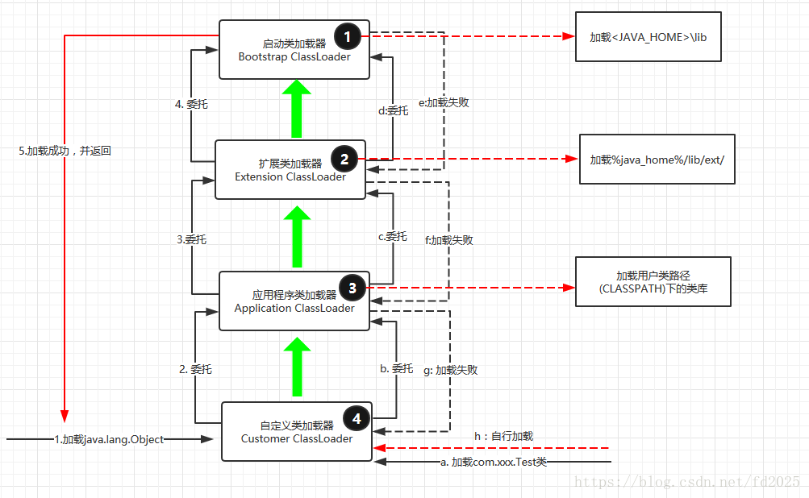
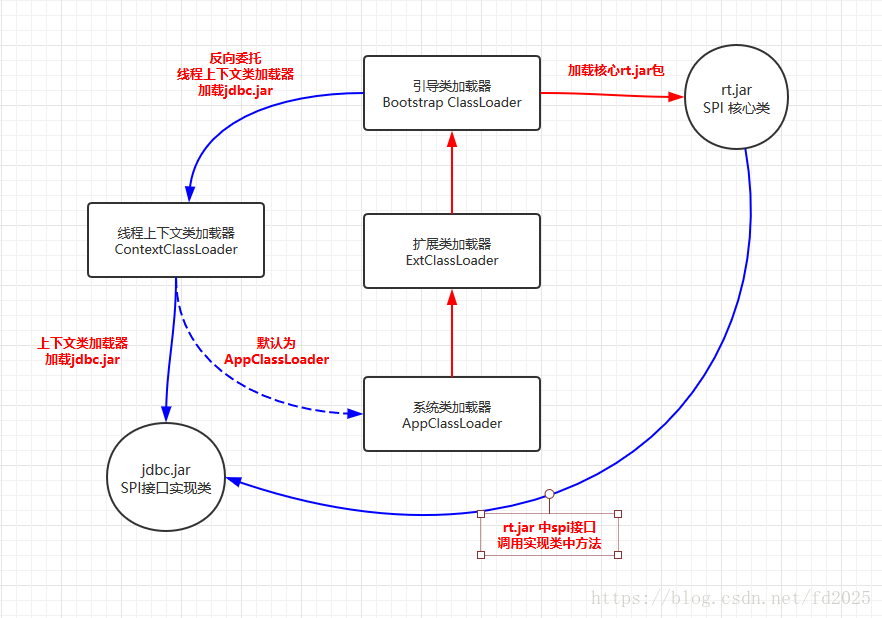

# 3 Java类加载

## 简述java类加载机制

虚拟机把描述类的数据从Class文件加载到内存，并对数据进行校验，解析和初始化，最终形成可以被虚拟机直接使用的java类型。


## java类加载过程

java类加载需要经历以下7个过程：加载、验证、准备、解析、初始化，然后是使用和卸载了。

**加载**
加载是类加载的第一个过程，在这个阶段，将完成以下三件事情：

1. 通过一个类的全限定名获取该类的二进制流。
2. 将该二进制流中的静态存储结构转化为方法去运行时数据结构。 
3. 在内存中生成该类的Class对象，作为该类的数据访问入口。

**验证**
验证的目的是为了确保Class文件的字节流中的信息不会危害到虚拟机.在该阶段主要完成以下四种验证:

1. 文件格式验证：验证字节流是否符合Class文件的规范，如主次版本号是否在当前虚拟机范围内，常量池中的常量是否有不被支持的类型。
2. 元数据验证:对字节码描述的信息进行语义分析，如这个类是否有父类，是否集成了不被继承的类等。
3. 字节码验证：是整个验证过程中最复杂的一个阶段，通过验证数据流和控制流的分析，确定程序语义是否正确，主要针对方法体的验证。如：方法中的类型转换是否正确，跳转指令是否正确等。
4. 符号引用验证：这个动作在后面的解析过程中发生，主要是为了确保解析动作能正确执行。

**准备**
准备阶段是为类的静态变量分配内存并将其初始化为默认值，这些内存都将在方法区中进行分配。准备阶段不分配类中的实例变量的内存，实例变量将会在对象实例化时随着对象一起分配在Java堆中。

​    public static int value=123;*//在准备阶段value初始值为0 。在初始化阶段才会变为123 。*

**解析**
该阶段主要完成符号引用到直接引用的转换动作。解析动作并不一定在初始化动作完成之前，也有可能在初始化之后。

**初始化**
初始化是类加载的最后一步，前面的类加载过程，除了在加载阶段用户应用程序可以通过自定义类加载器参与之外，其余动作完全由虚拟机主导和控制。到了初始化阶段，才真正开始执行类中定义的Java程序代码。


## 什么是类加载器，类加载器有哪些

实现通过类的全限定名获取该类的二进制字节流的代码块叫做类加载器。

从Java虚拟机的角度来说，只存在两种不同的类加载器：一种是启动类加载器（Bootstrap ClassLoader），这个类加载器使用C++语言实现（HotSpot虚拟机中），是虚拟机自身的一部分；另一种就是所有其他的类加载器，这些类加载器都有Java语言实现，独立于虚拟机外部，并且全部继承自java.lang.ClassLoader。

从开发者的角度，主要有以下四种类加载器:

1. 启动类加载器(Bootstrap ClassLoader)用来加载java核心类库，无法被java程序直接引用。
2. 扩展类加载器(extensions class loader):它用来加载 Java 的扩展库。Java 虚拟机的实现会提供一个扩展库目录。该类加载器在此目录里面查找并加载 Java 类。
3. 系统类加载器（system class loader）：它根据 Java 应用的类路径（CLASSPATH）来加载 Java 类。一般来说，Java 应用的类都是由它来完成加载的。可以通过 ClassLoader.getSystemClassLoader()来获取它。
4. 用户自定义类加载器，通过继承 java.lang.ClassLoader类的方式实现。

它们之间的层次关系被称为**类加载器的双亲委派模型**。该模型要求除了顶层的启动类加载器外，其余的类加载器都应该有自己的父类加载器，而这种父子关系一般通过组合（Composition）关系来实现，而不是通过继承（Inheritance）。

**类加载器--类的唯一性**

类加载器虽然只用于实现类的加载动作，但是对于任意一个类，都需要由加载它的类加载器和这个类本身共同确立其在Java虚拟机中的唯一性。通俗的说，JVM中两个类是否“相等”，首先就必须是同一个类加载器加载的，否则，即使这两个类来源于同一个Class文件，被同一个虚拟机加载，只要类加载器不同，那么这两个类必定是不相等的。


## 类加载器双亲委派模型机制

当一个类收到了类加载请求时，不会自己先去加载这个类，而是将其委派给父类，由父类去加载，如果此时父类不能加载，反馈给子类，由子类去完成类的加载。



某个特定的类加载器在接到加载类的请求时，首先将加载任务委托给父类加载器，依次递归，如果父类加载器可以完成类加载任务，就成功返回；只有父类加载器无法完成此加载任务时，才自己去加载。

使用双亲委派模型的好处在于Java类随着它的类加载器一起具备了一种带有优先级的层次关系。例如类java.lang.Object，它存在在rt.jar中，无论哪一个类加载器要加载这个类，最终都是委派给处于模型最顶端的Bootstrap ClassLoader进行加载，因此Object类在程序的各种类加载器环境中都是同一个类。相反，如果没有双亲委派模型而是由各个类加载器自行加载的话，如果用户编写了一个java.lang.Object的同名类并放在ClassPath中，那系统中将会出现多个不同的Object类，程序将混乱。因此，如果开发者尝试编写一个与rt.jar类库中重名的Java类，可以正常编译，但是永远无法被加载运行。

在java.lang.ClassLoader的loadClass()方法中，先检查是否已经被加载过，若没有加载则调用父类加载器的loadClass()方法，若父加载器为空则默认使用启动类加载器作为父加载器。如果父加载失败，则抛出ClassNotFoundException异常后，再调用自己的findClass()方法进行加载。

注意，双亲委派模型是Java设计者推荐给开发者的类加载器的实现方式，并不是强制规定的。大多数的类加载器都遵循这个模型，但是JDK中也有较大规模破坏双亲模型的情况，例如**线程上下文类加载器**（Thread Context ClassLoader）的出现。


## 双亲委派模型的破坏者-线程上下文类加载器

在Java应用中存在着很多服务提供者接口（Service Provider Interface，SPI），这些接口允许第三方为它们提供实现，如常见的 SPI 有 JDBC、JNDI等，这些 SPI 的接口属于 Java 核心库，一般存在rt.jar包中，由Bootstrap类加载器加载，而 SPI 的第三方实现代码则是作为Java应用所依赖的 jar 包被存放在classpath路径下，由于SPI接口中的代码经常需要加载具体的第三方实现类并调用其相关方法，但SPI的核心接口类是由引导类加载器来加载的，而Bootstrap类加载器无法直接加载SPI的实现类，同时由于双亲委派模式的存在，Bootstrap类加载器也无法反向委托AppClassLoader加载器SPI的实现类。在这种情况下，我们就需要一种特殊的类加载器来加载第三方的类库，而线程上下文类加载器就是很好的选择。 

线程上下文类加载器（contextClassLoader）是从 JDK 1.2 开始引入的，我们可以通过java.lang.Thread类中的getContextClassLoader()和 setContextClassLoader(ClassLoader cl)方法来获取和设置线程的上下文类加载器。如果没有手动设置上下文类加载器，线程将继承其父线程的上下文类加载器，初始线程的上下文类加载器是系统类加载器（AppClassLoader）,在线程中运行的代码可以通过此类加载器来加载类和资源，如下图所示，以jdbc.jar加载为例




## Java-编译后出现$1.class与$2.class的情况总结

如果是 Xxxx$Yyyy 的话就是有名字的内部类，如果是 Xxxx$1, Xxxx$2 的话就是没有名字的内部类，也就是匿名内部类。

**内部类**

a.class,a$b.class,表示 b类是a类的内部类，代码：

```
class a{

    .....a类代码

    class b{


    }

} 
```


**匿名类**

对于接口和抽象类来说, 不能被实例化.我们说不出这个类的名字, 就叫它匿名类.


匿名内部类也就是没有名字的内部类

正因为没有名字，所以匿名内部类只能使用一次，它通常用来简化代码编写

但使用匿名内部类还有个前提条件：必须继承一个父类或实现一个接口

 

**实例1:不使用匿名内部类来实现抽象方法**
```
abstract class Person {

    public abstract void eat();

}

 

class Child extends Person {

    public void eat() {

        System.out.println("eat something");

    }

}

 

public class Demo {

    public static void main(String[] args) {

        Person p = new Child();

        p.eat();

    }

}
```
**运行结果：**eat something

可以看到，我们用Child继承了Person类，然后实现了Child的一个实例，将其向上转型为Person类的引用

但是，如果此处的Child类只使用一次，那么将其编写为独立的一个类岂不是很麻烦？

这个时候就引入了匿名内部类

 

**实例2：匿名内部类的基本实现**
```
abstract class Person {

    public abstract void eat();

}

 

public class Demo {

    public static void main(String[] args) {

        Person p = new Person() {

            public void eat() {

                System.out.println("eat something");

            }

        };

        p.eat();

    }

}
```
**运行结果：**eat something

可以看到，我们直接将抽象类Person中的方法在大括号中实现了

这样便可以省略一个类的书写

并且，匿名内部类还能用于接口上

 

**实例3：在接口上使用匿名内部类**
```
interface Person {
    public void eat();
}
 
public class Demo {
    public static void main(String[] args) {
        Person p = new Person() {
            public void eat() {
                System.out.println("eat something");
            }
        };
        p.eat();
    }
}
```

**运行结果：**eat something

 

由上面的例子可以看出，只要一个类是抽象的或是一个接口，那么其子类中的方法都可以使用匿名内部类来实现

最常用的情况就是在多线程的实现上，因为要实现多线程必须继承Thread类或是继承Runnable接口

 

**实例4：Thread类的匿名内部类实现**

```
public class Demo {
    public static void main(String[] args) {
        Thread t = new Thread() {
            public void run() {
                for (int i = 1; i <= 5; i++) {
                    System.out.print(i + " ");
                }
            }
        };
        t.start();
    }
}
```

**运行结果：**1 2 3 4 5

 

**实例5：Runnable接口的匿名内部类实现**
```
public class Demo {

    public static void main(String[] args) {

        Runnable r = new Runnable() {

            public void run() {

                for (int i = 1; i <= 5; i++) {

                    System.out.print(i + " ");

                }

            }

        };

        Thread t = new Thread(r);

        t.start();

    }

}
```
**运行结果：**1 2 3 4 5