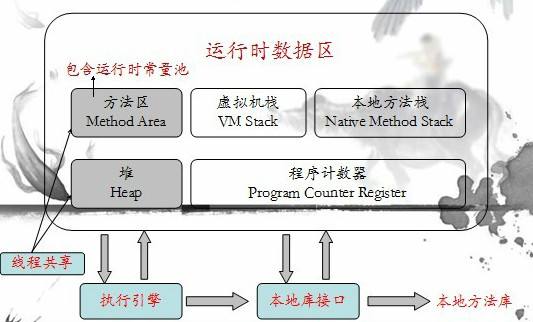

# 2.3 JVM介绍与参数详解
JVM是Java Virtual Machine（Java虚拟机）的缩写，它是java运行环境的一部分，是一个虚构出来的计算机，它是通过在实际的计算机上仿真模拟各种计算机功能来实现的。引入Java虚拟机后，Java语言在不同平台上运行时就不需要重新编译。Java语言使用Java虚拟机屏蔽了与具体平台相关的信息，使得Java语言编译程序只需生成在Java虚拟机上运行的目标代码（字节码），就可以在多种平台上不加修改地运行。

JVM在整个JDK中处于最底层，负责与操作系统之间进行交互。JVM是java字节码执行的引擎，还能优化java字节码，使之转化成效率更高的机器指令。
## **JVM主要组成部分**

JVM包含两个子系统和两个组件，两个子系统为Class loader(类装载)、Execution engine(执行引擎)；两个组件为Runtime data area(运行时数据区)、Native Interface(本地接口)。

1. 类加载器（Class Loader）：加载类文件到内存。Class loader只管加载，只要符合文件结构就加载，至于能否运行，它不负责，那是有Exectution Engine 负责的。

2. 执行引擎（Execution Engine）：也叫解释器，负责解释命令，交由操作系统执行。

3. 本地库接口（Native Interface）：与native libraries交互，本地接口的作用是融合java与其它编程语言交互的接口。

4. 运行时数据区（Runtime Data Area）：这就是我们常说的JVM的内存。

  除此外，Java虚拟机还包含一个垃圾回收模块。垃圾回收模块在Java虚拟机规范中并没有要求Java虚拟机提供垃圾收集，但是在没有发明无限的内存之前，大多数JVM实现都是有垃圾收集的。

## **JVM内存组成**

Java的运行时内存组成如下图所示：

其中，对于这各个部分有一些是线程私有的，其他则是线程共享的。

线程私有的如下：

- 程序计数器

  当前线程所执行的字节码的行号指示器。

  字节码解释器工作时就是通过改变这个计数器的值来选取下一条需要执行的字节码指令，分支、循环、跳
  转、异常处理、线程恢复等基础功能都需要依赖这个计数器来完成。 

- Java虚拟机栈

  Java方法执行的内存模型，每个方法被执行时都会创建一个栈帧，存储局部变量表、操作栈、动态链接、方法出口等信息。它的生命周期与线程相同。 

  - 每个线程都有自己独立的栈空间
  - 线程栈只存基本类型和对象地址
  - 方法中局部变量在线程空间中

- 本地方法栈

  Native方法服务。在HotSpot虚拟机中和Java虚拟机栈合二为一。

线程共享的如下：

- Java堆

  **存放对象实例，几乎所有的对象实例以及其属性都在这里分配内存。**

  Java 堆是垃圾收集器管理的主要区域，因此很多时候也被称做“GC 堆” 。

- 方法区

  存储已经被虚拟机加载的类信息、常量、静态变量、JIT编译后的代码等数据。

按照官方的说法：“Java 虚拟机具有一个堆，堆是运行时数据区域，所有类实例和数组的内存均从此处分配。堆是在 Java 虚拟机启动时创建的。在JVM中堆之外的内存称为非堆内存(Non-heap memory)”。可以看出JVM主要管理两种类型的内存：堆和非堆。简单来说堆就是Java代码可及的内存，是留给开发人员使用的；非堆就是JVM留给自己用的，所以方法区、JVM内部处理或优化所需的内存(如JIT编译后的代码缓存)、每个类结构(如运行时常数池、字段和方法数据)以及方法和构造方法的代码都在非堆内存中。

**堆内存参数**

–Xms 指定最小堆内存，默认是物理内存的1/64；-Xmx 指定最大堆内存，默认是物理内存的1/4。默认空余堆内存小于40%时，JVM就会增大堆直到-Xmx的最大限制；空余堆内存大于70%时，JVM会减少堆直到 -Xms的最小限制。因此服务器一般设置-Xms、-Xmx相等以避免在每次GC 后调整堆的大小。

目前大多数JVM采用分代回收的策略，将堆分为新生代和老年代。其中新生代有eden、2个survivor 区域组成。

-Xmn 设置新生代大小。

-XX:NewRatio 新生代（eden+2*s）和老年代的比值。 如设为4 表示 新生代:老年代=1:4，即新轻代占堆的1/5。

-XX:SurvivorRatio 设置两个Survivor区和eden的比值。如设为8表示两个Survivor :eden=2:8，即一个Survivor占年轻代的1/10。

**非堆内存参数**

-Xss 指定每个线程的栈的大小。JDK5.0以后每个线程堆栈大小为1M，以前每个线程堆栈大小为256K。

-XX:PermSize 设置永久代的初始空间，默认是物理内存的1/64；

-XX:MaxPermSize 设置永久代最大空间，默认是物理内存的1/4。

HotSpot虚拟机在1.8之后已经取消了永久代，改为元空间，类的元信息被存储在元空间中。元空间没有使用堆内存，而是与堆不相连的本地内存区域。

-XX:MetaspaceSize 设置元空间初始大小。

-XX:MaxMetaspaceSize 设置元空间最大可分配大小。

如果不指定元空间的大小，默认情况下，元空间最大的大小是系统内存的大小，元空间一直扩大，所以不会出现永久代存在时的内存溢出问题，但虚拟机可能会消耗完所有的可用系统内存。一旦元空间的大小触及-XX:MetaspaceSize值，就会触发Full GC并会卸载没有用的类，然后这个值将会被调整。所以为了避免频繁GC以及调整，建议将-XX:MetaspaceSize设置为较高的值，而-XX:MaxMetaspaceSize不进行设置。

## **JVM垃圾回收**

JVM里的GC(Garbage Collection)的算法有很多种：标记清除、标记整理、复制算法、分代收集。

**1.** **标记-清除:**
这是垃圾收集算法中最基础的，根据名字就可以知道，它的思想就是标记哪些要被回收的对象，然后统一回收。这种方法很简单，但是会有两个主要问题：1.效率不高，标记和清除的效率都很低；2.会产生大量不连续的内存碎片，导致以后程序在分配较大的对象时，由于没有充足的连续内存而提前触发一次GC动作。

**2.** **标记-整理**
该算法主要是为了解决标记-清除，产生大量内存碎片的问题；当对象存活率较高时，也解决了复制算法的效率问题。它的不同之处就是在清除对象的时候现将可回收对象移动到一端，然后清除掉端边界以外的对象，这样就不会产生内存碎片了。

**3.** **复制算法:**
为了解决效率问题，复制算法将可用内存按容量划分为相等的两部分，然后每次只使用其中的一块，当一块内存用完时，就将还存活的对象复制到第二块内存上，然后一次性清楚完第一块内存，再将第二块上的对象复制到第一块。但是这种方式，内存的代价太高，每次基本上都要浪费一般的内存。
于是将该算法进行了改进，内存区域不再是按照1：1去划分，而是将内存划分为8:1:1三部分，较大那份内存交Eden区，其余是两块较小的内存区叫Survior区。每次都会优先使用Eden区，若Eden区满，就将对象复制到第二块内存区上，然后清除Eden区，如果此时存活的对象太多，以至于Survivor不够时，会将这些对象通过分配担保机制复制到老年代中。(java堆又分为新生代和老年代)

**4.** **分代收集** 
现在的虚拟机垃圾收集大多采用这种方式，它根据对象的生存周期，将堆分为新生代和老年代。在新生代中，由于对象生存期短，每次回收都会有大量对象死去，那么这时就采用**复制**算法。老年代里的对象存活率较高，没有额外的空间进行分配担保，所以可以使用**标记-整理** 或者 **标记-清除**。

当Eden区没有足够的空间进行分配时，虚拟机会执行一次Minor GC。Minor GC通常发生在新生代的Eden区，在这个区的对象生存期短，往往发生GC的频率较高，回收速度比较快;Full GC/Major GC 发生在老年代，一般情况下，触发老年代GC的时候不会触发Minor GC,但是通过配置，可以在Full GC之前进行一次Minor GC这样可以加快老年代的回收速度。不管是Minor GC还是Full GC,GC过程中都会对导致程序运行中中断,正确的选择不同的GC策略,调整JVM、GC的参数，可以极大的减少由于GC工作，而导致的程序运行中断方面的问题，进而适当的提高Java程序的工作效率。

**JVM参数**

-XX:+UseSerialGC：使用串行回收器进行回收，这个参数会使新生代和老年代都使用串行回收器，新生代使用复制算法，老年代使用标记-整理算法。Serial收集器是最基本、历史最悠久的收集器，它是一个单线程收集器。一旦回收器开始运行时，整个系统都要停止。Client模式下默认开启，其他模式默认关闭。

-XX:+UseParNewGC：ParNew收集器是Serial收集器的多线程版本，使用这个参数后会在新生代进行并行回收，老年代仍旧使用串行回收。新生代S区任然使用复制算法。操作系统是多核CPU上效果明显，单核CPU建议使用串行回收器。默认关闭。

-XX:+UseParallelGC：代表新生代使用Parallel收集器，老年代使用串行收集器。Parallel收集器在各个方面都很类似ParNew收集器，它的目的是达到一个可以控制的吞吐量。吞吐量为CPU用于运行用户代码的时间与CPU总消耗时间的比值，即吞吐量=运行用户代码时间/（运行用户代码时间+垃圾收集时间），虚拟机运行100分钟，垃圾收集花费1分钟，那吞吐量就99%。Server模式默认开启，其他模式默认关闭。
Parallel Scavenge提供了两个参数用于控制吞吐量：
-XX:MaxGCPauseMills：最大停顿时间，单位毫秒,GC尽力保证回收时间不超过设定值。
-XX:GCTimeRatio ：0-100的取值范围,垃圾收集时间占总时间的比。默认99，即最大允许1%时间做GC。
这两个参数是矛盾的。因为停顿时间和吞吐量不可能同时调优。
Parallel收集器还提供了自适应的调节策略-XX:UseAdaptiveSizePolicy，即JVM会根据实际运行情况动态调整新生代大小、新生代和s区比例、晋升老年代对象大小等细节参数。

-XX:+UseConcMarkSweepGC 即使用CMS收集器。它是和应用程序线程一起执行，相对于Stop The World来说虚拟机停顿时间较少。停顿减少，吞吐量会降低。它使用的是标记清除算法，运作过程为四个步骤，分别是 初始标记—并发标识—重新标记—并发清除。它是老年代的收集算法，新生代使用ParNew收集算法。默认关闭。
CMS收集器的缺点是对服务器CPU资源较为敏感，在并发标记时会降低吞吐量。它使用的标记清除算法也会产生大量空间碎片，空间碎片的存在会加大Full GC的频率，虽然老年代还有足够的内存，但是因为内存空间连续，不得不进行Full GC。
-XX:+UseCMSInitiatingOccupancyOnly 表示只在到达阀值的时候，才进行CMS回收
-XX:CMSInitiatingOccupancyFraction设置触发GC的阈值

## **其他辅助的JVM参数**

-XX:+PrintCommandLineFlags   打印出JVM运行时的各种的各项配置参数

-verbose:gc  发生GC时，打印出GC日志

-XX:+printGC 发生GC时，打印出GC日志

-XX:+PrintGCDetails 打印GC的详细日志，并且在程序运行结束时会打印出JVM的内存占用情况

-Xloggc:d:\\gc.log  GC日志默认是打印在控制台，添加这个参数可以指定GC日志的输出位置，指定后控制台就无法查看GC日志了

-XX:+HeapDumpOnOutOfMemoryError OOM时导出堆到文件

-XX:HeapDumpPath=d:/a.dump 导出OOM的路径