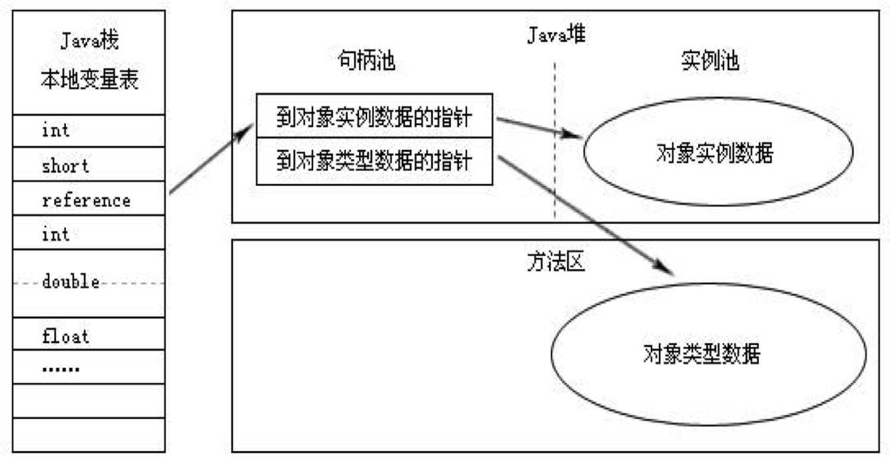

# 2 JVM内存管理

## Java运行时内存区

Java的运行时内存组成如下图所示：

其中，对于这各个部分有一些是线程私有的，其他则是线程共享的。

线程私有的如下：

- 程序计数器

  当前线程所执行的字节码的行号指示器。

  字节码解释器工作时就是通过改变这个计数器的值来选取下一条需要执行的字节码指令，分支、循环、跳
  转、异常处理、线程恢复等基础功能都需要依赖这个计数器来完成。 

- Java虚拟机栈

  Java方法执行的内存模型，每个方法被执行时都会创建一个栈帧，存储局部变量表、操作栈、动态链接、方法出口等信息。它的生命周期与线程相同。 

  - 每个线程都有自己独立的栈空间
  - 线程栈只存基本类型和对象地址
  - 方法中局部变量在线程空间中

- 本地方法栈

  Native方法服务。在HotSpot虚拟机中和Java虚拟机栈合二为一。

线程共享的如下：

- Java堆

  **存放对象实例，几乎所有的对象实例以及其属性都在这里分配内存。**

  Java 堆是垃圾收集器管理的主要区域，因此很多时候也被称做“GC 堆” 。

- 方法区

  存储已经被虚拟机加载的类信息、常量、静态变量、JIT编译后的代码等数据。

- 运行时常量池

  方法区的一部分。用于存放编译期生成的各种字面量和符号引用。

- 直接内存

  NIO、Native函数直接分配的堆外内存。DirectBuffer引用也会使用此部分内存。

  

## 对象访问

即使是最简单的访问，也会却涉及 **Java栈**、 **Java 堆**、**方法区**这三个最重要内存区域之间的关联关系，如下面的这句代码：
Object obj = new Object(); 

假设这句代码出现在方法体中，那“Object obj”这部分的语义将会反映到 **Java 栈**的本地变量表中，作为一个reference 类型数据出现。而“new Object()”这部分的语义将会反映到 **Java 堆**中，形成一块存储了 Object类型所有实例数据值（Instance Data，对象中各个实例字段的数据）的结构化内存，根据具体类型以及虚拟机实现的对象内存布局（Object Memory Layout）的不同，这块内存的长度是不固定的。另外，在 Java 堆中还必须包含能查找到此对象类型数据（如对象类型、父类、实现的接口、方法等）的地址信息，这些类型数据则存储在**方法区**中。

Java是面向对象的一种编程语言，那么如何通过引用来访问对象呢？一般有两种方式：

1. 通过句柄访问

   如果使用句柄访问方式， Java 堆中将会划分出一块内存来作为句柄池， reference 中存储的就是对象的句柄地址，而句柄中包含了对象实例数据和类型数据各自的具体地址信息，如下图所示： 

2. 直接指针(此种方式也是HotSpot虚拟机采用的方式。)

   如果使用的是直接指针访问方式， Java 堆对象的布局中就必须考虑如何放置访问类型数据的相关信息，reference 中直接存储的就是对象地址，如下图所示： 

## 内存溢出

在JVM申请内存的过程中，会遇到无法申请到足够内存，从而导致内存溢出的情况。一般有以下几种情况：

- 虚拟机栈和本地方法栈溢出
  - StackOverflowError: **线程请求的栈深度大于虚拟机所允许的最大深度(循环递归)**
  - OutOfMemoryError: 虚拟机在扩展栈是无法申请到足够的内存空间，一般可以通过不停地创建线程引起此种情况
- Java堆溢出: 当创建大量对象并且对象生命周期都很长的情况下，会引发OutOfMemoryError
- 运行时常量区溢出：OutOfMemoryError:PermGen space，这里一个典型的例子就是String的intern方法，当大量字符串使用intern时，会触发此内存溢出
- 方法区溢出：方法区存放Class等元数据信息，如果产生大量的类(使用cglib)，那么就会引发此内存溢出，OutOfMemoryError:PermGen space，在使用Hibernate等框架时会容易引起此种情况。