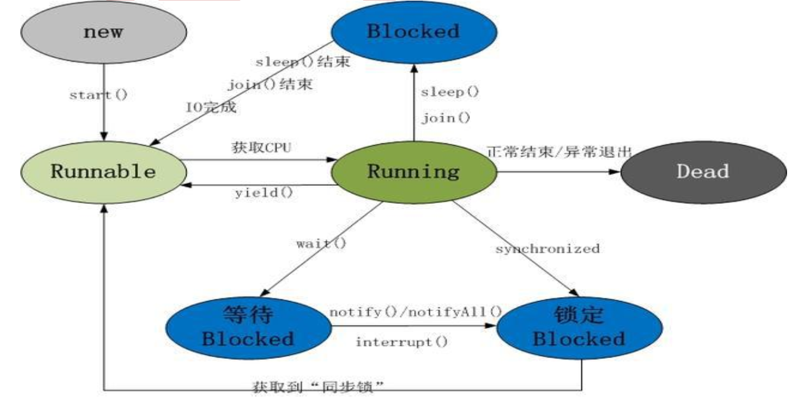

# 1 Java线程

## 创建线程的有哪些方式？ 

1. 继承 Thread 类创建线程类

   **优势是：**
   编写简单，如果需要访问当前线程，则无需使用 Thread.currentThread()方法，直接使用 this 即可获得当前线程。
   **劣势是：**
   线程类已经继承了 Thread 类，所以不能再继承其他父类。

2. 通过 Runnable 接口创建线程类 

   **优势是：**
   线程类只是实现了 Runnable 接口或 Callable 接口，还可以继承其他类。
   在这种方式下，多个线程可以共享同一个 target 对象，所以非常适合多个相同线程来处理同一份资源的情况，从而可以将 CPU、代码和数据分开，形成清晰的模型，较好地体现了面向对象的思想。
   **劣势是：** 
   编程稍微复杂，如果要访问当前线程，则必须使用 Thread.currentThread()方法 

3. 通过 Callable 和 Future 创建线程 

   - Callable 规定（重写）的方法是 call()，Runnable 规定（重写）的方法是 run()。
   
   - Callable 的任务执行后可返回值，而 Runnable 的任务是不能返回值的。
   
   - Call 方法可以抛出异常，run 方法不可以。
   
   运行 Callable 任务可以拿到一个 Future 对象，表示异步计算的结果。它提供了检查计算是否完成的方法，以等待计算的完成，并检索计算的结果。通过 Future 对象可以了解任务执行情况，可取消任务的执行，还可获取执行结果。
   
   在并发编程中，我们经常用到非阻塞的模型，在之前的多线程的三种实现中，不管是继承 thread 类还是实现 runnable 接口，都无法保证获取到之前的执行结果。通过实现 Callback 接口，并用 Future 可以来接收多线程的执行结果。 
   
   Future 表示一个可能还没有完成的异步任务的结果，针对这个结果可以添加Callback 以便在任务执行成功或失败后作出相应的操作。

## 线程的状态流转图 

线程的生命周期及五种基本状态： 

**Java 线程具有五中基本状态**

1）**新建状态（New）**：当线程对象对创建后，即进入了新建状态，如：Thread t = new MyThread();  

2）**就绪状态（Runnable）**：当调用线程对象的 start()方法（t.start();），线程即进入就绪状态。处于就绪状态的线程，只是说明此线程已经做好了准备，随时等待 CPU 调度执行，并不是说执行了 t.start()此线程立即就会执行； 

3）**运行状态（Running）**：当 CPU 开始调度处于就绪状态的线程时，此时线程才得以真正执行，即进入到运行状态。注：就 绪状态是进入到运行状态的唯一入口，也就是说，线程要想进入运行状态执行，首先必须处于就绪状态中； 

4）**阻塞状态（Blocked）**：处于运行状态中的线程由于某种原因，暂时放弃对CPU 的使用权，停止执行，此时进入阻塞状态，直到其进入到就绪状态，才有机会再次被 CPU 调用以进入到运行状态。根据阻塞产生的原因不同，阻塞状态又可以分为三种： 

1. 等待阻塞：运行状态中的线程执行 wait()方法，使本线程进入到等待阻塞状态；
2. 同步阻塞 — 线程在获取 synchronized 同步锁失败(因为锁被其它线程所占用)，它会进入同步阻塞状态；
3. 其他阻塞 — 通过调用线程的 sleep()或 join()或发出了 I/O 请求时，线程会进入到阻塞状态。当 sleep()状态超时、join()等待线程终止或者超时、或者 I/O 处理完毕时，线程重新转入就绪状态 ;

5）**死亡状态（Dead）**：线程执行完了或者因异常退出了 run()方法，该线程结束生命周期。 

sleep()和wait()方法的最大区别是：

  - sleep()睡眠时，保持对象锁，仍然占有该锁；

  - 而wait()睡眠时，释放对象锁。

但是wait()和sleep()都可以通过interrupt()方法打断线程的暂停状态，从而使线程立刻抛出InterruptedException（但不建议使用该方法）。

**sleep（）方法**

sleep()使当前线程进入停滞状态（阻塞当前线程），让出CUP的使用、目的是不让当前线程独自霸占该进程所获的CPU资源，以留一定时间给其他线程执行的机会;

sleep()是Thread类的Static(静态)的方法；因此他不能改变对象的机锁，所以当在一个Synchronized块中调用Sleep()方法是，线程虽然休眠了，但是对象的机锁并木有被释放，其他线程无法访问这个对象（即使睡着也持有对象锁）。

在sleep()休眠时间期满后，该线程不一定会立即执行，这是因为其它线程可能正在运行而且没有被调度为放弃执行，除非此线程具有更高的优先级。 

**wait（）方法**

wait()方法是Object类里的方法；当一个线程执行到wait()方法时，它就进入到一个和该对象相关的等待池中，同时失去（释放）了对象的机锁（暂时失去机锁，wait(long timeout)超时时间到后还需要返还对象锁）；其他线程可以访问；

wait()使用notify或者notifyAlll或者指定睡眠时间来唤醒当前等待池中的线程。

wiat()必须放在synchronized block中，否则会在program runtime时扔出“java.lang.IllegalMonitorStateException”异常。

# 线程的调度策略

线程调度器选择优先级最高的线程运行，但是，如果发生以下情况，就会终止线程的运行： 

（1）线程体中调用了 yield 方法让出了对 cpu 的占用权利 
（2）线程体中调用了 sleep 方法使线程进入睡眠状态 
（3）线程由于 IO 操作受到阻塞 
（4）另外一个更高优先级线程出现 
（5）在支持时间片的系统中，该线程的时间片用完