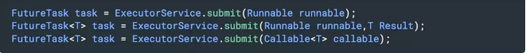

# 1.1 线程池

## Java 中的线程池是如何实现的？

- 在 Java 中，所谓的线程池中的“线程”，其实是被抽象为了一个静态内部类 Worker，它基于 AQS 实现，存放在线程池的 HashSet<Worker> workers 成员变量中；
- 而需要执行的任务则存放在成员变量 workQueue（BlockingQueue<Runnable> workQueue）中。

这样，整个线程池实现的基本思想就是：从 workQueue 中不断取出需要执行的任务，放在 Workers 中进行处理。

##  线程池的工作流程

1. 默认情况下，创建完线程池后并不会立即创建线程, 而是等到有任务提交时才会创建线程来进行处理。（除非调用prestartCoreThread或prestartAllCoreThreads方法）
2. 当线程数小于核心线程数时，每提交一个任务就创建一个线程来执行，即使当前有线程处于空闲状态，直到当前线程数达到核心线程数。
3. 当前线程数达到核心线程数时，如果这个时候还提交任务，这些任务会被放到队列里，等到线程处理完了手头的任务后，会来队列中取任务处理。
4. 当前线程数达到核心线程数并且队列也满了，如果这个时候还提交任务，则会继续创建线程来处理，直到线程数达到最大线程数。
5. 当前线程数达到最大线程数并且队列也满了，如果这个时候还提交任务，则会触发饱和策略。
6. 如果某个线程的控线时间超过了keepAliveTime，那么将被标记为可回收的，并且当前线程池的当前大小超过了核心线程数时，这个线程将被终止。

# 线程池的优点？

1）重用存在的线程，减少对象创建销毁的开销。 

2）可有效的控制最大并发线程数，提高系统资源的使用率，同时避免过多资源 竞争，避免堵塞。 

3）提供定时执行、定期执行、单线程、并发数控制等功能。

## 创建线程池的几个核心构造参数？

Java 中的线程池的创建其实非常灵活，我们可以通过配置不同的参数，创建出行为不同的线程池，这几个参数包括：

- corePoolSize：线程池的核心线程数。
- maximumPoolSize：线程池允许的最大线程数。
- keepAliveTime：超过核心线程数时闲置线程的存活时间。
- workQueue：任务执行前保存任务的队列，保存由 execute 方法提交的 Runnable 任务。

## 线程池中的线程是怎么创建的？是一开始就随着线程池的启动创建好的吗？

显然不是的。线程池默认初始化后不启动 Worker，等待有请求时才启动。

每当我们调用 execute() 方法添加一个任务时，线程池会做如下判断：

- 如果正在运行的线程数量小于 corePoolSize，那么马上创建线程运行这个任务；
- 如果正在运行的线程数量大于或等于 corePoolSize，那么将这个任务放入队列；
- 如果这时候队列满了，而且正在运行的线程数量小于 maximumPoolSize，那么还是要创建非核心线程立刻运行这个任务；
- 如果队列满了，而且正在运行的线程数量大于或等于 maximumPoolSize，那么线程池会抛出异常 RejectExecutionException。

当一个线程完成任务时，它会从队列中取下一个任务来执行。 当一个线程无事可做，超过一定的时间（keepAliveTime）时，线程池会判断。如果当前运行的线程数大于 corePoolSize，那么这个线程就被停掉。所以线程池的所有任务完成后，它最终会收缩到 corePoolSize 的大小。

## 既然提到可以通过配置不同参数创建出不同的线程池，那么 Java 中默认实现好的线程池又有哪些呢？请比较它们的异同。

**1. SingleThreadExecutor 线程池**

这个线程池只有一个核心线程在工作，也就是相当于单线程串行执行所有任务。如果这个唯一的线程因为异常结束，那么会有一个新的线程来替代它。此线程池保证所有任务的执行顺序按照任务的提交顺序执行。

- corePoolSize：1，只有一个核心线程在工作。
- maximumPoolSize：1。
- keepAliveTime：0L。
- workQueue：new LinkedBlockingQueue<Runnable>()，其缓冲队列是无界的。

**2. FixedThreadPool 线程池**

FixedThreadPool 是固定大小的线程池，只有核心线程。每次提交一个任务就创建一个线程，直到线程达到线程池的最大大小。线程池的大小一旦达到最大值就会保持不变，如果某个线程因为执行异常而结束，那么线程池会补充一个新线程。

FixedThreadPool 多数针对一些很稳定很固定的正规并发线程，多用于服务器。

- corePoolSize：nThreads
- maximumPoolSize：nThreads
- keepAliveTime：0L
- workQueue：new LinkedBlockingQueue<Runnable>()，其缓冲队列是无界的。

**3. CachedThreadPool 线程池**

CachedThreadPool 是无界线程池，如果线程池的大小超过了处理任务所需要的线程，那么就会回收部分空闲（60 秒不执行任务）线程，当任务数增加时，此线程池又可以智能的添加新线程来处理任务。

线程池大小完全依赖于操作系统（或者说 JVM）能够创建的最大线程大小。SynchronousQueue 是一个是缓冲区为 1 的阻塞队列。

缓存型池子通常用于执行一些生存期很短的异步型任务，因此在一些面向连接的 daemon 型 SERVER 中用得不多。但对于生存期短的异步任务，它是 Executor 的首选。

- corePoolSize：0
- maximumPoolSize：Integer.MAX_VALUE
- keepAliveTime：60L
- workQueue：new SynchronousQueue<Runnable>()，一个是缓冲区为 1 的阻塞队列。

**4. ScheduledThreadPool 线程池**

ScheduledThreadPool：核心线程池固定，大小无限的线程池。此线程池支持定时以及周期性执行任务的需求。创建一个周期性执行任务的线程池。如果闲置，非核心线程池会在 DEFAULT_KEEPALIVEMILLIS 时间内回收。

- corePoolSize：corePoolSize
- maximumPoolSize：Integer.MAX_VALUE
- keepAliveTime：DEFAULT_KEEPALIVE_MILLIS
- workQueue：new DelayedWorkQueue()

## 如何在 Java 线程池中提交线程？

线程池最常用的提交任务的方法有两种：

1. execute()：ExecutorService.execute 方法接收一个 Runable 实例，它用来执行一个任务：

2. submit()：ExecutorService.submit() 方法返回的是 Future 对象。可以用 isDone() 来查询 Future 是否已经完成，当任务完成时，它具有一个结果，可以调用 get() 来获取结果。也可以不用 isDone() 进行检查就直接调用 get()，在这种情况下，get() 将阻塞，直至结果准备就绪。

# 如果你提交任务时，线程池队列已满，这时会发生什么

这里区分一下： 

- 如果使用的是无界队列 LinkedBlockingQueue，也就是无界队列的话，没关系，继续添加任务到阻塞队列中等待执行，因为 LinkedBlockingQueue 可以近乎认为是一个无穷大的队列，可以无限存放任务 
- 如果使用的是有界队列比如 ArrayBlockingQueue，任务首先会被添加 到 ArrayBlockingQueue 中，ArrayBlockingQueue 满了，会根据 maximumPoolSize 的值增加线程数量，如果增加了线程数量还是处理不过 来，ArrayBlockingQueue 继续满，那么则会使用拒绝策略 RejectedExecutionHandler 处理满了的任务，默认是 AbortPolicy 

# 线程池大小设置多少合适

1)、CPU密集型

这种任务我们要尽量使用较小的线程池，一般是Cpu核心数+1

因为CPU密集型任务CPU的使用率很高，若开过多的线程，只能增加线程上下文的切换次数，带来额外的开销

2)、IO密集型

可以使用较大的线程池，一般CPU核心数 * 2

IO密集型CPU使用率不高，可以让CPU等待IO的时候处理别的任务，充分利用cpu时间

线程等待时间所占比例越高，需要越多线程。线程CPU时间所占比例越高，需要越少线程。

下面举个例子：

例如：平均每个线程CPU运行时间为0.5s，而线程等待时间(非CPU运行时间，比如IO)为1.5s，CPU核心数为8，那么根据上面这个公式估算得到：((0.5+1.5)/0.5)*8=32。这个公式进一步转化为：

最佳线程数目 = (线程等待时间与线程CPU时间之比 + 1)* CPU数目
