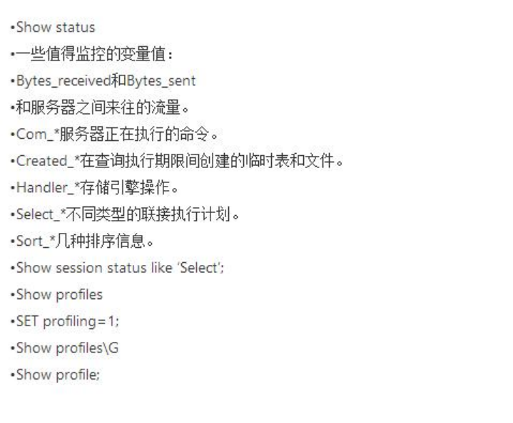

# 第4节 MySQL

**CHAR和VARCHAR的区别？**

以下是CHAR和VARCHAR的区别：

- CHAR和VARCHAR类型在存储和检索方面有所不同
- CHAR列长度固定为创建表时声明的长度，长度值范围是1到255
- 当CHAR值被存储时，它们被用空格填充到特定长度，检索CHAR值时需删除尾随空格。

**MYSQL数据库服务器性能分析的方法命令有哪些?**

**列设置为AUTO INCREMENT时，如果在表中达到最大值，会发生什么情况？**

它会停止递增，任何进一步的插入都将产生错误，因为密钥已被使用。

**怎样才能找出最后一次插入时分配了哪个自动增量？**

LAST_INSERT_ID将返回由Auto_increment分配的最后一个值，并且不需要指定表名称。

**BLOB和TEXT有什么区别？**

BLOB是一个二进制对象，可以容纳可变数量的数据。

有四种类型的BLOB -

- TINYBLOB
- BLOB
- MEDIUMBLOB
- LONGBLOB

它们只是在所能容纳价值的最大长度上有所不同。

TEXT是一个不区分大小写的BLOB。四种TEXT类型

- TINYTEXT
- TEXT
- MEDIUMTEXT
- LONGTEXT

它们对应于四种BLOB类型，并具有相同的最大长度和存储要求。

BLOB和TEXT类型之间的唯一区别在于对BLOB值进行排序和比较时区分大小写，对TEXT值不区分大小写。

**Mysql表中允许有多少个TRIGGERS？**

在Mysql表中允许有六个触发器，如下：

- BEFORE INSERT
- AFTER INSERT
- BEFORE UPDATE
- AFTER UPDATE
- BEFORE DELETE and
- AFTER DELETE

**Mysql中有哪几种锁？**

MyISAM支持表锁，InnoDB支持表锁和行锁，默认为行锁

- 表级锁：开销小，加锁快，不会出现死锁。锁定粒度大，发生锁冲突的概率最高，并发量最低

- 行级锁：开销大，加锁慢，会出现死锁。锁力度小，发生锁冲突的概率小，并发度最高