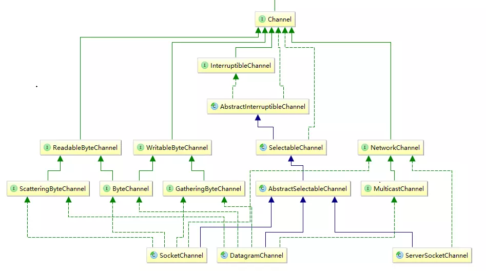
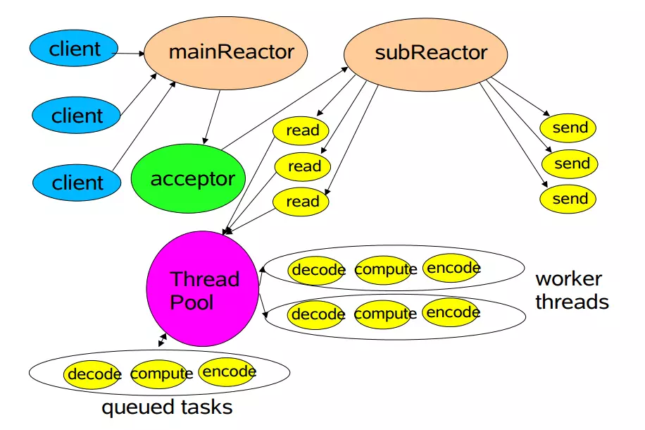

# 2 自顶向下深入分析Netty

https://www.jianshu.com/p/92c5092c5d3f

## 预备知识

Netty是基于Java NIO封装的网络通讯框架，只有充分理解了Java NIO才能理解好Netty的底层设计。Java NIO有几个重要的概念**Channel**,**Buffer**,**Selector**。NIO是基于`Channel`和`Buffer`操作的，数据只能通过`Buffer`写入到`Channel`或者从`Channel`读出数据到`Buffer`中。`Selector`可以监听多个通道的事件（连接打开，数据到达），这样便可以用一个线程监听多个`Channel`的事件，从而可以用一个线程处理多个网络连接。

### 1.1 Channel

首先来看Channel的类图：




Channel类图


主要关注三个类:,，其中是一个连接到TCP网络套接字的通道，可由两种方式创建：

1. 打开一个`SocketChannel`并连接到互联网上的某台服务器。
2. 一个新连接到达`ServerSocketChannel`时，会创建一个`SocketChannel`(即由`serverSocketChannel.accept()`方法返回)。

`ServerSocketChannel`是一个可以监听新进来的TCP连接的通道, 与标准IO中的`ServerSocket`类似。而`DatagramChannel`是一个能收发UDP包的通道。

### 1.2 Buffer

一个`Buffer`对象是固定数量的数据的容器。缓冲区的工作与通道紧密联系。通道是I/O传输发生时通过的入口，而缓冲区是这些数据传输的来源或目标。对于离开缓冲区的传输，想传递出去的数据被置于一个缓冲区，被传送到通道。对于传回缓冲区的传输，一个通道将数据复制到所提供的缓冲区中。这里我们主要关注的是**ByteBuffer**,因为字节是操作系统与I/O设备之间或者操作系统与应用进程之间传递数据使用的基本数据类型，并且Java NIO中的`Channel`只接受`ByteBuffer`作为参数。

### 1.3 selector

Selector是Java NIO中能够检测多个通道，并能够知晓通道是否为诸如读写时间做好准备的组件。当我们将1.1中的一个或多个`SelectableChannel`注册到一个Selector对象中时，一个表示通道和选择器关系的`SelectionKey`会被返回。`SelectionKey`将记住我们关心的通道，并且会追踪对应的通道是否有事件已经就绪。当调用一个`Selector.select()`方法时，相关的`SelectionKey`将会被更新，用来检查所有被注册到改选择器的通道。我们可以获取一个`SelectionKey`的集合，从而找到已经就绪的通道。通过遍历这些`SelectionKey`,我们可以选择出每个从上次调用`select()`开始直到现在已经就绪的通道。

### 1.4 示例

通过之前的描述，相信你已经对Java NIO有了初步的了解，但具体的细节还很模糊，没关系，记住我们的目标是自顶向下分析，也就是先整体后局部，先建立对整体的认识再不断完善局部细节。下面将通过一个简单的Java NIO echo Server实例从整体上理解Java NIO建立服务的过程。

```java
    public static void startServer(int port) throws IOException{
        // 打开服务端ServerSocketChannel
        ServerSocketChannel serverChannel = ServerSocketChannel.open();
        // 设置为非阻塞模式
        serverChannel.configureBlocking(false); 
        // 绑定一个本地端口，这样客户端便可以通过这个端口连接到服务器
        serverChannel.bind(new InetSocketAddress(port));
        
        // 打开selector
        Selector selector = Selector.open(); 
        // 注意关心的事件是OP_ACCEPT，表示只关心接受事件即接受客户端到服务器的连接
        serverChannel.register(selector, SelectionKey.OP_ACCEPT);

        while (true) {
            // select()阻塞直到注册的某个事件就绪并会更新SelectionKey的状态
            int readyChannels = selector.select();
            if (readyChannels <= 0) {
                continue;
            }

            // 得到就绪的key集合，key中保存有就绪的事件以及对应的Channel通道
            Set<SelectionKey> SelectorKeySet = selector.selectedKeys();
            Iterator<SelectionKey> iterator = SelectorKeySet.iterator();
            ByteBuffer buffer = ByteBuffer.allocate(1024);
            // 遍历选择键
            while (iterator.hasNext()) {    
                SelectionKey key = iterator.next(); 
                if (key.isAcceptable()) {   
                    // 处理accept事件
                    SocketChannel socketChannel = serverChannel.accept();
                    socketChannel.configureBlocking(false);
                    // 注意此处新增关心事件OP_READ
                    socketChannel.register(selector, SelectionKey.OP_READ);
                } else if (key.isReadable()) {
                    // 处理read事件
                    SocketChannel socketChannel = (SocketChannel) key.channel();
                    buffer.clear();
                    socketChannel.read(buffer);
                    buffer.flip();
                    socketChannel.write(buffer);
                }
                iterator.remove();
            }
        }
    }
```

其中内层`while`循环是事件处理的关键，以一个客户端连接到服务端并发送一段数据为例分析：`selector`最开始只关心OP_ACCEPT事件即等待客户端连接，当客户端连接到服务端完成后即OP_ACCEPT就绪，程序从`selector.select()`方法返回并进入内层循环的第一个`if`分支处理Accept事件。在处理过程中，会将刚接受的Channel注册到`selector`并关心该Channel上的OP_READ事件，完成后会清除key并回阻塞在下一轮循环的`selector.select()`方法上。当客户端发送一段数据到服务端后，OP_READ事件就绪，程序从阻塞处返回并进入内层`while`循环的第二个`if`分支，从而对OP_READ事件进行处理。本例中，会将客户端发来的数据写回原本Channel通道，从而完成echo服务。


## 线程模型




netty线程模型

上面这幅图描述了netty的线程模型，其中mainReacotor,subReactor,Thread Pool是三个线程池。mainReactor负责处理客户端的连接请求，并将accept的连接注册到subReactor的其中一个线程上；subReactor负责处理客户端通道上的数据读写；Thread Pool是具体的业务逻辑线程池，处理具体业务。

## 2.1 Reactor

> The reactor design pattern is an event handling pattern for handling service requests delivered concurrently to a service handler by one or more inputs. The service handler then demultiplexes the incoming requests and dispatches them synchronously to the associated request handlers

从wikipedia上面的解释可以知道Reactor模式是**事件驱动**的，由service handler处理一个或多个并发输入源的请求，并将这些请求同步的分发给相应的request handler。

## 2.2 netty默认模式

在默认情况下，netty的线程池有下面的两条规则：
(1).mainReactor和subReator可由用户指定。
(2).Thread Pool业务逻辑线程池使用SubReactor线程池。
**注意：**
(1).用户可以将mainReactor和subReator指定为同一个线程池，但不建议这样做，因为TCP连接的三次握手I/O频繁，使用一个独立的mainReactor线程池可以提升性能。
(2).如果业务逻辑中有大量耗费时间的操作，比如数据库读写等，这时有必要显示指定Thread Pool业务逻辑线程池，从而让subReactor线程池可以及时处理其他客户端的请求。

也许你对为什么netty选用这样的模型有疑问，选用这样的模型不是一蹴而就的，线程模型的进化史可以从这里查看[Scalable IO in Java](https://link.jianshu.com/?t=http://gee.cs.oswego.edu/dl/cpjslides/nio.pdf)


## 