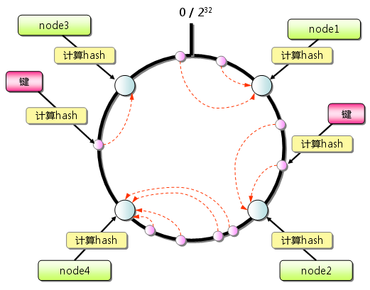
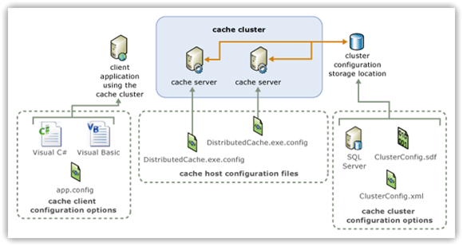
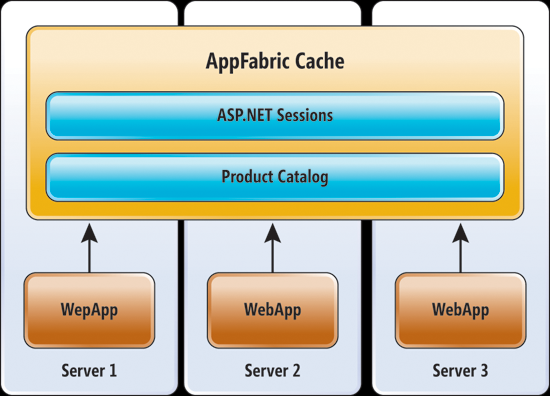
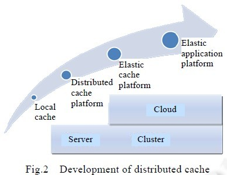
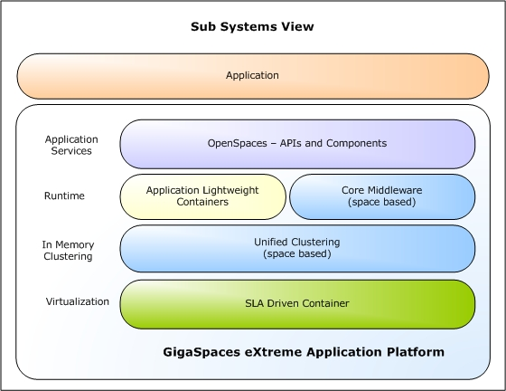

# 第7节 高性能缓存开发

## 分布式缓存的发展

分布式缓存经历了多个发展阶段,由最初的本地缓存到弹性缓存平台直至弹性应用平台[8],目标是朝着构建更好的分布式系统方向发展(如下图所示). 

1) 本地缓存:数据存储在应用代码所在内存空间.优点是可以提供快速的数据访问;缺点是数据无法分布式共享,无容错处理.典型的,如Cache4j;

2) 分布式缓存系统:数据在固定数目的集群节点间分布存储.优点是缓存容量可扩展(静态扩展);缺点是扩展过程中需要大量配置,无容错机制.典型的,如 Memcached;

3) 弹性缓存平台:数据在集群节点间分布存储,基于冗余机制实现高可用性.优点是可动态扩展,具有容错能力;缺点是复制备份会对系统性能造成一定影响.典型的,如 Windows Appfabric Caching;

4) 弹性应用平台:弹性应用平台代表了云环境下分布式缓存系统未来的发展方向.简单地讲,弹性应用平台是弹性缓存与代码执行的组合体,将业务逻辑代码转移到数据所在节点执行,可以极大地降低数据传输开销,提升系统性能.典型的,如 GigaSpaces XAP. 

## 分布式缓存的典型应用场景

分布式缓存的典型应用场景可分为以下几类: 

1) 页面缓存：用来缓存Web 页面的内容片段,包括HTML、CSS 和图片等,多应用于社交网站等; 

2) 应用对象缓存：缓存系统作为ORM 框架的二级缓存对外提供服务,目的是减轻数据库的负载压力,加速应用访问; 

3) 状态缓存：缓存包括Session 会话状态及应用横向扩展时的状态数据等,这类数据一般是难以恢复的,对可用性要求较高,多应用于高可用集群; 

4) 并行处理：通常涉及大量中间计算结果需要共享; 

5) 事件处理：分布式缓存提供了针对事件流的连续查询(continuous query)处理技术,满足实时性需求; 

6) 极限事务处理：分布式缓存为事务型应用提供高吞吐率、低延时的解决方案,支持高并发事务请求处理,多应用于铁路、金融服务和电信等领域.

## 分布式缓存与极限事务处理

随着云计算与 Web 2.0 的进一步发展,许多企业或组织时常会面对空前的需求:百万级的并发用户访问、每秒数以千计的并发事务处理、灵活的弹性与可伸缩性、低延时及7×24×365 可用性等.

传统事务型应用面临极限规模的并发事务处理,出现了极限事务处理型应用,典型的有铁路售票系统.Wikipedia 认为,极限事务处理是每秒多于500 事务或高于10 000 次并发访问的事务处理[12].

Gartner 将极限事务处理(extreme transactionprocessing,简称XTP)定义为一种为事务型应用的开发、部署、管理和维护供支持的应用模式,特点是对性能、可扩展性、可用性、可管理性等方面的极限需求.Gartner 在其报告中预测指出,极限事务处理型应用的规模将由2005 年的10%提升至2010 年的20%,极限事务处理技术是未来5 年~10 年的热点技术.极限事务处理的引入,无疑给传统Web 三层架构带来了新的挑战.即,如何在廉价的、标准化的硬件和软件平台之上,对大容量、业务关键型的事务处理应用提供良好的支撑.

分布式缓存作为一种关键的XTP 技术,可为事务型应用提供高吞吐率、低延时的技术解决方案.其延迟写(write-behind)机制可提供更短的响应时间,同时极大地降低数据库的事务处理负载,分阶段事件驱动架构(staged event-driven architecture)可以支持大规模、高并发的事务处理请求.此外,分布式缓存在内存中管理事务并提供数据的一致性保障,采用数据复制技术实现高可用性,具有较优的扩展性与性能组合.

## 分布式缓存与NoSQL

NoSQL 又称为Not Only Sql,主要是指非关系型、分布式、支持水平扩展的数据库设计模式.NoSQL 放弃了传统关系型数据库严格的事务一致性和范式约束,采用弱一致性模型.相对于NoSQL 系统,传统数据库难以满足云环境下应用数据的存储需求,具体体现在以下3 个方面: 

1) 根据CAP 理论,一致性(consistency)、可用性(availability)和分区容错(partition tolerance)这3 个要素最多同时满足两个,不可能三者兼顾.对云平台中部署的大量Web 应用而言,**数据可用性与分区容错的优先级通常更高**,所以一般会选择适当放松一致性约束.传统数据库的事务一致性需求制约了其横向伸缩与高可用技术的实现; 

2) 传统数据库难以适应新的数据存储访问模式.Web 2.0 站点以及云平台中存在大量半结构化数据,如用户Session 数据、时间敏感的事务型数据、计算密集型任务数据等,这些状态数据更适合以Key/Value 形式存储,不需要RDBMS 提供的复杂的查询与管理功能; 

3) NoSQL 提供低延时的读写速度,支持水平扩展,这些特性对拥有海量数据访问请求的云平台而言是至关重要的.传统关系型数据无法提供同样的性能,而内存数据库容量有限且不具备扩展能力.分布式缓存作为NoSQL 的一种重要实现形式,可为云平台提供高可用的状态存储与可伸缩的应用加速服务,与其他NoSQL 系统间并无清晰的界限.**平台中应用访问与系统故障均具有不可预知性,为了更好地应对这些挑战,应用软件在架构时通常采用无状态设计,大量状态信息不再由组件、容器或平台来管理,而是直接交付给后端的分布式缓存服务或NoSQL 系统.** 