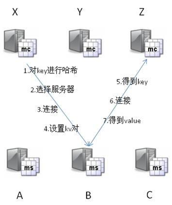
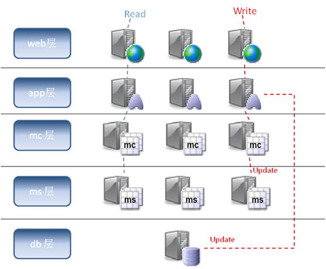
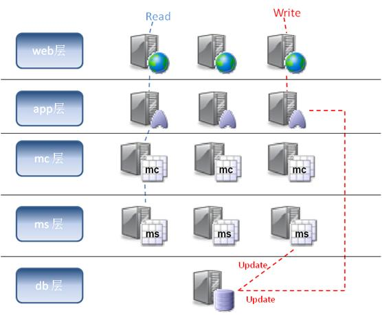
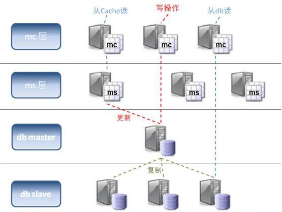

# 1 利用Memcache解决数据库高并发访问的瓶颈问题

​		对于高并发高访问的Web应用程序来说，数据库存取瓶颈一直是个令人头疼的问题。特别当你的程序架构还是建立在单数据库模式，而一个数据池连接数峰值已经达到500的时候，那你的程序运行离崩溃的边缘也不远了。很多小网站的开发人员一开始都将注意力放在了产品需求设计上，缺忽视了程序整体性能，可扩展性等方面的考虑，结果眼看着访问量一天天网上爬，可突然发现有一天网站因为访问量过大而崩溃了，到时候哭都来不及。所以我们一定要未雨绸缪，在数据库还没罢工前，想方设法给它减负，这也是这篇文章的主要议题。

　　大家都知道，当有一个request过来后，web服务器交给app服务器，app处理并从db中存取相关数据，但db存取的花费是相当高昂的。特别是每次都取相同的数据，等于是让数据库每次都在做高耗费的无用功，数据库如果会说话，肯定会发牢骚，你都问了这么多遍了，难道还记不住吗？是啊，如果app拿到第一次数据并存到内存里，下次读取时直接从内存里读取，而不用麻烦数据库，这样不就给数据库减负了？而且从内存取数据必然要比从数据库媒介取快很多倍，反而提升了应用程序的性能。

　　因此，我们可以在web/app层与db层之间加一层cache层，主要目的：1.减少数据库读取负担；2.提高数据读取速度。而且，cache存取的媒介是内存，而一台服务器的内存容量一般都是有限制的，不像硬盘容量可以做到TB级别。所以，可以考虑采用分布式的cache层，这样更易于破除内存容量的限制，同时又增加了灵活性。

## Memcached介绍

　　Memcached是开源的分布式cache系统，现在很多的大型web应用程序包括[facebook](http://www.jizhuomi.com/catalog.asp?tags=Facebook)，youtube，wikipedia，[yahoo](http://www.jizhuomi.com/catalog.asp?tags=雅虎)等等都在使用memcached来支持他们每天数亿级的页面访问。通过把cache层与他们的web架构集成，他们的应用程序在提高了性能的同时，还大大降低了数据库的负载。

　　具体的memcached资料大家可以直接从它的官方网站上得到。这里我就简单给大家介绍一下memcached的工作原理：

　　Memcached处理的原子是每一个（key，value）对（以下简称kv对），key会通过一个hash算法转化成hash-key，便于查找、对比以及做到尽可能的散列。同时，memcached用的是一个二级散列，通过一张大hash表来维护。

　　Memcached有两个核心组件组成：服务端（ms）和客户端（mc），在一个memcached的查询中，mc先通过计算key的hash值来确定kv对所处在的ms位置。当ms确定后，客户端就会发送一个查询请求给对应的ms，让它来查找确切的数据。因为这之间没有交互以及多播协议，所以memcached交互带给网络的影响是最小化的。

　　举例说明：考虑以下这个场景，有三个mc分别是X，Y，Z，还有三个ms分别是A，B，C：

**设置kv对**

　　X想设置key=”foo”,value=”seattle”

　　X拿到ms列表，并对key做hash转化，根据hash值确定kv对所存的ms位置

　　B被选中了

　　X连接上B，B收到请求，把（key=”foo”,value=”seattle”）存了起来

**获取kv对**

　　Z想得到key=”foo”的value

　　Z用相同的hash算法算出hash值，并确定key=”foo”的值存在B上

　　Z连接上B，并从B那边得到value=”seattle”

　　其他任何从X，Y，Z的想得到key=”foo”的值的请求都会发向B

## Memcached服务器(ms)

**内存分配**

　　默认情况下，ms是用一个内置的叫“块分配器”的组件来分配内存的。舍弃[c++](http://www.jizhuomi.com/catalog.asp?tags=C＋＋)标准的malloc/free的内存分配，而采用块分配器的主要目的是为了避免内存碎片，否则操作系统要花费更多时间来查找这些逻辑上连续的内存块（实际上是断开的）。用了块分配器，ms会轮流的对内存进行大块的分配，并不断重用。当然由于块的大小各不相同，当数据大小和块大小不太相符的情况下，还是有可能导致内存的浪费。

　　同时，ms对key和data都有相应的限制，key的长度不能超过250字节，data也不能超过块大小的限制---1MB。

​		因为mc所使用的hash算法，并不会考虑到每个ms的内存大小。理论上mc会分配概率上等量的kv对给每个ms，这样如果每个ms的内存都不太一样，那可能会导致内存使用率的降低。所以一种替代的解决方案是，根据每个ms的内存大小，找出他们的最大公约数，然后在每个ms上开n个容量=最大公约数的instance，这样就等于拥有了多个容量大小一样的子ms，从而提供整体的内存使用率。

**缓存策略**

　　当ms的hash表满了之后，新的插入数据会替代老的数据，更新的策略是LRU（最近最少使用），以及每个kv对的有效时限。Kv对存储有效时限是在mc端由app设置并作为参数传给ms的。

　　同时ms采用是偷懒替代法，ms不会开额外的进程来实时监测过时的kv对并删除，而是当且仅当，新来一个插入的数据，而此时又没有多余的空间放了，才会进行清除动作。

**缓存数据库查询**

　　现在memcached最流行的一种使用方式是缓存数据库查询，下面举一个简单例子说明：

　　App需要得到userid=xxx的用户信息，对应的查询语句类似：

　　“SELECT*FROMusersWHEREuserid=xxx”

　　App先去问cache，有没有“user:userid”（key定义可预先定义约束好）的数据，如果有，返回数据；如果没有，App会从数据库中读取数据，并调用cache的add函数，把数据加入cache中。

　　当取的数据需要更新，app会调用cache的update函数，来保持数据库与cache的数据同步。

　　从上面的例子我们也可以发现，一旦数据库的数据发现变化，我们一定要及时更新cache中的数据，来保证app读到的是同步的正确数据。当然我们可以通过定时器方式记录下cache中数据的失效时间，时间一过就会激发事件对cache进行更新，但这之间总会有时间上的延迟，导致app可能从cache读到脏数据，这也被称为狗洞问题。（以后我会专门描述研究这个问题）

**数据冗余与故障预防**

　　从设计角度上，memcached是没有数据冗余环节的，它本身就是一个大规模的高性能cache层，加入数据冗余所能带来的只有设计的复杂性和提高系统的开支。

　　当一个ms上丢失了数据之后，app还是可以从数据库中取得数据。不过更谨慎的做法是在某些ms不能正常工作时，提供额外的ms来支持cache，这样就不会因为app从cache中取不到数据而一下子给数据库带来过大的负载。

　　同时为了减少某台ms故障所带来的影响，可以使用“热备份”方案，就是用一台新的ms来取代有问题的ms，当然新的ms还是要用原来ms的IP地址，大不了数据重新装载一遍。

　　另外一种方式，就是提高你ms的节点数，然后mc会实时侦查每个节点的状态，如果发现某个节点长时间没有响应，就会从mc的可用server列表里删除，并对server节点进行重新hash定位。当然这样也会造成的问题是，原本key存储在B上，变成存储在C上了。所以此方案本身也有其弱点，最好能和“热备份”方案结合使用，就可以使故障造成的影响最小化。

## Memcached客户端（mc）

　　Memcached客户端有各种语言的版本供大家使用，包括java，c，php，.net等等。

　　大家可以根据自己项目的需要，选择合适的客户端来集成。

**缓存式的Web应用程序架构**

　　有了缓存的支持，我们可以在传统的app层和db层之间加入cache层，每个app服务器都可以绑定一个mc，每次数据的读取都可以从ms中取得，如果没有，再从db层读取。而当数据要进行更新时，除了要发送update的sql给db层，同时也要将更新的数据发给mc，让mc去更新ms中的数据。

​		假设今后我们的数据库可以和ms进行通讯了，那可以将更新的任务统一交给db层，每次数据库更新数据的同时会自动去更新ms中的数据，这样就可以进一步减少app层的逻辑复杂度。如下图：

​		不过每次我们如果没有从cache读到数据，都不得不麻烦数据库。为了最小化数据库的负载压力，我们可以部署数据库复写，用slave数据库来完成读取操作，而master数据库永远只负责三件事：1.更新数据；2.同步slave数据库；3.更新cache。如下图：

​		以上这些缓存式web架构在实际应用中被证明是能有效并能极大地降低数据库的负载同时又能提高web的运行性能。当然这些架构还可以根据具体的应用环境进行变种，以达到不同硬件条件下性能的最优化。

## 未来的憧憬

　　Memcached的出现可以说是革命性的，第一次让我们意识到可以用内存作为存储媒介来大规模的缓存数据以提高程序的性能。不过它毕竟还是比较新的东西，还需要很多有待优化和改进的地方，例如：

　　如何利用memcached实现cache数据库，让数据库跑在内存上。这方面，tangentsoftware开发的memcached_engine已经做了不少工作，不过现在的版本还只是处于实验室阶段。

　　如何能方便有效的进行批量key清理。因为现在key是散列在不同的server上的，所以对某类key进行大批量清理是很麻烦的。因为memcached本身是一个大hash表，是不具备key的检索功能的。所以memcached是压根不知道某一类的key到底存了多少个，都存在哪些server上。而这类功能在实际应用中却是经常用到。