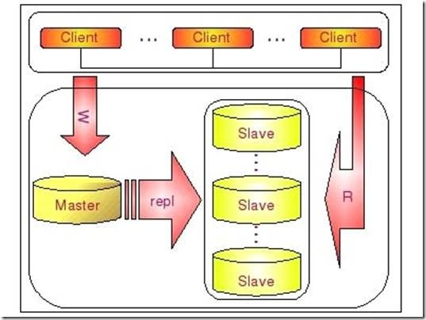
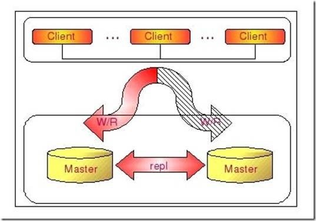
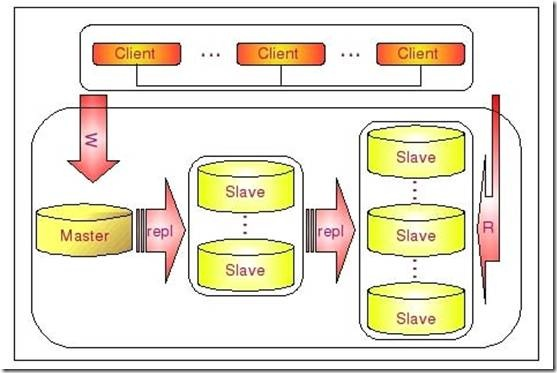
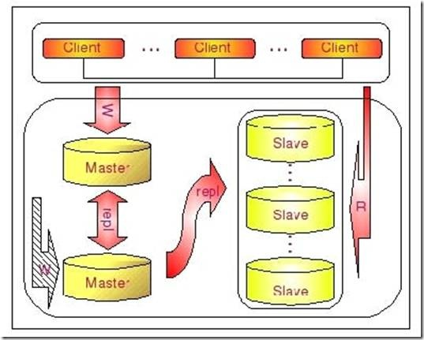

# 2 MySQL Replication 常用架构

MySQLReplicaion本身是一个比较简单的架构，就是一台MySQL服务器（Slave）从另一台MySQL服务器（Master）进行日志的复制然后再解析日志并应用到自身。一个复制环境仅仅只需要两台运行有MySQLServer的主机即可，甚至更为简单的时候我们可以在同一台物理服务器主机上面启动两个mysqldinstance，一个作为Master而另一个作为Slave来完成复制环境的搭建。但是在实际应用环境中，我们可以根据实际的业务需求利用MySQLReplication的功能自己定制搭建出其他多种更利于ScaleOut的复制架构。如DualMaster架构，级联复制架构等。下面我们针对比较典型的三种复制架构进行一些相应的分析介绍。

## 常规复制架构　 Master - Slaves

在实际应用场景中，MySQL复制90%以上都是一个Master复制到一个或者多个Slave的架构模式，主要用于读压力比较大的应用的数据库端廉价扩展解决方案。因为只要Master和Slave的压力不是太大（尤其是Slave端压力）的话，异步复制的延时一般都很少很少。尤其是自从Slave端的复制方式改成两个线程处理之后，更是减小了Slave端的延时问题。而带来的效益是，对于数据实时性要求不是特别Critical的应用，只需要通过廉价的pcserver来扩展Slave的数量，将读压力分散到多台Slave的机器上面，即可通过分散单台数据库服务器的读压力来解决数据库端的读性能瓶颈，毕竟在大多数数据库应用系统中的读压力还是要比写压力大很多。这在很大程度上解决了目前很多中小型网站的数据库压力瓶颈问题，甚至有些大型网站也在使用类似方案解决数据库瓶颈。

这个架构可以通过下图比较清晰的展示：

一个Master复制多个Slave的架构实施非常简单，多个Slave和单个Slave的实施并没有实质性的区别。在Master端并不Care有多少个Slave连上了自己，只要有Slave的IO线程通过了连接认证，向他请求指定位置之后的BinaryLog信息，他就会按照该IO线程的要求，读取自己的BinaryLog信息，返回给Slave的IO线程。

大家应该都比较清楚，从一个Master节点可以复制出多个Slave节点，可能有人会想，那一个Slave节点是否可以从多个Master节点上面进行复制呢？至少在目前来看，MySQL是做不到的，以后是否会支持就不清楚了。

MySQL不支持一个Slave节点从多个Master节点来进行复制的架构，主要是为了避免冲突的问题，防止多个数据源之间的数据出现冲突，而造成最后数据的不一致性。不过听说已经有人开发了相关的patch，让MySQL支持一个Slave节点从多个Master结点作为数据源来进行复制，这也正是MySQL开源的性质所带来的好处。

对于Replication的配置细节，在MySQL的官方文档上面已经说的非常清楚了，甚至介绍了多种实现Slave的配置方式，在下一节中我们也会通过一个具体的示例来演示搭建一个Replication环境的详细过程以及注意事项。

## dualMaster复制架构 Master - Master

有些时候，简单的从一个MySQL复制到另外一个MySQL的基本Replication架构，可能还会需要在一些特定的场景下进行Master的切换。如在Master端需要进行一些特别的维护操作的时候，可能需要停MySQL的服务。这时候，为了尽可能减少应用系统写服务的停机时间，最佳的做法就是将我们的Slave节点切换成Master来提供写入的服务。

但是这样一来，我们原来Master节点的数据就会和实际的数据不一致了。当原Master启动可以正常提供服务的时候，由于数据的不一致，我们就不得不通过反转原Master-Slave关系，重新搭建Replication环境，并以原Master作为Slave来对外提供读的服务。重新搭建Replication环境会给我们带来很多额外的工作量，如果没有合适的备份，可能还会让Replication的搭建过程非常麻烦。

为了解决这个问题，我们可以通过搭建DualMaster环境来避免很多的问题。何谓DualMaster环境？实际上就是两个MySQLServer互相将对方作为自己的Master，自己作为对方的Slave来进行复制。这样，任何一方所做的变更，都会通过复制应用到另外一方的数据库中。

可能有些读者朋友会有一个担心，这样搭建复制环境之后，难道不会造成两台MySQL之间的循环复制么？实际上MySQL自己早就想到了这一点，所以在MySQL的BinaryLog中记录了当前MySQL的server-id，而且这个参数也是我们搭建MySQLReplication的时候必须明确指定，而且Master和Slave的server-id参数值比需要不一致才能使MySQLReplication搭建成功。一旦有了server-id的值之后，MySQL就很容易判断某个变更是从哪一个MySQLServer最初产生的，所以就很容易避免出现循环复制的情况。而且，如果我们不打开记录Slave的BinaryLog的选项（--log-slave-update）的时候，MySQL根本就不会记录复制过程中的变更到BinaryLog中，就更不用担心可能会出现循环复制的情形了。

下如将更清晰的展示DualMaster复制架构组成：

通过DualMaster复制架构，我们不仅能够避免因为正常的常规维护操作需要的停机所带来的重新搭建Replication环境的操作，因为我们任何一端都记录了自己当前复制到对方的什么位置了，当系统起来之后，就会自动开始从之前的位置重新开始复制，而不需要人为去进行任何干预，大大节省了维护成本。

不仅仅如此，DualMaster复制架构和一些第三方的HA管理软件结合，还可以在我们当前正在使用的Master出现异常无法提供服务之后，非常迅速的自动切换另外一端来提供相应的服务，减少异常情况下带来的停机时间，并且完全不需要人工干预。

当然，我们搭建成一个DualMaster环境，并不是为了让两端都提供写的服务。在正常情况下，我们都只会将其中一端开启写服务，另外一端仅仅只是提供读服务，或者完全不提供任何服务，仅仅只是作为一个备用的机器存在。为什么我们一般都只开启其中的一端来提供写服务呢？主要还是为了避免数据的冲突，防止造成数据的不一致性。因为即使在两边执行的修改有先后顺序，但由于Replication是异步的实现机制，同样会导致即使晚做的修改也可能会被早做的修改所覆盖，就像如下情形：

时间点MySQL A MySQL B

1. 更新x表y记录为10

2. 更新x表y记录为20

3. 获取到A日志并应用，更新x表的y记录为10（不符合期望）

4. 获取B日志更新x表y记录为20（符合期望）

这种情形下，不仅在B库上面的数据不是用户所期望的结果，A和B两边的数据也出现了不一致。

当然，我们也可以通过特殊的约定，让某些表的写操作全部在一端，而另外一些表的写操作全部在另外一端，保证两端不会操作相同的表，这样就能避免上面问题的发生了。

## 级联复制架构 Master –Slaves - Slaves

在有些应用场景中，可能读写压力差别比较大，读压力特别的大，一个Master可能需要上10台甚至更多的Slave才能够支撑注读的压力。这时候，Master就会比较吃力了，因为仅仅连上来的SlaveIO线程就比较多了，这样写的压力稍微大一点的时候，Master端因为复制就会消耗较多的资源，很容易造成复制的延时。

遇到这种情况如何解决呢？这时候我们就可以利用MySQL可以在Slave端记录复制所产生变更的BinaryLog信息的功能，也就是打开—log-slave-update选项。然后，通过二级（或者是更多级别）复制来减少Master端因为复制所带来的压力。也就是说，我们首先通过少数几台MySQL从Master来进行复制，这几台机器我们姑且称之为第一级Slave集群，然后其他的Slave再从第一级Slave集群来进行复制。从第一级Slave进行复制的Slave，我称之为第二级Slave集群。如果有需要，我们可以继续往下增加更多层次的复制。这样，我们很容易就控制了每一台MySQL上面所附属Slave的数量。这种架构我称之为Master-Slaves-Slaves架构

这种多层级联复制的架构，很容易就解决了Master端因为附属Slave太多而成为瓶颈的风险。下图展示了多层级联复制的Replication架构。

当然，如果条件允许，我更倾向于建议大家通过拆分成多个Replication集群来解决

上述瓶颈问题。毕竟Slave并没有减少写的量，所有Slave实际上仍然还是应用了所有的数据变更操作，没有减少任何写IO。相反，Slave越多，整个集群的写IO总量也就会越多，我们没有非常明显的感觉，仅仅只是因为分散到了多台机器上面，所以不是很容易表现出来。

此外，增加复制的级联层次，同一个变更传到最底层的Slave所需要经过的MySQL也会更多，同样可能造成延时较长的风险。

而如果我们通过分拆集群的方式来解决的话，可能就会要好很多了，当然，分拆集群也需要更复杂的技术和更复杂的应用系统架构。

## dualMaster与级联复制结合架构(Master-Master-Slaves)

级联复制在一定程度上面确实解决了Master因为所附属的Slave过多而成为瓶颈的问题，但是他并不能解决人工维护和出现异常需要切换后可能存在重新搭建Replication的问题。这样就很自然的引申出了DualMaster与级联复制结合的Replication架构，我称之为Master-Master-Slaves架构

和Master-Slaves-Slaves架构相比，区别仅仅只是将第一级Slave集群换成了一台单独的Master，作为备用Master，然后再从这个备用的Master进行复制到一个Slave集群。下面的图片更清晰的展示了这个架构的组成：

这种DualMaster与级联复制结合的架构，最大的好处就是既可以避免主Master的写入操作不会受到Slave集群的复制所带来的影响，同时主Master需要切换的时候也基本上不会出现重搭Replication的情况。但是，这个架构也有一个弊端，那就是备用的Master有可能成为瓶颈，因为如果后面的Slave集群比较大的话，备用Master可能会因为过多的SlaveIO线程请求而成为瓶颈。当然，该备用Master不提供任何的读服务的时候，瓶颈出现的可能性并不是特别高，如果出现瓶颈，也可以在备用Master后面再次进行级联复制，架设多层Slave集群。当然，级联复制的级别越多，Slave集群可能出现的数据延时也会更为明显，所以考虑使用多层级联复制之前，也需要评估数据延时对应用系统的影响。

转自 《MySQL性能调优与架构》

