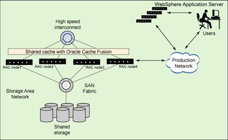
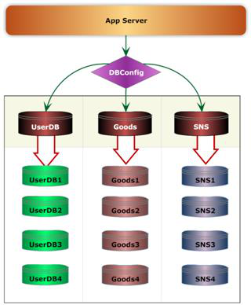
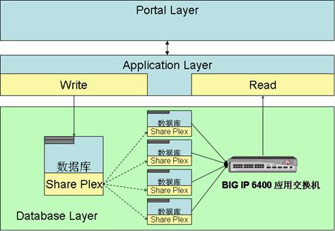

# 8  分布式数据库架构

近几年分布式成为热门的话题，也成为大型系统必备良药，而在数据库方面应用更加广泛。通过采用普通廉价的设备构建出高可用性和高扩展的集群目的。从而摆脱了大型设备的依赖，一个好的分布式数据库架构可以比较方便达到高可用性有可以达到向外扩展的能力。传统的数据库系统一般是通过高端设备，例如小型机或者高端存储来保证数据库完整性，或者通过增加内存cpu来提高数据库处理能力。这种集中式的的的数据库架构越来越不适合海里数据库处理，而且也得付出高额的费用。分布式的架构也就成了商家探索的技术。 

## 数据库集群 

### oracle集群

Oracle RAC是业界最流行的产品。其架构的最大特点是共享存储架构（Shared-disk），整个RAC集群是建立在一个共享的存储设备之上的，节点之间采用 高速网络互连。在 Oracle RAC 环境中，每个 Oracle 数据块都被赋予一个（且只有一个）“主”Oracle RAC 节点。该 Oracle RAC 节点的全局缓存服务 (GCS) 负责管理对这些数据块集的访问。当其中一个 Oracle 节点需要访问某个 Oracle 数据块时，它必须首先与该数据块协商。然后，该主节点的 GCS 或者指示请求的 Oracle 节点从磁盘中获取该数据块，或者指示该Oracle 数据块的当前持有者将被请求的数据块发送到请求节点。Oracle 尝试跨所有 RAC 节点统一分发该数据块的所有权。在 Oracle RAC 环境中，数据块大致相等的所有节点都将被指定为主节点。（如果 Oracle RAC 节点数是 Oracle 数据块数的约数，则所有 RAC 节点都是具有同样数量的数据块的主节点。 ）

### mysql 集群 

MySQL cluster 和 Oracle RAC 完全不同 ， 它采用 Shared-nothing 架构。整个集群由管理节点(ndb_mgmd)，处理节点(mysqld)和存储节点(ndbd)组 成，不存在一个共享的存储设备。MySQL cluster主要利用了NDB存储引擎来实现，NDB存储引擎是一个内存式存储引擎，要求数据必须全部加载到内存之中。数据被自动分布在集群中的不同存 储节点上，每个存储节点只保存完整数据的一个分片(fragment)。同时，用户可以设置同一份数据保存在多个不同的存储节点上，以保证单点故障不会造成数据丢失。 

MySQL cluster的优点在于其是一个分布式的数据库集群，处理节点和存储节点都可以线性增加，整个集群没有单点故障，可用性和扩展性都可以做到很高，更适合 OLTP应用。但是它的问题在于：1.NDB存储引擎必须要求数据全部加载到内存之中，限制比较大，但是目前NDB新版本对此做了改进，允许只在内存中加 载索引数据，数据可以保存在磁盘上。2.目前的MySQL cluster的性能还不理想，因为数据是按照主键hash分布到不同的存储节点上，如果应用不是通过主键去获取数据的话，必须在所有的存储节点上扫描， 返回结果到处理节点上去处理。而且，写操作需要同时写多份数据到不同的存储节点上，对节点间的网络要求很高。 

## 分布式数据库拆分

### 数据库分片 

Sharding 不是一个某个特定数据库软件附属的功能，而是在具体技术细节之上的抽象处理，是水平扩展(Scale Out，亦或横向扩展、向外扩展)的解决方案，其主要目的是为突破单节点数据库服务器的 I/O 能力限制，解决数据库扩展性问题。 

- 把热度高的数据划分开来，使用配置刚好的硬件，提高访问速度，增强用户体验 

- 把不同的用户的数据根据用户的id放到不同的数据库中，不同用户对应的交易数据也跟着到不同的数据库；之后可以把交易完成和正在交易的数据库分开。 

- 把不同对象或者地区的数据放到不同的库中，例如酒店一定网站：可以把不同地区的数据放到不库中。用户查询酒店信息时只能查询一个地区的酒店信息。不会存在跨库查询的问题。 

数据库分片存在比较大问题就是人查询或者统计涉及到跨库就比较麻烦。特别是join时如果涉及到多个节点，将非常困难，应该尽量避免。 

### 读写分离 

读写分离架构利用了数据库的复制技术，将读和写分布在不同的处理节点上，从而达到提高可用性和扩展性的目的。 

读写分离简单的说是把对数据库读和写的操作分开对应不同的数据库服务器，这样能有效地减轻数据库压力，也能减轻io 压力。主数据库提供写操作，从数据库提供读操作，其实在很多系统中，主要是读的操作。当主数据库进行写操作时，数据要同步到从的数据库，这样才能有效保证数据库完整性。**Quest SharePlex** 就是比较牛的同步数据工具，听说比oracle 本身的流复制还好，mysql 也有自己的同步数据技术。**mysql 只要是通过二进制日志来复制数据。通过日志在从数据库重复主数据库的操作达到复制数据目的。这个复制比较好的就是通过异步方法，把数据同步到从数据库。**

主数据库同步到从数据库后，从数据库一般由多台数据库组成这样才能达到减轻压力的目的。读的操作怎么样分配到从数据库上？应该根据服务器的压力把读的操作分配到服务器，而不是简单的随机分配。mysql 提供了MySQL-Proxy 实现读写分离操作。不过MySQL-Proxy 好像很久不更新了。oracle 可以通过F5 有效分配读从数据库的压力。

上面说的数据库同步复制，都是在从同一种数据库中，如果我要把oracle 的数据同步到mysql 中，其实要实现这种方案的理由很简单，mysql 免费，oracle 太贵。好像**Quest SharePlex** 也实现不了改功能吧。好像现在市面还没有这个工具吧。那样应该怎么实现数据同步？其实我们可以考虑自己开发一套同步数据组件，通过消息，实现异步复制数据。其实这个实现起来要考虑很多方面问题，高并发的问题，失败记录等。其实这种方法也可以同步数据到**memcache** 中。听说oracle 的Stream 也能实现，不过没有试过。

上图是ebay 读写分离的结构图，通过 Share Plex 近乎实时的复制数据到其他数据库节点，再通过F5 特定的模块检查数据库状态，并进行负载均衡，IO 成功的做到了分布，读写分离，而且极大的提高了可用性。目前读写分离技术比较多，比较有名的为 amoeba ，有兴趣的同学可以研究下。

### 数据库缓存

读写分离现在应用非常广泛，特别是时国内外大型网站，都使用的非常多，很多都是自己研发缓存系统，淘宝还开源了Tair 系统，有兴趣的可以研究下。比较有名的是memcached 使用memcached 最好的可能算facebook 了。通过memcached 分担读的操作，把常用的对象数据存储到memcached 中，当有读操作过来时先访问memcached 如果memcached 没有该数据再从数据库获取，同时把数据放到memcached 中，下次访问就可以直接访问memcached 了。

有一次在和一个朋友聊天时他们正在做一个在线文档系统，由于文档访问压力非常大，每次请求数据库也非常大，由于大量的的文档数据在服务端和客户端传输，会经常造成网络堵塞。我建议他可以把文档分片，减少一次性大文件传输。再根据文档热度把一些文档保持到缓存中。其实文档也好，数据库也好，很多方法只要根据业务要求也可以达到异曲同工的之效。