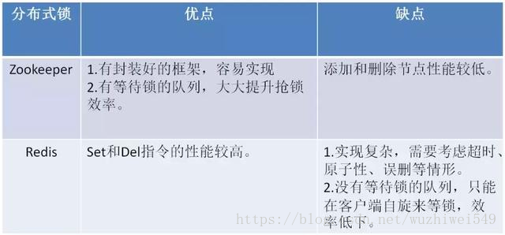

# 4 分布式锁解决方案

## 1. 什么是分布式锁？

- 当在分布式模型下，数据只有一份（或有限制），此时需要利用锁的技术控制某一时刻修改数据的进程数。
- 与单机模式下的锁不仅需要保证进程可见，还需要考虑进程与锁之间的网络问题。（我觉得分布式情况下之所以问题变得复杂，主要就是需要考虑到网络的延时和不可靠。。。一个大坑）
- 分布式锁还是可以将标记存在内存，只是该内存不是某个进程分配的内存而是公共内存如 Redis、Memcache。至于利用数据库、文件等做锁与单机的实现是一样的，只要保证标记能互斥就行。

## 2. 我们需要怎样的分布式锁？

- 可以保证在分布式部署的应用集群中，同一个方法在同一时间只能被一台机器-上的一个线程执行。
- 这把锁要是一把可重入锁（避免死锁）
- 这把锁最好是一把阻塞锁（根据业务需求考虑要不要这条）
- 这把锁最好是一把公平锁（根据业务需求考虑要不要这条）
- 有高可用的获取锁和释放锁功能
- 获取锁和释放锁的性能要好

## 3. 基于数据库做分布式锁

### 3.1 基于乐观锁

#### 3.1.1 基于表主键唯一做分布式锁

**思路：**利用主键唯一的特性，如果有多个请求同时提交到数据库的话，数据库会保证只有一个操作可以成功，那么我们就可以认为操作成功的那个线程获得了该方法的锁，当方法执行完毕之后，想要释放锁的话，删除这条数据库记录即可。

上面这种简单的实现有以下几个问题：

- 这把锁强依赖数据库的可用性，数据库是一个单点，一旦数据库挂掉，会导致业务系统不可用。
- 这把锁没有失效时间，一旦解锁操作失败，就会导致锁记录一直在数据库中，其他线程无法再获得到锁。
- 这把锁只能是非阻塞的，因为数据的 insert操作，一旦插入失败就会直接报错。没有获得锁的线程并不会进入排队队列，要想再次获得锁就要再次触发获得锁操作。
- 这把锁是非重入的，同一个线程在没有释放锁之前无法再次获得该锁。因为数据中数据已经存在了。
- 这把锁是非公平锁，所有等待锁的线程凭运气去争夺锁。
- 在 MySQL 数据库中采用主键冲突防重，在大并发情况下有可能会造成锁表现象。

**当然，我们也可以有其他方式解决上面的问题。**

- 数据库是单点？搞两个数据库，数据之前双向同步，一旦挂掉快速切换到备库上。
- 没有失效时间？只要做一个定时任务，每隔一定时间把数据库中的超时数据清理一遍。
- 非阻塞的？搞一个 while 循环，直到 insert 成功再返回成功。
- 非重入的？在数据库表中加个字段，记录当前获得锁的机器的主机信息和线程信息，那么下次再获取锁的时候先查询数据库，如果当前机器的主机信息和线程信息在数据库可以查到的话，直接把锁分配给他就可以了。
- 非公平的？再建一张中间表，将等待锁的线程全记录下来，并根据创建时间排序，只有最先创建的允许获取锁。
- 比较好的办法是在程序中生产主键进行防重。

#### 3.1.2 基于表字段版本号做分布式锁

这个策略源于 mysql 的 mvcc 机制，使用这个策略其实本身没有什么问题，唯一的问题就是对数据表侵入较大，我们要为每个表设计一个版本号字段，然后写一条判断 sql 每次进行判断，增加了数据库操作的次数，在高并发的要求下，对数据库连接的开销也是无法忍受的。

### 3.2 基于悲观锁

#### 3.2.1 基于数据库排他锁做分布式锁

在查询语句后面增加`for update`，数据库会在查询过程中给数据库表增加排他锁 (注意： InnoDB 引擎在加锁的时候，只有通过索引进行检索的时候才会使用行级锁，否则会使用表级锁。这里我们希望使用行级锁，就要给要执行的方法字段名添加索引，值得注意的是，这个索引一定要创建成唯一索引，否则会出现多个重载方法之间无法同时被访问的问题。重载方法的话建议把参数类型也加上。)。当某条记录被加上排他锁之后，其他线程无法再在该行记录上增加排他锁。

我们可以认为获得排他锁的线程即可获得分布式锁，当获取到锁之后，可以执行方法的业务逻辑，执行完方法之后，通过`connection.commit()`操作来释放锁。

这种方法可以有效的解决上面提到的无法释放锁和阻塞锁的问题。

- 阻塞锁？ `for update`语句会在执行成功后立即返回，在执行失败时一直处于阻塞状态，直到成功。
- 锁定之后服务宕机，无法释放？使用这种方式，服务宕机之后数据库会自己把锁释放掉。

但是还是无法直接解决数据库单点和可重入问题。

这里还可能存在另外一个问题，虽然我们对方法字段名使用了唯一索引，并且显示使用 for update 来使用行级锁。但是，MySQL 会对查询进行优化，即便在条件中使用了索引字段，但是否使用索引来检索数据是由 MySQL 通过判断不同执行计划的代价来决定的，如果 MySQL 认为全表扫效率更高，比如对一些很小的表，它就不会使用索引，这种情况下 InnoDB 将使用表锁，而不是行锁。如果发生这种情况就悲剧了。。。

还有一个问题，就是我们要使用排他锁来进行分布式锁的 lock，那么一个排他锁长时间不提交，就会占用数据库连接。一旦类似的连接变得多了，就可能把数据库连接池撑爆。

**优点**：简单，易于理解
**缺点**：会有各种各样的问题（操作数据库需要一定的开销，使用数据库的行级锁并不一定靠谱，性能不靠谱）

## 4. 基于 Redis 做分布式锁 

### 4.1 基于 REDIS 的 SETNX()、EXPIRE() 方法做分布式锁

**setnx()**

setnx 的含义就是 SET if Not Exists，其主要有两个参数 setnx(key, value)。该方法是原子的，如果 key 不存在，则设置当前 key 成功，返回 1；如果当前 key 已经存在，则设置当前 key 失败，返回 0。

**expire()**

expire 设置过期时间，要注意的是 setnx 命令不能设置 key 的超时时间，只能通过 expire() 来对 key 设置。

**使用步骤**

1、setnx(lockkey, 1) 如果返回 0，则说明占位失败；如果返回 1，则说明占位成功

2、expire() 命令对 lockkey 设置超时时间，为的是避免死锁问题。

3、执行完业务代码后，可以通过 delete 命令删除 key。

这个方案其实是可以解决日常工作中的需求的，但从技术方案的探讨上来说，可能还有一些可以完善的地方。**比如，如果在第一步 setnx 执行成功后，在 expire() 命令执行成功前，发生了宕机的现象，那么就依然会出现死锁的问题，所以如果要对其进行完善的话，可以使用 redis 的 setnx()、get() 和 getset() 方法来实现分布式锁。**

### 4.2 基于 REDIS 的 SETNX()、GET()、GETSET()方法做分布式锁

这个方案的背景主要是在 setnx() 和 expire() 的方案上针对可能存在的死锁问题，做了一些优化。

**getset()**
这个命令主要有两个参数 getset(key，newValue)。该方法是原子的，对 key 设置 newValue 这个值，并且返回 key 原来的旧值。假设 key 原来是不存在的，那么多次执行这个命令，会出现下边的效果：

- getset(key, “value1”) 返回 null 此时 key 的值会被设置为 value1
- getset(key, “value2”) 返回 value1 此时 key 的值会被设置为 value2
- 依次类推！

**使用步骤**

- setnx(lockkey, 当前时间+过期超时时间)，如果返回 1，则获取锁成功；如果返回 0 则没有获取到锁，转向 2。
- get(lockkey) 获取值 oldExpireTime ，并将这个 value 值与当前的系统时间进行比较，如果小于当前系统时间，则认为这个锁已经超时，可以允许别的请求重新获取，转向 3。
- 计算 newExpireTime = 当前时间+过期超时时间，然后 getset(lockkey, newExpireTime) 会返回当前 lockkey 的值currentExpireTime。
- 判断 currentExpireTime 与 oldExpireTime 是否相等，如果相等，说明当前 getset 设置成功，获取到了锁。如果不相等，说明这个锁又被别的请求获取走了，那么当前请求可以直接返回失败，或者继续重试。
- 在获取到锁之后，当前线程可以开始自己的业务处理，当处理完毕后，比较自己的处理时间和对于锁设置的超时时间，如果小于锁设置的超时时间，则直接执行 delete 释放锁；如果大于锁设置的超时时间，则不需要再锁进行处理。

### 4.3 基于 REDLOCK 做分布式锁

Redlock 是 Redis 的作者 antirez 给出的集群模式的 Redis 分布式锁，它基于 N 个完全独立的 Redis 节点（通常情况下 N 可以设置成 5）。

算法的步骤如下：

- 1、客户端获取当前时间，以毫秒为单位。
- 2、客户端尝试获取 N 个节点的锁，（每个节点获取锁的方式和前面说的缓存锁一样），N 个节点以相同的 key 和 value 获取锁。客户端需要设置接口访问超时，接口超时时间需要远远小于锁超时时间，比如锁自动释放的时间是 10s，那么接口超时大概设置 5-50ms。这样可以在有 redis 节点宕机后，访问该节点时能尽快超时，而减小锁的正常使用。
- 3、客户端计算在获得锁的时候花费了多少时间，方法是用当前时间减去在步骤一获取的时间，只有客户端获得了超过 3 个节点的锁，而且获取锁的时间小于锁的超时时间，客户端才获得了分布式锁。
- 4、客户端获取的锁的时间为设置的锁超时时间减去步骤三计算出的获取锁花费时间。
- 5、如果客户端获取锁失败了，客户端会依次删除所有的锁。

使用 Redlock 算法，可以保证在挂掉最多 2 个节点的时候，分布式锁服务仍然能工作，这相比之前的数据库锁和缓存锁大大提高了可用性，由于 redis 的高效性能，分布式缓存锁性能并不比数据库锁差。

但是，有一位分布式的专家写了一篇文章《How to do distributed locking》，质疑 Redlock 的正确性。

https://mp.weixin.qq.com/s/1bPLk_VZhZ0QYNZS8LkviA

https://blog.csdn.net/jek123456/article/details/72954106

**优点：** 性能高

**缺点：**

失效时间设置多长时间为好？如何设置的失效时间太短，方法没等执行完，锁就自动释放了，那么就会产生并发问题。如果设置的时间太长，其他获取锁的线程就可能要平白的多等一段时间。

### 4.4 基于 REDISSON 做分布式锁

redisson 是 redis 官方的分布式锁组件。GitHub 地址：https://github.com/redisson/redisson

上面的这个问题 ——> 失效时间设置多长时间为好？这个问题在 redisson 的做法是：每获得一个锁时，只设置一个很短的超时时间，同时起一个线程在每次快要到超时时间时去刷新锁的超时时间。在释放锁的同时结束这个线程。

## 5. 基于 ZooKeeper 做分布式锁

### 5.1  ZOOKEEPER 锁相关基础知识

- zk 一般由多个节点构成（单数），采用 zab 一致性协议。因此可以将 zk 看成一个单点结构，对其修改数据其内部自动将所有节点数据进行修改而后才提供查询服务。
- zk 的数据以目录树的形式，每个目录称为 znode， znode 中可存储数据（一般不超过 1M），还可以在其中增加子节点。
- 子节点有三种类型。序列化节点，每在该节点下增加一个节点自动给该节点的名称上自增。临时节点，一旦创建这个 znode 的客户端与服务器失去联系，这个 znode 也将自动删除。最后就是普通节点。
- Watch 机制，client 可以监控每个节点的变化，当产生变化会给 client 产生一个事件。

### 5.2 ZK 基本锁

- 原理：利用临时节点与 watch 机制。每个锁占用一个普通节点 /lock，当需要获取锁时在 /lock 目录下创建一个临时节点，创建成功则表示获取锁成功，失败则 watch/lock 节点，有删除操作后再去争锁。临时节点好处在于当进程挂掉后能自动上锁的节点自动删除即取消锁。
- 缺点：所有取锁失败的进程都监听父节点，很容易发生羊群效应，即当释放锁后所有等待进程一起来创建节点，并发量很大。

### 5.3  ZK 锁优化

- 原理：上锁改为创建临时有序节点，每个上锁的节点均能创建节点成功，只是其序号不同。只有序号最小的可以拥有锁，如果这个节点序号不是最小的则 watch 序号比本身小的前一个节点 (公平锁)。

步骤：

- 1.在 /lock 节点下创建一个有序临时节点 (EPHEMERAL_SEQUENTIAL)。
- 2.判断创建的节点序号是否最小，如果是最小则获取锁成功。不是则取锁失败，然后 watch 序号比本身小的前一个节点。
- 3.当取锁失败，设置 watch 后则等待 watch 事件到来后，再次判断是否序号最小。
- 4.取锁成功则执行代码，最后释放锁（删除该节点）。

##### 优点：

有效的解决单点问题，不可重入问题，非阻塞问题以及锁无法释放的问题。实现起来较为简单。

##### 缺点：

性能上可能并没有缓存服务那么高，因为每次在创建锁和释放锁的过程中，都要动态创建、销毁临时节点来实现锁功能。ZK 中创建和删除节点只能通过 Leader 服务器来执行，然后将数据同步到所有的 Follower 机器上。还需要对 ZK的原理有所了解。

## 6. 基于 Consul 做分布式锁

DD 写过类似文章，其实主要利用 Consul 的 Key / Value 存储 API 中的 acquire 和 release 操作来实现。

文章地址：http://blog.didispace.com/spring-cloud-consul-lock-and-semphore/

## 7. 使用分布式锁的注意事项

1、注意分布式锁的开销

2、注意加锁的粒度

3、加锁的方式

下面的表格总结了Zookeeper和Redis分布式锁的优缺点：

**三种方案的比较**
上面几种方式，哪种方式都无法做到完美。就像CAP一样，在复杂性、可靠性、性能等方面无法同时满足，所以，根据不同的应用场景选择最适合自己的才是王道。

从理解的难易程度角度（从低到高）
数据库 > 缓存 > Zookeeper

从实现的复杂性角度（从低到高）
Zookeeper >= 缓存 > 数据库

从性能角度（从高到低）
缓存 > Zookeeper >= 数据库

从可靠性角度（从高到低）

Zookeeper > 缓存 > 数据库