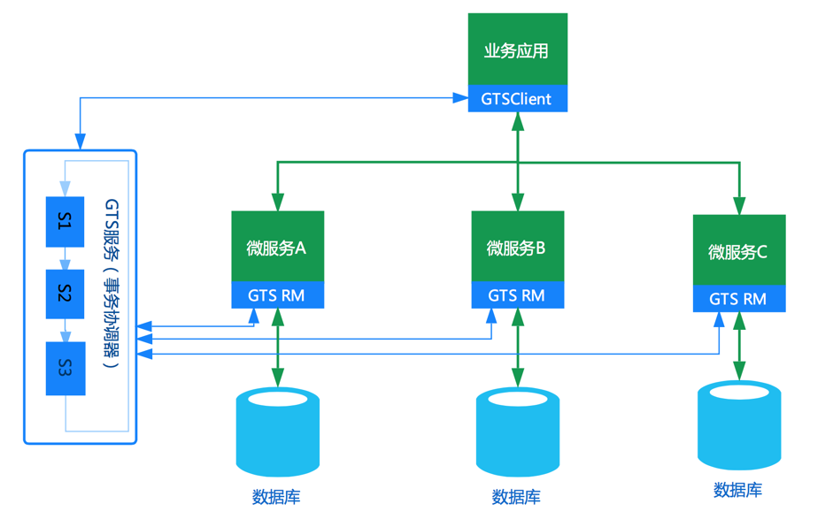
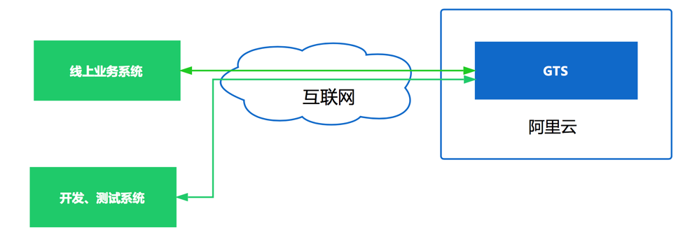
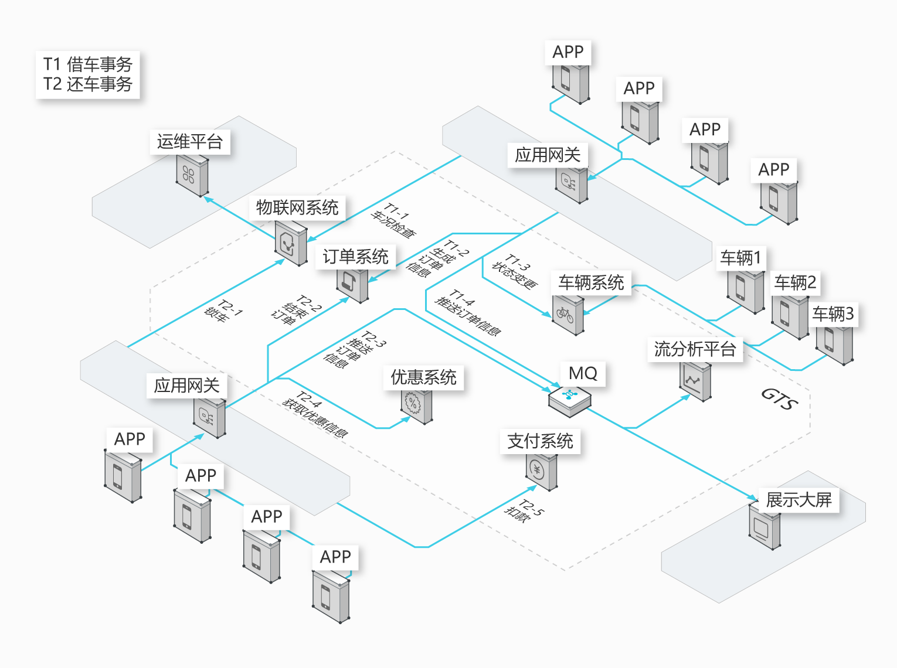

# 3.3 GTS分布式事务中间件

[GTS是一款分布式事务中间件](https://www.aliyun.com/aliware/txc?spm=5176.8142029.388261.386.a72376f4lqvQxv)，由阿里巴巴中间件部门研发，可以为微服务架构中的分布式事务提供一站式解决方案。


## 1 GTS的核心优势

- **性能超强**

  GTS通过大量创新，解决了事务ACID特性与高性能、高可用、低侵入不可兼得的问题。单事务分支的平均响应时间在2ms左右，3台服务器组成的集群可以支撑3万TPS以上的分布式事务请求。

- **应用侵入性极低**

  GTS对业务低侵入，业务代码最少只需要添加一行注解（@TxcTransaction）声明事务即可。业务与事务分离，将微服务从事务中解放出来，微服务关注于业务本身，不再需要考虑反向接口、幂等、回滚策略等复杂问题，极大降低了微服务开发的难度与工作量。

- **完整解决方案**

  GTS支持多种主流的服务框架，包括EDAS，Dubbo，Spring Cloud等。
  有些情况下，应用需要调用第三方系统的接口，而第三方系统没有接入GTS。此时需要用到GTS的MT模式。GTS的MT模式可以等价于TCC模式，用户可以根据自身业务需求自定义每个事务阶段的具体行为。MT模式提供了更多的灵活性，可能性，以达到特殊场景下的自定义优化及特殊功能的实现。

- **容错能力强**

  GTS解决了XA事务协调器单点问题，实现真正的高可用，可以保证各种异常情况下的严格数据一致。

## 2 GTS的应用场景

GTS可应用在涉及服务调用的多个领域，包括但不限于金融支付、电信、电子商务、快递物流、广告营销、社交、即时通信、手游、视频、物联网、车联网等，详细介绍可以阅读 [《GTS--阿里巴巴分布式事务全新解决方案》](https://www.jianshu.com/u/c9668ae2b661)一文。

## 3 GTS与微服务的集成

GTS包括客户端（GTS Client）、资源管理器（GTS RM）和事务协调器（GTS Server）三个部分。GTS Client主要用来界定事务边界，完成事务的发起与结束。GTS RM完成事务分支的创建、提交、回滚等操作。GTS Server主要负责分布式事务的整体推进，事务生命周期的管理。GTS和微服务集成的结构图如下所示，GTS Client需要和业务应用集成部署，RM与微服务集成部署。



## 4 GTS的输出形式

GTS目前有三种输出形式：公有云输出、公网输出、专有云输出。

### 4.1 公有云输出

这种输出形式面向阿里云用户。如果用户的业务系统已经部署到阿里云上，可以申请开通公有云GTS。开通后业务应用即可通过GTS保证服务调用的一致性。这种使用场景下，业务系统和GTS间的网络环境比较理想，达到很好性能。


### 4.2 公网输出

这种输出形式面向于非阿里云的用户，使用更加方便、灵活，业务系统只要能连接互联网即可享受GTS提供的云服务（与公有云输出的差别在于客户端部署于用户本地，而不在云上）。

在正常网络环境下，以包含两个本地事务的全局事务为例，事务完成时间在20ms左右，50个并发就可以轻松实现1000TPS以上分布式事务，对绝大多数业务来说性能是足够的。在公网环境，网络闪断很难完全避免，这种情况下GTS仍能保证服务调用的数据一致性。



### 4.3 专有云输出

这种形式主要面向于已建设了自己专有云平台的大用户，GTS可以直接部署到用户的专有云上，为专有云提供分布式事务服务。目前已经有10多个特大型企业的专有云使用GTS解决分布式事务难题，性能与稳定性经过了用户的严格检测。

## 5 [GTS的使用方式](https://help.aliyun.com/document_detail/53298.html?spm=a2c4g.11186623.6.554.NZEXg9)

GTS对应用的侵入性非常低，使用也很简单。下面以订单存储应用为例说明。订单业务应用通过调用订单服务和库存服务完成订单业务，服务开发框架为Dubbo。

### 5.1 订单业务应用

在业务函数外围使用@TxcTransaction注解即可开启分布式事务。Dubbo应用通过隐藏参数将GTS的事务xid传播到服务端。

```
@TxcTransaction(timeout = 1000 * 10)
public void Bussiness(OrderService orderService, StockService stockService, String userId) {
    //获取事务上下文
    String xid = TxcContext.getCurrentXid();
    //通过RpcContext将xid传到一个服务端
    RpcContext.getContext().setAttachment("xid", xid);
    
    //执行自己的业务逻辑
    int productId = new Random().nextInt(100);
    int productNum = new Random().nextInt(100);
    OrderDO orderDO = new OrderDO(userId, productId, productNum, new Timestamp(new Date().getTime()));
    orderService.createOrder(orderDO);
    
    //通过RpcContext将xid传到另一个服务端
    RpcContext.getContext().setAttachment("xid",xid);
    stockService.updateStock(orderDO);
}
```

### 5.2 服务提供者

更新库存方法

```
public int updateStock(OrderDO orderDO) {

//获取全局事务ID，并绑定到上下文

String xid = RpcContext.getContext().getAttachment("xid");

TxcContext.bind(xid,null);

//执行自己的业务逻辑

int ret = jdbcTemplate.update("update stock set amount = amount - ? where product_id = ?",new Object[]{orderDO.getNumber(), orderDO.getProductId()});

TxcContext.unbind();

return ret;

}
```

## 6 GTS的应用情况

GTS目前已经在淘宝、天猫、阿里影业、淘票票、阿里妈妈、1688等阿里各业务系统广泛使用，经受了16年和17年两年双十一海量请求的考验。某线上业务系统最高流量已达十万TPS（每秒钟10万笔事务）。

GTS在公有云和专有云输出后，已经有了100多个线上用户，很多用户通过GTS解决SpringCloud、Dubbo、Edas等服务框架的分布式事务问题。业务领域涉及电力、物流、ETC、烟草、金融、零售、电商、共享出行等十几个行业，得到[用户的一致认可](https://www.aliyun.com/aliware/hotproducts/gtscase1?open_id=42e50fd2-3b02-4d91-9468-4c785adaaff4-53709576&open_cid=17680)。



上图是GTS与SpringCloud集成，应用于某共享出行系统。业务共享出行场景下，通过GTS支撑物联网系统、订单系统、支付系统、运维系统、分析系统等系各统应用的数据一致性，保证海量订单和数千万流水的交易。