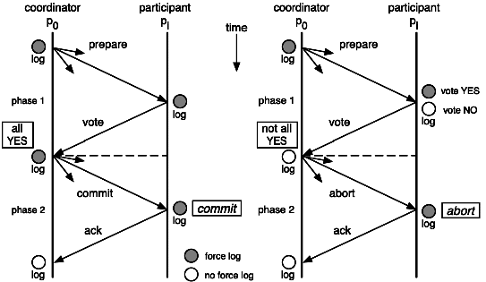
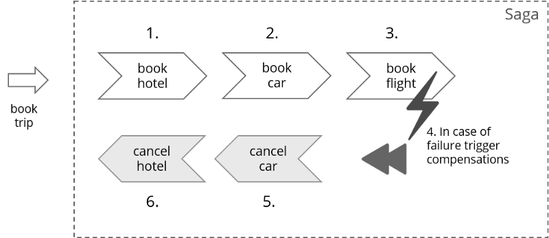

# 3 分布式事务解决方案

[为什么说分布式事务不再适用于微服务架构](https://blog.csdn.net/javahongxi/article/details/54177741)

本地事务数据库断电的这种情况，它是怎么保证数据一致性的呢？我们使用SQL Server来举例，我们知道我们在使用 SQL Server 数据库是由两个文件组成的，一个数据库文件和一个日志文件，通常情况下，日志文件都要比数据库文件大很多。数据库进行任何写入操作的时候都是要先写日志的，同样的道理，我们在执行事务的时候数据库首先会记录下这个事务的redo操作日志，然后才开始真正操作数据库，在操作之前首先会把日志文件写入磁盘，那么当突然断电的时候，即使操作没有完成，在重新启动数据库时候，数据库会根据当前数据的情况进行undo回滚或者是redo前滚，这样就保证了数据的强一致性。

**分布式事务**，本质上是对多个数据库的事务进行统一控制，按照控制力度可以分为：不控制、部分控制和完全控制。**不控制**就是不引入分布式事务，**部分控制**就是各种变种的两阶段提交，包括消息事务+最终一致性、TCC模式，而**完全控制**就是完全实现两阶段提交。部分控制的好处是并发量和性能很好，缺点是数据一致性减弱了，完全控制则是牺牲了性能，保障了一致性，具体用哪种方式，最终还是取决于业务场景。

XA协议由[Tuxedo](https://baike.baidu.com/item/Tuxedo/7217073)首先提出的，并交给X/Open组织，作为本地资源管理器（Local Resource Manager 数据库）与[事务](https://baike.baidu.com/item/事务)管理器(Transaction Manager)的接口标准。目前，[Oracle](https://baike.baidu.com/item/Oracle/301207)、[Informix](https://baike.baidu.com/item/Informix/269954)、[DB2](https://baike.baidu.com/item/DB2/7034285)和[Sybase](https://baike.baidu.com/item/Sybase/2138155)等各大数据库厂家都提供对XA的支持。XA协议采用两阶段提交方式来管理[分布式事务](https://baike.baidu.com/item/分布式事务/4747029)。XA接口提供资源管理器与事务管理器之间进行通信的标准接口。XA协议包括两套函数，以xa_开头的及以ax_开头的。

总的来说，XA协议比较简单，而且一旦商业数据库实现了XA协议，使用分布式事务的成本也比较低。但是，XA也有致命的缺点，那就是性能不理想，特别是在交易下单链路，往往并发量很高，XA无法满足高并发场景。XA目前在商业数据库支持的比较理想，在mysql数据库中支持的不太理想，mysql的XA实现，没有记录prepare阶段日志，主备切换回导致主库与备库数据不一致。许多nosql也没有支持XA，这让XA的应用场景变得非常狭隘。

## 一、两阶段提交（2PC）

和上一节中提到的数据库XA事务一样，两阶段提交就是使用XA协议的原理，我们可以从下面这个图的流程来很容易的看出中间的一些比如commit和abort的细节。

两阶段提交这种解决方案属于牺牲了一部分可用性来换取的一致性。在实现方面，在 .NET 中，可以借助 TransactionScop 提供的 API 来编程实现分布式系统中的两阶段提交，比如WCF中就有实现这部分功能。不过在多服务器之间，需要依赖于DTC来完成事务一致性，Windows下微软搞的有MSDTC服务，Linux下就比较悲剧了。

另外说一句，TransactionScop 默认不能用于异步方法之间事务一致，因为事务上下文是存储于当前线程中的，所以如果是在异步方法，需要显式的传递事务上下文。

**优点：** 尽量保证了数据的强一致，适合对数据强一致要求很高的关键领域。（其实也不能100%保证强一致）

**缺点：** 实现复杂，牺牲了可用性，对性能影响较大，不适合高并发高性能场景，如果分布式系统跨接口调用，目前 .NET 界还没有实现方案。

## 二、补偿事务（TCC）

TCC 其实就是采用的补偿机制，其核心思想是：针对每个操作，都要注册一个与其对应的确认和补偿（撤销）操作。它分为三个阶段：

- Try 阶段主要是对业务系统做检测及资源预留
- Confirm 阶段主要是对业务系统做确认提交，Try阶段执行成功并开始执行 Confirm阶段时，默认 Confirm阶段是不会出错的。即：只要Try成功，Confirm一定成功。
- Cancel 阶段主要是在业务执行错误，需要回滚的状态下执行的业务取消，预留资源释放。

举个例子，假入 Bob 要向 Smith 转账，思路大概是：
我们有一个本地方法，里面依次调用
1、首先在 Try 阶段，要先调用远程接口把 Smith 和 Bob 的钱给冻结起来。
2、在 Confirm 阶段，执行远程调用的转账的操作，转账成功进行解冻。
3、如果第2步执行成功，那么转账成功，如果第二步执行失败，则调用远程冻结接口对应的解冻方法 (Cancel)。

**优点：** 跟2PC比起来，实现以及流程相对简单了一些，但数据的一致性比2PC也要差一些

**缺点：** 缺点还是比较明显的，在2,3步中都有可能失败。TCC属于应用层的一种补偿方式，所以需要程序员在实现的时候多写很多补偿的代码，在一些场景中，一些业务流程可能用TCC不太好定义及处理。

## 三、本地消息表（异步确保）

本地消息表这种实现方式应该是业界使用最多的，其核心思想是将分布式事务拆分成本地事务进行处理，这种思路是来源于ebay。我们可以从下面的流程图中看出其中的一些细节：

基本思路就是：

消息生产方，需要额外建一个消息表，并记录消息发送状态。消息表和业务数据要在一个事务里提交，也就是说他们要在一个数据库里面。然后消息会经过MQ发送到消息的消费方。如果消息发送失败，会进行重试发送。

消息消费方，需要处理这个消息，并完成自己的业务逻辑。此时如果本地事务处理成功，表明已经处理成功了，如果处理失败，那么就会重试执行。如果是业务上面的失败，可以给生产方发送一个业务补偿消息，通知生产方进行回滚等操作。

生产方和消费方定时扫描本地消息表，把还没处理完成的消息或者失败的消息再发送一遍。如果有靠谱的自动对账补账逻辑，这种方案还是非常实用的。

这种方案遵循BASE理论，采用的是最终一致性，笔者认为是这几种方案里面比较适合实际业务场景的，即不会出现像2PC那样复杂的实现(当调用链很长的时候，2PC的可用性是非常低的)，也不会像TCC那样可能出现确认或者回滚不了的情况。

**优点：** 一种非常经典的实现，避免了分布式事务，实现了最终一致性。在 .NET中 有现成的解决方案。

**缺点：** 消息表会耦合到业务系统中，如果没有封装好的解决方案，会有很多杂活需要处理。

## 四、MQ 事务消息

有一些第三方的MQ是支持事务消息的，比如RocketMQ，他们支持事务消息的方式也是类似于采用的二阶段提交，但是市面上一些主流的MQ都是不支持事务消息的，比如 RabbitMQ 和 Kafka 都不支持???。

以阿里的 RocketMQ 中间件为例，其思路大致为：

第一阶段Prepared消息，会拿到消息的地址。
第二阶段执行本地事务，第三阶段通过第一阶段拿到的地址去访问消息，并修改状态。

也就是说在业务方法内要想消息队列提交两次请求，一次发送消息和一次确认消息。如果确认消息发送失败了RocketMQ会定期扫描消息集群中的事务消息，这时候发现了Prepared消息，它会向消息发送者确认，所以生产方需要实现一个check接口，RocketMQ会根据发送端设置的策略来决定是回滚还是继续发送确认消息。这样就保证了消息发送与本地事务同时成功或同时失败。

**优点：** 实现了最终一致性，不需要依赖本地数据库事务。

**缺点：** 实现难度大，主流MQ不支持，没有.NET客户端，RocketMQ事务消息部分代码也未开源。

## 五、Sagas 事务模型

Saga事务模型又叫做长时间运行的事务（Long-running-transaction）, 它是由普林斯顿大学的H.Garcia-Molina等人提出，它描述的是另外一种在没有两阶段提交的的情况下解决分布式系统中复杂的业务事务问题。你可以在[这里](https://www.cs.cornell.edu/andru/cs711/2002fa/reading/sagas.pdf)看到 Sagas 相关论文。

我们这里说的是一种基于 Sagas 机制的工作流事务模型，这个模型的相关理论目前来说还是比较新的，以至于百度上几乎没有什么相关资料。

该模型其核心思想就是拆分分布式系统中的长事务为多个短事务，或者叫多个本地事务，然后由 Sagas 工作流引擎负责协调，如果整个流程正常结束，那么就算是业务成功完成，如果在这过程中实现失败，那么Sagas工作流引擎就会以相反的顺序调用补偿操作，重新进行业务回滚。

比如我们一次关于购买旅游套餐业务操作涉及到三个操作，他们分别是预定车辆，预定宾馆，预定机票，他们分别属于三个不同的远程接口。可能从我们程序的角度来说他们不属于一个事务，但是从业务角度来说是属于同一个事务的。

他们的执行顺序如上图所示，所以当发生失败时，会依次进行取消的补偿操作。

因为长事务被拆分了很多个业务流，所以 Sagas 事务模型最重要的一个部件就是工作流或者你也可以叫流程管理器（Process Manager），工作流引擎和Process Manager虽然不是同一个东西，但是在这里，他们的职责是相同的。

