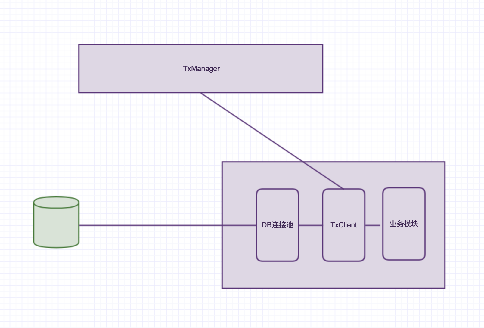
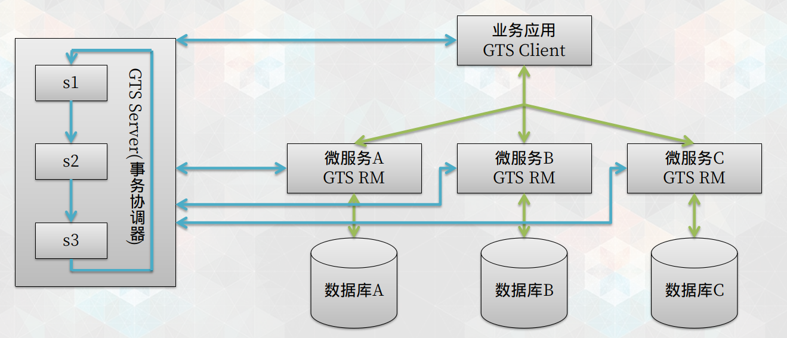

# 3.1 分布式事务实现

SpringBoot 集成 Atomikos 实现分布式事务

## Atomikos 


## LCN

### LCN简介

1. LCN分布式事务框架的核心功能是对本地事务的协调控制，框架本身并不创建事务，只是对本地事务做协调控制
2. 因此该框架与其他第三方的框架兼容性强，支持所有的关系型数据库事务，支持多数据源，支持与第三方数据库框架一块使用（例如 sharding-jdbc）
3. 在使用框架的时候只需要添加分布式事务的注解即可，对业务的侵入性低

### LCN核心步骤

1. 创建事务组，是指在事务发起方开始执行业务代码之前先调用TxManager创建事务组对象，然后拿到事务标示GroupId的过程
2. 添加事务组，添加事务组是指参与方在执行完业务方法以后，将该模块的事务信息添加通知给TxManager的操作
3. 关闭事务组，是指在发起方执行完业务代码以后，将发起方执行结果状态通知给TxManager的动作。当执行完关闭事务组的方法以后，TxManager将根据事务组信息来通知相应的参与模块提交或回滚事务

### LCN事务控制原理

LCN事务控制原理是由事务模块TxClient下的代理连接池与TxManager的协调配合完成的事务协调控制TxClient的代理连接池实现了javax.sql.DataSource接口，并重写了close方法，事务模块在提交关闭以后TxClient连接池将执行”假关闭”操作，等待TxManager协调完成事务以后在关闭连接




LCN框架主要是为微服务框架提供分布式事务的支持，在微服务框架上做了进一步的事务机制优化，在一些负载场景上LCN事务机制要比本地事务机制的性能更好，4.0以后框架开方了插件机制可以让更多的第三方框架支持进来


**在需要执行的事务上添加注解**

```
@Override
@TxTransaction(isStart = true)
@Transactional
public int save() {
}
```

其中 @TxTransaction(isStart = true) 为lcn 事务控制注解，其中isStart = true 表示该方法是事务的发起方例如，服务A 需要调用服务B,服务B 需要调用服务C，此时 服务A为服务发起方，其余为参与方，参与方只需@TxTransaction 即可

在测试时需要将 事务管理服务启动 txManager, 具体示例参看：https://www.txlcn.org

### 优缺点

优点:

- 性能优秀
- 可靠性强
- LCN实现的分布式事务处理模式，编码复杂性和入侵代码量低

缺点:

- 需额外部署tx-manager服务节点
- 由于需要lock资源这种处理方式，如果集中更新某几个热门商品时，LCN的性能衰减量大于TCC模式
- 服务超时时，会造成其他服务的资源被锁住，比如支付服务超时过程中，相关商品库存会一直无法操作
- 不支持SpringCloud 2.0.0及以上版本（目前已通过修改源码实现支持）

## ByteTCC

ByteTCC是一个基于TCC（Try/Confirm/Cancel）机制的分布式事务管理器。兼容JTA，可以很好的与EJB、Spring等容器（本文档下文说明中将以Spring容器为例）进行集成。

ByteTCC特性
1、支持Spring容器的声明式事务管理；
2、支持普通事务、TCC事务、业务补偿型事务等事务机制；
3、支持多数据源、跨应用、跨服务器等分布式事务场景；
4、支持长事务；
5、支持dubbo服务框架；
6、支持spring cloud；

该实现方式，需要在业务层编写对应的 tcc（Try/Confirm/Cancel） 方法，开发需要一定的成本，同时某些业务可能无法保证数据可回滚


## 阿里云GTS

1. 全局事务服务（Global Transaction Service，简称 GTS）是一款高性能、高可靠、接入简单的分布式事务中间件，用于解决分布式环境下的事务一致性问题
2. GTS 支持 DRDS、RDS、MySQL 等多种数据源，可以配合EDAS 和 SpringCloud 等微服务框架使用， 兼容 MQ 实现事务消息。通过各种组合，可以轻松实现分布式数据库事务、多库事务、消息事务、服务链路级事务等多种业务需求


### GTS模拟场景演示



### 性能

GTS 通过大量创新，解决了事务 ACID 特性与高性能、高可用、低侵入不可兼得的问题。单事务分支的平均响应时间在 2ms 左右，3 台服务器组成的集群可以支撑 3 万 TPS 以上的分布式事务请求

LCN性能参考：http://springcloud.cn/view/374在众多开源分布式事务框架中，LCN性能是处于前列的

### 优缺点

优点:

- 性能优秀(有淘宝双十一作为示例）
- 可靠性强
- 代码入侵性小（相比LCN多一点）
- 支持SpringCloud 2.0.0及以上版本

缺点:

- 无法在本地进行测试
- 只能在阿里云内网使用，或者购买专有云

### 开源

阿里分布式事务框架GTS开源了一个免费社区版Fescar，看到了这个消息内心非常的激动！在微服务系统中，分布式事务一直是痛点，也是难点。社区里也有一些开源的分布式解决方案的框架，比如ByteTCC、LCN，但是这些框架没有一个权威的组织在维护，或多或少大家都有点不敢用。阿里开源的分布式事务解决框架Fescar会不会一统分布式事务江湖，大家拭目以待！

我们现在来看看什么是FESCAR。Fescar项目地址：

https://github.com/alibaba/fescar

**//更新**

Fescar已经更名为Seata，一下讲述Fescar和Seata是一样的，的地址为：
https://github.com/seata/seata