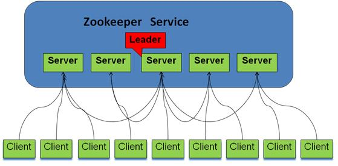

# 第4节 Zookeeper

ZooKeeper是一个分布式的，开放源码的分布式应用程序协调服务，它包含一个简单的原语集，分布式应用程序可以基于它实现同步服务，配置维护和命名服务等。Zookeeper是hadoop的一个子项目，其发展历程无需赘述。在分布式应用中，由于工程师不能很好地使用锁机制，以及基于消息的协调机制不适合在某些应用中使用，因此需要有一种可靠的、可扩展的、分布式的、可配置的协调机制来统一系统的状态。Zookeeper的目的就在于此。

## 1 Zookeeper的基本概念

### 1.1 角色

Zookeeper中的角色主要有以下三类，如下表所示：

系统模型如图所示：

### 1.2 设计目的

1. 最终一致性：client不论连接到哪个Server，展示给它都是同一个视图，这是zookeeper最重要的性能。
2. 可靠性：具有简单、健壮、良好的性能，如果消息m被到一台服务器接受，那么它将被所有的服务器接受。
3. 实时性：Zookeeper保证客户端将在一个时间间隔范围内获得服务器的更新信息，或者服务器失效的信息。但由于网络延时等原因，Zookeeper不能保证两个客户端能同时得到刚更新的数据，如果需要最新数据，应该在读数据之前调用sync()接口。
4. 等待无关（wait-free）：慢的或者失效的client不得干预快速的client的请求，使得每个client都能有效的等待。
5. 原子性：更新只能成功或者失败，没有中间状态。
6. 顺序性：包括全局有序和偏序两种：全局有序是指如果在一台服务器上消息a在消息b前发布，则在所有Server上消息a都将在消息b前被发布；偏序是指如果一个消息b在消息a后被同一个发送者发布，a必将排在b前面。

