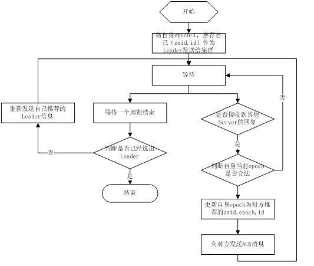

# 第4节 Zookeeper

ZooKeeper是一个分布式的，开放源码的分布式应用程序协调服务，它包含一个简单的原语集，分布式应用程序可以基于它实现同步服务，配置维护和命名服务等。Zookeeper是hadoop的一个子项目，其发展历程无需赘述。在分布式应用中，由于工程师不能很好地使用锁机制，以及基于消息的协调机制不适合在某些应用中使用，因此需要有一种可靠的、可扩展的、分布式的、可配置的协调机制来统一系统的状态。Zookeeper的目的就在于此。

它解决的是分布式环境中的一致性问题。Zookeeper是以Fast Paxos算法为基础的。

一致性协议和算法：二阶段提交协议、三阶段提交协议和Paxos算法：

二阶段提交协议：投票和执行两个阶段。

- 优点：原理简单，实现方便

- 缺点：同步阻塞、单点问题、脑裂、太过保守

三阶段提交协议：（CanCommit，PreCommit）和DoCommit

Paxos算法是一种基于**消息传递**且具有**高度容错特性**的一致性算法，是目前公认的解决分布式一致性问题最有效的算法之一。

## 1 Zookeeper的基本概念

### 1.1 角色

Zookeeper中的角色主要有以下三类，如下表所示：

系统模型如图所示：

### 1.2 设计目的

1. 最终一致性：client不论连接到哪个Server，展示给它都是同一个视图，这是zookeeper最重要的性能。
2. 可靠性：具有简单、健壮、良好的性能，如果消息m被到一台服务器接受，那么它将被所有的服务器接受。
3. 实时性：Zookeeper保证客户端将在一个时间间隔范围内获得服务器的更新信息，或者服务器失效的信息。但由于网络延时等原因，Zookeeper不能保证两个客户端能同时得到刚更新的数据，如果需要最新数据，应该在读数据之前调用sync()接口。
4. 等待无关（wait-free）：慢的或者失效的client不得干预快速的client的请求，使得每个client都能有效的等待。
5. 原子性：更新只能成功或者失败，没有中间状态。
6. 顺序性：包括全局有序和偏序两种：全局有序是指如果在一台服务器上消息a在消息b前发布，则在所有Server上消息a都将在消息b前被发布；偏序是指如果一个消息b在消息a后被同一个发送者发布，a必将排在b前面。

### 1.3 数据模型

如上图所示，ZooKeeper数据模型的结构与Unix文件系统很类似，整体上可以看作是一棵树，每个节点称做一个ZNode。每个ZNode都可以通过其路径唯一标识，比如上图中第三层的第一个ZNode, 它的路径是/app1/c1。在每个ZNode上可存储少量数据(默认是1M, 可以通过配置修改, 通常不建议在ZNode上存储大量的数据)，这个特性非常有用，在后面的典型应用场景中会介绍到。另外，每个ZNode上还存储了其Acl信息，这里需要注意，虽说ZNode的树形结构跟Unix文件系统很类似，但是其Acl与Unix文件系统是完全不同的，每个ZNode的Acl的独立的，子结点不会继承父结点的，关于ZooKeeper中的Acl可以参考之前写过的一篇文章《说说Zookeeper中的ACL》。

### 1.4 重要概念 

#### 1.4.1 ZNode

前文已介绍了ZNode, ZNode根据其本身的特性，可以分为下面两类：

- Regular ZNode: 常规型ZNode, 用户需要显式的创建、删除
- Ephemeral ZNode: 临时型ZNode, 用户创建它之后，可以显式的删除，也可以在创建它的Session结束后，由ZooKeeper Server自动删除

ZNode还有一个Sequential的特性，如果创建的时候指定的话，该ZNode的名字后面会自动Append一个不断增加的SequenceNo。

#### 1.4.2 Session

Client与ZooKeeper之间的通信，需要创建一个Session，这个Session会有一个超时时间。因为ZooKeeper集群会把Client的Session信息持久化，所以在Session没超时之前，Client与ZooKeeper Server的连接可以在各个ZooKeeper Server之间透明地移动。

在实际的应用中，如果Client与Server之间的通信足够频繁，Session的维护就不需要其它额外的消息了。否则，ZooKeeper Client会每t/3 ms发一次心跳给Server，如果Client 2t/3 ms没收到来自Server的心跳回应，就会换到一个新的ZooKeeper Server上。这里t是用户配置的Session的超时时间。

#### 1.4.3 Watcher

ZooKeeper支持一种Watch操作，Client可以在某个ZNode上设置一个Watcher，来Watch该ZNode上的变化。如果该ZNode上有相应的变化，就会触发这个Watcher，把相应的事件通知给设置Watcher的Client。需要注意的是，ZooKeeper中的Watcher是一次性的，即触发一次就会被取消，如果想继续Watch的话，需要客户端重新设置Watcher。这个跟epoll里的oneshot模式有点类似。

### 1.5  ZooKeeper特性 

#### 1.5.1 读、写(更新)模式

在ZooKeeper集群中，读可以从任意一个ZooKeeper Server读，这一点是保证ZooKeeper比较好的读性能的关键；写的请求会先Forwarder到Leader，然后由Leader来通过ZooKeeper中的原子广播协议，将请求广播给所有的Follower，Leader收到一半以上的写成功的Ack后，就认为该写成功了，就会将该写进行持久化，并告诉客户端写成功了。

#### 1.5.2 WAL和Snapshot

和大多数分布式系统一样，ZooKeeper也有WAL(Write-Ahead-Log)，对于每一个更新操作，ZooKeeper都会先写WAL, 然后再对内存中的数据做更新，然后向Client通知更新结果。另外，ZooKeeper还会定期将内存中的目录树进行Snapshot，落地到磁盘上，这个跟HDFS中的FSImage是比较类似的。这么做的主要目的，一当然是数据的持久化，二是加快重启之后的恢复速度，如果全部通过Replay WAL的形式恢复的话，会比较慢。

#### 1.5.3 FIFO

对于每一个ZooKeeper客户端而言，所有的操作都是遵循FIFO顺序的，这一特性是由下面两个基本特性来保证的：一是ZooKeeper Client与Server之间的网络通信是基于TCP，TCP保证了Client/Server之间传输包的顺序；二是ZooKeeper Server执行客户端请求也是严格按照FIFO顺序的。

#### 1.5.4 Linearizability

在ZooKeeper中，所有的更新操作都有严格的偏序关系，更新操作都是串行执行的，这一点是保证ZooKeeper功能正确性的关键。

## 2 ZooKeeper的工作原理

Zookeeper的核心是原子广播，这个机制保证了各个Server之间的同步。实现这个机制的协议叫做Zab协议。Zab协议有两种模式，它们分别是恢复模式（选主）和广播模式（同步）。当服务启动或者在领导者崩溃后，Zab就进入了恢复模式，当领导者被选举出来，且大多数Server完成了和leader的状态同步以后，恢复模式就结束了。状态同步保证了leader和Server具有相同的系统状态。

为了保证事务的顺序一致性，zookeeper采用了递增的事务id号（zxid）来标识事务。所有的提议（proposal）都在被提出的时候加上了zxid。实现中zxid是一个64位的数字，它高32位是epoch用来标识leader关系是否改变，每次一个leader被选出来，它都会有一个新的epoch，标识当前属于那个leader的统治时期。低32位用于递增计数。

每个Server在工作过程中有三种状态：

- LOOKING：当前Server不知道leader是谁，正在搜寻
- LEADING：当前Server即为选举出来的leader
- FOLLOWING：leader已经选举出来，当前Server与之同步

### 2.1 选主流程

当leader崩溃或者leader失去大多数的follower，这时候zk进入恢复模式，恢复模式需要重新选举出一个新的leader，让所有的Server都恢复到一个正确的状态。Zk的选举算法有两种：一种是基于basic paxos实现的，另外一种是基于fast paxos算法实现的。系统默认的选举算法为fast paxos。

先介绍basic paxos流程：

1. 选举线程由当前Server发起选举的线程担任，其主要功能是对投票结果进行统计，并选出推荐的Server；
2. 选举线程首先向所有Server发起一次询问(包括自己)；
3. 选举线程收到回复后，验证是否是自己发起的询问(验证zxid是否一致)，然后获取对方的id(myid)，并存储到当前询问对象列表中，最后获取对方提议的leader相关信息(id,zxid)，并将这些信息存储到当次选举的投票记录表中；
4. 收到所有Server回复以后，就计算出zxid最大的那个Server，并将这个Server相关信息设置成下一次要投票的Server；
5. 线程将当前zxid最大的Server设置为当前Server要推荐的Leader，如果此时获胜的Server获得n/2 + 1的Server票数， 设置当前推荐的leader为获胜的Server，将根据获胜的Server相关信息设置自己的状态，否则，继续这个过程，直到leader被选举出来。

通过流程分析我们可以得出：要使Leader获得多数Server的支持，则Server总数必须是奇数2n+1，且存活的Server的数目不得少于n+1.

每个Server启动后都会重复以上流程。在恢复模式下，如果是刚从崩溃状态恢复的或者刚启动的server还会从磁盘快照中恢复数据和会话信息，zk会记录事务日志并定期进行快照，方便在恢复时进行状态恢复。选主的具体流程图如下所示：

fast paxos流程是在选举过程中，某Server首先向所有Server提议自己要成为leader，当其它Server收到提议以后，解决epoch和zxid的冲突，并接受对方的提议，然后向对方发送接受提议完成的消息，重复这个流程，最后一定能选举出Leader。其流程图如下所示：

### 2.2 同步流程

选完leader以后，zk就进入状态同步过程。

1. leader等待server连接；
2. Follower连接leader，将最大的zxid发送给leader；
3. Leader根据follower的zxid确定同步点；
4. 完成同步后通知follower 已经成为uptodate状态；
5. Follower收到uptodate消息后，又可以重新接受client的请求进行服务了。

流程图如下所示：

### 2.3 工作流程

#### 2.3.1 Leader工作流程

Leader主要有三个功能：

1. 恢复数据；
2. 维持与Learner的心跳，接收Learner请求并判断Learner的请求消息类型；
3. Learner的消息类型主要有PING消息、REQUEST消息、ACK消息、REVALIDATE消息，根据不同的消息类型，进行不同的处理。

PING消息是指Learner的心跳信息；REQUEST消息是Follower发送的提议信息，包括写请求及同步请求；ACK消息是Follower的对提议的回复，超过半数的Follower通过，则commit该提议；REVALIDATE消息是用来延长SESSION有效时间。

Leader的工作流程简图如下所示，在实际实现中，流程要比下图复杂得多，启动了三个线程来实现功能。

#### 2.3.2 Follower工作流程

Follower主要有四个功能：

1. 向Leader发送请求（PING消息、REQUEST消息、ACK消息、REVALIDATE消息）；
2. 接收Leader消息并进行处理；
3. 接收Client的请求，如果为写请求，发送给Leader进行投票；
4. 返回Client结果。

Follower的消息循环处理如下几种来自Leader的消息：

1. PING消息： 心跳消息；
2. PROPOSAL消息：Leader发起的提案，要求Follower投票；
3. COMMIT消息：服务器端最新一次提案的信息；
4. UPTODATE消息：表明同步完成；
5. REVALIDATE消息：根据Leader的REVALIDATE结果，关闭待revalidate的session还是允许其接受消息；
6. SYNC消息：返回SYNC结果到客户端，这个消息最初由客户端发起，用来强制得到最新的更新。

Follower的工作流程简图如下所示，在实际实现中，Follower是通过5个线程来实现功能的。

**对于observer的流程不再叙述，observer流程和Follower的唯一不同的地方就是observer不会参加leader发起的投票。**

