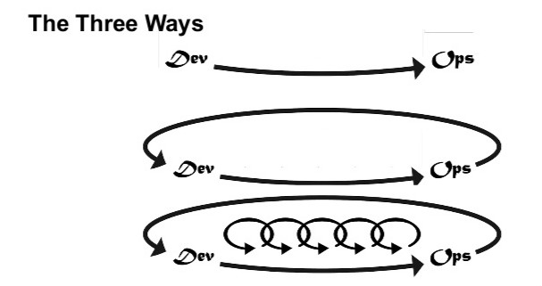
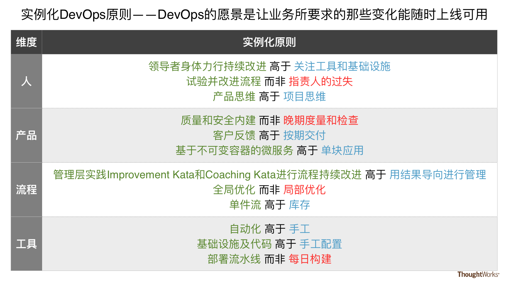

# 1 4个维度，实例化DevOps原则

DevOps原则所追求的愿景，就是“让业务所要求的那些变化能随时上线可用”；DevOps的起源表明，其原则是从Agile与Lean的实践当中提炼而来，因此与Agile和Lean的原则并无二致；本文所讨论的DevOps原则可以用“人、产品、流程和工具”这4个维度来进行组织。

“你在做用户故事拆分？这不是在做DevOps。”这是笔者在2016年以咨询师的身份，参与一家大型跨国金融企业的Agile和DevOps转型时所听到的话。在这家企业，Agile和DevOps明显指的是不同的东西：前者专指每日站会、计划会、回顾会等Scrum的实践和用户故事实践；后者专指自动化、工具链和基础设施等实践。过了一段时间，笔者把本文所列举的一些DevOps原则发到一个相关微信群里面，得到了这样的反馈：“怎么满眼都是敏捷和精益？”“感觉DevOps被一群不操作Op的人给玩儿坏了。”

这些经历让笔者开始关心这些问题：既然Dev指的是“开发”，Ops指的是“运维”，那么到底什么是DevOps？它的原则是什么？它和敏捷、精益的关系是什么？让我们先观察一下DevOps的起源。

## DevOps的起源可以分为两条线

### 第一条线：比利时独立咨询师Patrick Debois

2007年他在比利以咨询师的身份，参与了一个政府数据中心迁移中的测试工作。他在做测试时，需要频繁往返于Dev团队和Ops团队之间。Dev团队已经实践了敏捷，而Ops团队还是传统运维的工作方式。看到Ops团队每天忙于救火和疲于奔命的状态，他在想：能否把敏捷的实践引入Ops团队呢？

### 第二条线：当时雅虎旗下的图片分享网站Flickr

这家公司的运维部门经理John Allspaw和工程师Paul Hammond，于2009年6月23日在美国圣荷西举办的Velocity 2009大会上，发表了一个引燃DevOps的演讲。这个演讲的题目在当时很抢眼——《每天部署10次以上：Flickr公司的Dev与Ops的合作》。

这个演讲有一个核心议题：Dev和Ops的目标到底是不是冲突？传统观念认为Dev和Ops的目标是有冲突的——Dev的工作是添加新特性，而Ops的工作是保持系统运行的稳定和快速；而Dev在添加新特性时所带来的代码变化，会导致系统运行不稳定和变慢，从而引发Dev与Ops的冲突。然而从全局来看，Dev和Ops的目标是一致的，即都是“让业务所要求的那些变化能随时上线可用”。

这样抢眼的题目和鲜明的观点，自然抓住了当时还在比利时的Debois。他在“推特”上发帖：“可惜没法去现场参加。”朋友Paul Nasrat回帖说：“为什么不在比利时搞一个你自己的Velocity大会？”这两条线使得Debois撸起袖子，于2009年10月30至31日，在比利时的第二大城市根特，以社区自发的形式举办了一个名为DevOpsDays的大会。这次大会吸引了不少开发者、系统管理员和软件工具程序员。这两天大家聊得太开心了，会议结束还不过瘾，回去继续在“推特”上聊。限于推特140个字符的制约，**Debois把DevOpsDays中的Days去掉，而创建了#DevOps#这个“推特”聊天主题标签，DevOps诞生了。**

Flickr公司的两位演讲者所表达的**“Dev和Ops的共同目标是让业务所要求的那些变化能随时上线可用”**这一观点，其实就是DevOps的愿景。而要达到这一点，可以使用一个现成的工具：**精益**。源自丰田生产方式的“精益”的愿景就是“Shortest lead time”，**即用最短的时间来完成从客户下订单到收到货物的全过程**。这恰好能帮助实现DevOps的上述愿景。《持续交付》的作者之一Jez Humble也体会出精益在DevOps中的重要性，以至于他把DevOps的CAMS框架修订为CALMS，其中增加的L指的就是Lean（精益），这一点下文还会提及。

从上面DevOps的起源中能够看出三点：

1. DevOps源自草根社区，最初并没有什么自上而下设计出来的理论框架；
2. DevOps背后的原则，就是上面两条线中所涉及的敏捷和精益的原则；
3. DevOps的愿景是让业务所要求的那些变化能随时上线可用。

一旦了解了上面第2点，就不会有前文中所说的“Agile和DevOps是不同的东西”和“感觉DevOps被一群不操作Op的人给玩儿坏了”这样的说法。

因为DevOps源自草根，没有什么框架，所以如何定义DevOps成了DevOps社区里面的一个大难题。一些DevOps从业者，纷纷设定自己的DevOps框架。其中比较有名的框架有上文提到的Damon Edwards所定义并被Jez Humble所修订的CALMS，和Gene Kim所定义的The Three Ways。

CALMS:

- **Culture – 文化：**公司各个角色一起担当业务变化，实现有效协作和沟通；
- **Automation – 自动化：**在价值链中尽量除去手工步骤；
- **Lean – 精益：**运用精益原则更频繁地交付价值；
- **Metrics – 度量：**度量并使用数据来优化交付周期；
- **Sharing – 分享：**分享成功和失败的经验来相互学习。

The Three Ways:

- **The First Way：** System Thinking （系统思考：强调全局优化，避免局部优化）；
- **The Second Way：** Amplify Feedback Loops （经过放大的反馈回路：创建从开发过程下游至上游的反馈环）；
- **The Third Way：** Culture of Continual Experimentation And Learning（持续做试验和学习的文化：持续做试验，承担风险、从失败中学习；通过反复实践来达到精通）。

## 本文试着从“人、产品、流程和工具”4个维度，来梳理DevOps的一些原则。

**为什么会有这4个维度？**

先看前三个维度：“人”、“产品”和“流程”。在一百多年前的工业经济时代，由于物质匮乏，所以当时占主导地位的泰勒科学管理理论将“流程”这个维度放到了第一位，让企业首先通过标准化的“流程”达到规模化的制造能力，来满足供不应求的市场。市场上可购买的商品少，人们对“产品”的质量、设计也就不介意了，所以“产品”排在了第二位。而标准化的流程把工人的素质标准降到了最低，只要带着一双手来，在流水线上重复一个动作就好了，不需要动脑子，因此“人”排在了最后的位置。

一百年后，工业经济霸主的地位已被知识经济所取代。在具有知识密集特点的敏捷软件开发的上下文中，这三个维度的顺序颠倒了：“人”的优先级最高，因为只有依靠“人”的创造力才能应对多变的业务需求；给用户提供价值的“产品”依旧排第二位，因为这是企业赖以生存的根基；而“流程”可以为了“人”来高效地实现“产品”而进行定制，所以优先级最低。而强调自动化的DevOps离不开好用的“工具”，“工具”又可以依据流程来定制，因而可以补在“流程”的后面。

下面所描述的DevOps原则，来源于敏捷、精益和DevOps的一些具体实践。虽然没有涵盖DevOps的所有实践，但已经包括笔者最近一年在DevOps的实践中所感悟的主要内容，而且今后会继续完善。

一般的文章对于“原则”的阐述都比较抽象，有点像上面提到的CALMS和The Three Ways这两个框架的定义方式那样——仅仅把几个名词或短语放到那里。对于不熟悉Agile、Lean和DevOps的人来说，看了上述框架还是不知道DevOps到底是做啥的。

为了让DevOps原则的描述更加具体生动，笔者参考敏捷宣言的写法和实例化需求的做法（即用具体的实际例子来编写验收条件），使用了“高于”和“而非”的句式来对比两个具体实践的实例，且尽量用一些具体的实践来代表相应的原则，如“部署流水线”等。其中，“高于”表示右边的实践虽然不如左边的好，但还是有价值的。“而非”表示右边的实践并不值得推荐。这就是本文标题中“实例化”的由来。

### 1. 人

领导者身体力行持续改进、高于、关注工具和基础设施

很多企业（包括笔者所辅导的企业）都在实践DevOps。要想让DevOps这颗树苗茁壮成长，企业要为其提供一个良好的土壤——即企业文化。而企业文化，是企业领导者引导塑造的。DevOps对于国内大部分企业来说，都是一个前所未有的新事物。必须通过不断做试验，才能找到培育它生长的土壤方，做试验就是为持续改进做准备。笔者所辅导的企业，工程师被项目进度压得喘不过气来，根本没有时间学习新工具和新方法，更别提做试验了。

所以只有领导者身体力行，不仅自己亲自做试验和进行持续改进，并给工程师足够的时间来做试验和持续改进，这样所创造出良好的环境，才能让那些自动化工具和基础设施在企业内部得到有效利用。

**试验并改进流程而非指责人的过失**

丰田公司有一句口号：“对流程苛，对人员柔”，意思是说：每位员工都会尽力做好工作的，那些在工作中所出现的问题都是流程的问题。因为根据这种有问题的流程来工作，无论是谁都会出同样的问题。前面说过，DevOps对于国内大部分企业都是新事物，需要做试验来“摸着石头过河”，做试验就有失败的时候，此时就要调整流程，而不是怪罪于人，否则企业没有人会去继续尝试DevOps。

**产品思维高于项目思维**

根据这一个原则可以定义“人”的组织结构——团队结构，即可以按照产品而不是项目来组建团队。这样的产品团队包括了Dev、Ops、BA、Tester、PO和Architect等各种角色，他们相互配合且不依靠团队以外的其他角色就能独立自主地交付软件产品，这个产品团队负责该产品从生到死的全生命周期，并且只要产品还在，这个团队就不会解散。这种设置会让团队的不同角色目标一致，比起从目标不一致的各种职能团队（比如Dev团队、Tester团队和BA团队）抽调人员拼凑成临时的项目团队，磨合期更短，更加有战斗力。

### 2.  产品

**质量和安全内建而非晚期度量和检查**

产品需要质量和安全来保证价值。人们长期认为“高质量”意味着“高成本”，因为要维护高质量，需要在产品出厂前做大批量检测，并销毁那些次品，这就花费了高昂的成本。但丰田公司却说“高质量是免费的”。这是怎么做到的呢？这其实就是前文提到的丰田公司“对流程苛”的结果。丰田公司通过持续改进流程，“一次就把事情做对”，这样就能在脱离后期大规模检查的情况下保证高质量，同时其成本也趋近于零。

**客户反馈高于按期交付**

产品是否实现了价值，只有通过客户的反馈才能知道。很多团队往往过分关注交付期限，而忽视客户反馈。这样做的后果，就是虽然按期交付，但是产品却不是客户所期望的，造成返工或项目失败。

**基于不可变容器的微服务高于单块应用**

产品需要能快速地开发、测试和部署才能有效地交付价值。对于复杂度高的大型产品，如果可以由多个微服务组合而成，每个微服务都能独立地开发、测试、部署和上线。这比起必须集成各个模块才能进行手工测试的单块应用来说，更能实现各个微服务之间的并行研发，加快每个微服务的开发下游至上游的反馈环的反馈速度，进而缩短项目进度，让价值交付得更快。

不可变容器指的是软件产品被封装到一个类似docker这样的容器内上线，且上线后不可手工修改其配置。如果一定要修改，也只能通过部署流水线把要修改的内容重新打包成另一个新的不可变容器来上线。这样做的好处是能够实现部署和发布自动化以及进行更好的版本控制，消除线上手工配置所带来的无法审计的风险。这一实践是本文写作时期的推荐实践，该实践今后还会继续演进。

### 3.  流程

**管理层实践Improvement Kata和Coaching Kata进行流程持续改进 高于 用结果导向进行管理**

佛家说：“菩萨畏因，众生畏果”。传统按结果导向进行管理的一个弊病，就是团队成员会把注意力放到结果上，而不是产生这样结果的原因——即过程改进之上。这样的后果就是，大家会把精力放到如何让报表好看，而不是真正地提高团队成员的持续改进能力来真正达到所期望的结果。

企业管理层可以参考《丰田套路》一书来带头实践Improvement Kata和Coaching Kata，让企业产生持续改进的文化。其中，Improvement Kata是通过一系列“确定目标—>考察现状—>识别困难—>制定方案—>观察成效”的PDCA反馈环来做持续改进；Coaching Kata是通过导师“一对一带学徒”的方式来让企业全员掌握持续改进的方法。

**全局优化而非局部优化**

由于大部分按职能组织团队的企业内部都存在部门割据的问题，导致大家都在做本职能部门内的局部优化，而没人做部门间的整体优化。有些部门间的扯皮时间甚至长达数月，严重影响了产品的交付。这提醒我们，全局优化来提高企业整体竞争力，才是各个部门赖以生存的保障。

**单件流高于库存**

单件流指的是，正在制作的产品的各个模块，能从最初的对其增加价值的加工步骤，直接传递到下一个增值加工步骤进行加工，并最终被传递到客户手中，在这个过程中，各个步骤之间没有发生等待或者排队的现象。而如果在各个步骤的传递过程中发生了等待或排队，那就等同于建立了库存。

软件开发中常见的库存包括排队等候开发的需求、排队等候测试的代码、排队等待修复的缺陷和排队等待上线的产品特性；隐藏很深的库存可能由诸如那些有固定期限（比如每月一次）的“用户验收测试”的流程造成——月初几天就开发测试完毕的产品特性必须要被存放近一个月，等到月底“用户验收测试”后才能继续往下游走。软件开发中的上述库存就是让项目延期的最大原因。而企业如果能做到单件流，那么就相当于消灭了库存，让价值在不同环节之间流动得最快，进而实现了前文所提到的全局优化。

### 4. 工具

**自动化高于手工**

按照固定流程所进行的手工工作，比如手工回归测试和手工部署工作，无趣、缓慢且无法审计。如果能将其代码化，且用版本控制系统管理起来，并加以自动化，这既能节省以后手工运行的大量时间，又能体验到开发测试和部署脚本工作的乐趣。

**基础设施及代码高于手工配置**

传统Ops的部署工作有些需要用鼠标在界面上点来点去，效率很低；效率高一些的Ops用了自动化脚本，但很多脚本都没有进行版本控制，更别提针对脚本的自动化测试了。 如果能够将基础设施的维护工作都通过编写代码并加以版本控制来完成，那么会带来很多好处，比如Ops可以不用通过访问生产环境，就能知道生产环境上的配置情况；非运维人员如Dev，就有机会去学习这些运维配置代码并且加以修改，提升整个团队的DevOps能力；另外工具能方便地读取这些代码，来自动化地维护基层设施，大幅度提升Ops的工作效率。

**部署流水线而非每日构建**

程序员每天都会用代码提交来为软件系统增加价值。而如何有效地保证每次提交的代码质量过关而不会有损现有系统的价值呢？这就需要一个代码构建系统自动地验证代码在编译、测试和打包等工作的过程中，是否符合质量要求。

有些团队还在每晚做一次代码构建，这个昔日的“最佳”实践如今已经不再被推荐。一个团队程序员们每天代码的提交会有很多，如果晚上构建发现了错误，第二天从这些众多提交中发现谁导致的错误，将是一个很困难的事情。推荐的做法是每一次代码提交，都能自动触发部署流水线来检查该提交是否通过了自动化单元、验收和性能等测试。一旦发现问题，就能轻松定位是谁在哪个环节出现了什么问题。

## 总结

DevOps的原则来自从业者们在日常工作中运用敏捷、精益原则的具体实践。这些原则可以按照“人、产品、流程和工具”4个维度来组织。这些原则和实践的目的，都是要实现DevOps的愿景——让业务所要求的那些变化能随时上线可用。

