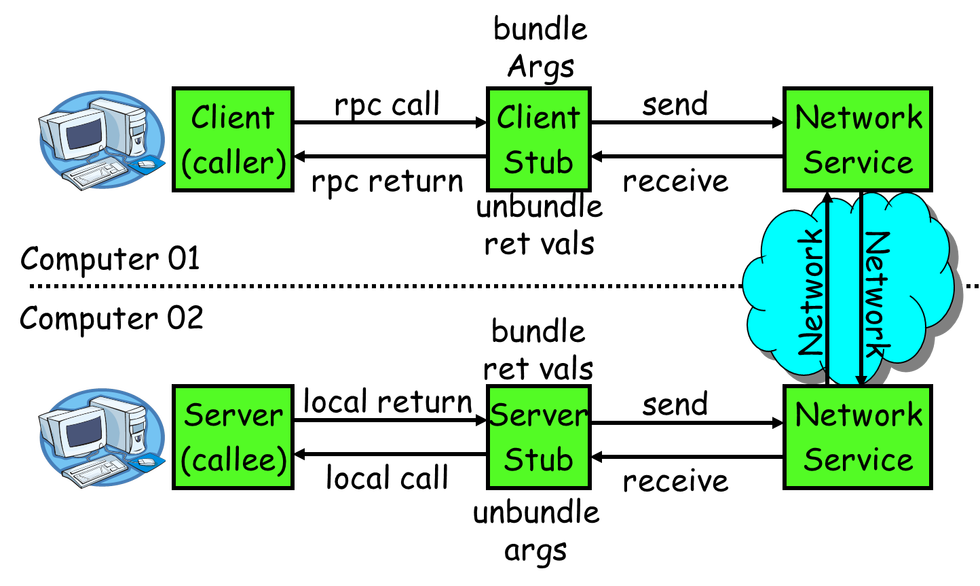

# 1 网易考拉海购Dubbok框架优化详解

本文背景还要从网易考拉海购（下文简称“考拉”）微服务化说起，现在任何大型的互联网应用，尤其是电商应用从Monolithic单体应用走向微服务化已经是必然趋势。微服务化是一个比较宽泛的概念，涉及到一个产品生命周期的多个方面，首先它作为一个指导原则指**引业务划分、架构解耦**等；技术层面实施微服务需要开发测试阶段、运行阶段、发布阶段、部署阶段等一系列基础框架的支撑。我们在享受服务化易扩展易部署等便利性的同时，也面临新的问题，如**数据一致性、分布式调用链路追踪、异常定位、日志采集**等。

本文将集中在支撑微服务交互、运行的基础框架讲解上，即考拉当前使用的Dubbok框架，Dubbok由阿里开源Dubbo框架的优化和功能改进而来。当前开源上可选用的微服务框架主要有Dubbo、Spring Cloud等，鉴于Dubbo完备的功能和文档且在国内被众多大型互联网公司选用，考拉自然也选择了Dubbo作为服务化的基础框架。其实相比于Dubbo，Spring Cloud可以说是一个更完备的微服务解决方案，它从功能性上是Dubbo的一个超集，个人认为从选型上对于一些中小型企业Spring Cloud可能是一个更好的选择。提起Spring Cloud，一些开发的第一印象是http+JSON的rest通信，性能上难堪重用，其实这也是一种误读。

微服务选型要评估以下几点：

- 内部是否存在异构系统集成的问题；
- 备选框架功能特性是否满足需求；
- http协议的通信对于应用的负载量会否真正成为瓶颈点（Spring Cloud也并不是和http+JSON强制绑定的，如有必要Thrift、protobuf等高效的RPC、序列化协议同样可以作为替代方案）；
- 社区活跃度、团队技术储备等。

作为已经没有团队持续维护的开源项目，选择Dubbo框架内部就必须要组建一个维护团队，先不论你要准备要集成多少功能做多少改造，作为一个支撑所有工程正常运转的基础组件，问题的及时响应与解答、重大缺陷的及时修复能力就已足够重要。

下文将选取Dubbo高性能RPC通信原理、服务注册发现特性、依赖隔离、启动与停机等几个方面阐述Dubbok的工作原理和相关改进工作。

## 一、高性能RPC

Dubbo作为一个分布式通信框架，最基本的职责就是完成跨进程的远程调用（RPC）。以下是RPC基本流程图：

RPC基本原理非常简单，那么Dubbo是如何实现高效的RPC通信的呢，和其他分布式通信组件关注点一样，主要集中在以下几点的优化：

### 1.协议栈：

- Dubbo支持自定义RPC协议，冗余字段少、通信性能高；
- 序列化协议支持hessian2、Dubbo自定义序列化等高性能协议；
- Dubbo支持序列化协议解码在业务线程（Netty3编码自动在业务线程执行）；

### 2.线程模型：

依赖Netty3的非阻塞线程模型，支持I/O、业务逻辑线程分离，通过Handler链处理请求。

这里特别强调Netty3，是因为Netty4在线程模型、buffer缓冲区等方面做了重大的设计和性能改进，包括Inbound、Outbound事件强制在I/O线程发起、buffer通过缓冲池减少分配释放、DirectBuffer实现缓冲区零复制等。Netty这块升级相对是一个高风险的点，明面上的API兼容性改造是小，如对Netty4工作原理认识不足，新的线程模型、buffer缓冲池等带来的非预期性能下降、内存泄露等问题相对更难定位与跟踪。

讲到线程模型，实现上密切相关的Dubbo网络连接模型必须要提一下。Dubbo默认是所有服务共享单一的TCP长连接的（这也是为什么服务接口不适合传输大负载值，即容易阻塞其他服务的调用）。为响应慢或重要的服务接口考虑，Dubbo支持设置多TCP连接，此时连接数和线程池数默认是绑定的，即每连接对应一个线池，consumer、provider都执行这个策略，从线程隔离的角度讲是合理的，但不注意也容易造成线程占用资源过多，尤其是对于消费端基本无线程阻塞的情况下可能是一个设计缺陷。

### 3.缓冲区：

Dubbo默认使用的全部是heap缓冲区，因此Socket通信不可避免会存在内核缓冲区和堆缓冲区复制消耗；除此之外在RPC协议解析（包括粘包/半包处理）、序列化协议解析等处理上也存在heap区内的复制，因此性能上是存在优化点的（当然要确有必要）。

## 二、自动注册/发现、负载均衡等服务化特性

高性能通信是Dubbo作为RPC框架的基本功能，但使其区别于Thrift、hessian、gRPC等框架的关键在于其新增的服务间自动协调、服务治理等特性。

### 1. 服务自动注册自动发现、负载均衡

服务自动注册发现依赖于注册中心的支持，consumer与provider通过注册中心获取各自地址后直接通信。目前考拉使用Zookeeper作为注册中心，Dubbo原生支持Redis作为注册中心，使用pub/sub机制协调服务的上下线事件通知，但Redis方案要求服务器时间同步且存在性能消耗过大的缺点。

- 使用Zookeeper作为注册中心，建议选用curator作为客户端框架；
- Zookeeper服务器异常宕机并重新启动的场景下，Dubbo服务的recover恢复机制存在不能重新注册的问题，导致老zk session失效后服务被错误清除。

服务框架常见负载均衡实现方案包括：集中式、分布式，分布式又可分进程内、分进程两种。Dubbo采用的是服务发现和负载均衡共同集成在consumer端的分布式进程内解决方案

负载均衡策略上Dubbo原生提供的有基于权重随机负载、最少活跃数优先、Roundrobin、一致性Hash等几个方案。

- 在实际应用中，为了能对个别错误率较高的异常provider做到及时发现、及时引流，Dubbok增加了新的负载均衡策略，在支持权重的基础上自动发现异常provider，异常期自动减流、正常后自动恢复流量。

### 2.路由、集群容错、限流

和负载均衡策略一样，Dubbo的路由方案是集成在消费端的，加上集群容错功能客户端相对是一个重量的功能封装。可选方案是将路由工作移到注册中心完成（这要求注册中心具有较强的可定制性，不仅路由像权限控制、服务过滤、环境隔离等都可由注册中心集成）

限流目前支持consumer、provider端并发限流，实际上是基于信号量限制的，以接口粒度分配信号量，当信号量用完新的调用将被拒绝，当业务返回后信号量被释放。

- 消费端限流应该是为整个提供端集群分配信号量，而Dubbo错误的将信号量分配给单个机器。这个问题目前可以通过下文提到的隔离框架的流控功能来实现。
- 限流并非精确限制，不应当依赖其实现严格的并发数控制。
- 后端backend服务限流需要业务方合理评估每个接口的流控值，要求对业务量有足够经验值（可能要在多次线上调优后才能最终得出合理的流控值）。考拉内部流控实践证明，对于保证服务稳定性、优先保证重要消费方、实现服务隔离等有着重要的作用。

### 3.服务动态治理

动态治理本质上是依赖Dubbo运行期参数的动态调整，再通用一点其实就是应用的参数动态调整，开源常用的disconf、diamond、archaius等集中配置管理工具都是设计来解决这个问题。Dubbo内部在url参数传递模型基础上实现了一套参数动态配置逻辑，个人认为相比于Dubbo的实现，集成disconf等更专业的框架应该是更好的解决方案，或许Dubbo为了一些其他设计目标解除了对一些外部框架的强制依赖。动态治理可以实现从基本参数如timeout、mock到一些高级特性如路由、限流等几乎所有的运行期参数调整。

- Dubbo原生在动态配置上存在很多bug，配置不生效或配置规则误读等问题都遇到过，如果你再使用原生Dubbo过程中也遇到任何配置问题，Dubbok应该都已经解决掉了。

## 三、依赖隔离（服务降级）

当应用被设计依赖外部服务时，要始终保持警惕状态：外部依赖是不稳定的，为此对接外部依赖做好解耦是关键，避免外部接口发生异常拖垮自身系统。Dubbo提供了超时timeout机制作为最基本的解耦措施，同时在接口报错时支持提供降级的容错逻辑；除了容错降级，Dubbo进一步支持强制的短路降级。

然而在容错降级与短路降级之间，Dubbo缺乏一种在容错与短路间切换的机制，即自动熔断。自动熔断要达到的效果是：当接口偶然报错时执行容错返回备用数据，而当接口持续大量报错时能自动在消费端对接口调用短路直接返回备用数据，之后持续监测接口可用性，接口恢复后自动恢复调用。这样能最大限度减少接口异常对消费方的影响，同时也减轻本就处于异常状态的提供端负载。

Dubbok通过标准SPI的的形式，实现了熔断功能。目前支持两套方案：一套是自己实现的熔断逻辑；一套是通过集成hystrix框架实现。目前支持错误率、最低请求量、熔断时间窗等基本配置，支持将业务异常纳入统计范畴；以上参数均可通过SOA治理平台运行期动态调整；支持外部Dubbo依赖调用的准实时监控。

Hystrix是Netflix在微服务实践中为实现外部依赖解耦而设计的框架，它假设所有的外部依赖（http、MySQL、Redis等等）可能在任何时间出现问题（你甚至可以想像不经意间就使用了一个没有提供超时设置的http客户端）。于任何可能的外部延时造成的阻塞或其他异常，hystix提供了基于线程池隔离的超时机制，新版本在RxJava基础上信号量隔离也同样支持超时。此外框架还支持定制容错逻辑、请求结果缓存、请求合并、消费端线程池隔离等，由于某些功能当前无明确需求或与Dubbo功能设计重合而没有进行集成。

Hystrix更多特性及实现原理请参见Netflix官方文档。

## 四、启动与停机

这里主要关注Dubbo工程启动初始化阶段和停机销毁阶段的一些特性和改进点：

### 1.延迟暴露。

默认Dubbo服务会随着Spring框架的加载逐一完成服务到注册中心的注册（暴露），如果某些服务需要等待资源就位才能暴露，那就需要延时注册。

- 增加Spring context初始化完成后继续延时等待的配置项
- 在无特殊配置的情况下，所有的Dubbo服务默认是注册在同一个tcp端口的。而延迟暴露是通过开启新的延时线程实现的，当延时结束时由于多线程并发执行导致多服务随机注册在多个端口。

### 2.启动预热

一些应用在运行期会通过本地缓存中间结果提升性能，而当此类应用重启时本地缓存数据丢失，如果重启后的机器立即有大量请求导流过来，由于没有缓存加速会导致请求阻塞响应性能降低。通过对重启后的机器设置预热期可有效缓解重启缓存失效问题：具体做法是降低预热期内的机器权重，引导少部分流量到此机器，此机器可以在预热期内逐步建立缓存，待预热期过后恢复正常权重与其他机器平均分摊流量。

### 3.优雅停机

在集群部署的情况下，单个消费者或提供者机器上下线对整个产品的运转应该是近乎无感知的，Dubbo提供了优雅停机功机制保障在进程关闭前请求都得到妥善处理。

消费方优雅停机：控制不再有新的请求发出；等待已经发出的请求正确返回；释放连接等资源。

提供方优雅停机：通知消费端停止发送请求到当前机器；通知注册中心服务下线；等待已经接收的请求处理完成并返回；释放连接等资源。

- 考拉在每次服务上下线过程中，每个工程总是收到大量的消费方/提供方报出的服务调用异常，经排查是Dubbo优雅停机实现的问题，修复问题后工程上线阶段异常数明显减少。
- 另外停机阶段总是莫名的收到zk连接为空的异常信息。是由于在通知注册中心服务下线的过程中，Spring销毁线程和jvm hook线程并发执行，导致zk客户端被提前销毁导致抛出异常。

### 4.Provider重启

注册中心发送大量服务销毁与注册通知导致consumer工程Full GC。

历史原因，考拉内部仍存在一个提供近200个Dubbo服务的单体工程，而每次当这个工程上线时，消费它的consumer工程就会出现频繁Full GC（3-5次，非内存泄露）。

- 是Dubbo为保证高可用而设计的注册中心缓存导致的问题：在每次收到注册中心变更时consumer会在本地磁盘保存一份服务数据副本，由于多注册中心共享同一份缓存文件，为了避免相互覆盖，每个注册中心实例会在收到变更时重新从磁盘加载文件到缓存，和变更数据对比后重新写回磁盘，在近100提供者机器不断重启的过程中，大量的变更通知导致的频繁加载缓存文件占用大量内存导致Full GC。

## 五、Dubbok近期优化目标:

- 提供端线程池隔离，解决提供端线程池阻塞等问题；优化消费端线程池分配方案
- 服务治理动态配置功能增加应用、机器粒度的配置
- 多注册中心消费端负载均衡策略
- Dubbo内部资源JMX监控
- 结合SOA平台优化监控统计数据：错误类型细分（超时、限流、网络异常等）；执行时间细分如90%、99% RT等；统计占 用线程数较多的服务、传送数据量较大的服务，为分线程池或连接做参考
- 对Spring boot推行的Javaconfig配置方式提供更友好、全面的注解支持
- 一些框架升级，如Javassist、Netty等
- 替代Zookeeper的高性能、可扩展注册中心
- 服务安全、授权问题调研
- Spring Cloud的一些优秀特性将作为Dubbok改进的一个持续关注点

……

## 六、总结

文中提到的一些改进点只是简略描述，Dubbok的很多改进点也没有一一提及，后续有时间再详细道来。

Dubbok框架、SOA服务治理平台、分布式调用链路跟踪以及其他考拉内部维护的如分布式事务、消息中间件等共同支撑了考拉微服务化的正常运转。上文也提到微服务需要有开发、测试、运行、运维、部署、发布等各阶段的全链路支撑才能发挥最大价值，后续我们将继续联合其他兄弟部门，对微服务化实践进一步优化。