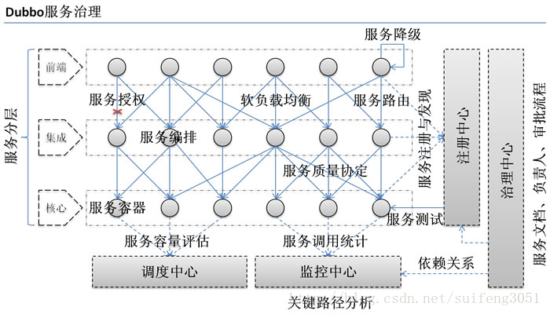
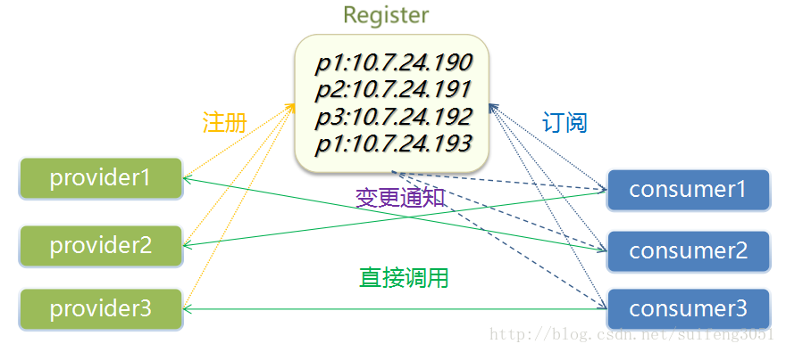
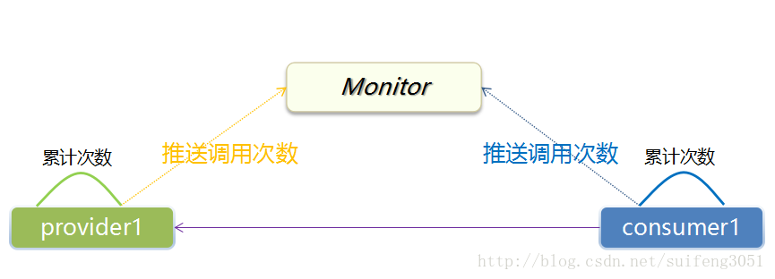
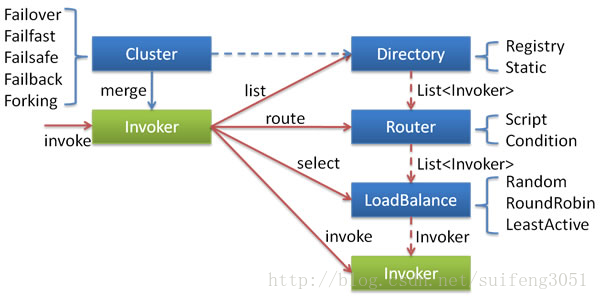

# 2 Dubbo服务治理

**服务治理是什么**

服务治理（SOA governance），按照Anne Thomas Manes的定义是：企业为了确保事情顺利完成而实施的过程，包括最佳实践、架构原则、治理规程、规律以及其他决定性的因素。服务治理指的是用来管理SOA的采用和实现的过程。

**服务治理针对的问题**

服务治理中一些典型的问题是：

1. 交付价值到利益相关者，这是投入与回报的问题
2. 对标准和规则的遵从（这是和审计相关的）
3. 变更管理：变更一个服务通常会引起不可预见的后果，因为服务的消费者对服务的提供者来说是不可知的。
4. 服务质量的保证：弹性添加新服务需要对这些服务给予额外的关注。

**服务治理包括的行为**

服务治理的一些关键活动包括：

1. 对开发新服务和升级现有服务的计划
2. 管理服务的生命周期：确保升级服务不会影响目前的服务消费者
3. 制定方针来限制服务行为：制定所有服务都要遵从的规则，确保服务的一致性
4. 监控服务的性能：由于服务组合，服务停机和性能低下的后果是严重的。通过监控服务的性能和可用性，当问题出现的时候能马上采取应对措施。
5. 管理由谁来调用服务、怎样调用服务

要想服务化，**服务治理**是关键。那么有没有好的服务治理方案呢？答案是有的，而且很多人都在用这个框架，他就是-dubbo。dubbo就是一个**带有服务治理功能的RPC框架**。

dubbo提供了一套较为完整的服务治理方案，所以企业如果要实现服务化的话，dubbo 是很好的一个选择。这里简单介绍一下dubbo服务治理相关方案。

**服务发现注册**

服务治理领域最重要的问题就是服务发现与注册。dubbo中引入了一个注册中心的概念，服务的注册与发现主要就依赖这个服务中心。

dubbo注册中心服务注册发现的具体过程：

- 服务提供者启动，向注册中心注册自己提供的服务
- 消费者启动，向注册中心订阅自己需要的服务
- 注册中心返回服务提供者的列表给消费者
- 消费者从服务提供者列表中，按照软负载均衡算法，选择一台发起请求

**服务监控**

**集群容错**

**负载均衡**

- Random Loadbalance
- RoundRobin
- LeastActive
- ConsistentHash

dubbo服务治理优势

- 注册中心只负责注册查找，不负责请求转发，压力小
- 注册中心宕机不影响消费者，消费者本地缓存服务地址列表
- 注册中心对等集群，宕掉一台自动切换到另外 一台
- 服务提供者无状态，可动态部署，注册中心负责推送
- 统计无压力，本地内存中累计次数，每分钟发送注册中心
- 消费者调用服务者，自动软负载均衡
- 通过服务中心可追踪依赖关系
- 监控中心为扩容和降级提供依据
- 可启用acl机制进行鉴权
- 与Spring整合，接入简单松耦合
- 多种序列化协议支持

dubbo的不足

- 消费者仍需要依赖配置中心
- 消费者仍需要依赖jar包配置provider
- 提供者文档管理功能缺失
- 无统一入口
- 不支持OAuth2.0
- 内部鉴权不方便管理
- 无外部应用鉴权
- 接口基本裸奔，无法直接对外暴露服务
- IT治理不方便