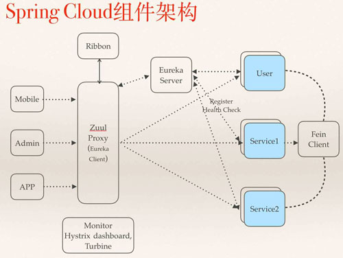
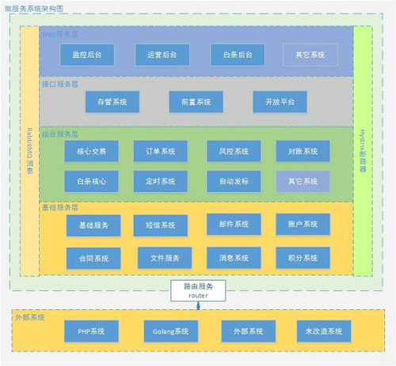

# 第5节 Spring Cloud应用及源码解读

Spring Cloud是一系列框架的有序集合。它利用Spring Boot的开发便利性巧妙地简化了分布式系统基础设施的开发，如服务发现注册、配置中心、消息总线、负载均衡、断路器、数据监控等，都可以用Spring Boot的开发风格做到一键启动和部署。Spring并没有重复制造轮子，它只是将目前各家公司开发的比较成熟、经得起实际考验的服务框架组合起来，通过Spring Boot风格进行再封装屏蔽掉了复杂的配置和实现原理，最终给开发者留出了一套简单易懂、易部署和易维护的分布式系统开发工具包。

以下为 Spring Cloud 的核心功能：

- 分布式/版本化配置。
- 服务注册和发现。
- 路由。
- 服务和服务之间的调用。
- 负载均衡。
- 断路器。
- 分布式消息传递。

我们再来看一张图：

解释一下这张图中各组件的运行流程：

- 所有请求都统一通过 API 网关(Zuul)来访问内部服务。
- 网关接收到请求后，从注册中心(Eureka)获取可用服务。
- 由 Ribbon 进行均衡负载后，分发到后端的具体实例。
- 微服务之间通过 Feign 进行通信处理业务。
- Hystrix 负责处理服务超时熔断。
- Turbine 监控服务间的调用和熔断相关指标。

当然上面只是 Spring Cloud 体系的一部分，Spring Cloud 共集成了 19 个子项目，里面都包含一个或者多个第三方的组件或者框架!

Spring Cloud 工具框架：

- Spring Cloud Config，配置中心，利用 git 集中管理程序的配置。
- Spring Cloud Netflix，集成众多 Netflix 的开源软件。
- Spring Cloud Bus，消息总线，利用分布式消息将服务和服务实例连接在一起，用于在一个集群中传播状态的变化 。
- Spring Cloud for Cloud Foundry，利用 Pivotal Cloudfoundry 集成你的应用程序。
- Spring Cloud Foundry Service Broker，为建立管理云托管服务的服务代理提供了一个起点。
- Spring Cloud Cluster，基于 Zookeeper、Redis、Hazelcast、Consul 实现的领导选举和平民状态模式的抽象和实现。
- Spring Cloud Consul，基于 Hashicorp Consul 实现的服务发现和配置管理。
- Spring Cloud Security，在 Zuul 代理中为 OAuth2 rest 客户端和认证头转发提供负载均衡。
- Spring Cloud Sleuth Spring Cloud，应用的分布式追踪系统和 Zipkin、HTrace、ELK 兼容。
- Spring Cloud Data Flow，一个云本地程序和操作模型，组成数据微服务在一个结构化的平台上。
- Spring Cloud Stream，基于 Redis、Rabbit、Kafka 实现的消息微服务，简单声明模型用以在 Spring Cloud 应用中收发消息。
- Spring Cloud Stream App Starters，基于 Spring Boot 为外部系统提供 Spring 的集成。
- Spring Cloud Task，短生命周期的微服务，为 Spring Boot 应用简单声明添加功能和非功能特性。
- Spring Cloud Task App Starters。
- Spring Cloud Zookeeper，服务发现和配置管理基于 Apache Zookeeper。
- Spring Cloud for Amazon Web Services，快速和亚马逊网络服务集成。
- Spring Cloud Connectors，便于 PaaS 应用在各种平台上连接到后端像数据库和消息经纪服务。
- Spring Cloud Starters，项目已经终止并且在 Angel.SR2 后的版本和其他项目合并。
- Spring Cloud CLI，插件用 Groovy 快速的创建 Spring Cloud 组件应用。

这个数量还在一直增加...

**三者之间的关系**

微服务是一种架构的理念，提出了微服务的设计原则，从理论为具体的技术落地提供了指导思想。

Spring Boot 是一套快速配置脚手架，可以基于 Spring Boot 快速开发单个微服务。

Spring Cloud 是一个基于 Spring Boot 实现的服务治理工具包;Spring Boot 专注于快速、方便集成的单个微服务个体;Spring Cloud 关注全局的服务治理框架。

Spring Boot / Cloud 是微服务实践的最佳落地方案。

**Spring Boot / Cloud 微服务实践背景**

2015 年初的时候，因为公司业务的大量发展，我们开始对原有的业务进行拆分，新上的业务线也全部使用独立的项目来开发，项目和项目之间通过 http 接口进行访问。

2015 年的业务发展非常迅速，项目数量也就相应急剧扩大，到了年底的时候项目达 60 多个，当项目数达到 30 几个的时候，我们就遇到了问题，经常某个项目因为扩展增加了新的 IP 地址，就需要被动的更新好几个相关的项目。

服务越来越多，服务之间的调用关系也越来越复杂，有时候想画一张图来表示项目和项目之间的依赖关系，线条密密麻麻无法看清。下面有一张图可以表达我们的心情：

这个时候我们就想找一种方案，可以将我们这么多分布式的服务给管理起来，到网上进行了技术调研我们发现有两款开源软件比较适合我们，一个是 Dubbo，另一个是 Spring Cloud。

刚开始我们是走了一些弯路的，这两款框架我们都不熟悉，当时国内使用 Spring Cloud 进行开发的企业非常的少，我在网上也几乎没找到太多应用的案例。但是 Dubbo 在国内的使用还是挺普遍的，相关的资料各方面都比较完善。

因此在公司扩展新业务线众筹平台的时候，技术选型就先定了 Dubbo，因为也是全新的业务没有什么负担，这个项目我们大概开发了 6 个月投产，上线之初也遇到了一些问题，但最终还比较顺利。

在新业务线选型使用 Dubbo 的同时，我们也没有完全放弃 Spring Cloud，我们抽出了一两名开发人员学习 Spring Boot，我也参与其中。

为了验证 Spring Boot 是否可以到达实战的标准，我们在业余的时间使用 Spring Boot 开发了一款开源软件云收藏，经过这个项目的实战验证我们对 Spring Boot 就有了信心。

最重要的是大家体会到使用 Spring Boot 的各种便利之后，就再也不想使用传统的方式来进行开发了。

但是还有一个问题，在选择了 Spring Boot 进行新业务开发的同时，并没有解决我们上面的那个问题，服务与服务直接调用仍然比较复杂和传统，这时候我们就开始研究 Spring Cloud。

因为大家在前期对 Spring Boot 有了足够的了解，因此学习 Spring Cloud 就显得顺风顺水了。所以在使用 Dubbo 半年之后，我们又全面开始拥抱 Spring Cloud。

**为什么选择使用 Spring Cloud 而放弃了 Dubbo**

 可能大家会问，为什么选择了使用 Dubbo 之后，又选择全面使用 Spring Cloud 呢?其中有如下四个原因：

1. 从两个公司的背景来谈

Dubbo，是阿里巴巴服务化治理的核心框架，并被广泛应用于中国各互联网公司;Spring Cloud 是大名鼎鼎的 Spring 家族的产品。

阿里巴巴是一个商业公司，虽然也开源了很多的顶级的项目，但从整体战略上来讲，仍然是服务于自身的业务为主。

Spring 专注于企业级开源框架的研发，不论是在中国还是在世界上使用都非常广泛，开发出通用、开源、稳健的开源框架是他们的主业。

2. 从社区活跃度这个角度来对比

Dubbo 虽然也是一个非常优秀的服务治理框架，并且在服务治理、灰度发布、流量分发这方面做的比 Spring Cloud 还好，除过当当网在此基础上增加了 rest 支持外，已有两年多的时间几乎没有任何更新了。

在使用过程中出现问题，开发者提交到 GitHub 的 Issue 也少有回复。相反 Spring Cloud 自从发展到现在，仍然在不断的高速发展。

从 GitHub 上提交代码的频度和发布版本的时间间隔就可以看出，现在 Spring Cloud 即将发布 2.0 版本，到了后期会更加完善和稳定。

3. 从整个大的平台架构来讲

Dubbo 框架只是专注于服务之间的治理，如果我们需要使用配置中心、分布式跟踪这些内容都需要自己去集成，这样无形中增加了使用 Dubbo 的难度。

Spring Cloud 几乎考虑了服务治理的方方面面，更有 Spring Boot 这个大将的支持，开发起来非常的便利和简单。

4. 从技术发展的角度来讲

Dubbo 刚出来的那会技术理念还是非常先进，解决了各大互联网公司服务治理的问题，中国的各中小公司也从中受益不少。

经过了这么多年的发展，互联网行业也是涌现了更多先进的技术和理念，Dubbo 一直停滞不前，自然有些掉队，有时候我个人也会感到有点可惜，如果 Dubbo 一直沿着当初的那个路线发展，并且延伸到周边，今天可能又是另一番景象了。

Spring 推出Spring Boot / Cloud 也是因为自身的很多原因。Spring 最初推崇的轻量级框架，随着不断的发展也越来越庞大，随着集成项目越来越多，配置文件也越来越混乱，慢慢的背离最初的理念。

随着这么多年的发展，微服务、分布式链路跟踪等更多新的技术理念的出现，Spring 急需一款框架来改善以前的开发模式，因此才会出现 Spring Boot / Cloud 项目。

我们现在访问 Spring 官网，会发现 Spring Boot 和 Spring Cloud 已经放到首页最重点突出的三个项目中的前两个，可见 Spring 对这两个框架的重视程度。

因此 Dubbo 曾经确实很牛逼，但是 Spring Cloud 是站在近些年技术发展之上进行的开发，因此更具技术代表性。

**如何进行微服务架构演进**

当我们将所有的新业务都使用 Spring Cloud 这套架构之后，就会出现这样一个现象：公司的系统被分成了两部分，一部分是传统架构的项目;另一部分是微服务架构的项目，如何让这两套配合起来使用就成为了关键。

这时候 Spring Cloud 里面的一个关键组件解决了我们的问题，就是 Zuul。在 Spring Cloud 架构体系内的所有微服务都通过 Zuul 来对外提供统一的访问入口，所有需要和微服务架构内部服务进行通讯的请求都走统一网关。如下图：

从上图可以看出我们对服务进行了四种分类，不同服务迁移的优先级不同：

- 基础服务，是一些基础组件，与具体的业务无关。比如：短信服务、邮件服务。这里的服务最容易摘出来做微服务，也是我们第一优先级分离出来的服务。
- 业务服务，是一些垂直的业务系统，只处理单一的业务类型，比如：风控系统、积分系统、合同系统。
- 这类服务职责比较单一，根据业务情况来选择是否迁移，比如：如果突然有需求对积分系统进行大优化，我们就趁机将积分系统进行改造，是我们的第二优先级分离出来的服务。
- 前置服务，前置服务一般为服务的接入或者输出服务，比如网站的前端服务、app 的服务接口这类，这是我们第三优先级分离出来的服务。

组合服务，组合服务就是涉及到了具体的业务，比如买标过程，需要调用很多垂直的业务服务，这类的服务我们一般放到最后再进行微服务化架构来改造，因为这类服务最为复杂，除非涉及到大的业务逻辑变更，我们是不会轻易进行迁移。

在这四类服务之外，新上线的业务全部使用 Sprng Boot / Cloud 这套技术栈。

**架构演化的步骤**

架构演化的步骤如下：

- 在确定使用Spring Boot / Cloud 这套技术栈进行微服务改造之前，请先梳理平台的服务，对不同的服务进行分类，以确认演化的节奏。
- 先让团队熟悉 Spring Boot 技术，并且优先在基础服务上进行技术改造，推动改动后的项目投产上线。
- 当团队熟悉 Spring Boot 之后，再推进使用 Spring Cloud 对原有的项目进行改造。
- 在进行微服务改造过程中，优先应用于新业务系统，前期可以只是少量的项目进行了微服务化改造，随着大家对技术的熟悉度增加，可以加快加大微服务改造的范围。

传统项目和微服务项目共存是一个很常见的情况，除非公司业务有大的变化，不建议直接迁移核心项目。

**服务拆分**

服务拆分的两个原则：

- 横向拆分。按照不同的业务域进行拆分，例如订单、营销、风控、积分资源等，形成独立的业务领域微服务集群。
- 纵向拆分。把一个业务功能里的不同模块或者组件进行拆分。例如把公共组件拆分成独立的原子服务，下沉到底层，形成相对独立的原子服务层。这样一纵一横，就可以实现业务的服务化拆分。

要做好微服务的分层：梳理和抽取核心应用、公共应用，作为独立的服务下沉到核心和公共能力层，逐渐形成稳定的服务中心，使前端应用能更快速的响应多变的市场需求。

服务拆分是越小越好吗?微服务的大与小是相对的。比如在初期，我们把交易拆分为一个微服务，但是随着业务量的增大，可能一个交易系统已经慢慢变得很大，并且并发流量也不小。

为了支撑更多的交易量，我会把交易系统，拆分为订单服务、投标服务、转让服务等。因此微服务的拆分力度需与具体业务相结合，总的原则是服务内部高内聚，服务之间低耦合。

**微服务 vs 传统开发**

使用微服务有一段时间了，这种开发模式和传统的开发模式对比，有很大的不同，如下面几点：

- 分工不同，以前我们可能是一个一个模块，现在可能是一人一个系统。
- 架构不同，服务的拆分是一个技术含量很高的问题，拆分是否合理对以后发展影响巨大。
- 部署方式不同，如果还像以前一样部署估计累死了，自动化运维不可不上。
- 容灾不同，好的微服务可以隔离故障避免服务整体 down 掉，坏的微服务设计仍然可以因为一个子服务出现问题导致连锁反应。

**给数据库带来的挑战**

每个微服务都有自己独立的数据库，那么后台管理的联合查询怎么处理?这是大家普遍遇到的一个问题。

有如下三种处理方案：

- 严格按照微服务的划分来做，微服务相互独立，各微服务数据库也独立，后台需要展示数据时，调用各微服务的接口来获取对应的数据，再进行数据处理后展示出来，这是标准的用法，也是最麻烦的用法。
- 将业务相关的表放到一个库中，将业务无关的表严格按照微服务模式来拆分，这样既可以使用微服务，也避免了数据库各种切换导致后台统计难以实现，是一个折中的方案。
- 数据库严格按照微服务的要求来切分，以满足业务高并发，实时或者准实时将各微服务数据库数据同步到 NoSQL 数据库中，在同步的过程中进行数据清洗，用来满足后台业务系统的使用，推荐使用 Mongodb、Hbase 等。

三种方案在不同的公司我都使用过，第一种方案适合业务较为简单的小公司;第二种方案，适合想在原有系统之上，慢慢演化为微服务架构的公司;第三种适合大型高并发的互联网公司。

**微服务的经验和建议**

1. 建议尽量不要使用 Jsp，页面开发推荐使用 Thymeleaf

Web 项目建议独立部署 Tomcat，不要使用内嵌的 Tomcat，内嵌 Tomcat 部署 Jsp 项目会偶现龟速访问的情况。

2. 服务编排是个好东西，主要的作用是减少项目中的相互依赖

比如现在有项目 a 调用项目 b，项目 b 调用项目 c...一直到 h，是一个调用链，那么项目上线的时候需要先更新最底层的 h 再更新 g...更新 c 更新 b 最后是更新项目 a。

这只是一个调用链，在复杂的业务中有非常多的调用，如果要记住每一个调用链对开发运维人员来说就是灾难。

有一个好办法可以尽量的减少项目间的相互依赖，就是服务编排，一个核心的业务处理项目，负责和各个微服务打交道。

比如之前是 a 调用 b，b 掉用 c，c 调用 d，现在统一在一个核心项目 W 中来处理，W 服务使用 a 的时候去调用 b，使用 b 的时候W去调用 c。

举个例子：在第三方支付业务中，有一个核心支付项目是服务编排，负责处理支付的业务逻辑，W 项目使用商户信息的时候就去调用“商户系统”，需要校验设备的时候就去调用“终端系统”，需要风控的时候就调用“风控系统”，各个项目需要的依赖参数都由W来做主控。以后项目部署的时候，只需要最后启动服务编排项目即可。

3. 不要为了追求技术而追求技术

需要考虑以下几方面的因素：

- 团队的技术人员是否已经具备相关技术基础。
- 公司业务是否适合进行微服务化改造，并不是所有的平台都适合进行微服务化改造，比如：传统行业有很多复杂垂直的业务系统。
- Spring Cloud 生态的技术有很多，并不是每一种技术方案都需要用上，适合自己的才是最好的。

**总结**

Spring Cloud 对于中小型互联网公司来说是一种福音，因为这类公司往往没有实力或者没有足够的资金投入去开发自己的分布式系统基础设施，使用 Spring Cloud 一站式解决方案能在从容应对业务发展的同时大大减少开发成本。

同时，随着近几年微服务架构和 Docker 容器概念的火爆，也会让 Spring Cloud 在未来越来越“云”化的软件开发风格中立有一席之地。

尤其是在目前五花八门的分布式解决方案中提供了标准化的、全站式的技术方案，意义可能堪比当前 Servlet 规范的诞生，有效推进服务端软件系统技术水平的进步。